# Measuring Cloud Oktas From Outer Space

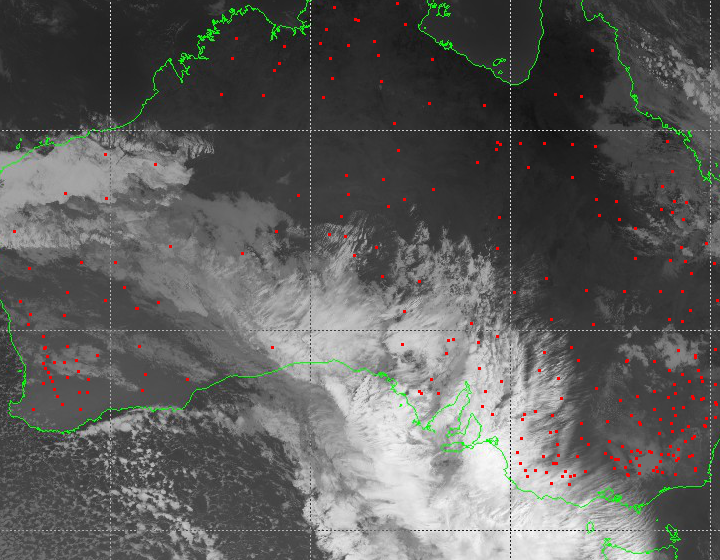

> This article describes the approach undertaken by data scientists at Axibase to calculate cloud cover using satellite imagery from the Japanese [Himawari 8](https://himawari8.nict.go.jp/) satellite.

Today, cloud cover is measured using automated weather stations, specifically ceilometers and sky imager instruments. The ceilometer is an upward pointed laser that calculates the time required for the laser to reflect back to ground surface from overhead clouds, which determines the height of the cloud base. The sky imager divides the sky into regions and finds the percentage of clouds in those different regions. Only clouds located directly overhead are detected. As a result, with how sparsely weather stations are placed today, the amount of cloud cover data is limited. Most modern weather stations can discover and measure clouds up to 7,600 meters. You can learn more about modern automated weather stations and ceilometers on [Wikipedia](https://en.wikipedia.org/wiki/Automated_airport_weather_station).

**Ceilometer:**

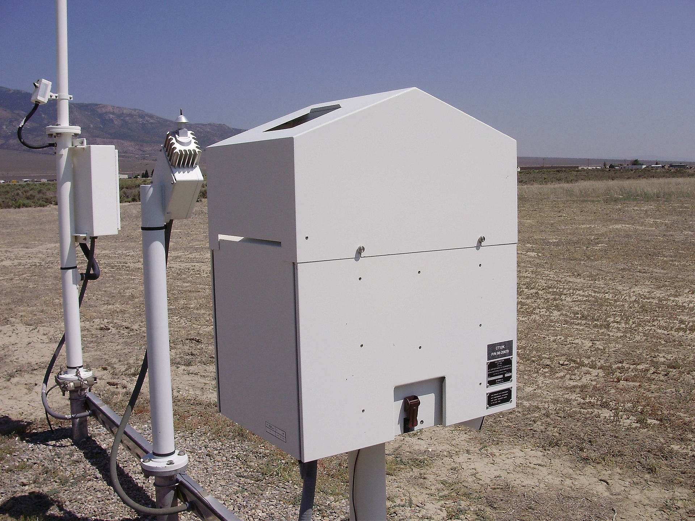

**Sky Imager:**

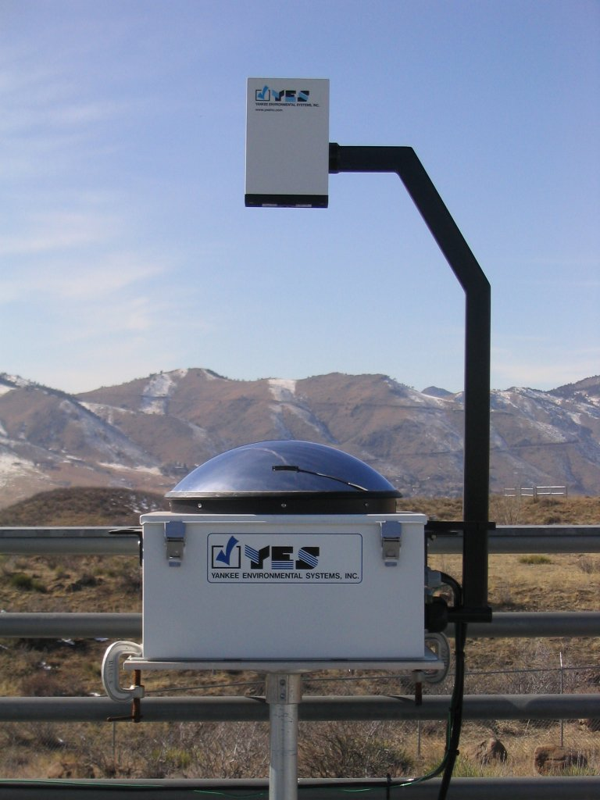

You can learn more about automated weather stations in Australia on the official website of the [Bureau of Meteorology Australia](http://www.bom.gov.au/).

Cloud cover measurements have many applications and benefits in weather forecasting and solar energy generation. For example, seasonal cloud cover statistics allow tourists to plan their holidays for sunnier weeks and months of the year. This information is also useful to mountain climbers planning an ascent, since the climbers need to choose seasons with less cloud cover, guaranteeing the best possible conditions for summit attempts. Photovoltaic energy generation hinges heavily on quality cloud cover data. Solar panels are most efficient when there are no clouds, when building a solar power station, a company or government must analyze cloud oktas data. Because automated weather stations that measure this metric are distributed sparsely, the data is often not available. Below is a visualization comparing cloud cover with solar power generation for a particular station in Australia. It is readily apparent that the two metrics are interdependent.


[](https://apps.axibase.com/chartlab/8e2917e2)

This research project is aimed at calculating cloudiness over Australia from satellite images. The goal is to use a simple method that can effectively determine the cloud cover without employing complex algorithms and machine learning. Afterwards, compare the results with actual data from ground weather stations. Data available from the Japan Meteorological Agency (JMA) and the Australian Bureau of Meteorology (BOM) made this research both interesting and feasible.

## Cloudiness Data

Australian meteorological stations are used as the source of cloudiness data. The list of all meteorological stations is available on the website of the [Australian Bureau of Meteorology](http://www.bom.gov.au/climate/cdo/about/sitedata.shtml).

Here is a summary of the available stations:

* 20,112: Total number of meteorological stations.
* 7,568: Total number of currently functional stations.
* 867: Total number of stations that have available data.
* 778: Total number of stations whose data is loaded into ATSD.
* 394: Total number of stations that measure cloud oktas.
* 45: Total number of station that measure cloud oktas at least four times per day.

Cloud cover measurements are available from the Australian Bureau of Meteorology [Latest Weather Observations](http://www.bom.gov.au/nsw/observations/nswall.shtml?ref=hdr) portal. Cloud cover data from each station for the past few days can be retrieved in JSON format using the REST API.

As stated on [Wikipedia](https://en.wikipedia.org/wiki/Cloud_cover), cloud cover is the fraction of the sky obscured by clouds when observed from a particular location. Cloud cover is measured in oktas, meaning eighths: `0`, `1/8`, `2/8`, up to `1`. Several methods are used to measure cloud cover but which method is used by the Australian weather stations is not exactly clear.

## Satellite Data

To collect more data, the analysis of images from a Japanese geostationary weather satellite, Himawari 8, is performed. The launch of this satellite took place on October 7, 2014 and the satellite became operational on July 7, 2015. It provides high quality images of the Earth in 16 frequency bands every ten minutes. Learn more about Himawari satellites and imaging on the [Meteorological Satellite Center](http://www.data.jma.go.jp/mscweb/en/himawari89/space_segment/spsg_ahi.html) of the JMA website.

The Japan Meteorological Agency processes the satellite images and determines several parameters of the clouds. The results can viewed on the [Meteorological Satellite Center](http://www.data.jma.go.jp/mscweb/en/product/product/hcai/index.html) of the JMA website.

The algorithms used by the JMA to process the images are complex. Read [Introduction of the Optimal Cloud Analysis
for Himawari‐8/‐9](http://www.icare.univ-lille1.fr/crew/images/d/d7/Poster_CREW-4_Hayashi.pdf) to learn more about these algorithms.

To determine cloud cover from Himawari images as simply as possible, only one band is analyzed. For this research project, [images](http://ds.data.jma.go.jp/mscweb/data/himawari/) of Australia available from the MSC JMA Real Time Image portal are used. The server keeps images for the past 24 hours. Images in infrared band 13 with wavelength equal to 10,400 nm are used.

## Data Flow

[ATSD](https://axibase.com/docs/atsd/) can collect data from the Australian Bureau of Meteorology in JSON format. ATSD comes with the [Axibase Collector](https://axibase.com/docs/axibase-collector/), which collects data from any remote source and stores it in ATSD. Another benefit of ATSD is the built-in visualization that supports graphing results, to give a good understanding of the progress.

The images from JMA are loaded in PNG format into R for analysis. To analyze the images in R, use [EBImage](https://www.rdocumentation.org/packages/EBImage/versions/4.14.2), [oce](http://dankelley.github.io/oce/), and [geosphere](https://cran.r-project.org/web/packages/geosphere/index.html) R packages. The results of the analysis are stored in ATSD.

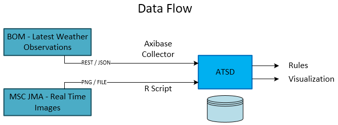

Once both the actual cloud oktas and the calculated cloud oktas are loaded into ATSD, visualization portals are built to compare the collected and computed metrics.

## Cloudiness Detection From Images

Using the geographical coordinates of each station, each station location on the satellite images is determined. The images are somewhat distorted near the border of Australia and on the lines of the coordinate grid. This distortion comes in the form of overlays added on top of the images, the green Australian border and white grid. Therefore, only stations that are far from the distorted areas are included.


A simple method to detect clouds is used. Since clouds are cooler than the surface of the earth, clouds are rendered white on the satellite images, and the surface of the earth is black. Therefore, the brightness of the pixels in the images reflects cloudiness. Hence, calculate cloud cover for a given meteorological station as the average pixel brightness over a `3 x 3` square of pixels, centered over the station.

Since one pixel on the image, depending on the location, covers an area from `5.5 x 3.9` to `5.5 x 5.6` square kilometers; the determination of cloudiness of an area sized about 230 square kilometers is analyzed.

Here is the key line from the R script used to calculate the `cloudiness_himawari_b13` metric from the satellite images:

```r
new_row[1, i + 1] <- get_density(lat = latitudes[i], lon = longitudes[i], matr = img_cont[ , , 1])
```

To store the results in ATSD:

```r
save_series(series, metric_col = 2, metric_name = cloudiness_Himawari_b13", entity = entities[i], verbose = FALSE)
```

Once the calculation results are stored in ATSD, view graphs of actual and calculated cloud cover in [ChartLab](../../tutorials/shared/chartlab.md). For example, the ChartLab portal for a weather station near the town of Oakey:

[](https://apps.axibase.com/chartlab/06a58e55)

In this ChartLab portal the `cloudiness_himawari_b13` metric is the calculated cloud cover, and the `cloud_oktas` metric is cloud cover measured by the station.

Stations that measure cloud cover at an average frequency of at least once every four hours are selected. The table below displays the [Pearson correlation coefficient](https://en.wikipedia.org/wiki/Pearson_correlation_coefficient) between actual and calculated cloud cover for the selected stations:

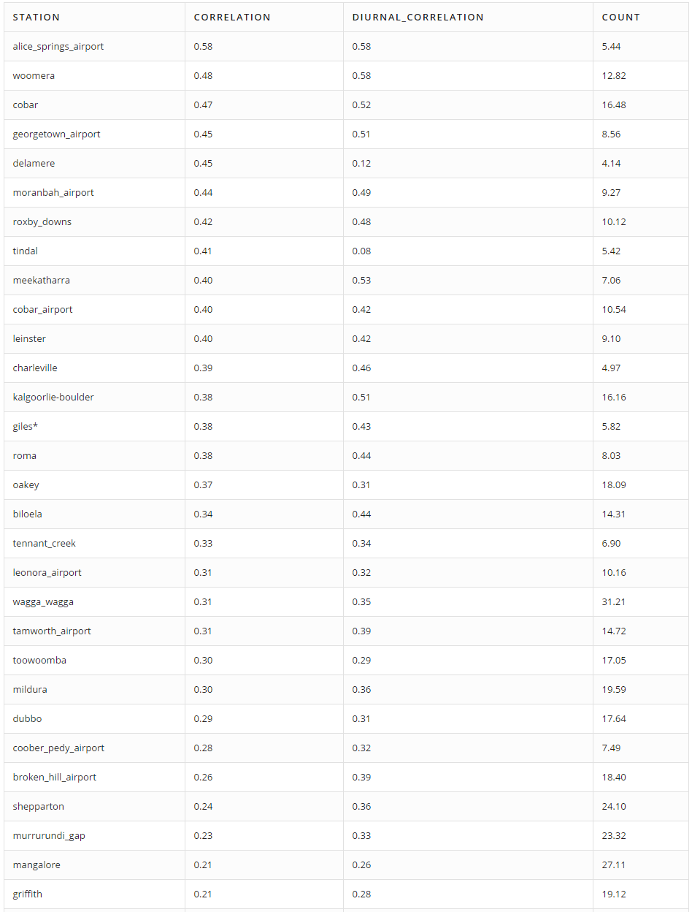

> the **Count** column indicates the average number of cloud cover measurements per day.

This approach does not appear to work particularly well as there is little correlation between computed and factual values.

Interestingly, the `cloudiness_himawari_b13` series has a daily cycle; the value is lower during the day than at night. This trend is clearly visible when comparing this series with the height of the sun above the horizon, known as sun altitude. Sun altitude is calculated using the [SunCalc library](https://github.com/mourner/suncalc) created by [Vladimir Agafonkin](https://github.com/mourner).

View the live ChartLab Portal comparing Cloud Cover to Sun Altitude:

[](https://apps.axibase.com/chartlab/08aa5fea/3/)

The results clearly show that the correlation during daytime hours is higher.

The diurnal cycle is removed by subtracting the average of values of the last `n` days. The results with the diurnal cycle removed:

[](https://apps.axibase.com/chartlab/06a58e55/7/)

## Improving the Correlation

Data scientists sought to improve the correlation by adjusting the method for determining the cloudiness from an image.

The following adjustments are made:

1. Average out the brightness over different areas of the images.
2. Calculate a weighted average of brightness over large areas of the image, giving less weight to pixels more distant from the center of the area. Calculate the weights using geometrical principles, described below. Take into account the height of the lower edge of the cloud directly over a station. Meteorological stations measure the height of clouds and this data is available from the Australian Bureau of Meteorology. It seems that the lower the height of the cloud the greater the value of cloud cover.

To be more concrete, here are example computations for eight meteorological stations. These stations are chosen because there are enough measurements of cloud cover and the stations are far from the overlaid white lines on the images.

For each of the stations, five not-perfectly round disks are selected with radii of `0`, `3`, `5`, `10`, `20`, and `30` pixels:

| 0 Pixels | 3 Pixels | 5 Pixels | 10 Pixels | 20 Pixels | 30 Pixels |
|:--:|:--:|:--:|:--:|:--:|:--:|
 | 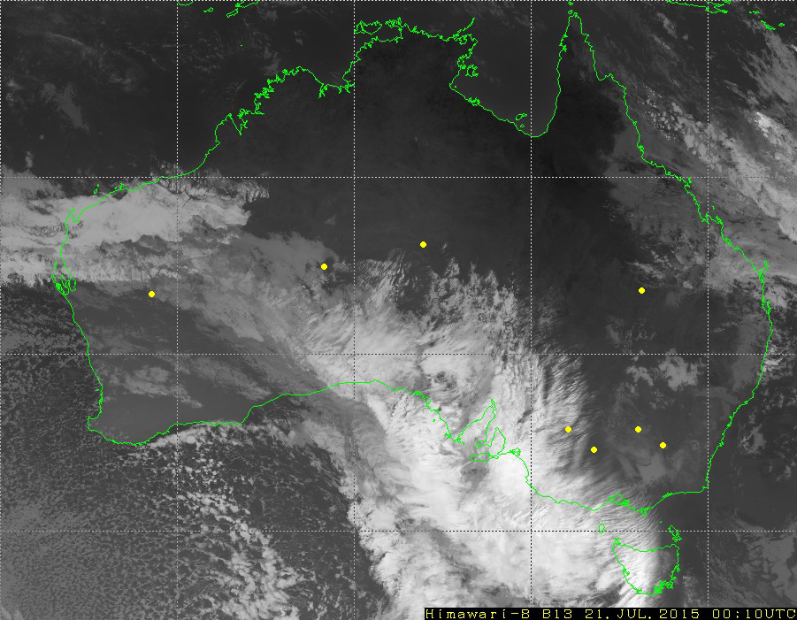 |  | 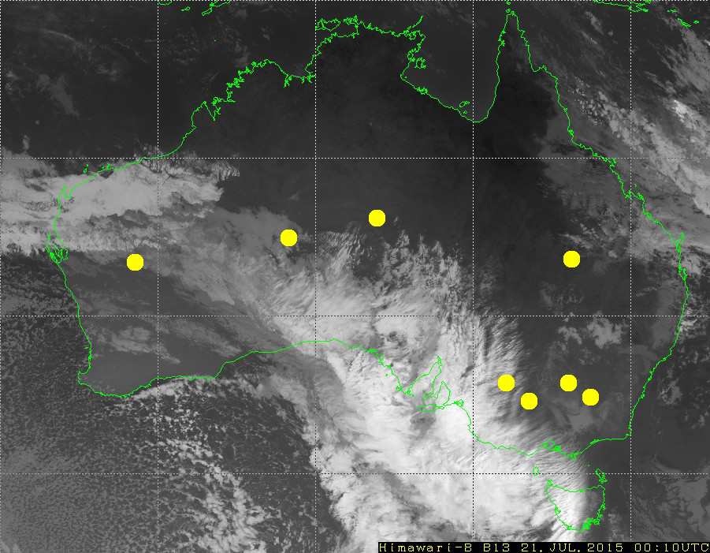 | 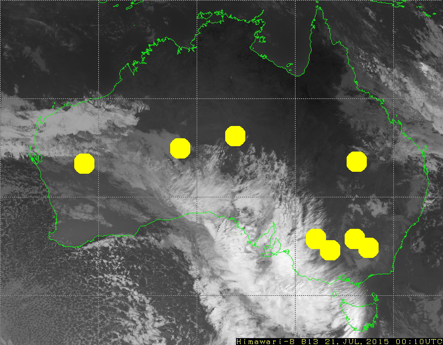 | 

Averaged brightness over each disc is an estimation of the cloud cover. There are six estimations, and the correlations with actual values of cloud cover are saved in columns **`avg0`** to **`avg30`** in these tables:

**Averaged Brightness**:


**Weighted Average Brightness**:

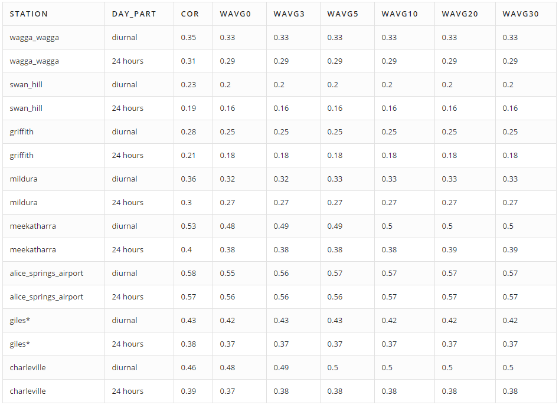

Columns **`wavg0`** to **`wavg30`** display correlations between cloud cover and the weighted average of brightness for given disks. To compute the weight (`w`) of each pixel, use the following equation:

```ls
$w = \frac{h}{(d^2 + h^2)^{3/2}} = \frac{h}{l^3}.$
```

In this equation, `d` is the distance between the center of the pixel and the given station (in meters) and `h` is the cloud height (in meters). Distant and high clouds have lower weights.

Here is a code snippet from the R script used to calculate the weighted average of brightness for given disks:

```r
 sum <- 0
  total_weight <- 0
for (i in 1:length(pixels$x_shift)) {
    x_shift <- pixels$x_shift[i]
    y_shift <- pixels$y_shift[i]
    coords <- get_lat_lon(x_0 + x_shift, y_0 + y_shift)

    dist <- distGeo(c(lon_0, lat_0), c(coords[2], coords[1]))
    weight <- cloud_base / (cloud_base^2 + dist^2)^(3/2)
    sum <- sum + weight * matr[x_0 + x_shift, y_0 + y_shift]
    total_weight <- total_weight + weight
  }
  return(sum / total_weight)
```

Unfortunately, since only the height of the clouds directly above each station is known, this height is used when calculating the weighted average for all pixels, assuming that the height of all clouds is the same around each station.

To explain the reasoning behind using this formula, assume that clouds are flat (this assumption is incorrect, but is used anyway). A flat cloud with an area of `A` squared meters has height of `h` meters above the ground and is `d` meters away of station. As a result, the “solid angle” of the cloud for the station is approximately equal `w * A`:

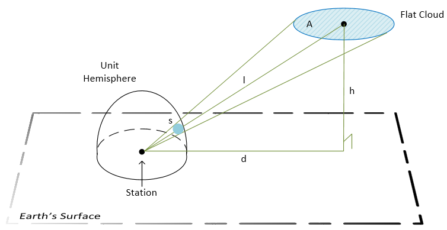

**Legend**:

* `A`: the cloud area.
* `h`: the height of the cloud.
* `d`: distance from the station to the center of the cloud’s projection on the ground.
* `l`: distance between the station and the center of the cloud.
* `s`: the area of the cloud’s image on the unit hemisphere. This tells us how big the cloud appears to the station.

```ls
$s = \int_A w\ d\sigma \approx w\cdot A$, where $w = \frac{h}{(d^2 + h^2)^{3/2}} = \frac{h}{l^3}.$
```

The measurement of a “solid angle” is equal to the area of intersection of this angle and the unit sphere centered in the angle vertex. The contribution of a pixel to cloud cover is proportional to the `w` coefficient, because all pixels on an image cover nearly the same area equal to `A`. The exact statement is that the integral of `w` over the area `A` equals to the “solid angle.”

The results show that none of the methods used to improve the correlation led to a significant increase.

## Changing the Original Logic – Improved Correlation

To improve the correlation, change the original logic of how cloud oktas are determined from satellite images. Rather than using black as the color of the earth, determine a shade of grey for each station that the earth, without cloud cover, reached during the day and used this color as the calculation base. This logic is used because the temperature of the surface of the earth changes throughout the day, meaning that the brightness on the satellite images changes as well. The brightest point occurred during the night, when the earth is coolest. All darker shades are considered cloudless, and lighter shades are considered cloudy.

This approach lead to an improvement in correlations. This approach also decreased the diurnal cycle.

**Here are the calculations and results for the town of Oakey**:

* The lower brightness threshold = `0.2916667`.
* All values below the lower threshold are zeroed out.
* The upper brightness threshold = `0.4583333`.
* All values are scaled – divided by the upper brightness threshold.
* Those values greater than `1` are set equal to `1`.

View the live ChartLab Portal for Cloud Cover over the meteorological station near Oakey with improved correlation.

[](https://apps.axibase.com/chartlab/06a58e55/9/)

## Conclusion

Comparing the calculated cloud oktas with solar power generation for a particular station, clearly this algorithm can be used as a basis of forecasting and power generation planning.


[](https://apps.axibase.com/chartlab/8e2917e2)

The above ChartLab portal compares the power generation of a solar power station near one of the automated weather stations in the city of Griffith, for which cloud cover is calculated. The solar power station is three kilometers away from the automated weather station. From these results the increases in calculated cloud cover lead to decreases in solar power generation and vice versa. There is a correlation between the calculated cloud oktas and solar power generation.

Comparing the improved correlation results with solar power generation for the same station, the interdependency of the measurements is even more apparent. There is a strong correlation between the improved calculated cloud cover and solar power generation.

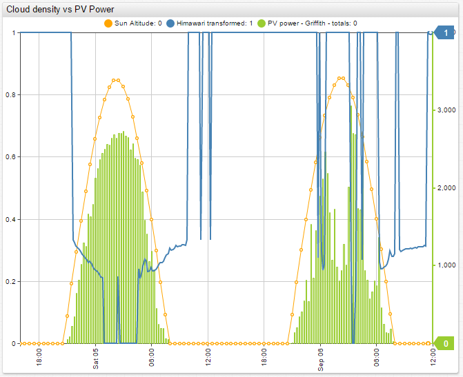

[](https://apps.axibase.com/chartlab/8e2917e2/3/)

The results of this research project indicate that this algorithm can be used as a way to calculate cloud oktas with relative accuracy. The calculated cloud cover accuracy is high enough that the algorithm can be used to forecast and plan solar energy production. This conclusion is especially true for areas that are not covered by BOM meteorological weather stations, where there is no other real source of cloud cover data.