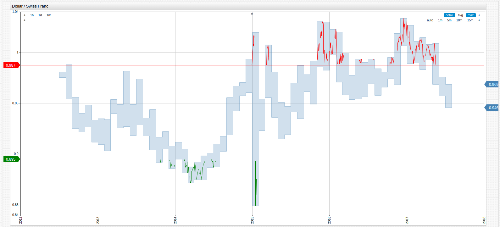
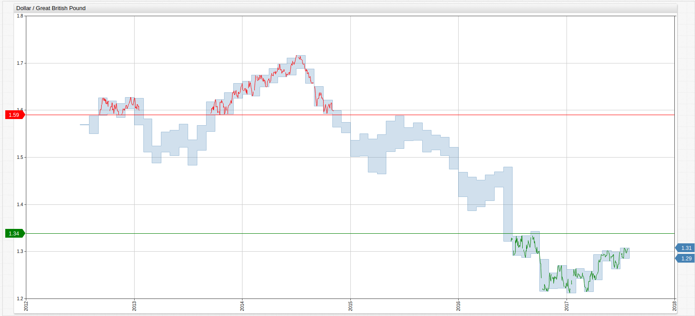
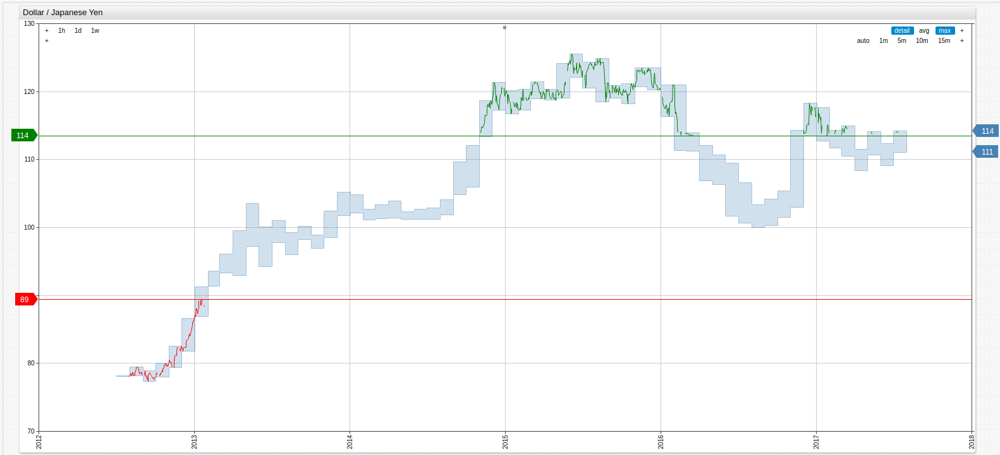
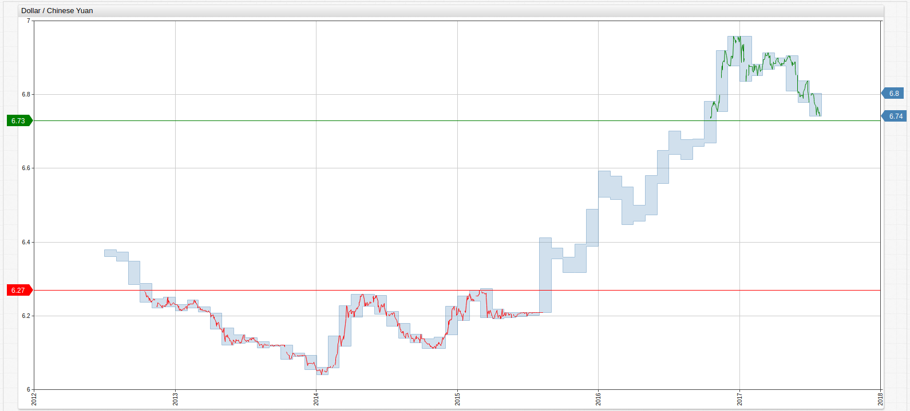
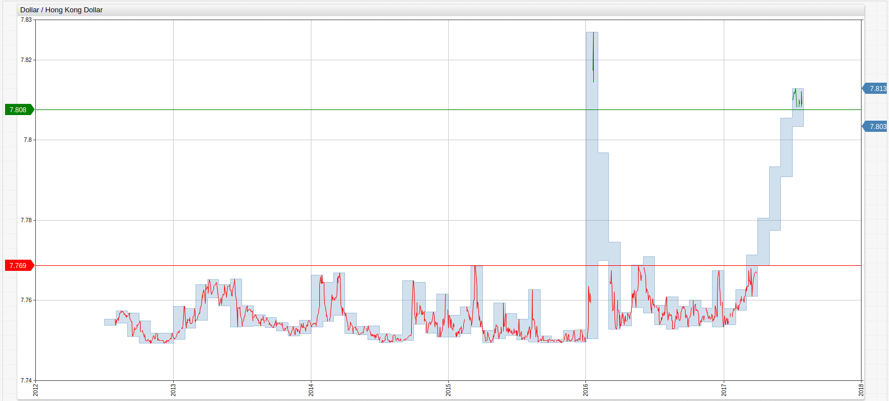
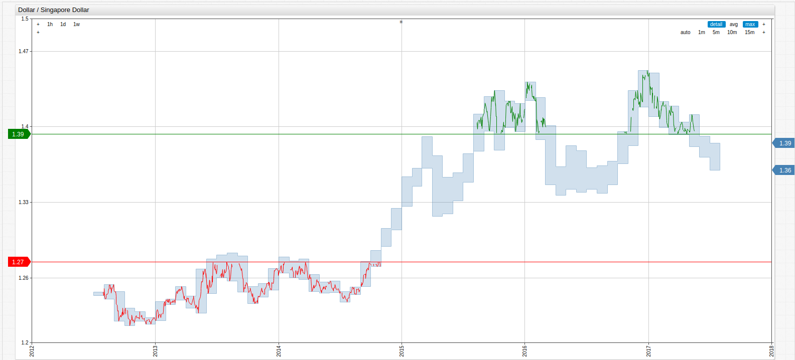
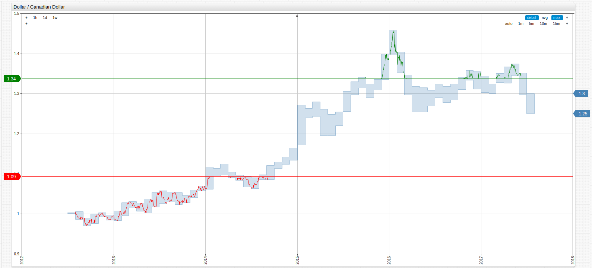
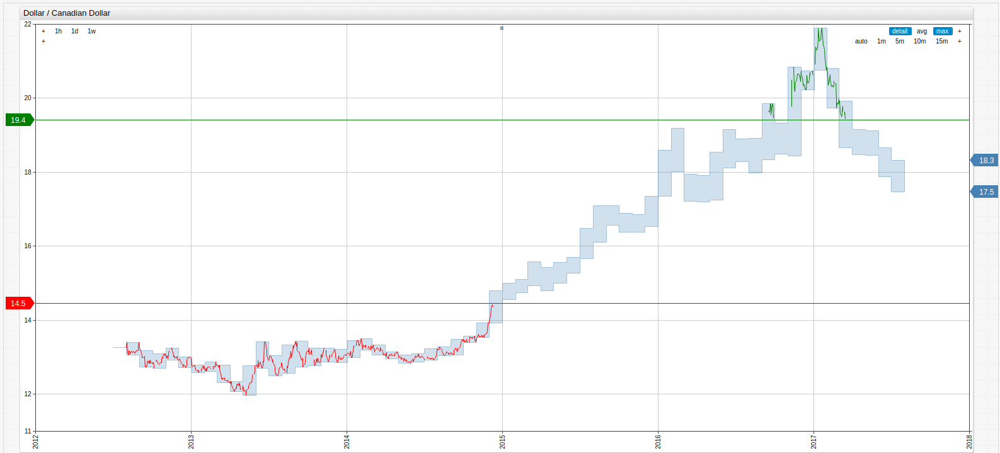

# United States Dollar International Exchange Rate (2012-2017)

Data Source: [Federal Reserve Economic Data (FRED)](https://fred.stlouisfed.org/categories/94)

Visualizations: [ChartLab](https://apps.axibase.com/chartlab)

Structured Query Language: [SQL Console](https://axibase.com/docs/atsd/sql/) in ATSD

## Index

Data is aggregated daily in visualizations, and annually in SQL queries. Favorable dollar exchange rates are shown in green
while less favorable exchange rates are shown in red, based on the overall 5-year average exchange rate. Each section is accompanied
by a brief analysis to give the data context. Using computed [value settings](https://axibase.com/products/axibase-time-series-database/visualization/widgets/configuring-the-widgets/)
thresholds have been calculated using the underlying data, the upper 25th percentile of a given exchange rate is considered
favorable while the lower 25th percentile is considered less than favorable. The data is coded with an ID which is provided in the index as well. Open any [ChartLab](https://apps.axibase.com/chartlab) display below to navigate through time, or change the metric to reflect a different exchange rate.

[Europe](#europe)

* [European Union Euro (`dexuseu`)](#usd-v-euro)
* [Swiss Franc (`dexszus`)](#usd-v-swiss-franc)
* [Great British Pound (`dexusuk`)](#usd-v-great-british-pound)

[Asia](#asia)

* [Japanese Yen (`dexjpus`)](#usd-v-japanese-yen)
* [Chinese Yuan (`dexchus`)](#usd-v-chinese-yuan)
* [Hong Kong Dollar (`dexhkus`)](#usd-v-hong-kong-dollar)
* [Singapore Dollar (`dexsius`)](#usd-v-singapore-dollar)

[North America](#north-america)

* [Canadian Dollar (`dexcaus`)](#usd-v-canadian-dollar)
* [Mexican Peso (`dexmxus`)](#usd-v-mexican-peso)

## Europe

### USD v. Euro

As the amount of debt carried by various EU member countries grew to increasingly worrisome heights, the Euro plunged in 2015
losing ground against the dollar. Further, as oil prices slumped the European Central Bank began to compensate by launching a
program of government bond purchases. The combination of these factors and the growth of the dollar post-recession have all
contributed to the currently favorable exchange rate enjoyed by the dollar.

```sql
SELECT date_format(time, 'yyyy') AS "Date", AVG(value) AS "Average Value"
  FROM dexuseu
GROUP BY PERIOD(1 YEAR)
```

| Date | Average Value |
|------|---------------|
| 2012 | 1.28          |
| 2013 | 1.33          |
| 2014 | 1.33          |
| 2015 | 1.11          |
| 2016 | 1.11          |
| 2017 | 1.09          |


[](https://apps.axibase.com/chartlab/424eb6b2/5/#fullscreen)

Open the ChartLab visualization above to navigate through time or select a different currency.

> Return to the [Index](#index)

### USD v. Swiss Franc

During the worst of the [European Debt Crisis](../eu-debt/README.md) which saw [European Union per capita debt](../eu-debt-per-capita/README.md)
grow at unprecedented rates across the continent, EU investors sought refuge in the stability of the Swiss Franc, backed by the
world-renowned Swiss banking system. Further, the Swiss National Bank removed the peg to the Euro unexpectedly in 2015 causing a huge
surge in 2015, clearly visible in the visualization below as a sudden change from a favorable exchange rate for dollar holders
to an all-time low for the observed time period.

```sql
SELECT date_format(time, 'yyyy') AS "Date", AVG(value) AS "Average Value"
  FROM dexszus
GROUP BY PERIOD(1 YEAR)
```

| Date | Average Value |
|------|---------------|
| 2012 | 0.94          |
| 2013 | 0.93          |
| 2014 | 0.91          |
| 2015 | 0.96          |
| 2016 | 0.98          |
| 2017 | 0.99          |



[](https://apps.axibase.com/chartlab/424eb6b2/9/#fullscreen)

Open the ChartLab visualization above to navigate through time or select a different currency.

> Return to the [Index](#index)

### USD v. Great British Pound

Largely influenced by the divisive Brexit vote, the value of the Pound has remained relatively low since the referendum in
late June of 2016, which aligns perfectly with the slight depreciation of the Pound in value against the dollar on the chart below.

```sql
SELECT date_format(time, 'yyyy') AS "Date", AVG(value) AS "Average Value"
  FROM dexusuk
GROUP BY PERIOD(1 YEAR)
```

| Date | Average Value |
|------|---------------|
| 2012 | 1.60          |
| 2013 | 1.56          |
| 2014 | 1.65          |
| 2015 | 1.53          |
| 2016 | 1.36          |
| 2017 | 1.27          |

> Average Exchange Rate: 1.50



[](https://apps.axibase.com/chartlab/424eb6b2/6/#fullscreen)

Open the ChartLab visualization above to navigate through time or select a different currency.

> Return to the [Index](#index)

## Asia

### USD v. Japanese Yen

After purchasing trillions of Yen worth of Japanese national debt from the private sector three years ago, the Central Bank
of Japan has been watching the gradual decrease in value of the Yen against the dollar. Most analysts, see this
fall as controlled and predict a bright future for the Yen as the Central Bank can no longer afford to collect more debt
than they already have. However, the rise of the Yen must be managed carefully, as the sudden appreciation of the currency could result in
an increase in loan defaults because industries which have taken loans at current Yen prices would be paying them back at a
much higher rate.

```sql
SELECT date_format(time, 'yyyy') AS "Date", AVG(value) AS "Average Value"
  FROM dexjpus
GROUP BY PERIOD(1 YEAR)
```

| Date | Average Value |
|------|---------------|
| 2012 | 80.05         |
| 2013 | 97.60         |
| 2014 | 105.74        |
| 2015 | 121.05        |
| 2016 | 108.66        |
| 2017 | 112.33        |



[](https://apps.axibase.com/chartlab/424eb6b2/4/#fullscreen)

Open the ChartLab visualization above to navigate through time or select a different currency.

> Return to the [Index](#index)

### USD v. Chinese Yuan

To prevent dramatic internal inflation, the People's Bank of China closely regulates local, or onshore, trading of the Yuan
by fixing the price each day. Although independent officially, the international, or offshore, price of the Yuan usually
remains fairly close to its onshore value. Additionally, the PBoC carefully controls the outflow of capital and often hedges
their own currency by maintaining positions in international currencies.

```sql
SELECT date_format(time, 'yyyy') AS "Date", AVG(value) AS "Average Value"
  FROM dexchus
GROUP BY PERIOD(1 YEAR)
```

| Date | Average Value |
|------|---------------|
| 2012 | 6.28          |
| 2013 | 6.15          |
| 2014 | 6.16          |
| 2015 | 6.28          |
| 2016 | 6.64          |
| 2017 | 6.86          |



[](https://apps.axibase.com/chartlab/424eb6b2/2/#fullscreen)

Open the ChartLab visualization above to navigate through time or select a different currency.

> Return to the [Index](#index)

### USD v. Hong Kong Dollar

The Hong Kong Dollar is officially pegged to the value of the United States Dollar. Any change in relative
value is planned. The "Miracle of the Orient" continues to be one of the most dominant financial markets in the world.

```sql
SELECT date_format(time, 'yyyy') AS "Date", AVG(value) AS "Average Value"
  FROM dexhkus
GROUP BY PERIOD(1 YEAR)
```

| Date | Average Value |
|------|---------------|
| 2012 | 7.75          |
| 2013 | 7.76          |
| 2014 | 7.75          |
| 2015 | 7.75          |
| 2016 | 7.76          |
| 2017 | 7.78          |



[](https://apps.axibase.com/chartlab/424eb6b2/3/#fullscreen)

Open the ChartLab visualization above to navigate through time or select a different currency.

> Return to the [Index](#index)

### USD v. Singapore Dollar

One of the financial centers of the world, Singapore is home to the second-busiest port in the world and one of the largest
oil refining industries worldwide as well. With one of the highest per capita GDP values, Singapore has cemented its
place of international importance despite inexplicably loose financial policy whereby the Monetary Authority of Singapore
does not regulate currency value by adjusting interest rates, which is common with most central banking systems.

```sql
SELECT date_format(time, 'yyyy') AS "Date", AVG(value) AS "Average Value"
  FROM dexsius
GROUP BY PERIOD(1 YEAR)
```

| Date | Average Value |
|------|---------------|
| 2012 | 1.23          |
| 2013 | 1.25          |
| 2014 | 1.27          |
| 2015 | 1.37          |
| 2016 | 1.38          |
| 2017 | 1.40          |



[](https://apps.axibase.com/chartlab/424eb6b2/8/#fullscreen)

Open the ChartLab visualization above to navigate through time or select a different currency.

> Return to the [Index](#index)

## North America

### USD v. Canadian Dollar

Relative to the USD, the Canadian dollar has been making a bit of a resurgence in 2017 as United States GDP numbers missed
its targets in quarter two. Although dependent on the price of oil due to their large natural reserves, the diverse Canadian
economy is one of the few globally-active nations with a significant trade surplus, although that too have been reduced in recent years.

```sql
SELECT date_format(time, 'yyyy') AS "Date", AVG(value) AS "Average Value"
  FROM dexcaus
GROUP BY PERIOD(1 YEAR)
```

| Date | Average Value |
|------|---------------|
| 2012 | 0.99          |
| 2013 | 1.03          |
| 2014 | 1.10          |
| 2015 | 1.28          |
| 2016 | 1.32          |
| 2017 | 1.33          |



[](https://apps.axibase.com/chartlab/424eb6b2/#fullscreen)

Open the ChartLab visualization above to navigate through time or select a different currency.

> Return to the [Index](#index)

### USD v. Mexican Peso

Boasting the highest per capita income of Latin America, the Mexican economy has continued to demonstrate healthy growth over
the last several decades. The number one producer of automobiles in North America also enjoys a $46 billion trade surplus with the
United States, and is the 9th ranked owner of United States government debt. This dependence on America affords Mexico the
ability to spur dramatic internal growth that has led to the creation of a booming electronics sector, but at the cost of a
certain amount of reliance on the United States as roughly half of the imports and exports of Mexico originate or end up
on U.S. soil.

```sql
SELECT date_format(time, 'yyyy') AS "Date", AVG(value) AS "Average Value"
  FROM dexmxus
GROUP BY PERIOD(1 YEAR)
```

| Date | Average Value |
|------|---------------|
| 2012 | 13.00         |
| 2013 | 12.76         |
| 2014 | 13.30         |
| 2015 | 15.87         |
| 2016 | 18.67         |
| 2017 | 19.18         |



[](https://apps.axibase.com/chartlab/424eb6b2/7/#fullscreen)

Open the ChartLab visualization above to navigate through time or select a different currency.

> Return to the [Index](#index)
