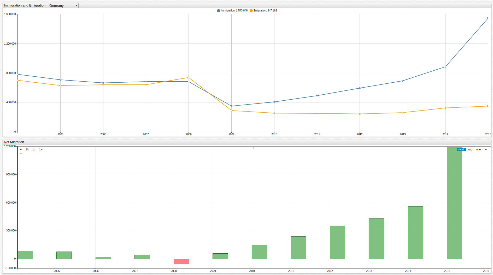

# European Union Net Migration by Country

**Source**: Eurostat [Immigration and Emigration Data](https://ec.europa.eu)

**Visualization**: [ChartLab](https://apps.axibase.com/chartlab)

_Database_: ATSD

Annual data recording immigration and emigration from member countries of the European Union, sorted by nation and shown alongside
net migration data.

> Use the drop-down list to navigate between countries.

Additional European Union datasets:

* [European Union Debt by Country](../eu-debt/README.md)
* [European Union Per Capita Debt by Country](../eu-debt-per-capita/README.md)
