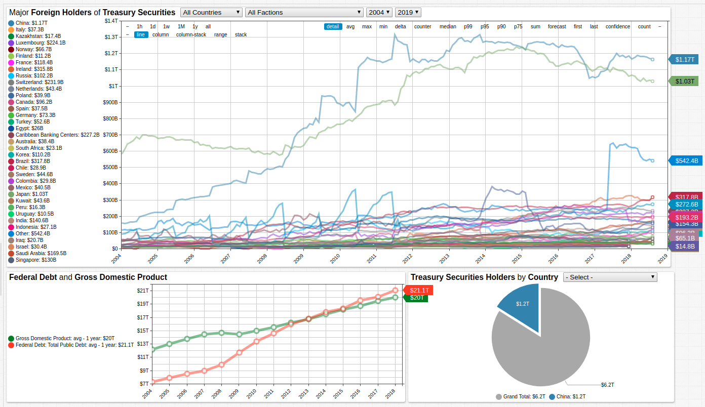
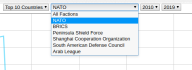
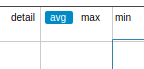
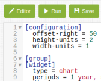
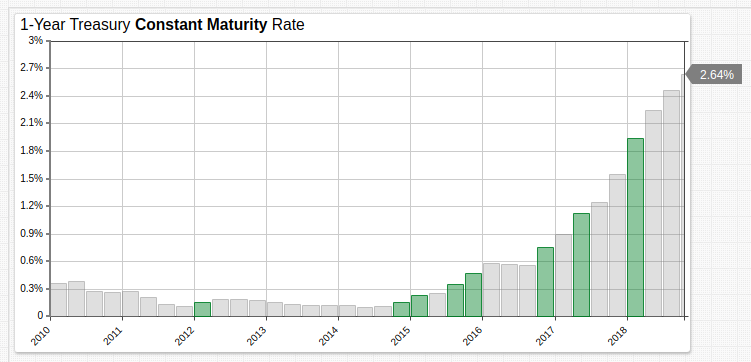

# Major Foreign Holders of Treasury Securities (2000-2018)

## Toolkit

* Data Source: [`treasury.gov`](https://home.treasury.gov/)
* Visualization Tool: [**ChartLab**](https://axibase.com/products/axibase-time-series-database/visualization/)
* Query Language: [ATSD **SQL Console**](https://axibase.com/docs/atsd/sql/)

> To replicate this or [other portals](../../../README.md), install [ATSD](https://axibase.com/docs/atsd/installation/) or launch the [Docker Container](https://axibase.com/docs/atsd/installation/images.html).

## Securities Portal

The United States Treasury releases monthly reports detailing major holders of United States Treasury securities in USD billion. The **Securities Portal** tracks this data for the last two decades, when foreign ownership of national debt began to significantly increase. In 1988, roughly 13% of the debt was foreign held. By 2007, that figure had increased to 25%. In the present, that number has reached 45%.



[](https://apps.axibase.com/chartlab/9c240db8#fullscreen)

### Exploring the Portal

The **Securites Portal** includes ad-hoc transformation and filtering tools to investigate an otherwise large dataset.

> **ChartLab** uses [Charts syntax](https://axibase.com/products/axibase-time-series-database/visualization/) to create portals from data stored in ATSD.

#### Filtering Series

Use the drop-down lists in the the widget headers to filter by value, military faction, or time span.



#### Transforming Data

Use the control panel along the top of the chart to compute and display aggregated values for any of the specified time periods.

```ls
periods = 1 year, 5 year, 10 year
```



### Modifying the Portal

To customize the visualization, expand the **Editor** pane. Refer to the [**ChartLab** tutorial](../../../tutorials/shared/chartlab.md) to get started. [**ChartLab** documentation](https://axibase.com/products/axibase-time-series-database/visualization/) includes other basic configuration examples.



---

## Querying the Data

Treasury data is accessible via [**SQL Console**](https://axibase.com/docs/atsd/sql/sql-console.html).

### Greatest Absolute Increase in Securities Holdings

Data is stored by Treasury in USD billion:

* `1,000` corresponds to $1 trillion.
* `1` corresponds to $1 billion.

```sql
SELECT tags.country as "Country", DELTA(value) as "Debt"
  FROM tic_foreign_holders
WHERE tags.country NOT LIKE 'Total'
  AND tags.country NOT LIKE 'For. Official'
  AND tags.country NOT LIKE 'T-Bonds & Notes'
  AND tags.country NOT LIKE 'Oil Exporters'
  AND tags.country NOT LIKE 'Treasury Bills'
GROUP BY PERIOD(20 year), tags.country
  ORDER BY delta(value) DESC
LIMIT 10
```

```ls
| Country                   | Debt |
|---------------------------|------|
| China                     | 1106 |
| Japan                     | 704  |
| Other                     | 415  |
| Ireland                   | 309  |
| Brazil                    | 307  |
| Switzerland               | 210  |
| Luxembourg                | 201  |
| Caribbean Banking Centers | 171  |
| Hong Kong                 | 148  |
| India                     | 135  |
```

### Greatest Percent Increase in Securities Holdings

```sql
SELECT tags.country as "Country", FIRST(value) AS "Initial", LAST(value) AS "Final", LAST(value)/FIRST(value)* 100 as "%Increase"
  FROM tic_foreign_holders
WHERE tags.country NOT LIKE 'Total'
  AND tags.country NOT LIKE 'For. Official'
  AND tags.country NOT LIKE 'T-Bonds & Notes'
  AND tags.country NOT LIKE 'Oil Exporters'
  AND tags.country NOT LIKE 'Treasury Bills'
GROUP BY PERIOD(20 year), tags.country
  ORDER BY "%Increase" DESC
LIMIT 10
```

```ls
| Country     | Initial | Final  | %Increase |
|-------------|---------|--------|-----------|
| Ireland     | 7.2     | 315.8  | 4386.1    |
| Brazil      | 10.9    | 317.8  | 2915.6    |
| India       | 5.8     | 140.6  | 2424.1    |
| China       | 59.4    | 1165.1 | 1961.4    |
| Russia      | 8.5     | 102.2  | 1202.4    |
| Norway      | 5.7     | 66.7   | 1170.2    |
| Switzerland | 21.4    | 231.9  | 1083.6    |
| Luxembourg  | 23.1    | 224.1  | 970.1     |
| Sweden      | 6.1     | 44.6   | 731.1     |
| Thailand    | 9.7     | 63.3   | 652.6     |
```

### Countries Which Maintain Holdings

These countries carry the greatest overall average values of Treasury securities, indicating they rarely sell what they buy.

```sql
SELECT tags.country as "Country", AVG(value) AS "Average Annual Holdings"
  FROM tic_foreign_holders
WHERE tags.country NOT LIKE 'Total'
  AND tags.country NOT LIKE 'For. Official'
  AND tags.country NOT LIKE 'T-Bonds & Notes'
  AND tags.country NOT LIKE 'Oil Exporters'
  AND tags.country NOT LIKE 'Treasury Bills'
  AND tags.country NOT LIKE 'Grand Total'
GROUP BY PERIOD(20 year), tags.country
  ORDER BY AVG(value) DESC
```

```ls
| Country        | Average Annual Holdings |
|----------------|-------------------------|
| Japan          | 790.0                   |
| China          | 720.0                   |
| All Other      | 639.2                   |
| Other          | 210.3                   |
| Cayman Islands | 194.9                   |
| Brazil         | 155.5                   |
| United Kingdom | 149.1                   |
| Luxembourg     | 112.9                   |
| Taiwan         | 110.5                   |
| Russia         | 109.2                   |
```

---

## The Value of Treasury Securities

Debt is generally understood to be an economic disadvantage with the great transcendentalist Ralph Waldo Emerson remarking, "a man in debt is so far a slave." The general attitude towards debt has evolved as such, and national debt held by foreign government is traditionally regarded with uneasiness.

Equity analyst Michael Foster offers a [different perspective](https://www.forbes.com/sites/michaelfoster/2017/11/08/federal-debt-is-reaching-20-trillion-and-i-dont-care/#7f28bf3832ba), whereby the national debt should be considered a reliable long-term asset which promises the stability historically ascribed to the dollar. Certainly, various foreign countries, and several countries in particular, have made significant long-term investments in the national debt. According to Dr. Foster, that the national debt even begun to exceed GDP is not a harbinger of imminent financial collapse.

Nonetheless, anytime an investment is improperly hedged an increased risk is assumed. At the moment, roughly 35% of the national debt held by foreign governments is controlled by just two countries: China and Japan. Indeed, the combined share of the debt held by just two parties is nearly equal to half of the the overall value. Such imparity can always produce unknowable outcomes. Should either economy sell their treasury securities *en masse*, the entire market could be affected in ways that are not predictable.

The 1-year constant maturity rate for Treasury bonds has been steadily increasing for the last several years. Encouraging considering the half-decade of less-than-one-percent yields on the same bonds.



[](https://apps.axibase.com/chartlab/6866c376#fullscreen)

The source [Federal Reserve data](https://fred.stlouisfed.org/series/DGS1) is grouped by quarter, and periods which show an increase of greater than 25% from the previous quarter are highlighted.

```ls
[widget]
  statistics = avg
  period = 3 month

  [series]
    alert-expression = value > 1.25 * previous