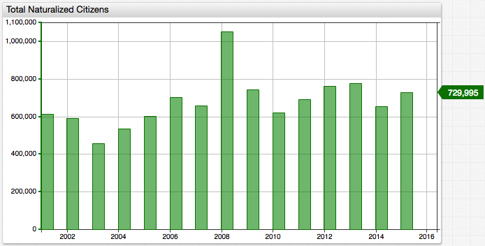
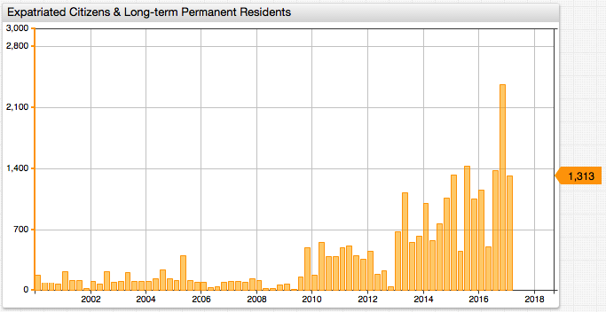

# Quarterly Expatriation Report


## Introduction

The Internal Revenue Service (IRS) of the United States releases quarterly reports tracking the number of expatriated citizens processed in the previous three-month period. The reports are announced via the [Federal Register](https://www.federalregister.gov/) which is the primary publication medium of the federal government and used by a number of agencies as an outreach arm to the public.

Ostensibly, the tax bureau maintains these records instead of Citizenship and Immigration Services (CIS) because the IRS uses that information to adjudicate decisions regarding those expatriating citizens upon whom the Expatriation Tax is levied.

An expatriate must meet any one of the following criteria to be liable for the eponymous tax:

* Average annual net income tax for the five years ending before the date of expatriation or termination of residency is more than a specified amount that is adjusted for inflation ($151,000 for 2012, $155,000 for 2013, $157,000 for 2014, and $160,000 for 2015).
* Net worth is $2 million or more on the date of expatriation or termination of residency.
* Failure to certify on `Form 8854` that the citizen has complied with all U.S. federal tax obligations for the five years preceding the date of expatriation or termination of residency.

IRS [Form `8854`](https://www.irs.gov/pub/irs-pdf/f8854.pdf) available at is a statement which confirms that up to the date of your expatriation, you have complied with United States Federal Tax Code to the letter of the law. Failing to correctly complete this document means that you are obligated to pay the Expatriation Tax, even if you do not meet either of the previous criteria.

Each year more than 700 thousand people become U.S. citizens in a process called naturalization.

The number of people who pledge allegiance to the United States has been relatively stable over the years.



What is interesting however is the number of individuals rolling back their commitment to the country.

Data is published quarterly by the U.S. Federal Register and each report even discloses the names of expatriating individuals. The [latest report](https://www.federalregister.gov/documents/2017/05/10/2017-09475/quarterly-publication-of-individuals-who-have-chosen-to-expatriate-as-required-by-section-6039g) published on May 10, 2017, for example, contains the last, first, and middle names of 1,313 individuals losing United States citizenship from whom the government received information during the quarter ending March 31, 2017.

The IRS legal rationale of disclosing the names under the auspices of HIPAA which is supposed to protect patient privacy seems rather strange to an uninitiated observer but it is of out of scope for this article.

After removing duplicate names which are most likely associated with different social security numbers in the back-end systems and calculating a rolling annual total to smooth out variance, the trend becomes more apparent. More people are leaving the U.S. than in previous years.

```sql
SELECT date_format(time+365*24*60*60000, 'yyyy') AS "Year",
  count(value) AS "Total"
FROM "us-expatriate-counter"
  WHERE entity = 'us.irs' AND datetime < '2017-04-01T00:00:00Z'
GROUP BY period(1 YEAR, END_TIME)
  ORDER BY time
```

## Expatriated Citizens & Long-term Permanent Residents, 12-month rolling sum

| **Year** | **Total** | **Change, %** |
|------|-------|----------:|
| 2000 | 184   | -      |
| 2001 | 470   | 155       |
| 2002 | 373   | -21       |
| 2003 | 507   | 36        |
| 2004 | 545   | 7         |
| 2005 | 645   | 18        |
| 2006 | 724   | 12        |
| 2007 | 285   | -61       |
| 2008 | 485   | 70        |
| 2009 | 174   | -64       |
| 2010 | 853   | 390       |
| 2011 | 1850  | 117       |
| 2012 | 1742  | -6        |
| 2013 | 1151  | -34       |
| 2014 | 3319  | 188       |
| 2015 | 3743  | 13        |
| 2016 | 4096  | 9         |
| 2017 | 5557  | 36        |

> 12-month rolling sum. For example, Year 2017 covers the period between April 1, 2016 and March 31, 2017.



[](https://apps.axibase.com/chartlab/3cc7e293/3)

Given that it usually takes several months between the submission of an application and the appearance of a name on the list, it is not clear if there is any effect of the latest political season on the expatriation numbers.

The next report is due in early August. Stay tuned!

## Expatriated Citizens & Long-term Permanent Residents, Quarterly Totals

```sql
SELECT date_format(time+90*24*60*60000, 'yyyy-MMM') AS "Date",
  count(value) AS "Quarterly Total"
FROM "us-expatriate-counter"
  WHERE entity = 'us.irs' AND datetime >= '2010-01-01T00:00:00Z'
GROUP BY period(1 QUARTER)
  ORDER BY time
```

| **Date** | **Quarterly Total** |
|----------|----------------:|
| 2010-Apr | 179             |
| 2010-Jun | 557             |
| 2010-Sep | 397             |
| 2010-Dec | 398             |
| 2011-Apr | 498             |
| 2011-Jun | 519             |
| 2011-Sep | 403             |
| 2011-Dec | 360             |
| 2012-Mar | 460             |
| 2012-Jun | 189             |
| 2012-Sep | 238             |
| 2012-Dec | 45              |
| 2013-Apr | 679             |
| 2013-Jun | 1129            |
| 2013-Sep | 560             |
| 2013-Dec | 631             |
| 2014-Apr | 999             |
| 2014-Jun | 576             |
| 2014-Sep | 775             |
| 2014-Dec | 1061            |
| 2015-Apr | 1331            |
| 2015-Jun | 459             |
| 2015-Sep | 1426            |
| 2015-Dec | 1057            |
| 2016-Mar | 1154            |
| 2016-Jun | 506             |
| 2016-Sep | 1379            |
| 2016-Dec | 2359            |
| 2017-Apr | 1313            |

## References

* Title Image: [Benedict Arnold's Oath of Allegiance, May 30, 1778](https://en.wikipedia.org/wiki/Oath_of_allegiance#/media/File:Benedict_Arnold_oath_of_allegiance.jpg)
* Axibase Time Series Database (ATSD) [SQL Documentation](https://axibase.com/docs/atsd/sql/)
* [Federal Register](https://www.federalregister.gov/documents/search?conditions%5Bterm%5D=Quarterly+Expatriate)
* Wikipedia: [Quarterly Publication of Individuals Who Have Chosen to Expatriate](https://en.wikipedia.org/wiki/Quarterly_Publication_of_Individuals_Who_Have_Chosen_to_Expatriate)
