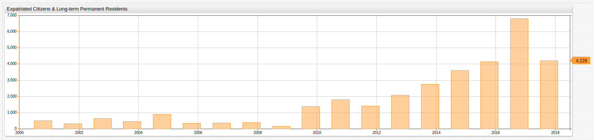
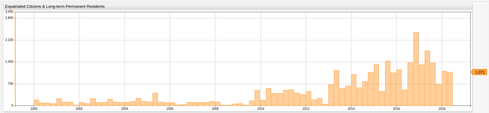
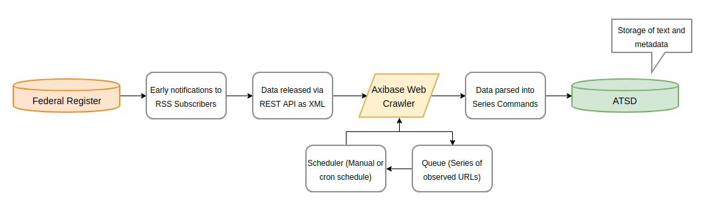
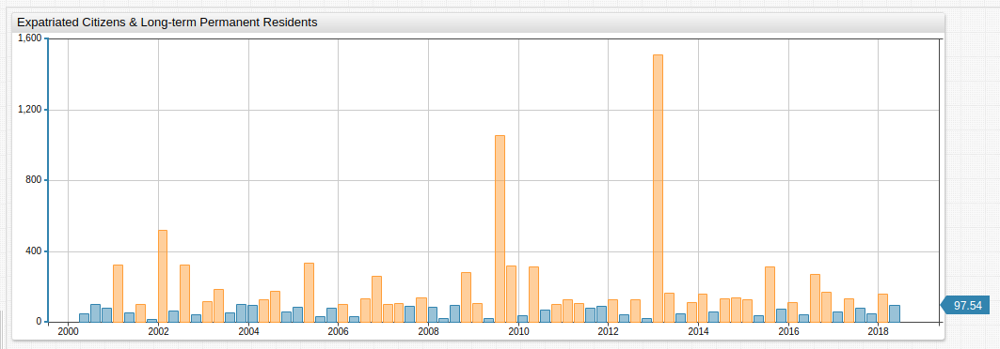
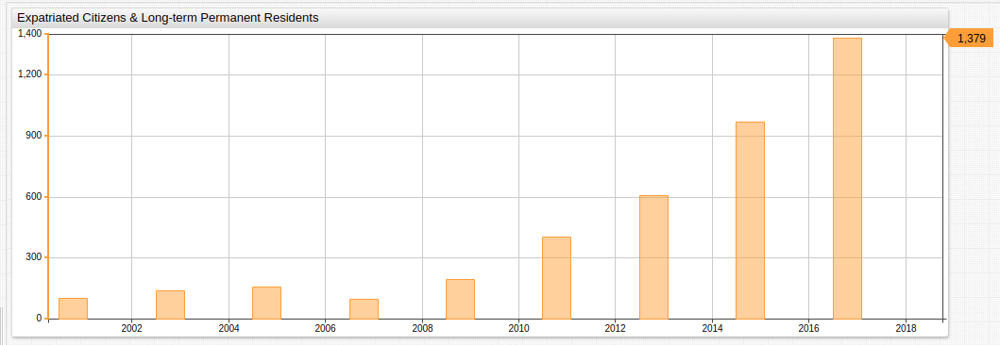
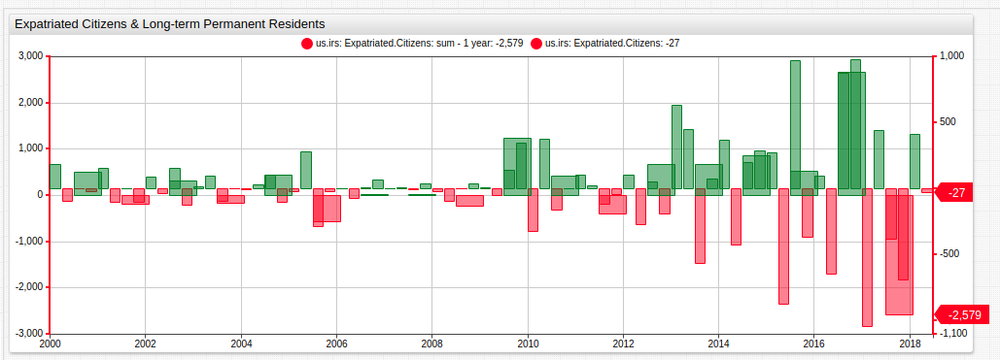
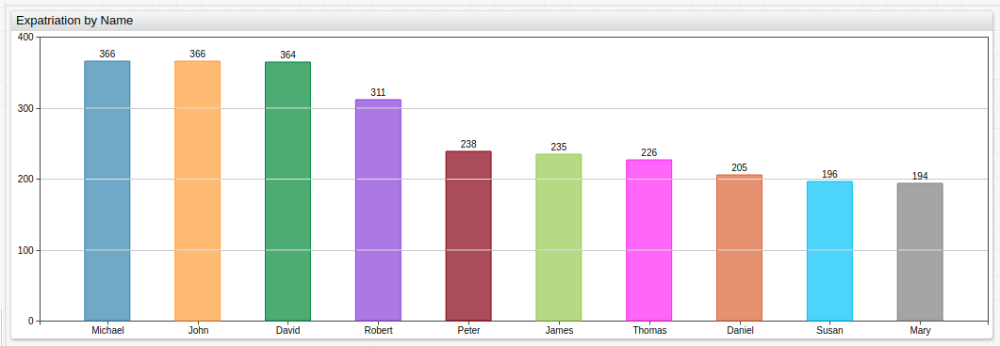
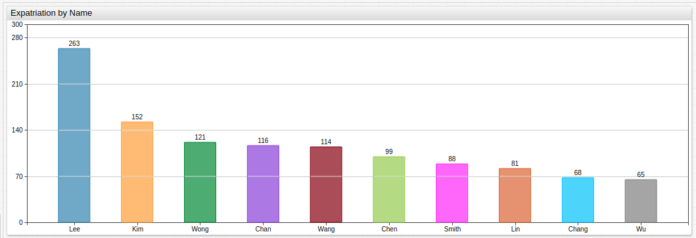

# Second Quarter Expatriation Remains High Despite GDP Growth


## Introduction

The Internal Revenue Service (IRS) of the United States releases quarterly reports tracking the number of expatriated citizens processed in the previous three-month period. The reports are announced via the [Federal Register](https://www.federalregister.gov/) which is the primary publication medium of the federal government and used by a number of agencies as an outreach arm to the public.

Ostensibly, the tax bureau maintains these records instead of Citizenship and Immigration Services (CIS) because the IRS uses that information to adjudicate decisions regarding those expatriating citizens upon whom the Expatriation Tax is levied.

An expatriate must meet any one of the following criteria to be liable for the eponymous tax:

* Average annual net income tax for the five years ending before the date of expatriation or termination of residency is more than a specified amount that is adjusted for inflation ($151,000 for 2012, $155,000 for 2013, $157,000 for 2014, and $160,000 for 2015).
* Net worth is $2 million or more on the date of expatriation or termination of residency.
* Failure to certify on `Form 8854` that the citizen has complied with all U.S. federal tax obligations for the five years preceding the date of expatriation or termination of residency.

IRS [Form `8854`](https://www.irs.gov/pub/irs-pdf/f8854.pdf) available at is a statement which confirms that up to the date of your expatriation, you have complied with United States Federal Tax Code to the letter of the law. Failing to correctly complete this document means that you are obligated to pay the Expatriation Tax, even if you do not meet either of the previous criteria.

Previous articles tracking United States expatriation:

* [2017 Q2](2017-1.md)
* [2017 Q3](2017-2.md)
* [2017 Q4](2017-3.md)
* [2018 Q1](2018-1.md)

---

## Expatriation Review

One of the central principles of the Trump Doctrine has been tangible economic growth. Perhaps invigorated by what former President Obama called the ["new normal,"](http://www.aei.org/publication/team-obama-sorry-america-the-new-normal-may-be-here-to-stay/) that is, roughly 2% quarterly growth, Trump seems to have pulled out all the stops to ensure American GDP grew at a rate greater than the 3.7% standard that we have come to expect since the end of Second World War. Despite the success, expatriation levels remain higher than normal. Naturally, the number of expatriating citizens is far lower than the amount of number of new citizens due to naturalization, but the trend remains interesting nonetheless. This trend has been noted by such publications as the [Washington Post](https://www.washingtonpost.com/news/worldviews/wp/2017/02/10/a-potentially-historic-number-of-people-are-giving-up-their-u-s-citizenship/?noredirect=on&utm_term=.5a0d04f0ffb5) as far back as early 2017, when Axibase published the [first article](2017-1.md) citing the trend.

---

## Latest Data

The underlying IRS report contains the names of the individuals who expatriated in the second quarter of 2018.

Support for date aggregations in ATSD [SQL syntax](https://axibase.com/docs/atsd/sql/) allows reporting on both the annual and quarterly basis.

### Annual Data

```sql
SELECT date_format(time+365*24*60*60000, 'yyyy') AS "Year",
  count(value) AS "Year Total",
  count(value)-lag(count(value)) AS "Y-o-Y Change",
  100*(count(value)-lag(count(value)))/lag(count(value)) AS "Y-o-Y Change, %"
FROM "us-expatriate-counter"
  WHERE entity = 'us.irs' AND datetime <= '2018-06-30T00:00:00Z'
GROUP BY period(1 YEAR, END_TIME)
  ORDER BY period(1 YEAR, END_TIME)
```

```txt
| Year | Year Total | Y-o-Y Change | Y-o-Y Change, % |
|------|------------|--------------|-----------------|
| 2000 | 273        | null         | null            |
| 2001 | 502        | 229          | 84              |
| 2002 | 322        | -180         | -36             |
| 2003 | 646        | 324          | 101             |
| 2004 | 474        | -172         | -27             |
| 2005 | 911        | 437          | 92              |
| 2006 | 351        | -560         | -61             |
| 2007 | 368        | 17           | 5               |
| 2008 | 394        | 26           | 7               |
| 2009 | 166        | -228         | -58             |
| 2010 | 1395       | 1229         | 740             |
| 2011 | 1812       | 417          | 30              |
| 2012 | 1412       | -400         | -22             |
| 2013 | 2091       | 679          | 48              |
| 2014 | 2766       | 675          | 32              |
| 2015 | 3626       | 860          | 31              |
| 2016 | 4143       | 517          | 14              |
| 2017 | 6807       | 2664         | 64              |
| 2018 | 4228       | -2579        | -38             |
```

[**ChartLab**](../../tutorials/shared/chartlab.md) is a visualization service which can display ATSD data as charts. **ChartLab** features a wide range of widgets, created using a declarative syntax.



[](https://apps.axibase.com/chartlab/f45f19fc)

### Quarterly Data

```sql
SELECT CEIL(CAST(date_format(time, 'M') AS NUMBER)/3) AS "Quarter", date_format(time, 'yyyy') AS "Year",
  count(value) AS "Quarter Total"
FROM "us-expatriate-counter"
  WHERE entity = 'us.irs' AND date_format(time, 'yyyy-MM') >= '2014-01' AND datetime <= now
GROUP BY period(1 QUARTER)
  ORDER BY period(1 QUARTER)
```

```txt
| Quarter | Year | Quarter Total |
|---------|------|---------------|
| 1       | 2014 | 999           |
| 2       | 2014 | 576           |
| 3       | 2014 | 775           |
| 4       | 2014 | 1061          |
| 1       | 2015 | 1331          |
| 2       | 2015 | 459           |
| 3       | 2015 | 1426          |
| 4       | 2015 | 1057          |
| 1       | 2016 | 1154          |
| 2       | 2016 | 506           |
| 3       | 2016 | 1379          |
| 4       | 2016 | 2359          |
| 1       | 2017 | 1313          |
| 2       | 2017 | 1756          |
| 3       | 2017 | 1374          |
| 4       | 2017 | 685           |
| 1       | 2018 | 1098          |
| 2       | 2018 | 1071          |
```

Although lower than 2017 Q2, 2018 Q2 data is on the order of recent, record-setting years for expatriation numbers.

Using **ChartLab** for data visualization of the quarterly samples:



[](https://apps.axibase.com/chartlab/7c00db67)

---

## On-Loading Expatriation Data

The data published by the Federal Register requires an intermediate ETL step to be available for analysis. This extraction-transformation-loading procedure is implemented by a [web crawler](https://github.com/axibase/atsd-data-crawlers/tree/irs-expatriation-data-crawler) built specifically for the task of tracking Federal Register publications for new expatriation data releases.

The Web Crawler operates according to this workflow:



The Web Crawler reads incoming data from the Federal Register and parses it into [`series` commands](https://axibase.com/docs/atsd/api/network/series.html), readable by ATSD, the database which hosts all the data used in this article and supports the background operations of [SQL Console](https://axibase.com/docs/atsd/sql/). A `series` command template is shown below:

```ls
series d:{iso-date} e:{entity} t:{tag-1}={val-1} m:{metric-1}={number}
```

In the case of expatriation data here, the entity is the publishing body, `us.irs` and the metric is `us-expatriate-counter`.

SQL result set with raw data output no grouping:

```sql
SELECT datetime, tags.first_name, tags.middle_name, tags.last_name
  FROM "us-expatriate-counter"
WHERE entity = 'us.irs'
  ORDER BY datetime DESC
LIMIT 10
```

```txt
| datetime   | tags.first_name | tags.middle_name | tags.last_name |
|------------|-----------------|------------------|----------------|
| 2018-06-30 | TIMNA           | null             | SHNITZER       |
| 2018-06-30 | SHUNTARO        | JAMES            | SHIMIZU        |
| 2018-06-30 | DANZHU          | null             | SHI            |
| 2018-06-30 | YOMESH          | DINESH           | SHAH           |
| 2018-06-30 | FAREHA          | null             | SHAFIQUE       |
| 2018-06-30 | JUNYA           | null             | SATO           |
| 2018-06-30 | GETHEN          | JAN              | SASANOW        |
| 2018-06-30 | THEIPHILUS      | L                | SAMUELS        |
| 2018-06-30 | NATASJA         | null             | RESLOW         |
| 2018-06-30 | CHARLEMAGNE     | R                | QUIBAN         |
```

---

## Additional Visualizations

### Ad Hoc Percent Change Calculation

Show each data sample a percentage of the previous data sample. Quarters where expatriation increased, thus `value > 100` are highlighted in orange using an [`alert-expression`](https://github.com/axibase/charts/blob/master/syntax/alert-expression.md)

```ls
[series]
  replace-value = value/previousValue *100
  format = round(value, 2)
  alert-expression = value > 100
  alert-style = fill: orange
```



[](https://apps.axibase.com/chartlab/d30a6925)

### Two-Year Average

Group data in two-year periods and calculate the average amongst intervals to highlight overarching trends since year 2000.

```ls
[widget]
  period = 2 year
  statistics = avg
```



[](https://apps.axibase.com/chartlab/3b0867f2)

### Raw Difference Between Annual and Quarterly Samples

Compute the raw differences between samples for both the quarterly and annual datasets.



[](https://apps.axibase.com/chartlab/9f15f28f)

### Expatriation by Name

**The goal of these queries is purely demonstrative and lighthearted. There is no intention to invade privacy, defame people, or
otherwise cause harm.**



```sql
SELECT tags.first_name AS "First Name",
  count(value) AS "Expat Total"
FROM "us-expatriate-counter"
  WHERE entity = 'us.irs' AND datetime <= now
GROUP BY tags.first_name
  ORDER BY count(value) desc
LIMIT 15
```

```txt
| First Name  | Expat Total |
|-------------|-------------|
| MICHAEL     | 366         |
| JOHN        | 366         |
| DAVID       | 364         |
| ROBERT      | 311         |
| PETER       | 238         |
| JAMES       | 235         |
| THOMAS      | 226         |
| DANIEL      | 205         |
| SUSAN       | 196         |
| MARY        | 194         |
| WILLIAM     | 190         |
| RICHARD     | 186         |
| CHRISTOPHER | 177         |
| MARK        | 164         |
| JENNIFER    | 158         |
```

> All of these names appear on the list of most common American first names, linked [here](https://www.ssa.gov/oact/babynames/decades/century.html)



```sql
SELECT tags.last_name AS "Last Name",
  count(value) AS "Expat Total"
FROM "us-expatriate-counter"
  WHERE entity = 'us.irs' AND datetime <= now
GROUP BY tags.last_name
  ORDER BY count(value) desc
LIMIT 15
```

```txt
| Last Name | Expat Total |
|-----------|-------------|
| LEE       | 263         |
| KIM       | 152         |
| WONG      | 121         |
| CHAN      | 116         |
| WANG      | 114         |
| CHEN      | 99          |
| SMITH     | 88          |
| LIN       | 81          |
| CHANG     | 68          |
| WU        | 65          |
| NG        | 56          |
| PARK      | 54          |
| LI        | 54          |
| LIU       | 53          |
| LIM       | 52          |
```

>Only the name Smith appears on the list of most common American last names.