# Quantifying Public Health: The American Fitness Index


## Introduction

Obesity and heart disease have long-plagued the American people, with the Center for Disease Control estimating that [one-in-four deaths in America](https://www.cdc.gov/heartdisease/facts.htm) each year are caused by heart disease, a number that comes out to around 610,000 annually.
However, one metric alone is never enough to make meaningful conclusions, and with National Institutes of Health [figures](https://www.niddk.nih.gov/health-information/health-statistics/overweight-obesity)
that estimate two-thirds of Americans are classifiable as overweight, a more comprehensive
understanding of public health is clearly needed if the nation is going to make
meaningful strides towards a future that sees the resolution of the problem that is America's ever-growing waistline.

## Methodology

[Data](https://catalog.data.gov/dataset/american-fitness-index-ranking-2010-present)
originally released by the [American College of Sports Medicine](http://www.acsm.org/) and
partially-published by the City of New Orleans attempts to quantify the overall health of the fifty largest metropolitan areas in the United States every year. The 100-point ascending scale
takes into account a number of factors they believe contribute to the overall health
of a city and its surrounding area with the goal of informing policy makers of the
reality of public health in their areas.

>A detailed explanation of how the ACSM assigns scores can be found in the [Appendix](#appendix)

The data compares ten Metropolitan Statistical Areas (MSAs) located primarily
in the Southeast of the country, a region notorious for its problems with public health. Location notwithstanding, the data is otherwise quite diverse, representing MSAs from seven states and including the United States average values as well. Further, high-scoring MSAs like Atlanta, Georgia are shown alongside low-scoring MSAs like Oklahoma City, Oklahoma; with a five-year time period of observation (2011 to 2015), enough public data
exists to effectively observe and record recent trends through similarity matching.

Additionally, statistical analysis can be done to test theories that arise during observation.
Since the data is collected over a reasonable time span and contains information from
several different states, a number of relationships can be observed and investigated
to determine their validity and data-based clustering can be done for a range of purposes.

Is there a way to predict performance on the ACSM AFI, and by extension, overall public
health using this data?

Publicly-available data allows for anyone with access to the correct analytics tools to pursue answers
to their own questions and convey that information to any audience. The ATSD
is developed to work within the [Socrata](https://axibase.com/docs/axibase-collector/jobs/socrata.html)
framework used by government agencies to publish data, so it was selected as the main tool for this project
and calculations were done using the computational knowledge engine [WolframAlpha](https://www.wolframalpha.com/).

## Data

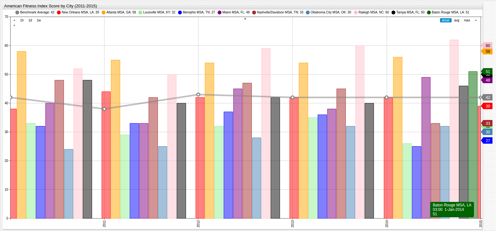

[](https://apps.axibase.com/chartlab/e926d483/47/)

Looking at an entire set of data at once is often unhelpful and overwhelming, but
this visualization can be used to offer a wide lens through which to view what amounts
to quite a lot of data over a long period of time. The grey Benchmark Average line
simplifies the visualization by establishing a standard and providing perspective to someone
who may be otherwise unfamiliar with the scoring system.

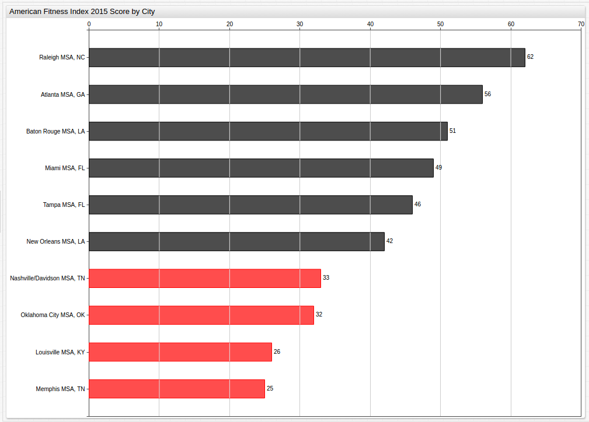

[](https://apps.axibase.com/chartlab/e926d483/55/)

This visualization looks at Year 2015 data and highlights those cities performing
below the National Benchmark Average.

>For more information about using the `ALERT` Setting, see the [Appendix](#appendix)

This visualization can track city performance throughout the observed time period,
establishing binary clusters, those cities which performed above the benchmark
average and those which performed below the benchmark average.

The Benchmark Average, and by extension alert threshold, is modified for each year:

> Year 2011 (Benchmark Average: 42)


[](https://apps.axibase.com/chartlab/e926d483/56/)

> Year 2013 (Benchmark Average: 43)

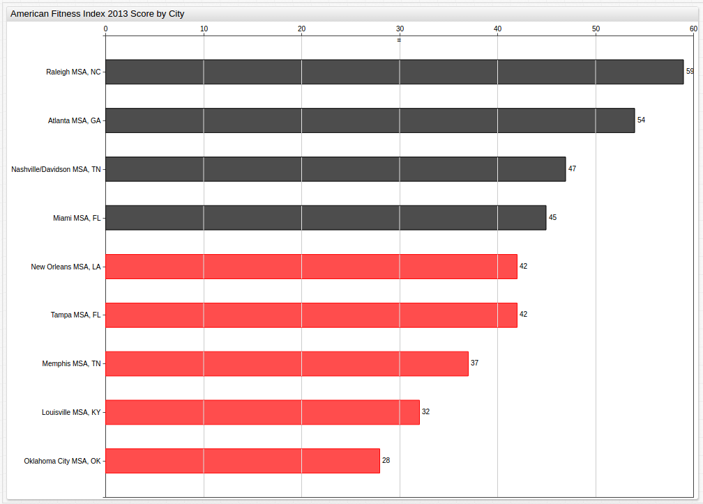

[](https://apps.axibase.com/chartlab/e926d483/51/)

>Even year (2012 and 2014) data can be found in the [Appendix](#appendix)

to observe trends in individual MSAs, finding an effective method to sort
the data is needed. By organizing the data by city, chronologically, trends appear
that were not as obvious in the first visualization:


[](https://apps.axibase.com/chartlab/c43f580b)

>See [Appendix](#Appendix) for an alternative display of the above data

Using the same data but instead focusing the layout of the visualization
on the trend across the observed MSAs for a given year, a third configuration is
needed:

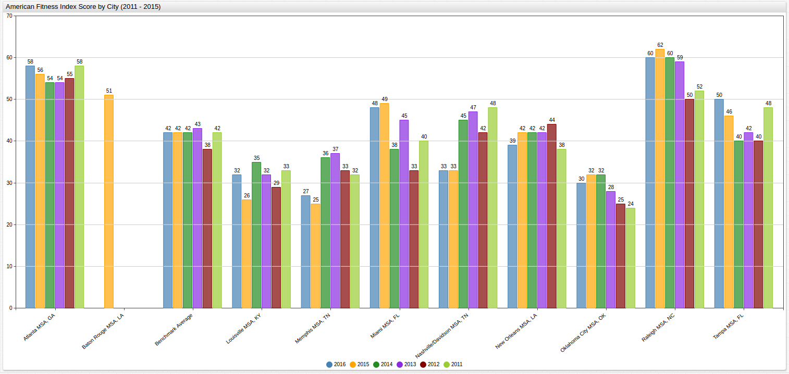

[](https://apps.axibase.com/chartlab/e926d483/59/#fullscreen)

Although the two charts are rendered almost identically with respect to the data,
the key difference is how they are presented. Here we see the graph organized to show
trends based on the year, and even though the same amount of data is still
present, tracing patterns year-to-year has become much easier than it was in the previous
display. Notice that because data is only available for 2015 for Baton Rouge, Louisiana the remaining empty columns are still rendered for the sake of chronology.

Using the [`DISPLAY`](https://axibase.com/products/axibase-time-series-database/visualization/widgets/configuring-the-widgets/)
setting, unneeded data can be masked to compare the best and worst performing MSAs over the observed period. Here, Oklahoma City, Oklahoma was the lowest-performing MSA and Raleigh, North Carolina was the highest-performing MSA based on averaged performance. Displayed next to one another, their absolute and relative differences can be underlined:

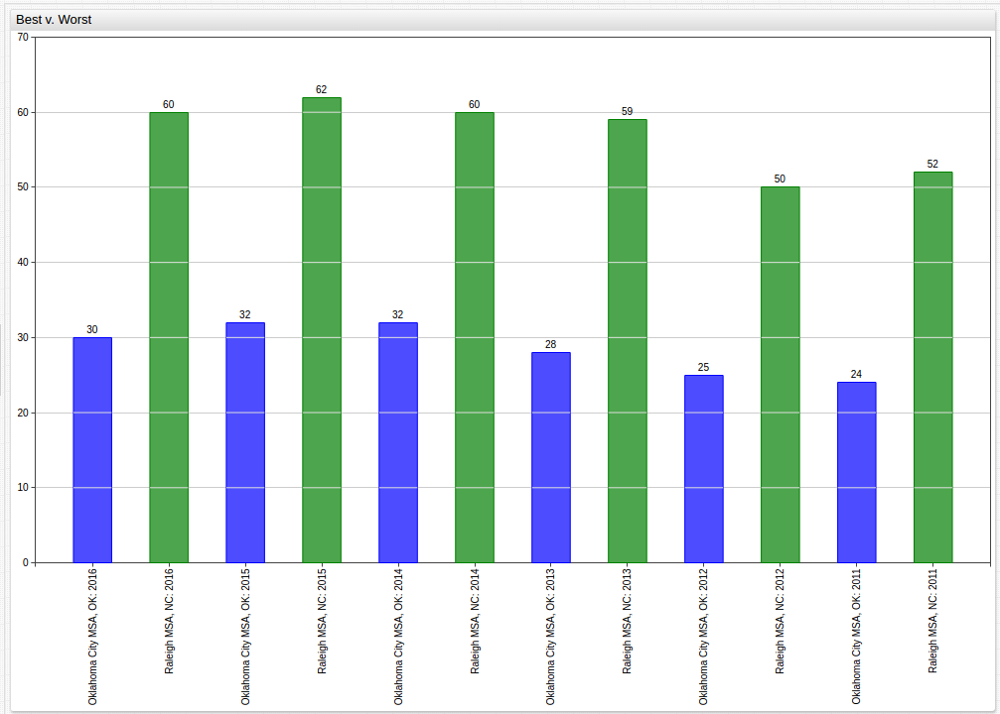

[](https://apps.axibase.com/chartlab/c43f580b/7/)

to make observations about the performance of one MSA over the observed time,
a similar strategy can be used with a different method of visualization:

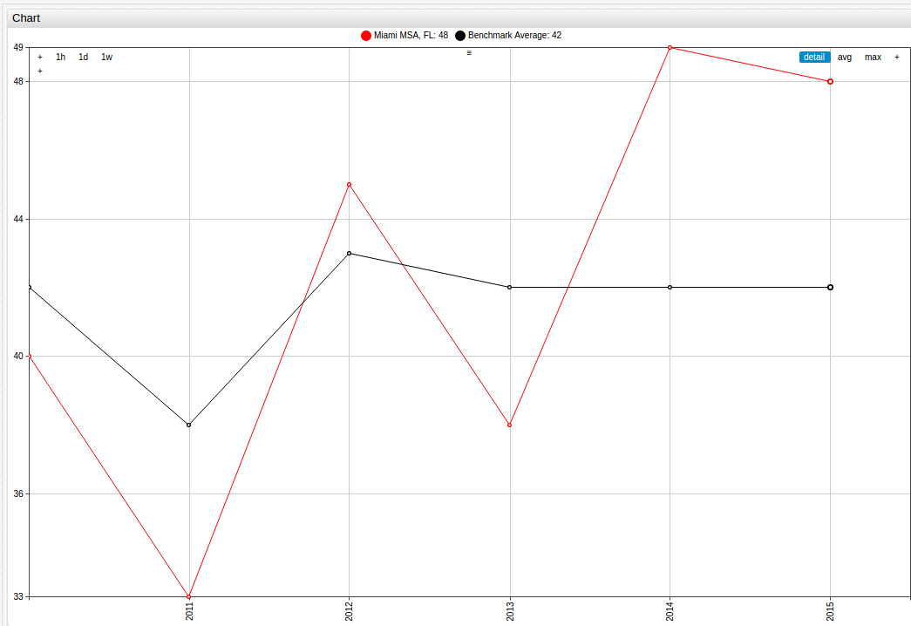

[](https://apps.axibase.com/chartlab/e926d483/64/)

Or, to compare the results of data observed within one state, additions can easily be
made to include a third entity:

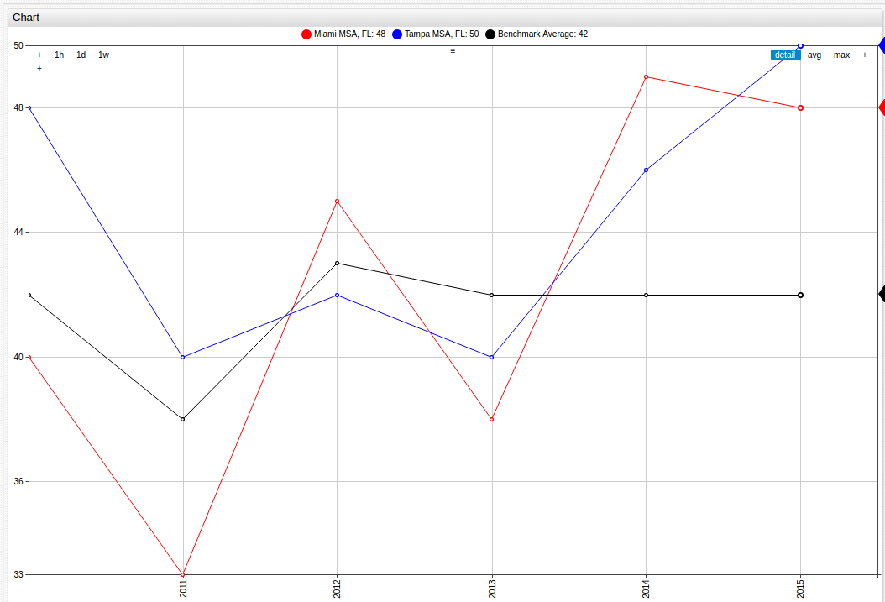

[](https://apps.axibase.com/chartlab/e926d483/65/)

The same can be done using the two Tennessee MSAs, Memphis and Nashville/Davidson,
displayed here alongside the Benchmark Average value:

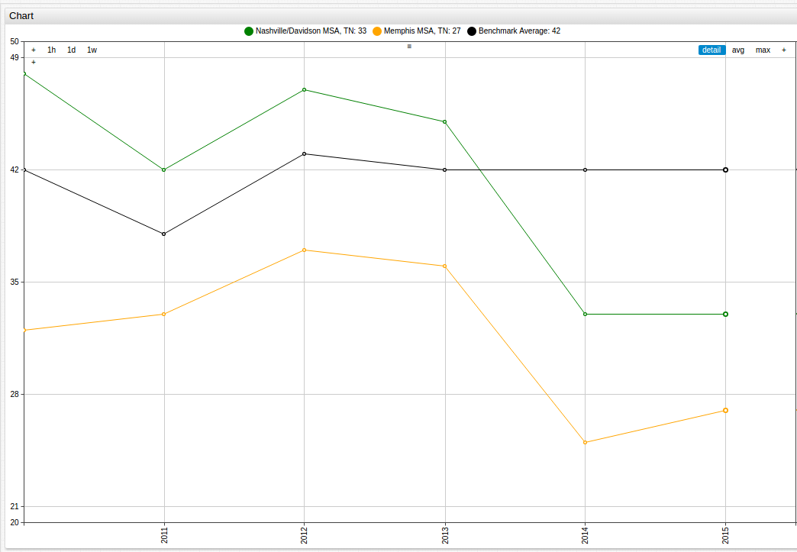

[](https://apps.axibase.com/chartlab/e926d483/66/)

Additionally, cities that serve as state capitals can be used as a microcosm
for the trends of the state itself:

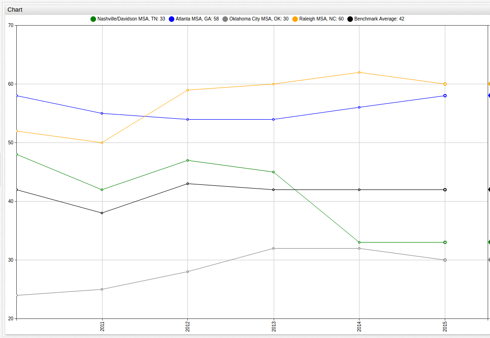

[](https://apps.axibase.com/chartlab/e926d483/67/)

The population of these metropolitan areas often accounts for a significant amount
of the state's total population. In the Atlanta Metropolitan Area for example, that number
is as high as 57% of the state's roughly 10 million residents. On average, in the observed states, the Metropolitan areas observed make up around 30% of the state's
total population, with the Raleigh MSA (population 1.3 million) being a low exception representing only 12%
of the state's population, in fact the Raleigh MSA is not even the largest Metropolitan Area in North Carolina. Charlotte, North Carolina, an MSA with a population of roughly 2.3 million residents that ranked 43rd according to 2015 AFI scores published by `http://www.americanfitnessindex.org/2015-afi-report-archive/`
with an overall score of 37.4, ranks below the National Benchmark Average and
significantly below its less-populous neighbor Raleigh.

> This trend will be further explored in the [Analysis](#analysis) section.

The two highest performing MSAs, Raleigh, North Carolina and Atlanta, Georgia can
also be displayed next to one another, and the Benchmark Average:

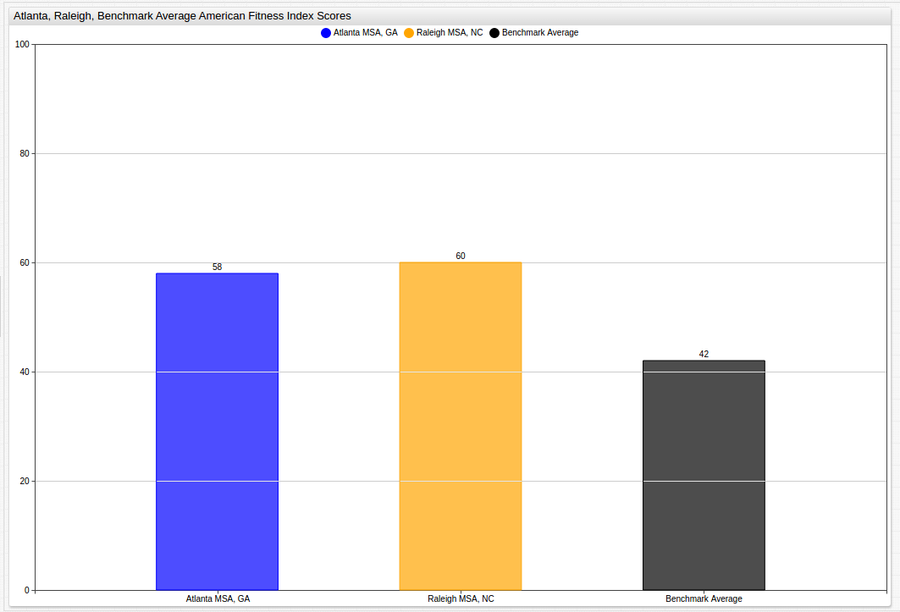

[](https://apps.axibase.com/chartlab/e926d483/60/)

## Analysis

The American College of Sports Medicine has taken on the bold task of attempting to
quantify the public health of the fifty most populous metropolitan areas in the
country. Using a combination of measurable data and self-reported figures, the goal
of the annual American Fitness Index report is to see cities make positive steps
towards better public health.

Because of the ranked nature of the index, a city may see a measurable increase in its
raw score and still lose position in the national ranking. Although competition is
important, this facet of the index oversimplifies the root factors that contribute
to public health and cause the true goal of the AFI to be lost if other factors are ignored,
making a thorough examination of the data even more important.

to simultaneously analyze the ranking of each city and its individual performance,
the following [Box-and-Whisker](https://axibase.com/products/axibase-time-series-database/visualization/widgets/box-chart-widget/)
graphic can be used:

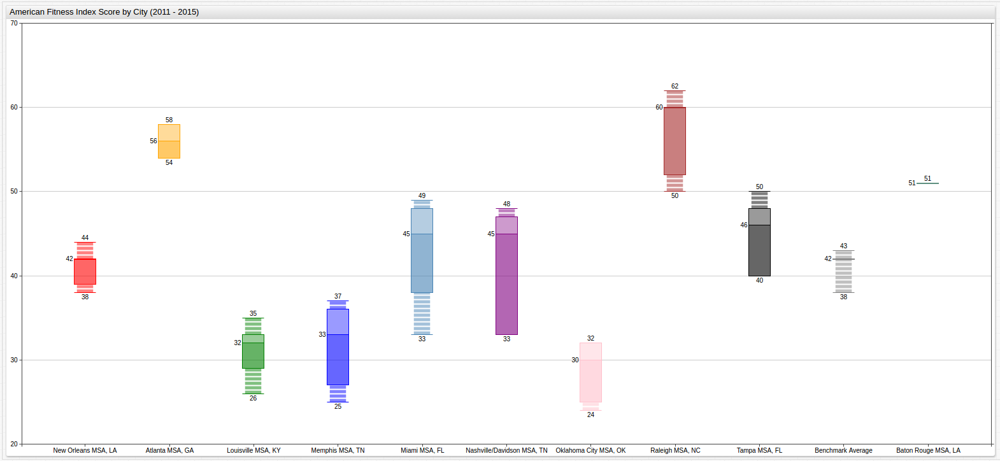

[](https://apps.axibase.com/chartlab/e926d483/61/#fullscreen)

Here the city's individual performance can be analyzed at the same time as its relative
performance against other cities. The average score of each city over the course of
the entire period is displayed along with its maximum and minimum values.
Outlier data is loosely connected to the central box to indicate that it was
atypical. When viewed in ChartLab, a detailed breakdown of the entity's data is visible when hovering the cursor over a box or its features.

Average performance of the observed cities can also be displayed with a less ambiguous visualization using the [Gauge Chart](https://axibase.com/products/axibase-time-series-database/visualization/widgets/gauge-chart/)
that shows subjective performance standards, here the threshold has been set at 42
to represent the National Benchmark Average value, although this tool is also capable of handling
active data sets and sending subscribers alerts when a certain threshold value is crossed.

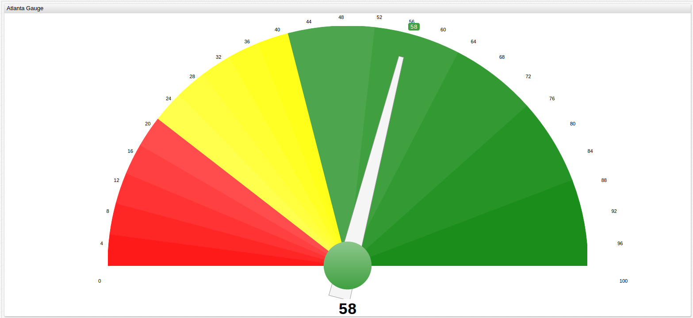

[](https://apps.axibase.com/chartlab/e926d483/70/#fullscreen)

>Learn more about Gauge controls and explore the results of other MSAs in the [Appendix](#appendix).

Above, when examining capital cities, the case of the Raleigh MSA and Charlotte MSA was observed. That is, two cities in one state with vastly different
population sizes and vastly different scores on the American Fitness Index rankings. Is there a correlation between population size and score on the AFI?

The following table shows cities included in earlier data compared to cities not included, their Metropolitan populations, and also their score and rank on the 2017 American Fitness Index report at `http://www.americanfitnessindex.org/wp-content/uploads/2014/02/ACSM-AFI-Report-2017.pdf`:

| State |Metropolitan Statistical Area | Population | AFI Score | Rank |
|-------|------------------------------|------------|-----------|------|
| California | San Francisco | 7.7 million | 73.3 | 3 |
| California | San Jose | 2.0 million | 71.6 | 5 |
| California | San Diego | 3.1 million | 65.6 | 10 |
| California | Sacramento | 2.2 million | 63.3 | 11 |
| California | Los Angeles | 12.8 million | 55.7 | 16 |
| California | Riverside | 3.4 million | 44.5 | 37 |
| Florida | Tampa Bay | 3.0 million | 54.1 | 19 |
| Florida | Miami | 5.0 million | 52.6 | 23 |
| Florida | Orlando | 2.2 million | 52.3 | 25 |
| Florida | Jacksonville | 1.5 million | 46.0 | 35 |
| New York | New York City | 23.7 million | 54.5 | 18 |
| New York | Buffalo | 1.1 million | 52.5 | 24 |
| Tennessee | Nashville | 1.8 million | 36.8 | 42 |
| Tennessee | Memphis | 1.3 million | 33.2 | 45 |
| Texas | Austin | 2.0 million | 61.2 | 12 |
| Texas | Dallas | 6.4 million | 43.2 | 38 |
| Texas | Houston | 6.4 million | 39.0 | 40 |
| Texas | San Antonio | 2.4 million | 34.7 | 44 |

Using data from the above table, the average size, score, and rank plus standard deviation of those figures for each state's cities can be calculated. Those numbers are shown below:

| State | Average Population | Average Rank | Average Score | Standard Deviation of Population |Standard Deviation of Rank | Standard Deviation of Score|
|-------|--------------------|--------------|---------------|----------------------------------|----------------------------|----------------------------|
| California| 5.2 million | 14 | 62.3 | 4.2 million | 12 | 10.8 |
| Florida | 2.9 million | 26 | 51.3 | 1.5 million | 7 | 3.6 |
| New York | 38.1 million |21 |  53.5 | 20.4 million | 4 | 1.4 |
| Tennessee | 1.6 million | 44 | 35.0 | 0.4 million | 2 | 2.5 |
| Texas | 4.3 million | 36 | 44.5 | 2.4 million | 15 | 11.6 |

> Average population values represent the average population of observed MSAs, not for the entire state.

Averages of the above figures establish standards:

| Avg SD of Population | Avg SD of Rank | Avg SD of Score |
|----------------------|----------------|-----------------|
| 5.78 | 8 | 6.0 |

The data shows that in fact, there is very little correlation between the size of a
given city and its likelihood to have a certain AFI score. The hypothesis suggested by
the Raleigh/Charlotte example seemed to indicate that two cities in one state of vastly
different sizes score very differently on the AFI, with the smaller Raleigh MSA
having a much higher rank and score than the larger Charlotte MSA. This relationship
is shown to actually be the exception and not the norm: The trend supported by the data shows that cities within one state, regardless of their population size, seem
to score more closely to one another than cities from different states but similar
population sizes. Compare the Nashville MSA (population 1.8 million) to the San Jose
MSA (population 2.0 million), the Orlando MSA (population 2.2 million), and the
Austin MSA (population 2.0 million) for example:

| State |Metropolitan Statistical Area | Population | AFI Score | Rank |
|-------|------------------------------|------------|-----------|------|
| California | San Jose | 2.0 million | 71.6 | 5 |
| Florida | Orlando | 2.2 million | 52.3 | 25 |
| Tennessee | Nashville | 1.8 million | 36.8 | 42 |
| Texas | Austin | 2.0 million | 61.2 | 12 |

Now perform the same calculations as shown above:

| Average Population | Average Rank | Average Score | Standard Deviation of Population |Standard Deviation of Rank | Standard Deviation of Score|
|--------------------|--------------|---------------|----------------------------------|---------------------------|----------------------------|
| 2.0 million | 21 | 55.5 | 0.2 million | 16 | 14.7 |

Or use a larger population as the control amount:

| State |Metropolitan Statistical Area | Population | AFI Score | Rank |
|-------|------------------------------|------------|-----------|------|
| California | San Diego | 3.1 million | 65.6 | 10 |
| California | Riverside | 3.4 million | 44.5 | 37 |
| Florida | Tampa Bay| 3.0 million | 54.1 | 19 |
| Texas | San Antonio | 2.4 million | 34.7 | 44 |

Following the above procedure once again:

| Average Population | Average Rank | Average Score | Standard Deviation of Population |Standard Deviation of Rank | Standard Deviation of Score|
|--------------------|--------------|---------------|----------------------------------|---------------------------|----------------------------|
| 3.0 million | 28 | 49.7 | 0.4 million | 16 | 13.2 |

In both of these examples, where cities with similar population sizes were
consciously selected to test the Raleigh/Charlotte hypothesis, the standard deviation
of their rank was 16, or twice the value of the average standard deviation shown
by cities when controlled for location. That contrast is even more vivid when comparing the raw score
numbers, with size-controlled data showing a standard deviation of 13.2 and 14.7, both more than double the average standard deviation of 6.0 for location-controlled data. Uncertainty values for similarities within a given state being significant are calculated below, the expected value is the average value of the AFI score in the given MSA's state:

| State |  Metropolitan Statistical Area | AFI Score (O1) | State Average (E1) | X^2 |
|-------|--------------------------------|----------------|--------------------|-----|
| California | San Francisco | 73.3 | 62.3 | 0.0312 |
| California | San Jose  | 71.6 | 62.3 | 0.0223 |
| California | San Diego  | 65.6 | 62.3 | 0.0028 |
| California | Sacramento | 63.3 | 62.3 | 0.0003 |
| California | Los Angeles | 55.7 | 62.3 | 0.0109 |
| California | Riverside | 44.5 | 62.3 | 0.0816 |
| Florida | Tampa Bay | 54.1 | 51.3 | 0.0197 |
| Florida | Miami | 52.6 | 51.3 | 0.0006 |
| Florida | Orlando | 52.3 | 51.3 | 0.0004 |
| Florida | Jacksonville  | 46.0 | 51.3 | 0.0107 |
| New York | New York City | 54.5 | 53.5 | 0.0006 |
| New York | Buffalo | 52.5 | 53.5 | 0.0003 |
| Tennessee | Nashville | 36.8 | 35.0 | 0.0926 |
| Tennessee | Memphis | 33.2 | 35.0 | 0.0926 |
| Texas | Austin | 61.2 | 44.5 | 0.1408 |
| Texas | Dallas | 34.7 | 44.5 | 0.0485 |
| Texas | Houston | 39.0 | 44.5 | 0.0153 |
| Texas | San Antonio | 43.2 | 44.5 | 0.0009 |

Because the rank of an MSA is relative to the performance of other MSAs, it has been excluded
from uncertainty testing, only the city's raw AFI score is considered.

The uncertainty value for each state is considered individually:

| State | X^2 Total | DoF | P value |
|-------|-----------|-----|---------|
| California | 0.1491 | 5 | \< 0.001 |
| Florida | 0.0314 | 3 | \< 0.005 |
| New York | 0.0009 | 1 | 0.025 |
| Tennessee | 0.1851 | 1 | \> 0.10 |
| Texas | 0.2055 | 3 | 0.025 |

The failure of Tennessee to conform to the scoring model was noticed above when comparing MSA
performance to the Baseline Average in the [Data](#data) section. With such a high degree of
uncertainty for that state, and the Charlotte/Raleigh case, only about a third of the states tested here conform to the standard, however, in a binary classification model as
demonstrated here, the requirement is to determine one of two solutions: will MSAs in a
particular state conform to the general public health standards of other MSAs in a particular state?

Since this type of profiling seeks to determine the likelihood of other cities in a given state to follow the public health trends observed and recorded in public databases, highly uncertain or irregular data merely suggests that, no, the AFI score of a given MSA in a particular state cannot be predicted based on the AFI scores of other MSAs in the same state and a different model, or different data,
is needed for that state.

## Conclusions

The predictive model explored here indicates that there is a number of states where enough public data
exists to effectively predict community health figures in MSAs where no such data is present, the ACSM only observes the fifty largest Metropolitan Statistical Areas in the country.

Using several standard methods of comparison, the data published by the City of New
Orleans shows that most metropolitan statistical areas within one state follow a similar trend with respect to their public health. Using graphing tools shown in the
[Data](#data) section that portray this pattern in a number of states,
and statistical calculation shown in the [Analysis](#analysis) section that highlight
the same observation certain hypotheses can also be rejected: the size of the population of a given MSA has no meaningful ability to predict that city's public health, however there are states which can be modeled with known data to predict unknown data. Analysis of the political process and community engagement that may contribute to the existence or absence
of such consistences is outside the scope of this experiment but well within the scope of the American College of Sports Medicine, as they go a step further and even provide custom-made action plans for each MSA, based on their performance in range of areas over a given period of time.

The data observed here is objectively quite large, and effective management and presentation of such data is crucial to drawing meaningful conclusions from it, which is why the ATSD is ideal for comprehensive and comprehensible solutions
to a wide range of data science problems, a handful of which were demonstrated here.

> Contact [us](https://axibase.com/feedback/) with any support issues.

## Action Items

Install [Docker](https://docs.docker.com/engine/installation/linux/ubuntu/).

Download the [`docker-compose.yml`](./resources/docker-compose.yml) file to launch the ATSD container bundle.

Launch containers by specifying the built-in collector account credentials that will be used by Axibase Collector to insert data into ATSD.

```sh
   export C_USER=myuser; export C_PASSWORD=mypassword; docker-compose pull && docker-compose up -d
```

Open ATSD web interface and begin exploring your data.

## Appendix

### How the AFI is Calculated

The American Fitness Index is calculated using the following formula:

```javascript
x = [( \sum_1^n r w) / Max ] * 100
```

where:

* `x` = Total Score
* `n` = up to 15 for **Personal Health** or 16 for **Community and Environment** indicators are either present and counted, or not.
* `n` = Metropolitan Statistical Area (MSA) Rank out of 50.
* `w` = Weighted value of indicator, determined by ACSM internally.
* `Max` = A hypothetical maximum score for the MSA if it were to rank best on both indicators.

>Source: `http://www.americanfitnessindex.org/methodology/` American Fitness Index

### Using the `ALERT` Setting

The [`ALERT`](https://axibase.com/products/axibase-time-series-database/visualization/widgets/bar-chart-widget/#tab-id-3)
setting has a two-part syntax:

```elm
alert-expression = YOUR_CONDITION_HERE
alert-style = fill: COLOR; stroke = COLOR
```

And is shown in a ChartLab example below:

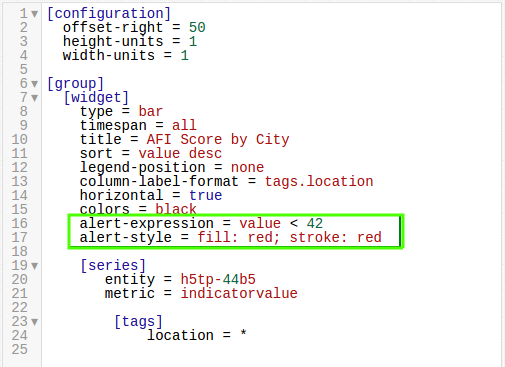

### Even Year (2012 and 2014) By-City Data With the `ALERT` Setting

>Year 2012 (Benchmark Average: 38)

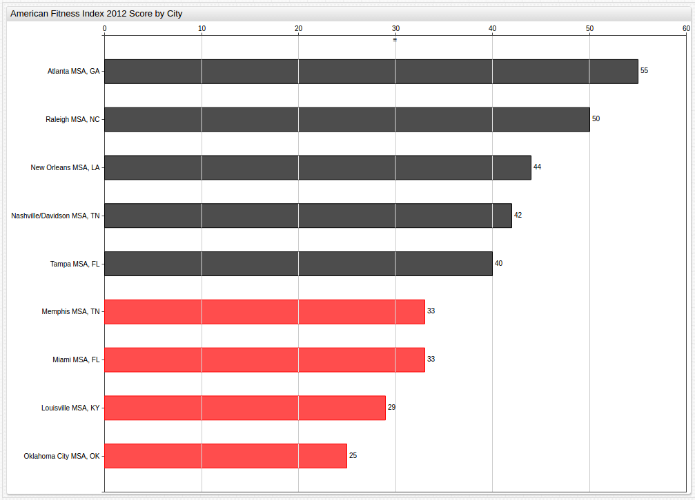

[](https://apps.axibase.com/chartlab/e926d483/57/)

>Year 2014 (Benchmark Average: 42)

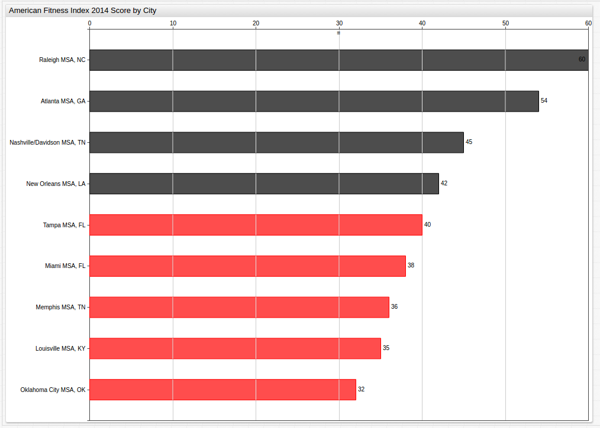

[](https://apps.axibase.com/chartlab/e926d483/58/)

### Alternative Display of City By Year Data

It may be more desirable to separate each body of data, for a cleaner visualization as shown below:


[](https://apps.axibase.com/chartlab/c43f580b/8/#fullscreen)

The visualization show above uses the [`GROUP`](https://axibase.com/products/axibase-time-series-database/visualization/widgets/bar-chart-widget/#[widget]-settings)
setting in the `[WIDGET]` cluster, as shown below:


Because of the highlighted setting, data is separated by its `location` tag, but in
the visualization shown in the [Data](#data) section, the `GROUP = LOCATION` tag is ignored because of the [`SORT`](https://axibase.com/products/axibase-time-series-database/visualization/widgets/bar-chart-widget/#[widget]-settings)
setting shown below:


> Please contact [Axibase](https://axibase.com/feedback/) with any questions.

### Modifying the Gauge to Display Other Cities

Locate the `LOCATION` setting at the bottom of the Editor and correct the text to the
observed MSA that you would like to view with the Gauge, being sure to follow the
syntax including the two-letter state abbreviation, and the `\,` comma notation.
For a better presentation, change the `TITLE` setting as well.

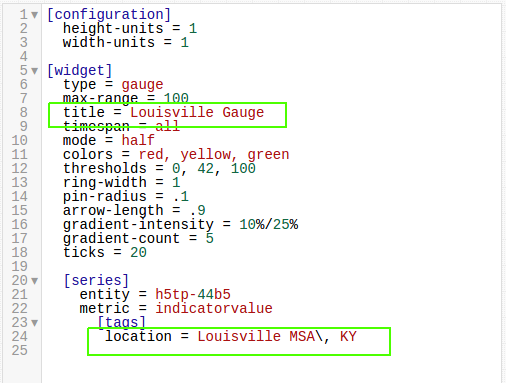
