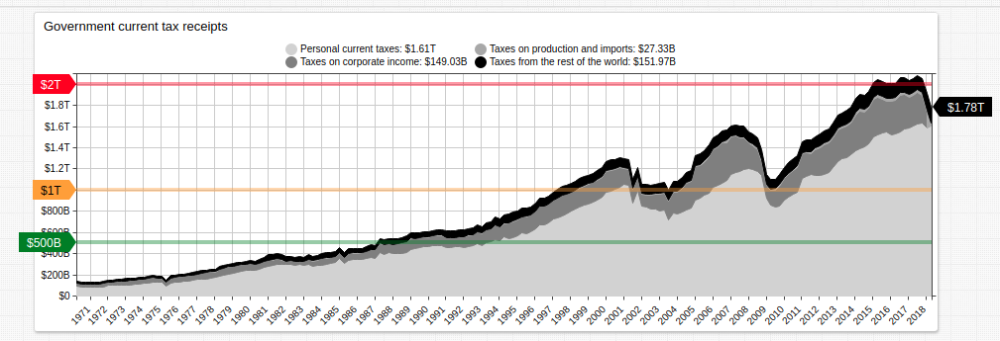
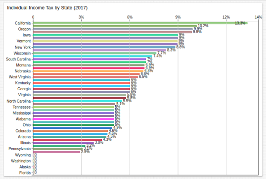
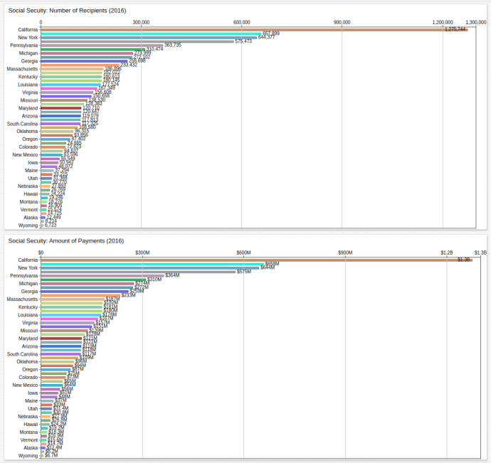
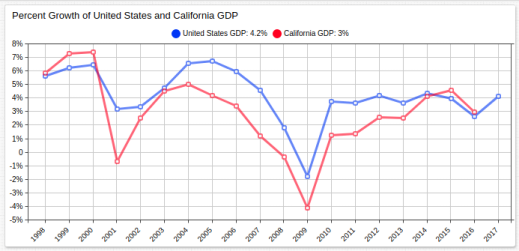
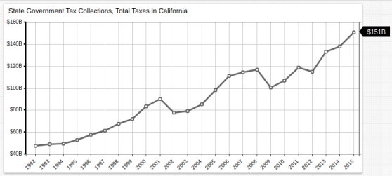

# Income Tax as a Vehicle for Centralization

> Figure 1: Government Current Tax Receipts (1970-2018), by category.

## Abstract

> <i>"The Congress shall have Power To lay and collect Taxes, Duties, Imposts and Excises, to pay the Debts and provide for the common Defence and general Welfare of the United States; but all Duties, Imposts and Excises shall be uniform throughout the United States;"</i> Article 1, Section 8, Clause 1; United States Constitution[1](http://press-pubs.uchicago.edu/founders/tocs/a1_8_1.html)

The United States government instituted its first income tax with the Revenue Act of 1861 to finance the Union effort in the Civil War.[2](http://memory.loc.gov/cgi-bin/ampage?collId=llsl&fileName=012/llsl012.db&recNum=323) Taxation was justified on the basis of the text of the Constitution shown above. Originally introduced as a flat rate of 3% on all income greater than $600, the tax was reformed as a progressive tax by the Revenue Act of 1862.[3](https://www.finance.senate.gov/about/history/) The legality of the income tax was challenged and upheld in [*Springer v. United States*](https://www.law.cornell.edu/supremecourt/text/102/586) and the income tax was eventually given Constitutional protection by the ratification of the Sixteenth Amendment in 1913.[4](https://www.law.cornell.edu/constitution/amendmentxvi)

Originally prepared as the Internal Revenue Code of 1954, but later redesignated the Internal Revenue Code of 1986,[5](https://www.govinfo.gov/content/pkg/USCODE-2015-title26/html/USCODE-2015-title26.htm) Title 26, Section 164 protects the deduction of state income tax from any amount paid to the federal government, with certain limitations.[6](https://www.law.cornell.edu/uscode/text/26/164) This work seeks to assert that this represents a fundamental distortion of United States tax code which has resulted in disproportionate tax incomes among states, and handicapped the federal government's ability to effectively levy the income tax. Further, this decentralization has created an atmosphere of state financial independence which has fostered state deviation from federal policy. A confederation of states under a weak federal government is ill-equipped to deal with the foreign or domestic challenges facing the United States.

## Overview

> Figure 2: Effective Individual Tax by State (2017), highest bracket.

[*Brushaber v. Union Pacific Railroad Co.*](https://www.loc.gov/item/usrep240001/) upheld the legality of the Revenue Act of 1913, which mandated the equal use of federal income tax revenue among the states. Originally envisioned to be apportioned among the states based on population size, no income tax before or after the ratification of the sixteenth amendment has ever been distributed as such. [7](https://www.stlouisfed.org/open-vault/2018/march/purpose-history-federal-income-taxes)

Federal guidelines notwithstanding, each state controls the effective tax rate within their borders, most of which is deductible from any sum paid to the federal government by individuals. This policy has never been challenged in the Supreme Court but represents a method by which states are able to institute policy which contradicts the federal government without fear of bilateral response. Historically, when such issues are brought to bear, the federal government has always at least been able to wield some financial power against nonconforming states:

* The [Highway Trust Fund](https://www.fhwa.dot.gov/highwaytrustfund/) has been used to goad states into compliance multiple times: in 1984 to standardize the drinking age[8](https://www.cdc.gov/alcohol/fact-sheets/minimum-legal-drinking-age.htm) and in 1974 to enforce a national freeway speed limit[9](https://www.heritage.org/report/the-high-cost-the-55-mph-speed-limit) are two notable examples.
* [*South Dakota v. Dole*](https://billofrightsinstitute.org/educate/educator-resources/lessons-plans/landmark-supreme-court-cases-elessons/south-dakota-v-dole-1987/) provided for the legality of Congress to impose spending restrictions against states whose policy contradicts federal statute.
* The opinion of the United States DC Circuit court in [*Barbour v. Washington Metropolitan Area Transit Authority*](https://www.mwela.org/sites/default/files/brief-bank/AnnaBrooks/MWELA_Amicus_BarbourVWMATA.pdf) stated that acceptance of federal funds voids immunity to suits related to policy which contradicts federal statute.

These decisions and actions provide precedent, protection, and process for Congress to implement financial penalities vis-à-vis state income tax exception in order to enforce conformity in a manner that is not analogous to extortion around issues of common defense and general welfare.

> Figure 3: Social Security Number of Recipients and Amount of Payments (2016), by state.

*Figure 2* shows that Californians in the highest bracket pay the greatest effective rate of state tax, thus exempting them from a significant portion of federal income tax contribution via SALT deductions.[9](http://www.gfoa.org/salt) In spite of such eligibility, California receives by far the largest portion of federal income tax allocation for Social Security payments according to data visualized in *Figure 3*.

## Controlling Californian Nonconformity

California serves as the working model for this paper. By virtue of its stated position as a sanctuary state,[10](http://www.fairus.org/legislation/state-local-legislation/california-sanctuary-state-bill-sb-54-summary-and-history) and as provider of protection for the distribution and use of medical marijuana,[11](https://saclaw.org/articles/marijuana-laws-in-california-edl/) California stands in direct opposition to federal statute.

The key difference between the former and latter examples above is that [SB No. 54](https://leginfo.legislature.ca.gov/faces/billTextClient.xhtml?bill_id=201720180SB54) was introduced directly to the California Senate by Senate President pro Tempore Keven de León,[12](https://sd24.senate.ca.gov/news/2016-12-07-senate-leader-de-le%C3%B3n-introduces-bill-%E2%80%9Cfreeze-out-ice%E2%80%9D) whilst [Proposition 215](http://vigarchive.sos.ca.gov/1996/general/pamphlet/215text.htm) was introduced by ballot initiative and passed by the people of California with 55.58% of voters for the proposition.[13](https://ballotpedia.org/California_Proposition_215,_the_Medical_Marijuana_Initiative_(1996))

Federal action against SB No. 54, that is, challenging the legality of Californian commitment to noncooperation with federal immigration officials would present the chance for the people of California to vote on a revision of SB No. 54, presented as a ballot initiative. Doing so would underline the legality of noncompliance when the people themselves are granted greater control of their state legislature.

Precedent for this method is established by the admission of both Kansas and Nebraska to the United States. In both territories, during the escalation to the Civil War, the contentious issue of whether to enter the union as a slave state was put to a popular vote and defeated in both cases.[14](https://www.ourdocuments.gov/doc.php?flash=false&doc=28) The popular sovereignty clause of the [Kansas-Nebraska Act](https://www.senate.gov/artandhistory/history/minute/Kansas_Nebraska_Act.htm), which placed control of the issue in the hands of voters served as a foundation for the legitimacy of their entry as free territories. The same reasoning can be applied to California's and other states' status as sanctuary states. Initiatives placed before the people would less vulnerable to federal challenge should they succeed.

As such, the elimination of SALT deductions for states which enact legislature in opposition to federal immigration guidelines could be leveraged to require that each state be required to pass such legislation via ballot initiative instead of State Congressional legislation.

> Figure 4: Percent Growth of United States and California Gross Domestic Product (1998 - 2016/2017).

Undoubtedly, California is an economic powerhouse in and of itself; the state boasts the world's fifth largest economy.[15](https://www.sacbee.com/news/business/article210466514.html) GDP growth is often analogous in percentile form to that of the United States as a whole, as seen in *Figure 4* above. Nonetheless, the precedents being set by the state politically represent a challenge to the federal government which is similarly polarizing to those which led up to the Civil War. The [*Posse Comitatus* Act](https://www.rand.org/content/dam/rand/pubs/monograph_reports/MR1251/MR1251.AppD.pdf) sets limits on executive use of federal troops to quell state insurrection, but several times throughout American history, federal influence was wielded in states' affairs. Using federal authority to require California to legislate via ballot instead of State Congress on issues which contradict federal statutes exemplifies an important standard for states' rights to decline to enforce such statutes.

## Broader Implications

States which internally generate large amounts of income tax are able to defend themselves against federal threats to withhold funding. Indeed, Californian politicians rightly describe California as a "donor state," that is, a state which generates more in federal revenue that it receives (about $0.96 out of every tax dollar comes back to California from Washington, D.C.).[16](https://www.apnews.com/2f83c72de1bd440d92cdbc0d3b6bc08c) As such, California is positioned to be more readily able to defy federal statute because its government maintains greater financial independence. Thus, the elimination of SALT deductions is a way for the Federal government to centralize the authority to determine the nation's immigration policy. California voters would be confronted with the reality of greatly increased federal taxes should they continue to elect officials determined to contravene federal law and would be more protected from federal challenge should a ballot initiative succeed.

> Figure 5: State Government Tax Collections, Total Taxes in California (1992-2015).

