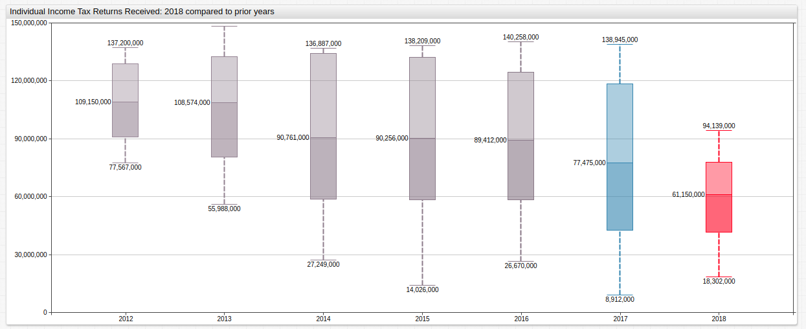
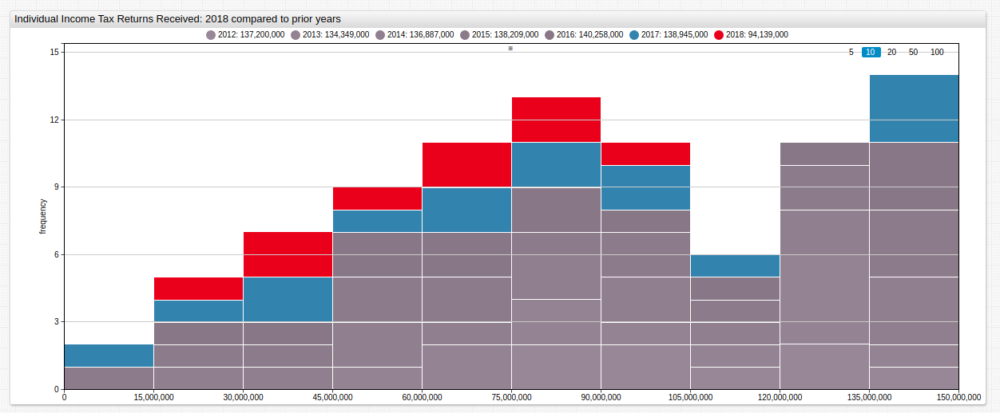
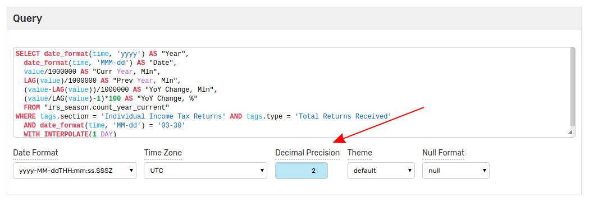

# Tax Day 2018: Americans Reverse the Late-Filing Trend

## Summary

Interim 2018 tax filing statistics bring hope that Americans have returned to a timely filing schedule.

### Introduction

Each year the Internal Revenue Service (IRS) releases [public data](https://www.irs.gov/newsroom/2018-and-prior-year-filing-season-statistics) about the number of Americans who have filed their annual income tax paperwork. The data for 2018 shows that American filing practice is roughly in line with the previous several years although minor differences can always be detected between any two datasets. Open-source data may be visualized using ATSD and queried with [SQL console](https://axibase.com/docs/atsd/sql/).

Axibase [analyzed](2017.md) IRS filing statistics after Tax Day 2017 saw a higher number of people filing [later than usual](https://www.reuters.com/article/us-money-taxes-delays/u-s-taxpayers-procrastinate-on-filing-returns-this-year-idUSKBN16L18C) or [not at all](https://www.bloomberg.com/news/articles/2017-04-17/millions-of-americans-still-haven-t-filed-their-taxes) according to Reuters and Bloomberg, respectively. The income tax makes up roughly [half](https://www.nationalpriorities.org/budget-basics/federal-budget-101/revenues/) of the annual revenue of the federal government (around $1.48 trillion), a surge in late or missing filings would wreak havoc on the U.S. budget for the subsequent year.

### Objectives

* Visualize public data using [ChartLab](https://apps.axibase.com/chartlab);
* Query data using [**SQL console**](https://axibase.com/docs/atsd/sql/);
* Compare and contrast previous-year filing statistics with current-year data via chart configurations and queries.

### Visualization

ChartLab is a data visualization sandbox that uses a simple declarative syntax for creating charts. It is designed to be used by anyone, but a basic understanding of the key concepts and settings is helpful here. Full ChartLab documentation may be accessed [here](https://axibase.com/products/axibase-time-series-database/visualization/widgets/); this article demonstrates the process of using data stored in ATSD to create multiple visualizations using the same dataset. Each chart is shown alongside the configuration to create it and a brief explanation of the particularities therein.

#### Configuration 1: Time Series Line Graph


[](https://apps.axibase.com/chartlab/fd986f58)

*Fig 1.* Tax filing data for the 2017 and 2018 superimposed over previous-year data.

Configuration Settings:

Configuration has been shortened to include only relevant settings for brevity, open ChartLab visualization to view the entire configuration.

```ls
[configuration]
  disconnect-interval = 10 day

[group]

[widget]
  var offsets = range(2,6)
  for ofs in offsets
  [series]
     markers = false
     color = rgb(@{128 + ofs * 4},@{112 + ofs * 4},@{128 + ofs * 4})
     label = @{2018-ofs}
     time-offset = @{ofs} year
     style = stroke-opacity: @{0.5-ofs*0.05}; stroke-width: 20; stroke-linecap: round ; stroke-linejoin: round
  endfor

  [series]
     label = 2017
     time-offset = 1 year
     color = steelblue

  [series]
     label = 2018
     color = #d00
```

Configuration Features:

* `disconnect-interval`: data with missing points, or gaps in the time series, are highlighted by specifying a user-defined data gap. Compare this [example](https://apps.axibase.com/chartlab/8234982b) which features a `disconnect-interval` setting to [this one](https://apps.axibase.com/chartlab/2f06ecee) where the setting is disabled, or [here](https://apps.axibase.com/chartlab/bb9e34e8) where the `disconnect-value` setting has been given a non-zero value.

* `var`: ChartLab configurations may include JavaScript objects and functions as well as built-in [control structures](https://axibase.com/products/axibase-time-series-database/visualization/widgets/control-structures/). Here a variable called `offsets` is created using a `range(x,y)` function to control the settings for multiple `[series]` at once representing previous-year data. The index begins at `0`.

* `color`: this setting may accept RGB parameters, web color names, or HTML color codes.

#### Configuration 2: Time Series Bar Chart


[](https://apps.axibase.com/chartlab/07f8b200)

*Fig 2.* The same data displayed with different settings.

Configuration Settings:

Configuration has been shortened to include only non-repeated settings for brevity, open ChartLab visualization to view the entire configuration.

```ls
[widget]
  type = chart
  mode = column

  [series]
     alias = 2018
     label = 2018
     color = #d00
     style = stroke-width: 5
     alert-expression = value('2018') > value('2017')
     alert-style = fill:green
```

**Configuration Features:**

* `alert-expression`: user-defined thresholds may be created via `[threshold]` series, or comparison to other series in the visualization. Here, the two colored series are assigned an `alias` according to their year and compared. When the condition is satisfied, that is, the value of 2018 tax return filings is greater than the value of 2017 tax filings for the same period, the `alert-style` setting is activated, in this case coloring the representative bar of a period green.

* `mode`: time charts feature several display [modes](https://axibase.com/products/axibase-time-series-database/visualization/widgets/time-chart/) to quickly change visualization styles.

#### Configuration 3: Box-and-Whisker Plot


[](https://apps.axibase.com/chartlab/5dba3269)

*Fig 3.* Average filing numbers for the entire observed period show that the total number of Americans filing a tax return has diminished in recent years.

Configuration Settings:

Configuration has been shortened to include only non-repeated settings for brevity, open ChartLab visualization to view the entire configuration.

```ls
[widget]
  type = box
  title = Individual Income Tax Returns Received: 2018 compared to prior years

[widget]
  var offsets = range(6,2)
  for ofs in offsets
```

Configuration Features:

* `type`: a variety of visualization widgets are available in ChartLab, see the full list [here](https://axibase.com/products/axibase-time-series-database/visualization/widgets/).
* `range(y,x)`: to show chronological data, a reverse-ordered range setting may be used where the more recent parameter is the second argument instead of the first as seen above.

#### Configuration 4: Histogram


[](https://apps.axibase.com/chartlab/bdab5fd8)

 A histogram shows the distribution of values for the given datasets. Assuming all series are equally-distributed the slope of the stacked boxes is zero.

Configuration Settings:

Configuration has been shortened to include only non-repeated settings for brevity, open ChartLab visualization to view the entire configuration.

```ls
[widget]
  type = histogram
  mode = stack
  title = Individual Income Tax Returns Received: 2018 compared to prior years
  bar-count = 10
  percentiles = 20, 40, 60, 80, 99
```

Configuration Features:

* [`percentiles`](https://apps.axibase.com/chartlab/7f906511/7/): the percentile range for each bar may be set to a user-configured value when observing irregular series. Here, percentile values are `20, 40, 60, 80, 99`.
* `bar-count`: modify the number of bars displayed in the visualization.

### SQL

Although ATSD is a non-relational database it offers a SQL-like syntax with time series extensions such as interpolation functions. It also provides a built-in **SQL Console** for ad-hoc data exploration.

The following queries are shown below:

* Year-on-year change based on calendar day;
* Year-on-year change based on calendar index position.

#### Year-on-Year Change based on calendar day

Here, the query returns the number of filed tax returns for the same calendar day (March 30) each year.

Query:

```sql
SELECT date_format(time, 'yyyy') AS "Year",
  date_format(time, 'MMM-dd') AS "Date",
  value/1000000 AS "Curr Year, Mln",
  LAG(value)/1000000 AS "Prev Year, Mln",
  (value-LAG(value))/1000000 AS "YoY Change, Mln",
  (value/LAG(value)-1)*100 AS "YoY Change, %"
  FROM "irs_season.count_year_current"
WHERE tags.section = 'Individual Income Tax Returns' AND tags.type = 'Total Returns Received'
  AND date_format(time, 'MM-dd') = '03-30'
  WITH INTERPOLATE(1 DAY)
ORDER BY date_format(time, 'MM-dd')
```

Syntax Features:

* [`date_format`](https://axibase.com/docs/atsd/sql/#date-functions): date function which converts Unix millisecond time to a user-defined format.
* [`LAG(columnName)`](https://axibase.com/docs/atsd/sql/): value function which returns the previous data point for the selected column. Very useful for time-on-time comparisons such as the one shown here.
* [`INTERPOLATE(period)`](https://axibase.com/docs/atsd/sql/examples/interpolate.html): value function which is used to fill gaps for irregular series. Used in this example to regularize data which has a timestamp other than the observed date.

Result:

| Year | Date   | Curr Year, Mln | Prev Year, Mln | YoY Change, Mln | YoY Change, % |
|------|--------|----------------|----------------|-----------------|---------------|
| 2011 | Mar-30 | 87.59          |                |                 |               |
| 2012 | Mar-30 | 91.07          | 87.59          | 3.48            | 3.98          |
| 2013 | Mar-30 | 89.46          | 91.07          | -1.61           | -1.76         |
| 2014 | Mar-30 | 93.36          | 89.46          | 3.89            | 4.35          |
| 2015 | Mar-30 | 94.03          | 93.36          | 0.67            | 0.72          |
| 2016 | Mar-30 | 95.28          | 94.03          | 1.26            | 1.34          |
| 2017 | Mar-30 | 92.47          | 95.28          | -2.81           | -2.95         |
| 2018 | Mar-30 | 94.14          | 92.47          | 1.67            | 1.80          |

#### Year-on-year change based on calendar index position

Here, the query returns the number of filed tax returns for the same calendar index position. Calendar years with unequal number of days (leap years) have different index positions for the same day.

Query:

```sql
SELECT date_format(time, 'yyyy') AS "Year",
  date_format(time, 'MMM-dd') AS "Date",
  CAST(date_format(time, 'D') AS NUMBER) AS "Day in Year",
  value/1000000 AS "Curr Year, Mln",
  LAG(value)/1000000 AS "Prev Year, Mln",
  (value-LAG(value))/1000000 AS "YoY Change, Mln",
  (value/LAG(value)-1)*100 AS "YoY Change, %"
  FROM "irs_season.count_year_current"
WHERE tags.section = 'Individual Income Tax Returns' AND tags.type = 'Total Returns Received'
  AND "Day in Year" = CAST(date_format(date_parse('2018-03-30T00:00:00Z'), 'D') AS NUMBER)
  WITH INTERPOLATE(1 DAY)
ORDER BY "Day in Year", time
```

Syntax Features:

* [`CAST`](https://axibase.com/docs/atsd/sql/#cast): value function which changes a number into a string or vice versa. Time values are cast as numbers, as such they may be interpolated.

**Result:**

```ls
| Year | Date   | Day in Year | Curr Year, Mln | Prev Year, Mln | YoY Change, Mln | YoY Change, % |
|------|--------|-------------|----------------|----------------|-----------------|---------------|
| 2011 | Mar-30 | 89.00       | 87.59          |                |                 |               |
| 2012 | Mar-29 | 89.00       | 90.08          | 87.59          | 2.49            | 2.85          |
| 2013 | Mar-30 | 89.00       | 89.46          | 90.08          | -0.62           | -0.68         |
| 2014 | Mar-30 | 89.00       | 93.36          | 89.46          | 3.89            | 4.35          |
| 2015 | Mar-30 | 89.00       | 94.03          | 93.36          | 0.67            | 0.72          |
| 2016 | Mar-29 | 89.00       | 94.11          | 94.03          | 0.08            | 0.09          |
| 2017 | Mar-30 | 89.00       | 92.47          | 94.11          | -1.64           | -1.74         |
| 2018 | Mar-30 | 89.00       | 94.14          | 92.47          | 1.67            | 1.80          |
```

SQL console supports the [`ROUND`](https://axibase.com/docs/atsd/sql/#mathematical-functions) function for inline rounding operations of numerical values, however the SQL console interface also has a decimal precision setting which may be used to adjust date and number formatting even after the query has been completed.

