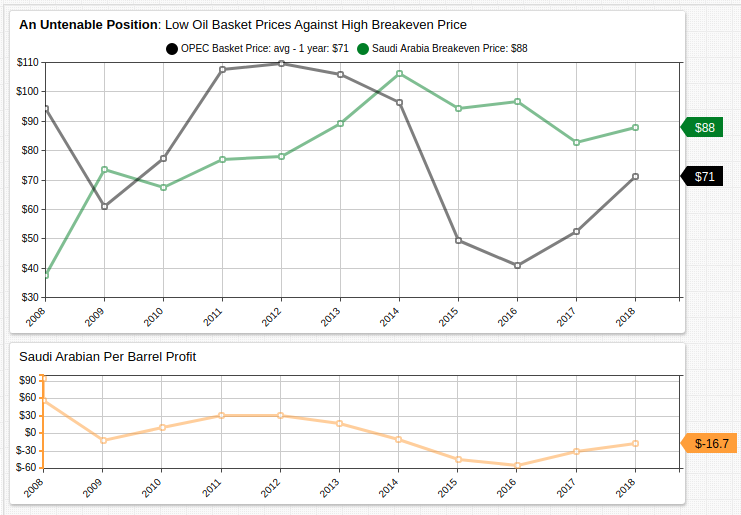
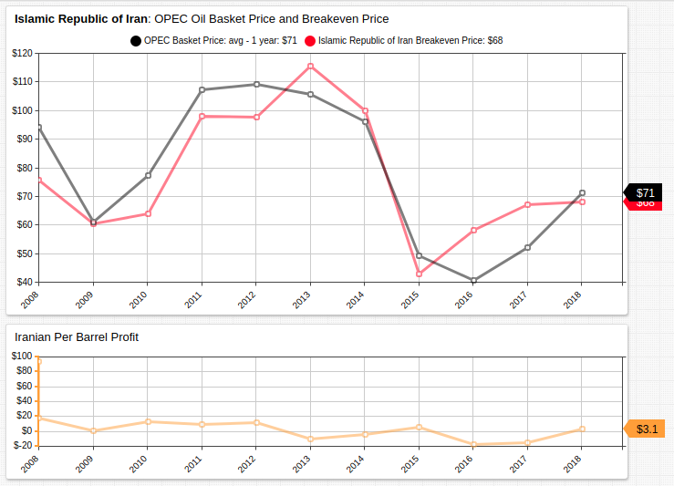
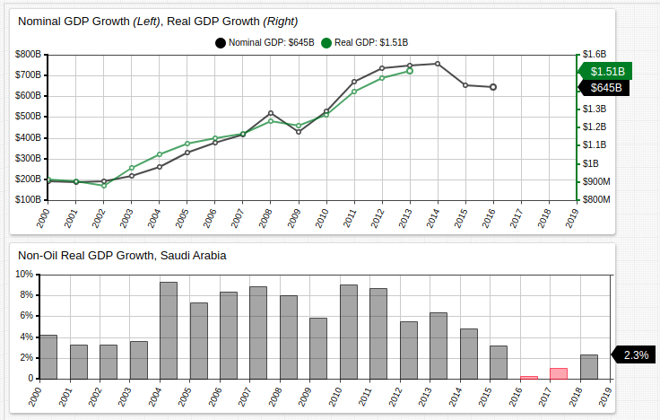

# The Saudi Arabia Challenge

## Overview

The modern incarnation of the state of Saudi Arabia, an Arabian Gulf absolute monarchy, came about in earnest at the end of the First World War, when allied victory over the Ottoman Empire insured the latter's declining influence in the region.

Since then, the nation of 33 million occupying two million square kilometers in the Arab gulf has grown to the world's eighteenth largest economy (behind Turkey, ahead of Switzerland) and regional preeminence. The discovery of vast petroleum ores in 1938 have resulted in Saudi Arabia becoming the world's largest oil exporter for many years, having been only recently unseated by the United States.

Oil revenue accounts for almost half of the Saudi GDP, and more than 80% of private sector workers are immigrants. Roughly 30-40% of native Saudis are employed, mostly in the government, which has a powerful role in the Saudi Arabian command economy.

The current Saudi Arabian economic paradigm is dependant on three assumptions:

* Oil price **consistency**.
* Military **security**.
* Undisputed **legitimacy**.

Should any of these three realities be challenged, the economy could face legitimate insolvency in conjunction with untenable oil prices, destroyed and damaged production facilities from conflict, or challenges to government authority. Saudi Arabia is special, however, because it represents a geopolitical keystone which supports the stability of the world order while facing distinct threats to all three of its primary strategic foils. Adding to its fragility, each of these regions is intimately related to the others, so collapse in one could quickly produce collapse in all three.

## Oil Price Consistency

Saudi Arabia is a founding member of [OPEC](https://www.opec.org/opec_web/en/), an intergovernmental group of oil-producing nations united by bureaucracy to stabilize oil markets though regulation such as production quotas. OPEC represents almost half the world's annually produced oil, and over 80% of proven reserves. This level of supply control given OPEC significant, though waning, power in the oil market.

For five consecutive years, the Kingdom of Saudi Arabia has been selling their lifeblood at a loss. Low oil prices have had an effect on a number of oil-dependant nations' economies including Saudi Arabia but Saudi Minister of Petroleum and Mineral Resources Ali Al-Naimi refused to relax production quotas when pressed to do so in 2014.

> <i>"Is it reasonable for a highly efficient producer to reduce output, while the producer of poor efficiency continues to produce? That is crooked logic. If I reduce, what happens to my market share? The price will go up and the Russians, the Brazilians, [and] US shale oil producers will take my share."</i>

Al-Naimi's rigidity was fundamentally sound, backing down production quotas would most likely increase the price of oil. Unfortunately, the once oligarchical control over the oil markets wielded by OPEC began to fade in the 1970s after the OAPEC (Organization of Arab Petroleum Exporting Countries- A group which consisted of the Arab OPEC states, as well as Syria and Egypt) overplayed their hand during the Yom Kippur War, whereby the United States and other industrialized nations were subject to embargoe by OAPEC countries as retribution for their support of the state of Israel, resulting in soaring prices.

Choosing the nuclear option as OAPEC did more than four decades ago has put the current Saudi administration in a tenuous position. Most western nations scrambled to achieve at least partial independence from OPEC, which had been shown to be a political as well as economic organ, and as a result the modern current OPEC is unable to pull the same levers.

Further challenging regional stability from the Saudi perspective is the assent of the Islamic Republic of Iran, the nominal Shia antagonist to the Sunni Islam practiced in the Kingdom of Saudi Arabia. Iran, which produces about three million barrels of oil a day compared to the Saudis' nearly ten million, has nonetheless been able to maintain production costs at such a level than their petrol industry is still profitable. Matched with the 83 million or so Iranians living on the other side of Iraq from Saudi Arabia, the Islamic Republic of Iran could eventually move to challenge Saudi hegemony in the Middle East.

A demonstration of Saudi reliance on oil production can be observed by examining gross domestic product statistics. Non-oil GDP growth has been significant several times in the last decades, but similar to the "Chinese miracle," developing nations are often able to achieve extraordinary growth rates by importing business ideas from more developed nations. More importantly, non-oil GDP growth has been less than 2% two of the last 4 years. Matched with diminished oil profits, an ascendent foe, and a slow growing domestic economy, challenge in one theater of Saudi affairs could easily spill over into another.

Real GDP growth rarely exceeded nominal GDP growth, so although the relative size of the Saudi economy continues to expand, the portion of that income which translates into real liquidity is diminishing.

As mentioned above, economic instability has the potential to hamper the retention of royal legitimacy or combat readiness and each of those in turn have the ability to further affect the Saudi economy via oil production costs or sales prices.

## Military Security

Military operations in the Middle East have had long-reaching effects on oil-producing countries, whether directly or indirectly. War in the Middle East means damaged or ruined extraction and production facilities and decreased production of a particular nation, which thereby decreases overall production as well, causing a spike in oil prices which exclude any affected countries.

The following Middle Eastern wars are described in terms of their effect on international and regional oil markets:

* **Yom Kippur War** (1973): Arab nations impose an oil embargo on the United States and other developed nations in retaliation for their support of Israel against the alliance of mostly Arab nations. One result was the 1973 energy crisis, whereby oil prices rose fourfold, much to the advantage of oil-producing nations.
* **Iranian Revolution** (1979): Islamic revolutionaries depose Mohammad Reza Shah Pahlavi, ending the Persian monarchy which had held power for more than two millennia, in favor a theocratic-republican government headed by Ruhollah Khomeini. One result was the 1979 energy crisis, whereby global supply contracted approximately 0.4% but per barrel cost doubled in the course of a year.
* **Gulf War** (1990): Iraqi president Saddam Hussein invades neighboring Kuwait triggering a western coalition response headed by the United States. One result was the 1990 oil price shock, whereby oil prices doubled in just four months.
* **Iraq War**(2003): A western coalition headed by the United States invades Iraq with the goal of toppling the regime of Saddam Hussein. Combined with precise military tactics and $20 billion in reconstruction aid money, the global price of oil remains relatively stable despite war in an oil-producing country.

Each of these conflicts highlights a possible outcome to Middle Eastern conflict.

The Yom Kippur War was a Middle Eastern power (Israel) against other Middle Eastern powers (Led by Egypt and Syria), Western intervention triggered oil embargoes which quadrupled the price of oil. This is an example Middle Eastern nations exerting their control over the market.

The Iranian Revolution represented a price run on oil inspired by international skepticism that the new government would honor the rule of law, and become a responsible geopolitical actor. Ayatollah Khomeini employed outspoken criticism against the West. This is an example of a Middle Eastern revolution due to loss of legitimacy affecting the opinions of oil-purchasing nations and therefore oil prices.

