# The Saudi Arabia Challenge

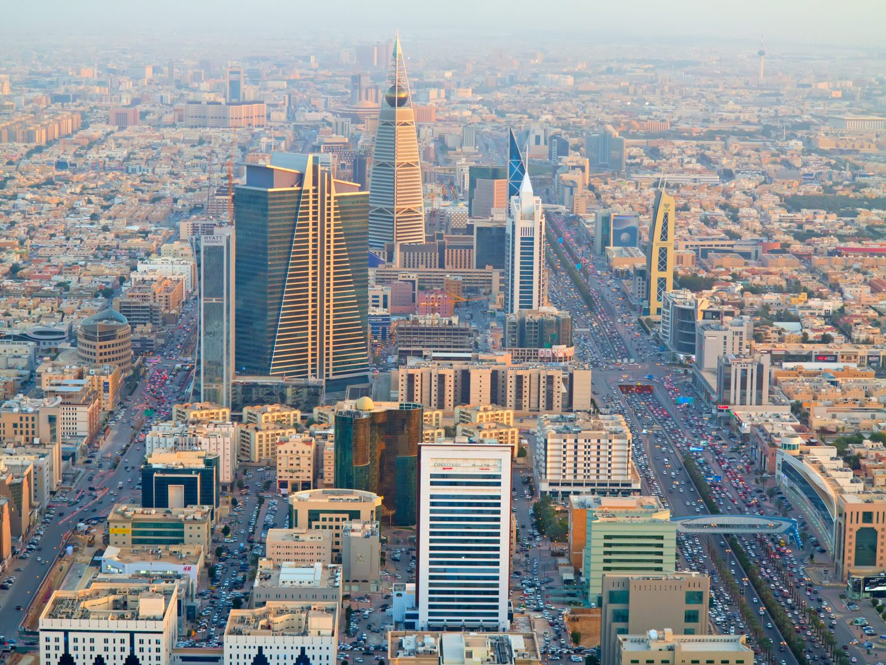

## Overview

The modern state of Saudi Arabia, an absolute monarchy on the Arab Gulf, came about at the end of the First World War, when allied victory over the Ottoman Empire insured the decline of Ottoman influence in the region.

Since then, the nation of 33 million which occupies two million square kilometers in the Arab gulf has grown to the world's eighteenth largest economy (behind Turkey, ahead of Switzerland)[1](https://data.worldbank.org/country/saudi-arabia) and secured regional preeminence. The discovery of vast petroleum reserves in 1938 resulted in Saudi Arabia becoming the world's largest oil exporter for many years, having been only recently unseated by the United States.

Oil revenue accounts for almost half of the Saudi GDP, and more than 80% of its private sector workers are immigrants. Roughly 30-40% of native Saudis are employed, mostly in the government, which has a powerful role in the Saudi Arabian command economy.[2](https://www.opec.org/opec_web/en/about_us/169.htm)

The current Saudi Arabian economic paradigm is dependant on three assumptions:

* Oil price **consistency**.
* Military **security**.
* Undisputed **legitimacy**.

Should any of these three realities be challenged, the economy could face legitimate insolvency in conjunction with untenable oil prices, destroyed or damaged production facilities, and challenges to government authority.

Saudi Arabia is special, however, because it represents a geopolitical keystone which faces distinct threats to all three of its primary strategic foils. Underpinning the fragility, each of these goals is intimately related to the others, so collapse from one could quickly produce collapse from all three.

## Oil Price Consistency

Saudi Arabia is a founding member of [OPEC](https://www.opec.org/opec_web/en/), an intergovernmental group of oil-producing nations united by bureaucracy to stabilize oil markets though regulation such as production quotas. OPEC represents almost half the world's annually produced oil, and over 80% of proven reserves.[3](https://www.opec.org/opec_web/en/data_graphs/330.htm) This level of supply control gives OPEC significant, though waning, power in the oil market.

[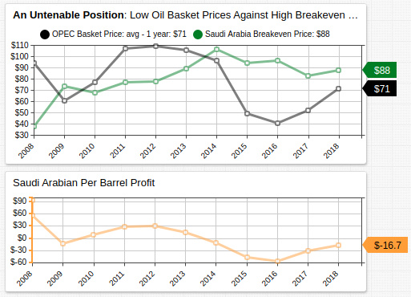](https://apps.axibase.com/chartlab/84a1066f#fullscreen)

For five consecutive years, the Kingdom of Saudi Arabia has been selling their lifeblood at a loss. Low oil prices have had an effect on a number of oil-dependant nations' economies including Saudi Arabia but Saudi Minister of Petroleum and Mineral Resources Ali Al-Naimi refused to relax production quotas when pressed to do so in 2014.

> <i>"Is it reasonable for a highly efficient producer to reduce output, while the producer of poor efficiency continues to produce? That is crooked logic. If I reduce, what happens to my market share? The price will go up and the Russians, the Brazilians, [and] US shale oil producers will take my share."</i> [4](https://www.ft.com/content/51c508a4-89fe-11e4-8daa-00144feabdc0)

Al-Naimi's rigidity was fundamentally sound, backing down production quotas would likely increase the price of oil. The once oligarchical control over the oil markets wielded by OPEC began to fade in the 1970s after the OAPEC (Organization of Arab Petroleum Exporting Countries, a group which consisted of the Arab OPEC states, as well as Syria and Egypt) overplayed its hand during the Yom Kippur War, whereby the United States and other industrialized nations were subject to embargo by OAPEC countries as retribution for their support of the state of Israel, resulting in soaring oil prices. [5](https://www.cs.mcgill.ca/~rwest/wikispeedia/wpcd/wp/1/1973_oil_crisis.htm)

Wielding cartel authority as OAPEC did more than four decades ago has put the current Saudi administration in a tenuous position. Most western nations scrambled to achieve at least partial independence from OPEC, which had been shown to be a political as well as economic organ, and as a result the modern OPEC is unable to pull the same levers in the present.

[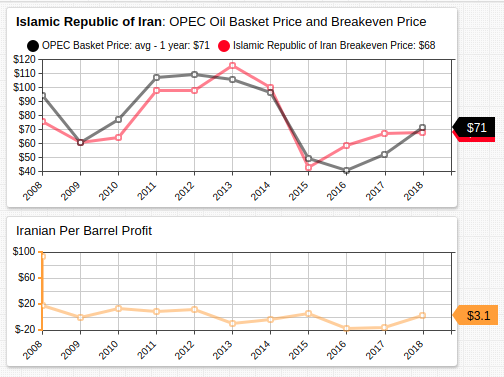](https://apps.axibase.com/chartlab/e2e02622#fullscreen)

Further challenging regional stability from the Saudi perspective is the assent of the Islamic Republic of Iran, the nominal Shia antagonist to the Sunni Kingdom of Saudi Arabia. Iran, which produces about three million barrels of oil a day[6](https://www.opec.org/opec_web/en/about_us/163.htm) compared to the Saudis' nearly ten million, has nonetheless been able to maintain production costs at such a level than their petrol industry is still profitable. Matched with the 83 million or so Iranians living on the other side of Iraq from Saudi Arabia, the Islamic Republic of Iran could eventually move to challenge Saudi hegemony in the Middle East.

A demonstration of Saudi reliance on oil production can be observed by examining gross domestic product statistics. Non-oil GDP growth has been significant several times in the last decades, but similar to the "Chinese miracle," developing nations are often able to achieve extraordinary growth rates by importing growth from more developed economies. More importantly, non-oil GDP growth has been less than 2% two of the last four years. [7](https://fred.stlouisfed.org/series/SAUNGDPXORPCHPT) Matched with diminished oil profits, an ascendent foe, and a slow growing domestic economy, challenge in one theater of Saudi affairs could easily spill over into another.

[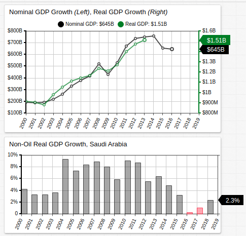](https://apps.axibase.com/chartlab/6870db58#fullscreen)

Real GDP growth rarely exceeded nominal GDP growth, so although the relative size of the Saudi economy continues to expand, the portion of that income which translates into real liquidity is diminishing.

As mentioned above, economic instability has the potential to hamper the retention of royal legitimacy or combat readiness and either has the ability to further affect the Saudi economy via oil production costs or sales prices.

## Military Security

Military operations in the Middle East have had long-reaching effects on oil-producing countries, whether directly or indirectly. War in the Middle East means damaged or ruined extraction and production facilities and especially the decreased production of a particular nation, which can precipitate a spike in oil prices that exclude affected countries.

The following Middle Eastern wars are described in terms of their effect on international and regional oil markets:

* **Yom Kippur War** (1973): Arab nations impose an oil embargo on the United States and other developed nations in retaliation for their support of Israel against the alliance of mostly Arab nations. One result was the 1973 energy crisis, whereby oil prices rose fourfold, much to the advantage of oil-producing nations.

  [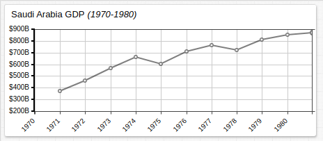](https://apps.axibase.com/chartlab/5fa9ce58#fullscreen)

* **Iranian Revolution** (1979): Islamic revolutionaries depose Mohammad Reza Shah Pahlavi, ending the Persian monarchy which had held power for more than two millennia, in favor of a theocratic-republican government headed by Ruhollah Khomeini. One result was the 1979 energy crisis, whereby global supply contracted approximately 4% and per barrel cost doubled in the course of a year. Nonetheless, OPEC lost considerable world influence as US and Norwegian oil was allowed to supplement increased oil production.[8](https://www.federalreservehistory.org/essays/oil_shock_of_1978_79)

  [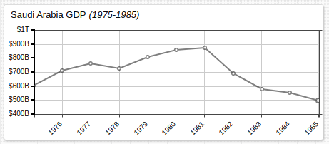](https://apps.axibase.com/chartlab/5fa9ce58#fullscreen)

* **Gulf War** (1990): Iraqi president Saddam Hussein invades neighboring Kuwait triggering a western coalition response headed by the United States. One result was the 1990 oil price shock, whereby oil prices doubled in just four months.[9](https://www.bis.org/publ/econ31.htm)

  [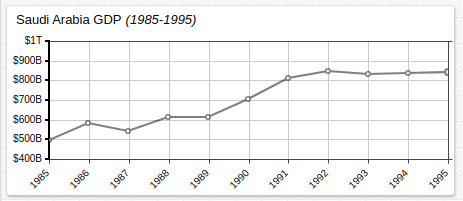](https://apps.axibase.com/chartlab/5fa9ce58#fullscreen)

* **Iraq War** (2003): A western coalition headed by the United States invades Iraq with the goal of toppling Saddam Hussein. Combined with precise military tactics and $20 billion in reconstruction aid money, the global price of oil remains stable despite war in an oil-producing country, but Saudi GDP grew as well.[10](http://www.rubincenter.org/meria/2005/06/Duffield%20pdf.pdf)

  [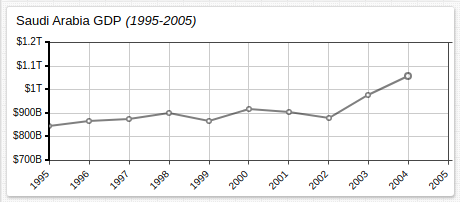](https://apps.axibase.com/chartlab/5fa9ce58#fullscreen)

Each of these conflicts highlights a possible outcome to a new Middle Eastern episode.

The Yom Kippur War was a Middle Eastern power (Israel) against other Middle Eastern powers (Led by Egypt and Syria), Western intervention triggered oil embargoes which quadrupled the price of oil. This is an example Middle Eastern nations exerting their control over the market.

The Iranian Revolution represented a price run on oil inspired by international skepticism that the new government would honor the rule of law, and become a responsible geopolitical actor. Ayatollah Khomeini employed outspoken criticism against the West throughout his life and especially during his ascent to power. This is an example of a Middle Eastern revolution due to loss of legitimacy affecting the opinions of oil-purchasing nations and therefore oil prices. As a result, the move was not profitable to other oil-producing nations, in fact, the opposite occurred and OPEC lost influence.

The Gulf War immediately resulted in a price surge that was less extreme than other instances, which was caused by internal politics in the Middle East.

The Iraq War involved a spearhead attack on a number of Iraqi oil fields to prevent their sabotage by the collapsing government, and with respect to maintaining the global stability of oil markets was successful.

## Undisputed Legitimacy

Saudi Arabia is ruled by a royal family with no legislative branch, and the Qur'an is the country's official constitution. Crown Prince Mohammad bin Salman led a 2017 effort ostensibly to combat corruption[11](http://vision2030.gov.sa/en), although many believe that it was a move to consolidate political power. The nature of the Saudi balancing act is that the authority of the government necessitates the provision and finance of vast social welfare programs to support the kingdom.

The Arab Spring showed Saudi authority was not immune to challenge; a number of protesters were killed in skirmishes with state forces and organizers were arrested.[12](https://www.amnesty.org/en/latest/news/2018/08/saudi-arabia-appalling-plan-to-execute-female-activist-must-be-stopped/)

[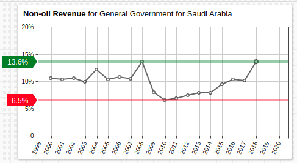](https://apps.axibase.com/chartlab/a8da9b06#fullscreen)

The stagnation and decrease in non-oil revenue for the government of Saudi Arabia that coincided with the Saudi protests shows how dramatic an effect domestic unrest plays in national output. The monarchy was able to keep oil production constant, primarily because the majority of the sector's employees were non-Saudi non-demonstrators but the areas affected by Saudi domestic labor sufferered dramatically and recovered slowly; 2018 revenue has only just caught up to the 2008 pre-demonstration value.

[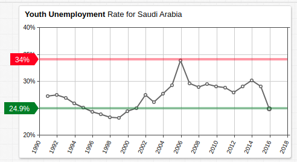](https://apps.axibase.com/chartlab/c3ac221c#fullscreen)

Like macroeconomic stagnation at the federal level, microeconomic stagnation at the individual level peaked in the years leading up to the Arab Spring demonstrations, which have since corrected.

Of the three strategic sectors of Saudi Arabia, the royal family's grasp on power is the most stable. Most internal struggles between factions of the royal family, and domestic struggles against organized protesters have subsided. Indeed, after the death of Jamal Khashoggi in the Saudi embassy in Istambul, the Saudi government responded with no international backlash that would challenge the authority of the ruling family.

The Saudi government has introduced a number of reforms within the last years which are enumerated below[13](http://vision2030.gov.sa/en/node/125):

* **2011**: Suffrage and the right to hold office extended to women in 2015 elections.
* **2013**: Domestic violence criminalized.
* **2018**: Legal protection extended to women who want to open their own business. Women granted the right to drive motor vehicles.

## Conclusion

Saudi Arabia maintains a fragile regional hegemony that is predicated on its ability to profit from its petroleum sector, a lack of military conflict that hampers its ability to produce or export oil, and the ability of the royal family to maintain control of the country.

A decline in production is unlikely, the country has no shortage of oil, and barring invasion is unlikely to unwillingly decrease production. The royal family, although challenged in the recent past, provides the people of Saudi Arabia a sufficient amount of outlets for expression and mechanisms to prevent widespread protest that a populist uprising is also unlikely to be fomented[14](https://www.cfr.org/expert-brief/how-stable-saudi-arabia). Saudi Arabia's primary challenge is losing influence in the Muslim world in favor of the larger population and increasingly competitive economy of the Islamic Republic of Iran.

[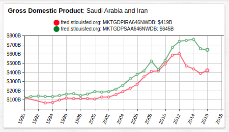](https://apps.axibase.com/chartlab/c799ed43)

Until 2012, when the international community instituted wide-reaching oil sanctions[15](https://obamawhitehouse.archives.gov/the-press-office/2012/07/31/fact-sheet-sanctions-related-iran) on Iran, the economy was approaching the output of neighboring Saudi Arabia. Because of the size of the country, its economic prowess, and the effectiveness of its military, Iran is poised to challenge Saudi Arabia as hegemon of the Middle East in the future.

The potential for conflict between the two nations has significant ramifications for the rest of the region and indeed the world as well, especially if either power were to attain nuclear weaponry.