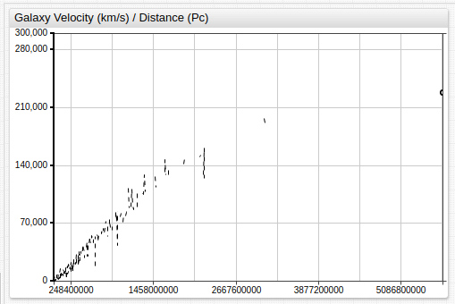

# Calculating the Age of the Universe


## Introduction

[HyperLEDA](http://leda.univ-lyon1.fr/intro.html) is a service which provides a database and collection of tools to study the physics of galaxies and cosmology. The project began in 1983 and is currently maintained by a collaboration between [Observatoire de Lyon](https://observatoire.univ-lyon1.fr/) in France and the [Special Astrophysical Observatory](http://www.sao.ru/) in the Russian Federation.

To quote the HyperLEDA mission statement: "The principle behind HyperLEDA is to collect measurements published in literature and modern surveys, and to combine them into a unique homogeneous description of the astronomical objects. This enables the researcher to compare objects located at very different distances. This approach is a continuation of the famous series of Bright Galaxy Catalogues (`RC1`, `RC2`, `RC3`) by de Vaucouleurs and co-workers. The result of the homogenization is the Leda catalogue."

Using SQL to query the HyperLEDA database and [Axibase Time Series Database](https://axibase.com/docs/atsd/) to store, process, and visualize the relevant information, a theoretical age of the universe can be calculated using a relatively straightforward procedure which is demonstrated in this article.

## Data Collection

HyperLEDA provides an [SQL interface](http://leda.univ-lyon1.fr/leda/fullsql.html) to query data stored in their database. This research focuses on three metrics:

* `objname`: The name of an astronomical object, assigned by the scientific community.
* `mod0`: The [distance modulus](https://en.wikipedia.org/wiki/Distance_modulus) of the astronomical object.
* `vgsr`: The recorded velocity with which the astronomical object is moving away from the point of reference, in this case, the planet Earth.

Access the raw data used in this article with the query:

```sql
SELECT objname, mod0, vgsr
  WHERE mod0 IS NOT NULL
```

> This query requests all objects which have numerical data for at least the distance modulus metric.

A few lines of the dataset returned by this query are shown below:

```txt
| objname   | mod0  | vgsr  |
|-----------|-------|-------|
| PGC765572 | 36.38 | 13281 |
| NGC1201   | 31.54 |  1597 |
| PGC869197 | 37.52 | 23603 |
...
```

> Alternatively, download the raw dataset from the [`/resources`](./resources/raw-data.txt) directory.

### Converting Distance Modulus

The distance modulus is a derived value of the logarithmic measure of the distance to an astronomical object, and therefore unhelpful to these ends in its raw form.

The distance modulus is calculated as **&mu; = *m* - *M***, where:

* &mu;: Distance modulus.
* *m*: [Apparent magnitude](https://en.wikipedia.org/wiki/Apparent_magnitude).
* *M*: [Absolute magnitude](https://en.wikipedia.org/wiki/Absolute_magnitude).

The [inverse-square law](https://en.wikipedia.org/wiki/Inverse-square_law) allows the comparison of observed brightness expressed as apparent magnitude to absolute distance as **log<sub>10</sub>(*d*) = 1 + (&mu;/5)**, where:

* &mu;: Distance modulus.
* *d*: Distance in [parsecs](https://en.wikipedia.org/wiki/Parsec).

Therefore, ***d* = 10<sup>(&mu;-25)/5</sup>** or ***d* = 10<sup>(&mu;/5)+ 1**</sup>.

> For more information about converting the distance modulus to absolute distance, the Australian amateur astronomy society [IceInSpace](http://www.iceinspace.com.au/forum/index.php) offers a convenient [tutorial](http://www.iceinspace.com.au/forum/archive/index.php/t-104145.html).

Apply this formula to the raw data, or download the converted dataset from the [`/resources`](./resources/converted-data.csv) directory, which includes the derived `dist` column and is stored in CSV format.

A few lines of the converted dataset are shown below:

```txt
objname,   mod0,  vgsr,  dist,
PGC765572, 36.38, 13281, 188799134.909629,
NGC1201,   31.54, 1597,  20323570.1093622,
PGC869197, 37.52, 23603, 319153785.510077,
...
```

To replicate the remaining procedure, download [ATSD](https://axibase.com/docs/atsd/installation/) or launch the [Docker Image](https://axibase.com/docs/atsd/installation/images.html) to perform visualization and analysis tasks.

## Visualization

Import the required data into a local ATSD instance using the attached [CSV Parser Configuration](./resources/parser-config.xml). Refer to the [Configuration Import Tutorial](../../tutorials/shared/import-csv-parser.md) to upload configuration to ATSD.

Data is visualized below using the [**ChartLab**](https://github.com/axibase/charts/blob/master/README.md#axibase-charts).



The majority of the data falls into the third quadrant (greater than 95%), and within that quadrant, roughly 90% of that data falls into the third quadrant once again.

The visualization below show limited data visualization to present a more clear image using the information provided by HyperLEDA.


The above image contains less than 100 data points, of the over 4,000 included in the dataset and is meant to illustrate the same trend on a significantly reduced scale for ease of viewing.

## Calculation

The upward slope of the dataset implies that objects farther from the observation point are moving away from that point more quickly. This is among the foundational hypotheses of what came to be known as the Big Bang Theory, first proposed in its earliest forms by [Georges Lemaître](https://en.wikipedia.org/wiki/Georges_Lema%C3%AEtre). Lemaître's abductive logic was soon expanded upon by [Edwin Hubble](https://en.wikipedia.org/wiki/Edwin_Hubble), and serves as the basis for the modern understanding of the nature of the universe.

ATSD features myriad [statistical functions](https://axibase.com/docs/atsd/api/data/aggregation.html#aggregation), including those related to [linear regression](https://en.wikipedia.org/wiki/Linear_regression), which are used to determine the slope and intercept of the linear model.

```ls
[series]
statistic = slope
[series]
statistic = intercept
```


> Note that the distance unit has been converted to megaparsecs (MPc), which is one million parsecs.

These values exclude less than 10% of total data as erroneous. The regression line is shown below superimposed over the data.


Using the standard linear equation ***f(x)* = *mx* + *b***, where:

* *f(x)*: Distance in megaparsecs.
* *m*: Slope of the regression line.
* *x*: Velocity in *km/s*.
* *b*: Intercept of regression line.

Transformed to isolate the derived value *m*, *1* / *m* = (*x* + *b*) / *f(x)*. Where the units for each value are:

* *x*: *km/s*
* *b*: Unitless scalar value.
* *f(x)*: 3.086*e*<sup>19</sup> *km/s*

As such, the exponential value is calculated to be `19` - `1` - `7` = `11`. Where `1` is the exponent of the numerator, and `7` is the conversion factor from seconds to years.

Thus, the inverse value of the derived linear regression slope raised to the power of `11` is the theoretical age of the universe. The linear regression intercept is discarded as insignificant.

## Conclusion

Using simple visualization and linear regression, calculation shows the universe to be roughly `14.71` billion years old. However, this number does not include certain assumptions which are outside the scope of this article, but detailed extensively [elsewhere](https://en.wikipedia.org/wiki/Age_of_the_universe#Cosmological_parameters). Ostensibly, there is a correction factor which can be approximated as roughly `1`, that must be subtracted from the derived value. This leaves the final solution of `13.71` billion years old.

The accepted value for the [age of the universe](https://en.wikipedia.org/wiki/Age_of_the_universe) is `13.79` billion years old.