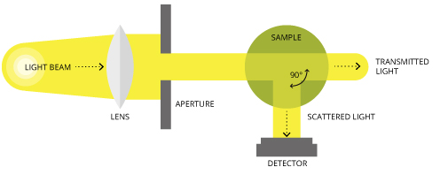
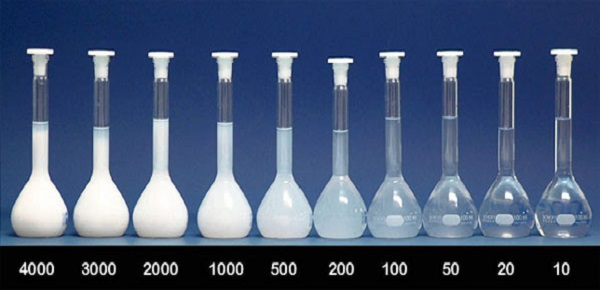
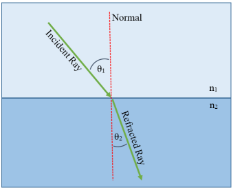
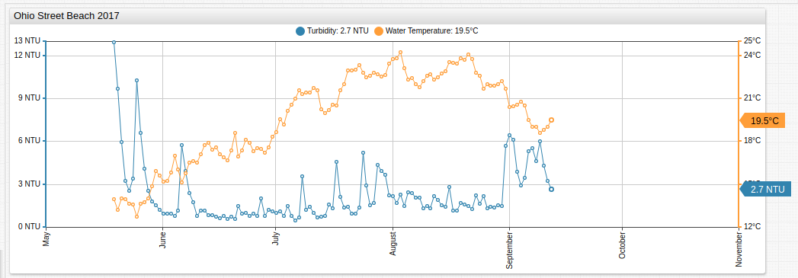
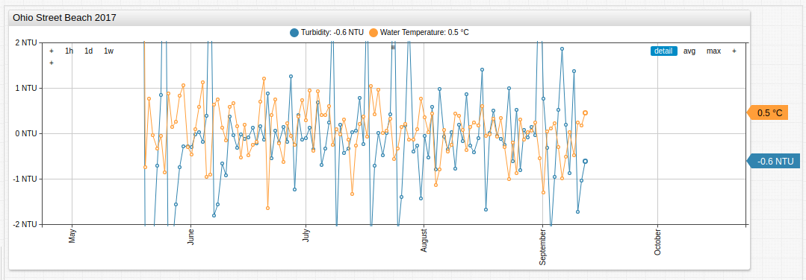
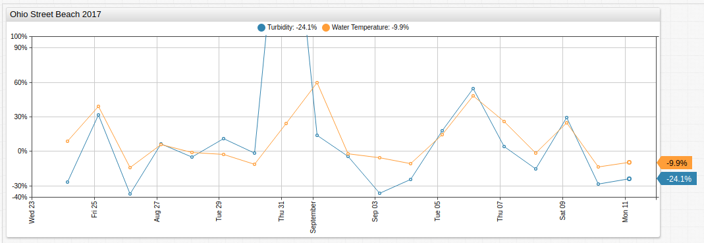
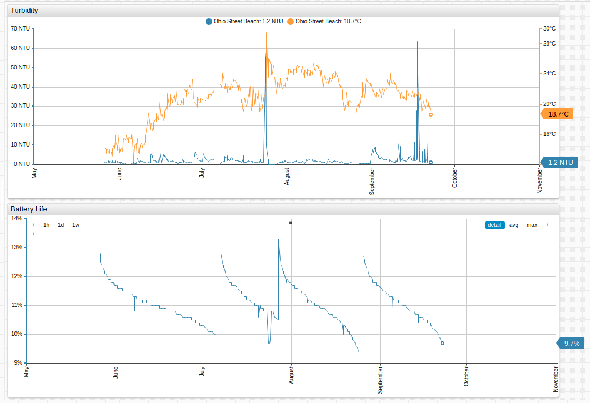
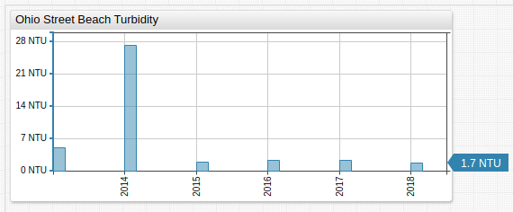

# The Effect of Particulate Matter on Water Temperature

## Introduction

Water temperature is an important metric to biological life and overall ecosystem health. Small deviations in water temperature can have numerous effects:

* Distortion of metabolic and photosynthetic rates.
* A change in the levels of both natural and harmful compounds.
* Altered salinity, conductivity, acidity, and water density.

Water turbidity is a key test of water quality. The measurement tracks the cloudiness of a body of water caused by the presence of microscopic particulate matter. The standard unit for turbidity is Nephelometric Turbidity Units (NTU), which is a function of the amount of refracted light detected by a sensor called a Nephelometer. The more particulate matter present, the more light refracted.



Turbidity standards are shown below in NTU:



Drinking water turbidity standards for various governments and organizations are enumerated here for context:

| Organization | Turbidity Standard |
:--:|:--:
World Health Organization | 5 NTU
European Union | 4 NTU
United States | 1 NTU

Several states have promulgated ambient water turbidity standards to adjudicate the cleanliness of publicly accessible bodies of water based on size, location, and purpose:

| State | Turbidity Standard |
:--:|:--:
Louisiana | 25, 50, or 150 NTU
Vermont | 10 or 25 NTU
[Washington](../../chart-of-the-day/wa-wqi/README.md) | 5 NTU

## Dataset

The City of Chicago makes use of several such detectors during the summer months to track water turbidity and temperature. The dataset is stored in [Socrata](https://axibase.com/use-cases/integrations/socrata/python/) format and available in the [Axibase Dataset Catalog](https://axibase.com/datasets/socrata/qmqz-2xku.html).

Alternatively, download the [CSV file](./resources/water-turbidity-and-temperature.csv) from the `/resources` directory.

Sample records from this dataset are shown here:

| Beach Name | Measurement Timestamp | Water Temperature | Turbidity | Transducer Depth | Wave Height | Wave Period | Battery Life | Measurement Timestamp Label | Measurement ID |
|------------|-----------------------|-------------------|-----------|------------------|-------------|-------------|--------------|-----------------------------|----------------|
| Ohio Street Beach | 07/02/2018 05:00:00 PM | 21.6 | 1.39 |       | 0.158 | 4    | 11.9                | 07/02/2018 5:00 PM          | `OhioStreetBeach201807021700` |
| Ohio Street Beach | 07/02/2018 06:00:00 PM | 21.1 | 0.91 |       | 0.189 | 2    | 11.9                | 07/02/2018 6:00 PM          | `OhioStreetBeach201807021800` |
| Ohio Street Beach | 07/02/2018 07:00:00 PM | 20.5 | 1.07 |       | 0.154 | 4    | 11.9                | 07/02/2018 7:00 PM          | `OhioStreetBeach201807021900` |
| Ohio Street Beach | 07/02/2018 08:00:00 PM | 19.9 | 1.11 |       | 0.161 | 3    | 11.7                | 07/02/2018 8:00 PM          | `OhioStreetBeach201807022000` |
| Ohio Street Beach | 07/02/2018 09:00:00 PM | 19.6 | 1.1  |       | 0.19  | 3    | 11.9                | 07/02/2018 9:00 PM          | `OhioStreetBeach201807022100` |
| Ohio Street Beach | 07/02/2018 10:00:00 PM | 19.3 | 1.02 |       | 0.176 | 3    | 11.9                | 07/02/2018 10:00 PM         | `OhioStreetBeach201807022200` |
| Ohio Street Beach | 07/02/2018 11:00:00 PM | 19   | 1.04 |       | 0.117 | 2    | 11.9                | 07/02/2018 11:00 PM         | `OhioStreetBeach201807022300` |
| Ohio Street Beach | 07/03/2018 12:00:00 AM | 18.9 | 1.01 || 0.123 | 3     | 11.9 | 07/03/2018 12:00 AM | `OhioStreetBeach201807032400` |                             |
| Ohio Street Beach | 07/03/2018 01:00:00 AM | 18.8 | 1.02 | |0.102 | 3     | 11.9 | 07/03/2018 1:00 AM  | `OhioStreetBeach201807030100` |                             |
| Ohio Street Beach | 07/03/2018 02:00:00 AM | 18.7 | 1    |       | 0.103 | 3    | 11.9                | 07/03/2018 2:00 AM          | `OhioStreetBeach201807030200` |

The four relevant columns for this research are `Water Temperature` and `Turbidity`, the associated `Measurement Timestamp`, and the `Beach Name` detector location.

The location of each detector is described on [`data.cityofchicago.org`](https://data.cityofchicago.org/Parks-Recreation/Beach-Water-and-Weather-Sensor-Locations/g3ip-u8rb) by geographic longitude and latitude. Their position is plotted on the map below and specified by name in the associated table:


Location ID | `Beach Name` | Geographic Coordinates
--|--|--
1 | Calumet Beach | `(41.714739°, -87.527356°)`
2 | 63rd Street Beach | `(41.784561°, -87.571453°)`
3 | Montrose Beach | `(41.969094°, -87.638003°)`
4 | Osterman Beach | `(41.987675°, -87.651008°)`
5 | Ohio Street Beach | `(41.894328°, -87.613083°)`
6 | Rainbow Beach | `(41.760147°, -87.550081°)`

## Visualization

The dataset is inconsistent. Some years lack data for certain locations, and others contain only intermittent data. Open the **ChartLab** portal below to view 2016 data.


[](https://apps.axibase.com/chartlab/77067e32#fullscreen)

View data from other years by modifying the `starttime` expression or isolate a series by clicking the `Beach Name` tag icons above the visualization to toggle the presence of the detector from that location.

```ls
[configuration]
  starttime = May 2016
```

The `Ohio Street Beach` dataset is the most consistent, and the only data tracked for the entire observed period. To maintain consistency, other data is henceforth excluded.

This portal tracks the four most recent years of `Ohio Street Beach` data for metrics `Turbidity` and `Water Temperature` with data as recent as July 2, 2018.


[](https://apps.axibase.com/chartlab/8d79f2ce#fullscreen)

The data is hourly and erratic. This is due to the nature of the device which is unable to discard erroneous readings or the presence of an object, such as a person or thing, near the detector.

According to [Snell's law](https://en.wikipedia.org/wiki/Snell%27s_law), the angle of incidence and thus wavelength of refracted light is a function of the speed of light divided by the frequency, which changes when the light particle is refracted. Particles refracted by particulate matter of different indices of refraction create different readings.



The formula associated with Snell's law `n1/n2 =  sin(θ1)/sin(θ2)` states that the difference between two mediums affects the angle and velocity at which a light particle is refracted.

Aggregating temperature and turbidity data by the day is a reasonable resolution to the problem of volatile samples considering the observed period is less than six months for each year.

```ls
[widget]
  group-period = 1 day
  group-statistic = avg
```



[](https://apps.axibase.com/chartlab/eae1eb1c#fullscreen)

**ChartLab** supports [user-defined functions](https://github.com/axibase/charts/blob/master/syntax/udf.md#user-defined-functions) which aid further analysis. Define JavaScript functions and store them in the [appropriate location](https://github.com/axibase/charts/blob/master/syntax/udf.md#deploying-function-files). The publicly accessible **ChartLab** application already supports the `fred.js` library. Alternatively, deploy the library locally with the [downloadable resource](https://raw.githubusercontent.com/axibase/charts/master/resources/fred.js).

The `PercentChangeByOffset` function is used below to handle the difference in magnitude of the two metrics and compare relative changes. The `PercentChangeByOffset` function requires two arguments: the `alias` of the series to transform, and the `interval` of the offset.

```ls
[series]
  value = local.PercentChangeByOffset('raw-turb', '1 day')
[series]
  value = local.PercentChangeByOffset('raw-temp', '1 day')
```

The resultant visualization highlights the analogous changes for each metric.


[](https://apps.axibase.com/chartlab/7ef7c546#fullscreen)

The converse relationship of turbidity and water temperature is visualized above: larger than normal increases in turbidity and therefore particulate matter, correlate to larger than normal decreases in water temperature. This phenomena occurs because of the energy transfer between solar photons and the media through which they refract. Generally this is treated as either 0% or 100% energy transfer for mathematical purposes. The presence of more absorbing bodies decreases the amount energy transferred to heat the body of water.

[Consecutive sample comparison](../../tutorials/subtract-subsequent-values/README.md) is another way to solve the magnitude problem.



[](https://apps.axibase.com/chartlab/a420c8de#fullscreen)

The pattern is similar when comparing absolute daily average change but the `PercentChangeByOffset` is preferable since absolute turbidity changes are greater than absolute temperature changes. Converting the Celsius temperature values to Fahrenheit is one solution to increase variance.

```ls
[series]
  replace-value =  ((value - previousValue) * 9/5 + 32)
```

Modifying the derived `value` expression in the visualization created using the `PercentChangeByOffset` function to reflect the `Water Temperature` line about the `x` axis and reducing the observed `time-span` generates a more coherent visualization of the relationship.

```ls
[configuration]
  time-span = 20 day

[series]
  value = -1 * local.PercentChangeByOffset('raw-temp', '1 day')
```



[](https://apps.axibase.com/chartlab/1f2b1be5#fullscreen)

> For additional Charts syntax, see the [**ChartLab** Documentation](https://axibase.com/products/axibase-time-series-database/visualization/widgets/)

## Outlier Data


[](https://apps.axibase.com/chartlab/c18e05f0#fullscreen)

The portal above shows two datasets that contain significant outlier data which does not conform to correlation established through visualization.

The `2015` dataset shows a significant decrease in water temperature without a proportionate increase in turbidity. The `2016` dataset shows a significant increase in turbidity paired with an analogous increase in water temperature as well as a significant increase in turbidity without an analogous increase in water temperature.


[](https://apps.axibase.com/chartlab/cb2996e1#fullscreen)

[Historical weather reports](https://www.timeanddate.com/weather/usa/chicago/historic?month=8&year=2015) show that during the trend, the recorded high temperature fell from 32° Celsius on August 17 to 24° on August 20 and the recorded low temperature fell from 22° to 16° during the same period. Several days of thunderstorms and a 30% drop in humidity are also recorded. The addition of rainwater and overall drop in atmospheric temperature likely contributed to the decrease in water temperature without an analogous increase in water turbidity. No other rainfall is recorded in the month of August in Chicago.

The `2016` dataset has two irregular incidents. Of the two noted above, the latter is likely the result of erroneous data input as mentioned in the introduction but the former requires a better explanation. The inclusion of the `Battery Life` metric showed that the surge in both metrics aligned perfectly with a sharp drop in battery life, perhaps indicating a temporary loss of power which flooded the recording device upon restart.



[](https://apps.axibase.com/chartlab/5e4d1b0a#fullscreen)

No other substantial fluctuation of battery life is recorded during the observation period, that is likely the cause of the erroneous data.

## Validation

Repeat this procedure using the attached dataset and ATSD.

1. Refer to the [Installation](https://axibase.com/docs/atsd/installation/) instructions or launch the ATSD [Docker image](https://axibase.com/docs/atsd/installation/docker.html).
1. Load data into ATSD using the provided CSV [parser configuration](./resources/turbidity-temperature-parser.xml). Follow the [configuration upload](../../tutorials/shared/import-csv-parser.md) instructions.
1. Review the [**ChartLab** tutorial](../../tutorials/shared/chartlab.md) and documentation for additional syntax options.

## Conclusion

Ohio Street Beach is one of the most popular beaches in the country and is located in the heart of Downtown Chicago.


To maintain such consistently clean water in the heart of a major metropolitan area is no easy feat.

Average annual turbidity is shown here.



[](https://apps.axibase.com/chartlab/c046b3ba)

Only one year recorded an annual average turbidity greater than 10 NTU.