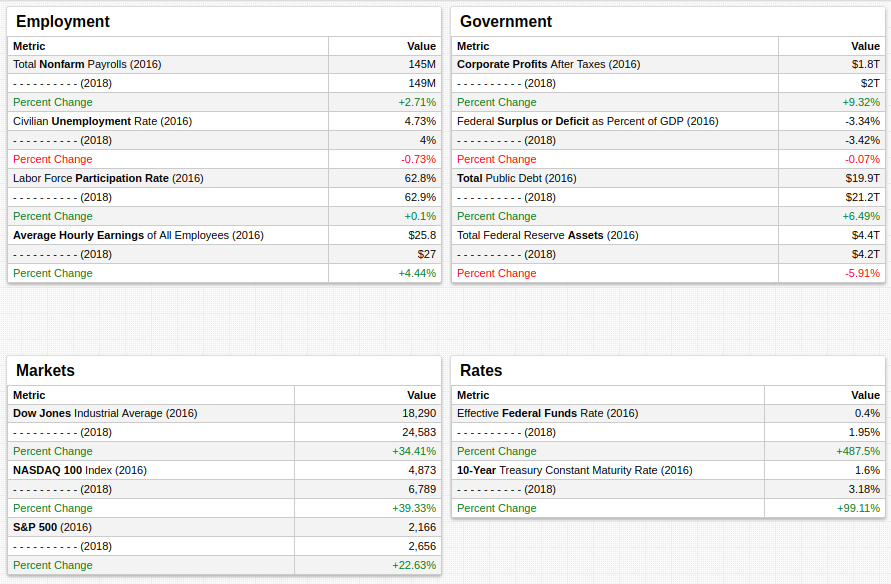
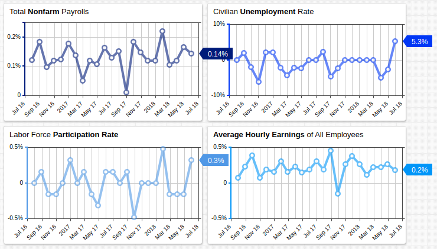
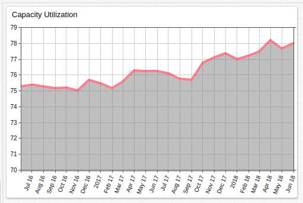
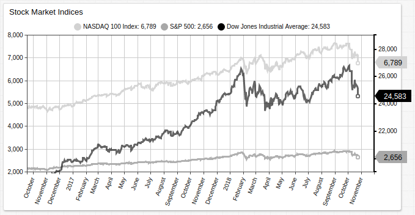
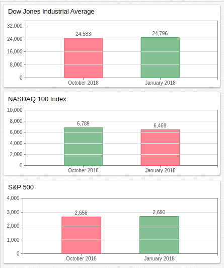
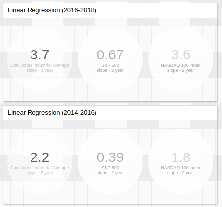

# Biennial Evaluation of the Trump Administration



[](https://trends.axibase.com/81002545#fullscreen)

## Contents

* [Overview](#overview)
* [Employment](#employment)
* [Government](#government)
* [Markets](#markets)
* [Rates](#rates)
* [Conclusion](#conclusion)

## Overview

January 20, 2019 marks the halfway point of the first term of the Trump administration. The President has repeatedly boasted on the state of the economy and lauded the growth which has been a central plank in the administration platform since the campaign trail. America has experienced slow GDP growth since the Recession, with seasonally adjusted quarterly annualized GDP percent change exceeding 3% only roughly one in every ten quarters since 2008.

Collected from the Federal Reserve [Economic Research](https://fred.stlouisfed.org/) Division, the metrics shown above are tracked by October 2016 value, in the month leading up to the election of President Trump, alongside the most recent value, the exact date of which varies by metric.

## Employment



[](https://trends.axibase.com/#fullscreen)

```ls
value = fred.MonthlyPercentChange('payems')
```

These [charts](https://github.com/axibase/charts/blob/master/widgets/time-chart/README.md#time-chart) display the values shown in the **Employment** table above by month and track the percent change during each interval.

The BLS [Employment Situation Summary](https://www.bls.gov/news.release/empsit.nr0.htm) (released October 5, 2018) contains the most current public information available. The report enunciates the following trends:

* Civilian Unemployment Rate fell 20 basis points (0.2%) in September to 3.7%
* Total Nonfarm Payrolls increased by 134,000, against an average monthly increase of 201,000 during the previous 12 months.
* Labor force participation remained constant.
* Average hourly earnings of nonfarm employees increased by 8 cents to $27.24.



Also in the past two years, [Capacity Utilization](https://fred.stlouisfed.org/series/TCU) has approached 80%, a feat which has not been accomplished in more than a decade.

## Government

The latest federal budget deficit, according to the [Congressional Budget Office](https://www.cbo.gov/topics/budget), is $793 billion. According to the CBO [2018 Long-Term Budget Outlook](https://www.cbo.gov/system/files?file=2018-06/53919-2018ltbo.pdf), the two main factors which will contribute to an increased budget deficit and public debt are thus:

* The Federal Funds Rate has increased almost 500% in the last two years. Net interest costs account for 1.8% of 2018 GDP but CBO analysts expect this amount to rise to 5.3% of GDP by 2048.
* Non-interest outlays are expected to rise from 19% of GDP to 23% by 2048.


[](https://trends.axibase.com/6b9f6470#fullscreen)

```ls
statistic = avg
period = 1 month
```

An additional thorn in the side of the government is the rising per person cost of healthcare. One of the primary failures of the Trump administration was the repeal of the ACA, famously defeated by an across-the-aisle vote from the late Senator [John McCain](https://www.youtube.com/watch?time_continue=1&v=hT2pp_KrJGg). Healthcare mandatory spending is also projected to outpace per person GDP growth, requiring a greater allotment of federal funds. 10.1% of 2018 GDP was used for mandatory Social Security and health care. CBO predictions indicate that that number will be 15.0% in 2039-2048.

That leaves a hypothetical United States circa 2048 with approximately 43% of its anticipated GDP tied up in non-discretionary spending.

## Markets

Wall Street brokers recorded [4% S&P 500 growth](https://www.vox.com/policy-and-politics/2018/1/17/16897656/trump-wall-street-stock-market) in the first 2 weeks of 2018, but by the next month most of the gains were wiped away. All American markets have experienced growth in the previous two years, however, most 2018 gains were been reversed in the past week.



Mark Twain famously quipped, "October. This is one of the peculiarly dangerous months to speculate in stocks. The others are July, January, September, April, November, May, March, June, December, August, and February." He supposedly singled out October in reference to the so-called [October Effect](http://lexicon.ft.com/Term?term=October-effect), whereby stock markets are supposed to be particularly prone to disaster during the month of October; the stock market collapses of [1929](https://en.wikipedia.org/wiki/Wall_Street_Crash_of_1929), [1987](https://en.wikipedia.org/wiki/Black_Monday_(1987)), and [2008](https://en.wikipedia.org/wiki/Financial_crisis_of_2007%E2%80%932008) all began to metastasize in October. Although nowhere near as severe as those cases, the curse appears to have wreaked its havoc in 2018 also.



> Only the NASDAQ 100 Index remains greater than its valuation in January 2018.

Despite the month of October, average market growth has increased immensely. The table below shows calculated values of the slope of  the regression line for each index for consecutive two-year periods.



[](https://trends.axibase.com/a9352427)

```ls
statistics = slope
period = 2 year
```

## Rates

The effective federal funds rate has grown almost 500% during President Trump's administration, and 10-year Treasury bond yield has doubled.

The former was held at less than 0.2% for almost a decade, when the Fed called for an increase to 0.3% in January of 2016 for the first time since the rate was set below 0.3% in December 2008. Since then, the Fed has increased the target range to between 2% and 2.25%, with the possibility of a [forthcoming hike](https://www.marketwatch.com/story/fed-hikes-interest-rates-signals-strong-support-for-another-increase-in-december-2018-09-26) in the next few months.


[](https://trends.axibase.com/4b471a9e#fullscreen)

```ls
[widget]
thresholds = 0, 0.2, 1.0, 2.0
summarize-period = 1 month
```

The [Calendar Chart](https://github.com/axibase/charts/blob/master/widgets/calendar-chart/README.md) tracks deviation from a calculated threshold. Here, each monthly value is assigned a color based on how it compares to overall average monthly value. Refer to the legend along the top of the chart for reference. The steep increase in the effective Fed rate began in October 2016 and has continued to the present. A higher Fed rate means larger return on investment in US Treasury bonds, but has the caveat of requiring larger net interest payments by the government as well.

## Conclusion

The traditional basket of indicators is mostly positive for the first two years of the Trump administration, but there are warning signs that the economy is not yet out of harm's way.

Perennial market bear Peter Schiff, who correctly predicted the 2008 crisis, recently spoke to [RT America](https://www.youtube.com/watch?time_continue=3&v=mowurscobbk) highlighting numerous potentially catastrophic conditions which could bring the US economy, and worldwide hegemony of the dollar, to its knees:

* Increased debt service costs caused by rising Fed interest rates. Schiff compared this phenomena to the surge in adjustable-rate mortgages which precipitated the housing crisis in 2006.
* Increased borrowing under the Trump administration. Schiff stressed that he believes the Trump administration [Tax Cuts and Jobs Act](https://www.congress.gov/bill/115th-congress/house-bill/1) will likely serve to decrease government revenue, forcing the Congress to authorize further borrowing. This is a contestable point, as the traditional libertarian perspective argues that lower tax rates also reduce deductions, and therefore potentially increase government revenue.
* According to Schiff, the $15 trillion public debt has become utterly untenable, and paying it all off is a fantasy. It logically follows that this will eventually inspire distrust in the dollar and result in loss of value.

Schiff's skepticism assumes several trends will hold constant: Slow economic growth, decreased tax revenue, and no attempt at addressing the public debt. Schiff is among a small school of thinkers who advocate selling dollar-based assets in favor of a return to his fiat of choice, precious metals.

Nonetheless, the President deserves acknowledgement of the large-scale economic gains his administration has made in the first two years of the term. Should this progress be reinforced and solidified, it is reasonable to assume that none of Schiff's projected scenarios will be brought to bear. Indeed, a 100-year plan whereby the United States committed to paying down 1% of the federal year each year would not add an undue burden to the federal government and would expand confidence in the dollar.