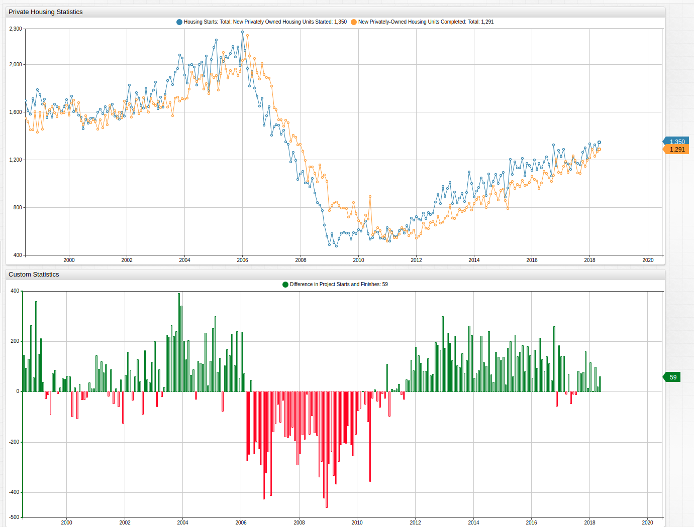
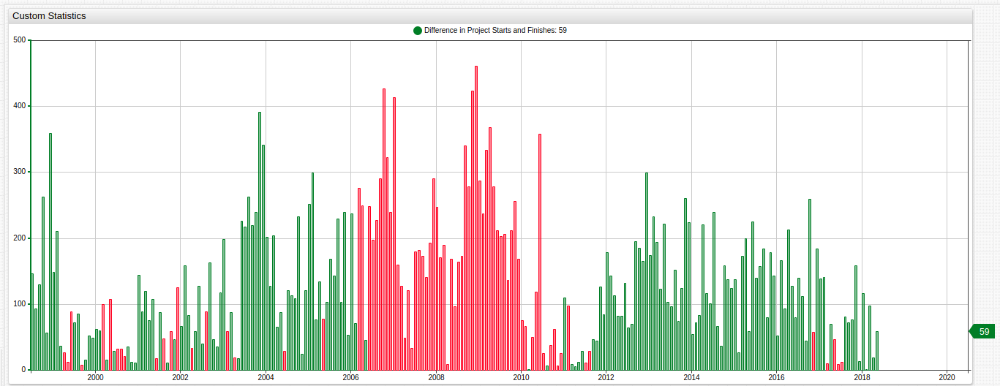
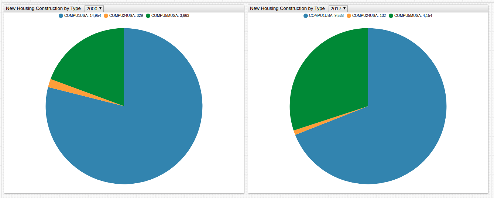

# Creating a Custom Housing Index

## Introduction

[FRED](https://research.stlouisfed.org/) tracks a range of data concerning the American housing market. The ATSD instance [**Trends**](../../tutorials/shared/trends.md) is a publicly accessible database where you can transform FRED data to explore it in ways that are otherwise impossible using the tools provided by the Federal Reserve.

## Inflation Index


[](https://trends.axibase.com/1b62b77e#fullscreen)

The visualization above uses the [Housing Consumer Price Index](https://fred.stlouisfed.org/series/CUUS0000SAH) and [Average Sales Price for New Houses in the United States](https://fred.stlouisfed.org/series/ASPNHSUS) datasets to create a derived Housing Price Index.

```ls
[series]
  value = (value('price') / value('index'))
```

Each FRED metric is used to create a derived series tracking the growth of inflation in the housing sector against the average sale price of an American home. The index is compared to the average home cost in the visualization on the right to show the inflation and deflation of the housing market through time.

Ideally, inflation grows at the same rate that housing prices inflate. The visualization shows that the reality is much different. Areas where the slope of the index exceeds the slope of the housing prices trend line indicate a "seller's market" whereby the increase is average housing costs outpaces the growth in inflation. The observed period shows the inverse trend as well during the American housing market crash. During this period, inflation and presumably wage growth, outstripped inflation in the cost of housing.

## Project Start Index


[](https://trends.axibase.com/6b04d60e#fullscreen)

The number of building permits issued for a period is related to the number of new projects. Accepting some deviations as normal, these numbers are in relative sync with one another. The issuance of an increased number of residential building permits indicate tangible growth of both people and capital indicating solvency in the real estate market.

This visualization tracks the number of housing projects initiated against the number of permits issued compared to the value of the previous year, averaged by quarter, six months, and year. Percentile change calculation are performed using a [user-defined function](https://axibase.com/use-cases/tutorials/shared/trends.html#user-defined-functions) from the [`fred.js`](https://axibase.com/use-cases/tutorials/shared/trends.html#fred-library) library.

Import a custom library and call user-defined functions by name:

```ls
[configuration]
  import fred = fred.js

[series]
  value = fred.PercentChangeFromYearAgo('permit12')
```

## Project Completion Index



[](https://trends.axibase.com/bddf1518#fullscreen)

Another important set of metrics track the start and end of housing projects. During growth period, you can see that the number of new projects consistently outstrips the number of completed projects, indicating a period a growth. During the housing crisis, this trend reversed significantly. In fact, the difference is more negative than growth periods are positive, showing the severity of the crisis.

```ls
[series]
  value = value('hou') - value('comp')
  alert-expression = value < 0
  alert-style = color: red
```

The `alert-expression` setting allows you to define custom conditions and control how the visualization is rendered when those conditions are met.

To illustrate the severity of the housing market crisis with respect to the difference between new and completed projects, reflect the periods of negative growth across the `x-axis` and compare them to periods of positive growth. **Trends** supports JavaScript syntax in the **Editor** window, this visualization uses the absolute value function `abs()` from the [`Math`](https://developer.mozilla.org/en-US/docs/Web/JavaScript/Reference/Global_Objects/Math) library.



[](https://trends.axibase.com/75bc2e31)

```ls
[series]
  value = Math.abs(value('hou') - value('comp'))
  alert-expression = value('comp') > value('hou');
  alert-style = color: red
```

## Development Index

The Federal Reserve records data for types of residences built as well.

| Metric | Description |
--|--
`COMPU1USA` | New Privately-Owned Housing Units Completed: 1-Unit Structures.
`COMPU24USA` | New Privately-Owned Housing Units Completed: 2-4 Unit Structures.
`COMPU5MUSA` | New Privately-Owned Housing Units Completed: 5-Unit Structures or More


[](https://trends.axibase.com/2952de5d#fullscreen)

The [Pie Chart](https://axibase.com/products/axibase-time-series-database/visualization/widgets/pie-chart-widget/#tab-id-1) tracks the annual total for each type of project. Navigate through time using the drop-down list in the portal above. Expand the `range` to view data outside the scope of this article. The Federal Reserve tracks  from completed projects 1971 to the present.

```ls
[dropdown]
 options = @{range(2000,2018)}
 change-field = starttime
```

High Occupancy Housing has grown to more than a quarter of total number of projects. The Federal Reserve does not track High Occupancy Housing projects more specifically than all those projects which are more than five units.



It is interesting to note that the current distribution of completed is housing projects is similar to that of the 1970's. During the 1980's and 1990's the number of High Occupancy Housing projects decreased.