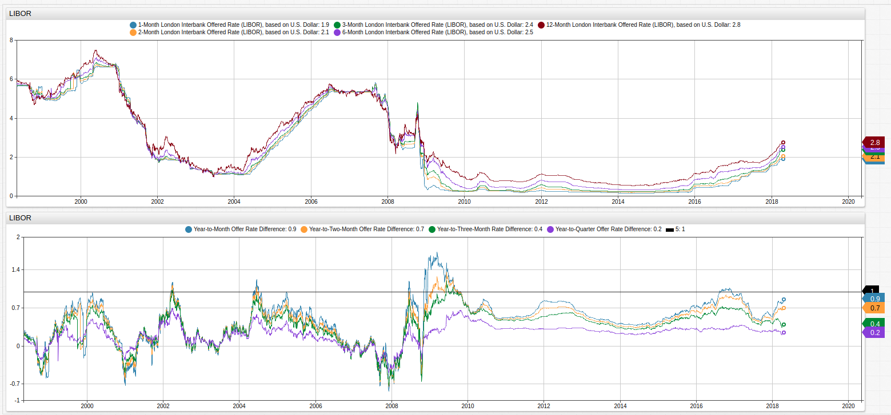
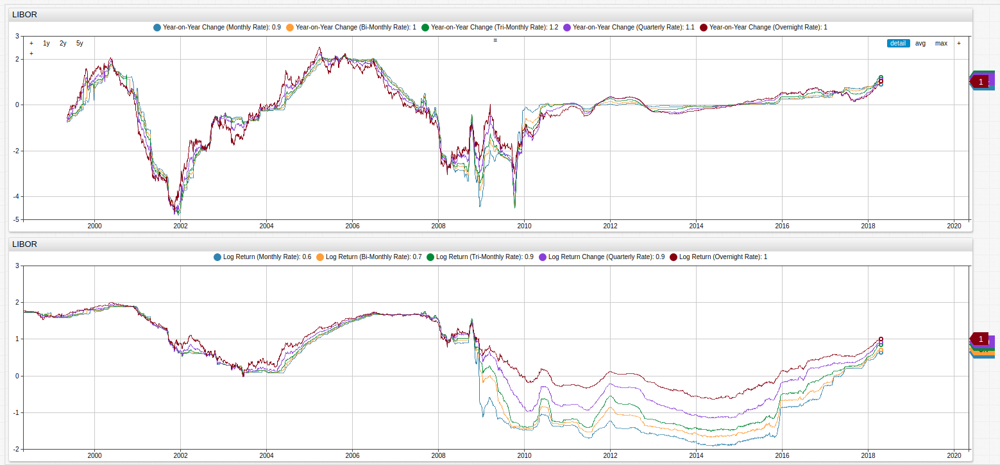
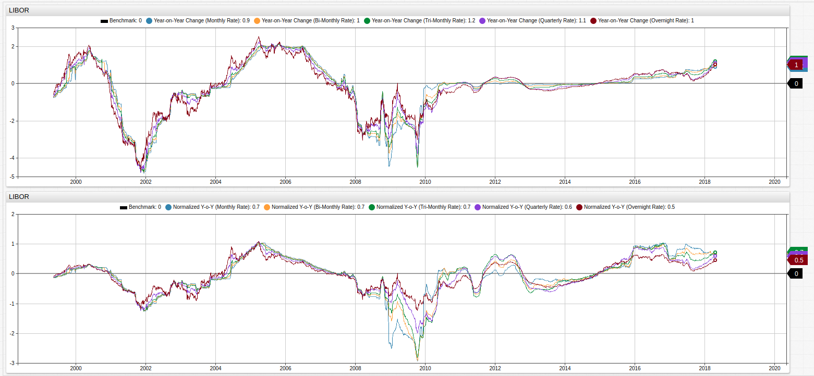

# London Inter-Bank Offered Rate (LIBOR)


[](https://trends.axibase.com/8f97e6db#fullscreen)

*Fig 1.* The LIBOR and its denominational rates are shown in the upper **Trends** visualization while the difference among each of the rates, compared to the annual lending rate, are shown in the lower visualization. A `[threshold]` series is set to 1, showing divergence of greater than a full percent among series.

The LIBOR is a benchmark index that tracks the interest rates at which banks lend money to one another. Similar to the United States Federal Reserve [Federal Fund and Interest Rates](../../research/analysis/fed-fund-interest/README.md), the LIBOR is often to used to appraise the current market climate and helps to inform investors of broad trends based on the amount of interest being collected. In the years leading up to the worldwide recession of 2009, the LIBOR moved frequently and dramatically, and its subordinate rates (measured daily, monthly, bi-monthly, tri-monthly, quarterly, and annually) often diverged significantly as member banks scrambled to hide losses or hedge positions.

In 2012 it was revealed that many of these worldwide member banks, fraudulently inflated or deflated the rates to profit off of short-term trades and increase interest rates in their favor. What came to be known as the LIBOR crisis led to stricter government regulation of the associated member banks and the LIBOR as a whole. As seen in the figure above, the government intervention has led to a marked stabilization of the various LIBOR-denominated rates.

---

## Year-Over-Year Change and Log Returns


[](https://trends.axibase.com/ea89aea3#fullscreen)

*Fig 2.* The upper chart shows year-over-year changes in the LIBOR index, and the lower chart normalizes the raw values using a natural logarithm function.

Year-On-Year change is a method of long-term analysis which tracks the change in a particular index or value of an instrument based on its value on the same date of the previous year. Often it is used to identify trends and correlate changes to real-world events. Log returns serve a similar purpose in that they are used to identify trends, however using log returns is useful because the dataset is normalized. This process removes potentially redundant data and increases data integrity, the natural logarithm essentially acts as a filter through which all data is processed and therefore related. Normalization is always assumed in classical statistical mathematics however, real-world datasets are often non-normal which makes meaningful analysis more difficult without first using some kind of normalization procedure.

Compare the raw year-over-year dataset to the normalized year-over-year dataset shown below:


[](https://trends.axibase.com/a400eabf#fullscreen)

*Fig 3.* Log returns provide a normalized dataset, which may be more easily operated upon by additional functions such as continuously-compounds rate of change. A `[threshold]` series is given the value of 0 for ease-of-viewing.

The **Trends** examples in this article use the [`fred.js`](../../tutorials/shared/trends.md#fred-library) library. This is a set of [user-defined functions](../../tutorials/shared/trends.md#user-defined-functions). Axibase Time Series Database, the underlying database which supports the data-processing and storage operations for the **Trends** service, supports the creation of user-defined functions for those operations frequently performed by end users.

---

## Structured Query Language

Most modern quantitative analysis relies on the use of a structured query language to enhance the quality of information available to a group of researchers. With an effective SQL, a user is able to extract the precise information needed when performing analysis or looking for trends. With the LIBOR index, SQL may be used to quantify the visualizations seen above, or expand upon them with deeper analytics.

This query returns all of the data from the visualizations above using a convenient and well-documented syntax (see [Resources](#resources)):

```sql
SELECT datetime AS "Date",
  value AS "1-Month Rate",
  (value - LAG(value)) AS "Change from Previous Value",
  LN(value) AS "Log Return",
  (LN(value) - LAG(LN(value))) AS "Log Return Change"
FROM "USD1MTD156N"
WHERE date_format(time, 'dd') = '01'
```

The [`WHERE`](https://axibase.com/docs/atsd/sql/#where-clause) clause is used to select only one data point from each month, the LIBOR is a daily index, as such the number of returned value would be quite large without some limitations. The addition of a second [`WHERE`](https://axibase.com/docs/atsd/sql/#where-clause) clause can target a specific year for a more narrowed result set.

```sql
WHERE date_format(time, yyyy) = '2015'
```

Previous values may be targeted with [`LAG`](https://axibase.com/docs/atsd/sql/#lag) statements and supported [mathematical functions](https://axibase.com/docs/atsd/sql/#mathematical-functions) may be used in [`SELECT`](https://axibase.com/docs/atsd/sql/#select-expression), `WHERE`, [`GROUP BY`](https://axibase.com/docs/atsd/sql/#group-by-columns), or [`ORDER BY`](https://axibase.com/docs/atsd/sql/#ordering) clauses.

Each of the LIBOR-denominated rates may be explored by changing the [`FROM`](https://axibase.com/docs/atsd/sql/#select-expression) expression to the applicable metric name, stored in ATSD.

The result set is shown here:

```txt
| Date       | 1-Month Rate | Change from Previous Value | Log Return | Log Return Change |
|------------|--------------|----------------------------|------------|-------------------|
| 2015-01-01 | NaN          | null                       | NaN        | null              |
| 2015-04-01 | 0.18         | NaN                        | -1.73      | NaN               |
| 2015-05-01 | 0.18         | 0.00                       | -1.70      | 0.03              |
| 2015-06-01 | 0.18         | 0.00                       | -1.70      | 0.00              |
| 2015-07-01 | 0.18         | 0.00                       | -1.69      | 0.01              |
| 2015-09-01 | 0.20         | 0.02                       | -1.60      | 0.08              |
| 2015-10-01 | 0.19         | -0.01                      | -1.64      | -0.04             |
| 2015-12-01 | 0.24         | 0.05                       | -1.41      | 0.23              |
```

Note that months whose first day fell on a weekend or bank holiday are excluded here as the LIBOR rate is only set for working days.

---

## Resources

* All data is provided by [FRED API](https://fred.stlouisfed.org/);

* For detailed instructions on using the **Trends** service, see this [guide](../../tutorials/shared/trends.md#using-trends);

* Complete [ATSD Documentation](https://axibase.com/docs/atsd/);

* Complete ATSD [SQL Documentation](https://axibase.com/docs/atsd/sql/).
