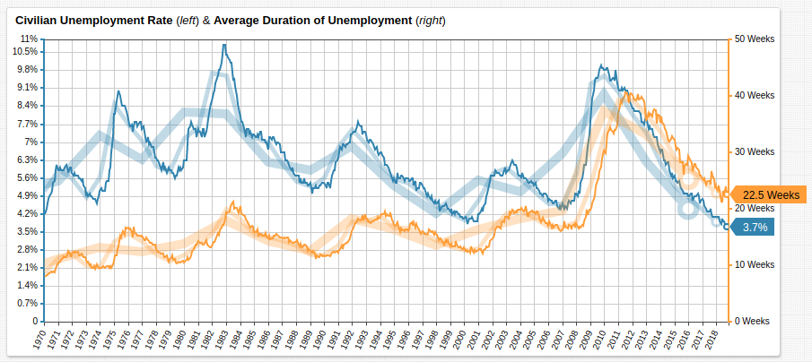
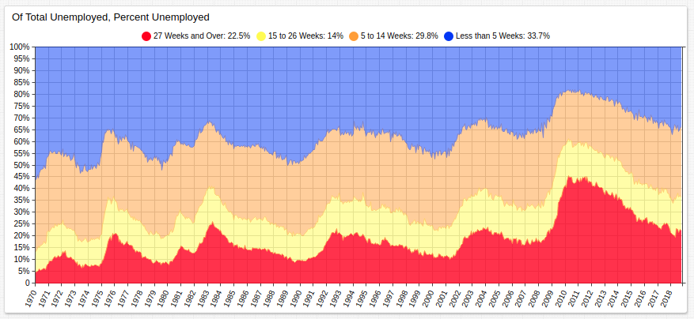
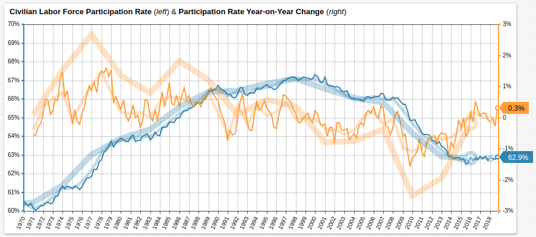

# The Obsolesce Problem

[](https://trends.axibase.com/4ba13d16#fullscreen)

> Although the civilian unemployment rate is lower than it has been in decades, average duration of unemployment has yet to fall below levels recorded in 2008 indicating that a portion of the population has been left behind during the economic recovery process.<br>Source: Federal Reserve database [FRED](https://fred.stlouisfed.org/)

## Overview

Despite a marked decrease in the overall unemployment rate of the nation, the amount of time the average jobless person remains as such is still greater than five months.<sup>[1](https://fredblog.stlouisfed.org/2018/11/the-unusual-duration-of-unemployment/)</sup> This phenomena is a double-edged sword: once a person self-identifies as no longer in search of employment, they are removed from the pool of citizens considered to be unemployed. Furthermore, the inherent dangers of remaining out of work for significant periods of time have grown exponentially in the information age. Large segments of the population who are not retrained to compete in modern marketplaces are rendered obsolete.<sup>[2](https://www.theatlantic.com/education/archive/2018/01/why-is-the-us-so-bad-at-protecting-workers-from-automation/549185/)</sup> This has serious implications for the not-too-distant future, when even cheap labor is achievable through automation.<sup>[3](https://hbr.org/2017/04/automation-makes-things-cheaper-so-why-doesnt-it-feel-that-way)</sup>

## Unemployment by Period

[](https://trends.axibase.com/6f4865e3#fullscreen)

> Those unemployed for more than 15 weeks (roughly 1 quarter) represent nearly 40% of the total.<br>Source: Federal Reserve database [FRED](https://fred.stlouisfed.org/)

True 0% unemployment is chimerical in nature. The perfectly responsive market would support a job for everyone who is able to perform one. An important distinction between that fantasy and reality is the concept of desire superceding the concept of ability; those who are not actively seeking a job, that is, those lacking the desire to work are not counted as unemployed from the moment they self-identify as no longer searching, whether or not they are physically and mentally able to perform one is not considered.<sup>[4](https://www.gobankingrates.com/making-money/economy/dangerously-close-zero-percent-unemployment/)</sup> As such, some level of unemployment is not a sign of an inherently weak market, or even an imperfectly responsive one. The more important metric is the nature of that unemployment which does exist.

The chart above visualizes the length of time those considered unemployed have been classified as such. In 2008, those unemployed for longer than a quarter represented around 35% of the total, within two years, that number was 60%. Since 2010, that percentage has fallen roughly 20 points to 38%, indicating that what can be undone in a relatively short time might just take a decade to repair.

## Business Phase Analysis

[ATSD](https://axibase.com/docs/atsd/), the database used for processing and storage tasks related to this article, includes [SQL Console](https://axibase.com/docs/atsd/sql/sql-console.html), which is used to query recession statistics and assess the severity of the so-called Great Recession against other incidents of prolonged economic downturn in recent U.S. history based on business cycle phases.<sup>[5](https://courses.lumenlearning.com/baycollege-introbusiness/chapter/reading-the-business-cycle-definition-and-phases/)</sup>

```sql
SELECT datetime AS "Peak Date", peak_to_trough.value AS "Peak to Trough", peak_from_previous_peak.value AS "Peak From Previous Peak", previous_trough_to_this_peak.value AS "Previous Trough to this Peak", trough_from_previous_trough.value AS "Trough From Previous Trough"
  FROM peak_to_trough
  JOIN peak_from_previous_peak
  JOIN previous_trough_to_this_peak
  JOIN trough_from_previous_trough
```

```ls
| Peak Date  | Peak to Trough | Peak From Previous Peak | Previous Trough to this Peak | Trough From Previous Trough |
|------------|----------------|-------------------------|------------------------------|-----------------------------|
| 1973-11-01 | 16             | 47                      | 36                           | 52                          |
| 1980-01-01 | 6              | 74                      | 58                           | 64                          |
| 1981-07-01 | 16             | 18                      | 12                           | 28                          |
| 1990-07-01 | 8              | 108                     | 92                           | 100                         |
| 2001-03-01 | 8              | 128                     | 120                          | 128                         |
| 2007-12-01 | 18             | 81                      | 73                           | 91                          |
```

> Source: National Bureau of Economic Research, [US Business Cycle Expansions and Contractions](https://www.nber.org/cycles.html)<sup>`*`</sup><br><sup>`*`</sup> Phases are recorded in months.

For comparison, average values for each phase are shown below:

```sql
SELECT  avg(peak_to_trough.value) AS "Peak to Trough", avg(peak_from_previous_peak.value) AS "Peak From Previous Peak", avg(previous_trough_to_this_peak.value) AS "Previous Trough to this Peak", avg(trough_from_previous_trough.value) AS "Trough From Previous Trough"
  FROM peak_to_trough
  JOIN peak_from_previous_peak
  JOIN previous_trough_to_this_peak
  JOIN trough_from_previous_trough
```

```ls
| Peak to Trough | Peak From Previous Peak | Previous Trough to this Peak | Trough From Previous Trough |
|----------------|-------------------------|------------------------------|-----------------------------|
| 12             | 76                      | 65                           | 77                          |
```

The Great Recession exceeded the average length of each phase for all recessions from 1970 to the present. The latter three phases represent the amount of time between certain points in any two recessions. An above average interval for each indicates that U.S. business cycles have been growing longer, but the duration of the recession was also longer than average. The fact that the recession represented a more serious downturn in a shorter amount of time after a long period of relative economic stability helps to explain its long-lasting effects on unemployment.

## Labor Force Participation

[](https://trends.axibase.com/63924ab9#fullscreen)

> Since 2010, labor force participation has diminished to its lowest levels since the late seventies. Although the three-year trend shows generally upward movement, the more short-term metrics indicate that the labor participation rate has remained mostly stable or in recent years.<br>Source: Federal Reserve database [FRED](https://fred.stlouisfed.org/series/CIVPART)

The essential metric to monitor in the coming months is the labor force participation rate. If unemployment continues to fall, and the civilian labor force participation rate falls along with it, the economy is not absorbing more workers, but rather, more workers are identifying as no longer a part of the labor force.

This scenario would also warp unemployment interval data, as more and more assumedly long-term jobless are removed from the **27 Weeks or more** pool. Herein lies dangerous rub: growth in short-term unemployment, stable labor force participation, and declining overall unemployment means that as new unemployed are added to the total, long-term unemployed are being removed. This phenomena creates the potential for large swathes of the American public to be economically left behind as the rapidly changing modern market place continues to evolve without them.

## The Problem Defined

As technology progresses rapidly, so too does the required rate of worker retraining. The first motorized vehicle was invented in 1885<sup>[6](https://www.daimler.com/company/tradition/company-history/1885-1886.html)</sup> and, along with an entire family of similar automobiles, was rendered obsolete little more than 20 years later with the debut of the Ford Model T in 1908<sup>[7](https://www.asme.org/about-asme/who-we-are/engineering-history/landmarks/233-model-t)</sup>.

Marketing executive [Geoff Hollingworth](https://datacatalyst.org/geoff-hollingworth/) claims that the knowledge and techniques taught to first year computer science students are obsolete by their third year of university.<sup>[8](https://www.ericsson.com/thinkingahead/the-networked-society-blog/2014/01/30/how-fast-is-our-world-becoming-obsolete/)</sup> In 100 years, the approximate rate at which cutting edge technology is rendered obsolete increased tenfold. Amplifying the problem, the former example is a market-level study while the latter is an education-level study. Retraining at the market level is understandably slower than at the education level, where retraining (or indeed, training in the first place) is the sole focus of the endeavor.

Apply this is trend to the 20% of the unemployed Americans who have been jobless for greater than 27 weeks. It is reasonable to anticipate that some proportion of this group will have already been rendered obsolete in the time it took them to find a new job. This may mean they stop looking for work altogether, or accept an entry-level position in a different field. The possible ramifications of large groups of Americans retraining in new fields is exacerbated by the increase in automation; formerly reliable entry-level jobs are disappearing each year.

The emergence of a rather grim economic paradigm whereby more and more Americans are pushed out of an increasingly rapidly evolving technocratic economy would bring about serious disparity in American wealth. The survival and prosperity of a property-owning middle class is one of the touchstones of a dominant American economy<sup>[9](https://www.pbs.org/wnet/civilization-west-and-rest/killer-apps/)</sup> and its suppression would challenge vital notions about the resilience of the American economy.