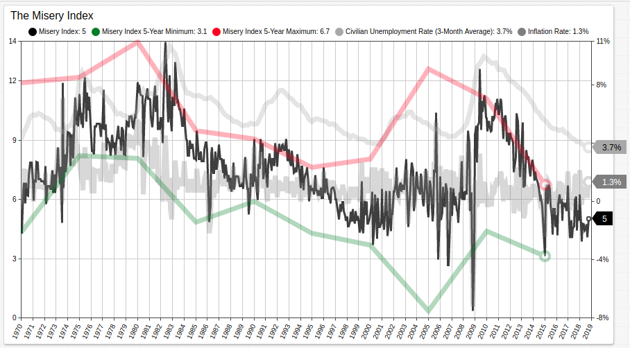

# The Misery Index, Revisited



[](https://trends.axibase.com/c07aa87d#fullscreen)

## Overview

The misery index is an economic metric which combines the inflation rate and unemployment rate to track the state of a particular economy. The derived metric was created by [Arthur Okun](https://www.brookings.edu/opinions/the-brookings-institutions-arthur-okun-father-of-the-misery-index/) in the seventies.

Currently, the misery index is at the lowest its been since the early 2000s.

## Misery Index by President

The [Streaming Table](https://axibase.com/docs/charts/widgets/streaming-table/) below tracks the misery index for the most recent four U.S. presidents using the [`time-offset`](https://axibase.com/docs/charts/widgets/shared/#time-offset) setting and a [`for`](https://axibase.com/docs/charts/syntax/control-structures.html#for) loop control structure.

```ls

```
