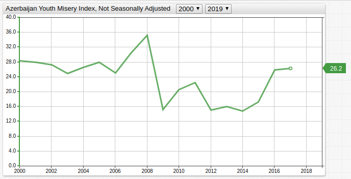

# The Misery Index, Revisited

## Overview

><b><big>*Misery Index*</big></b> = *Unemployment Rate (%)* + *Inflation Rate (%)*

* The Misery Index was created in the seventies by American economist [Arthur Okun](https://www.brookings.edu/opinions/the-brookings-institutions-arthur-okun-father-of-the-misery-index/) to track the combined values of unemployment and inflation.
* The Misery Index was created during the OPEC embargo on western nations, a period which saw both high inflation and high unemployment.<sup>[1](https://online.scu.edu.au/blog/what-is-stagflation-and-how-can-it-happen/)</sup>
* Typically, the Misery Index is considered during times of high inflation and unemployment.
* The index is used as a baseline from which to judge the overall state of an economy.

## Countries

* [Azerbaijan](#azerbaijan)
* [Canada](#canada)
* [France](#france)
* [Germany](#germany)
* [Israel](#israel)
* [Japan](#japan)
* [Libya](#libya)
* [Philippines](#philippines)
* [Poland](#poland)
* [Russia](#russia)
* [South Africa](#south-africa)
* [Switzerland](#switzerland)
* [United States](#united-states)

> Use the Trends [Reference](https://trends.axibase.com/public/reference.html) page to search for additional data and create a custom misery index for countries not included here.

## Graphics

### Azerbaijan

[](https://trends.axibase.com/532df7e1#fullscreen)



<!-- markdownlint-disable MD105 -->

Because only youth unemployment is tracked in [FRED](https://fred.stlouisfed.org/), the Federal Reserve database from which data is sourced, a so-called youth misery index is shown above.

<!-- markdownlint-disable MD105 -->

Azerbaijan has among the lowest youth unemployment rates in the Commonwealth of Independent States (CIS), a confederation of Eurasian former-Soviet states.<sup>[2](https://eeca.unfpa.org/sites/default/files/pub-pdf/Youth%20in%20CIS%20eng.pdf)</sup>

> Per FRED:<br><i>"Youth unemployment refers to the share of the labor force ages 15-24 without work but available for and seeking employment (modeled ILO estimate)."</i>

### Canada

[](https://trends.axibase.com/71ca5c35#fullscreen)


Canadian newspaper *The Globe and Mail* predicted a low score for the Misery Index north of the Frontière Internationale in 2015, attributing some of the success to low energy prices curbing inflation.<sup>[3](https://www.theglobeandmail.com/report-on-business/economy/canadas-misery-index/article25112820/)</sup>

Use a [user-defined function](https://axibase.com/docs/charts/syntax/udf.html) to track custom metrics using the underlying Misery Index data:

* Remove `/*` multi-line comment `*/` surrounding derived `[series]`; click **Run**.

  ```ls
  /*
   [series]
     value = fred.PercentChangeFromYearAgo('mi')
     axis = right
     color = black
     style = opacity: 0.5;stroke-width:2
     format = percent
  */
  ```

* If necessary, replace `PercentChangeFromYearAgo()` function with any [included function](https://axibase.com/docs/charts/syntax/udf.html#examples).

### France

[](https://trends.axibase.com/0b09f1eb#fullscreen)


French data is only stored for the period 1996-2018. Using [SQL Console](https://axibase.com/docs/atsd/sql/sql-console.html) to query the data shows a significant gap in the value of unemployment and inflation.

```sql
SELECT datetime, (((inflation.value/LAG(inflation.value))-1)*100) AS "Inflation", unemployment.value AS "Unemployment", (((inflation.value/LAG(inflation.value))-1)*100) + unemployment.value AS "Misery Index"
  FROM LRUN74TTFRA156N AS unemployment
  JOIN FRACPIHICAINMEI AS inflation
WHERE datetime > '1995-01-01'
```

<details><summary>Expand this section to view query results.</summary>

```txt
| datetime   | Inflation | Unemployment | Misery Index |
|------------|-----------|--------------|--------------|
| 1996-01-01 | 1.05      | 10.56        | 11.61         |
| 1997-01-01 | 1.27      | 10.72        | 11.98        |
| 1998-01-01 | 0.69      | 10.29        | 10.97        |
| 1999-01-01 | 0.56      | 9.98         | 10.55        |
| 2000-01-01 | 1.82      | 8.53         | 10.35        |
| 2001-01-01 | 1.78      | 7.74         | 9.52         |
| 2002-01-01 | 1.93      | 7.88         | 9.81         |
| 2003-01-01 | 2.18      | 8.12         | 10.31        |
| 2004-01-01 | 2.33      | 8.47         | 10.80        |
| 2005-01-01 | 1.90      | 8.50         | 10.40        |
| 2006-01-01 | 1.89      | 8.45         | 10.34        |
| 2007-01-01 | 1.61      | 7.65         | 9.26         |
| 2008-01-01 | 3.15      | 7.08         | 10.23        |
| 2009-01-01 | 0.11      | 8.72         | 8.83         |
| 2010-01-01 | 1.74      | 8.85         | 10.59        |
| 2011-01-01 | 2.29      | 8.80         | 11.09        |
| 2012-01-01 | 2.21      | 9.40         | 11.61        |
| 2013-01-01 | 1.00      | 9.93         | 10.92        |
| 2014-01-01 | 0.60      | 10.32        | 10.93        |
| 2015-01-01 | 0.09      | 10.38        | 10.47        |
| 2016-01-01 | 0.31      | 10.05        | 10.36        |
| 2017-01-01 | 1.16      | 9.40         | 10.56        |
```

</details>

To view this discrepancy in the original visualization, hide the `display` settings for series `unemp` and `inf`.

```ls
[series]
  alias = unemp
  # display = false
  # hide the display setting using the single-line comment hash symbol
```

<details><summary>View the modified chart here, which includes unemployment, inflation, and misery index data together.</summary>

[](https://trends.axibase.com/8e1eb8e9#fullscreen)

</details>

### Germany


Before 3 October 1990, Germany was partitioned into two independent countries: the German Democratic Republic and the German Federal Republic.

As the Cold War came to a close and Germany reunified, disparate capitalist and Communist economies became one with some friction.<sup>[4](https://u.osu.edu/eng4400portermaldonado/economics-effect/)</sup> The pre-unification misery index value of 9.0 would not be seen again until 2008.

### Israel

[](https://trends.axibase.com/2e8c0e01#fullscreen)


The New Israeli Shekel was introduced in 1986 at a rate of 1000:1 against the hyperinflated old shekel. The original shekel was introduced in 1980 at a rate of 10:1 against the Israeli Pound, which was a holdover currency from the British Mandate of Palestine.<sup>[5](https://www.boi.org.il/en/Currency/PastNotesAndCoinsSeries/Pages/Default.aspx)</sup>

The effects of both currency overhauls, and their effects relative to one another are visible in the Israel Misery Index chart.

### Japan


As mentioned above, the misery index was created during the Energy Crisis of 1973. At the time Japan had the world's third largest economy and consumed the second most oil, as such the country was severely impacted by the OPEC oil embargo.<sup>[6](https://www.nytimes.com/1973/12/08/archives/japan-braces-for-a-fullscale-oil-crisis-japan-whose-busy-economy.html)</sup>

Reduce the high cardinality of the set with [aggregator functions](https://axibase.com/docs/charts/configuration/aggregators.html#aggregators).

```ls
[series]
  metric = LRHUTTTTJPM156S
  #statistics = avg
  #period = 3 month
  #period = 1 year
  #period = 5 year

/*
remove the # single-line comment for the statistics settings, and one of the periods defined above to reduce cardinality
*/
```

<details><summary>View a combined chart for each period (click image to inspect configuration).</summary>

[](https://trends.axibase.com/11f03527#fullscreen)

</details>

### Libya

[](https://trends.axibase.com/39be9446#fullscreen)


> Note that only Libyan youth unemployment is tracked in FRED.

The foundation of the Libyan Arab Republic via military coup under Muammar Gaddafi in 1969 was a revolution with international implications. Colonel Gaddafi was implicated in secretly supporting the IRA, accused of orchestrating the Lockerbie plane bombing, and guilty of ordering an attack on the West German nightclub *La Belle* during the eighties.<sup>[7](https://www.bbc.com/news/world-africa-13755445)</sup> Western leaders, led by Ronald Reagan, responded harshly and ordered multiple bombing attacks on the country in retaliation.

During the early 2000s, UN sanctions were lifted from Libya in response to state admission of guilt in the Lockerbie case, and a promise to pay $2.7 billion in reparations.

### Philippines

[](https://trends.axibase.com/af4026b4#fullscreen)


Since the spike in the youth misery index in 1986 correlating to the foundation of the Fifth Philippines Republic, the value has declined significantly.

### Poland

[](https://trends.axibase.com/c41f969d#fullscreen)


Decommunization of Poland was tied to 251.1% inflation in 1989 and 585.3% inflation in 1990.<sup>[8](http://documents.worldbank.org/curated/en/956061468763176263/Relative-prices-and-inflation-in-Poland-1989-97-the-special-role-of-administered-price-increases)</sup> These huge amounts of inflation skew the [Time Chart](https://axibase.com/docs/charts/widgets/time-chart/) range.

Control the maximum and minimum boundaries for data with high variance using the [`max-range-force`](https://axibase.com/docs/charts/widgets/shared/#max-range-force) or [`min-range-force`](https://axibase.com/docs/charts/widgets/shared/#min-range-force) settings.

```ls
[widget]
  max-range-force = 100
```

<details><summary>View the Poland Misery Index visualization with the <code>max-range-force = 100</code> setting applied.</summary>

[](https://trends.axibase.com/5596a917#fullscreen)

</details>

### Russia

[](https://trends.axibase.com/edaba992#fullscreen)


The effects of the 1998 Russian financial crisis are visible; the currency was greatly devalued resulting in soaring inflation and the government issued a moratorium on foreign debt obligation repayments on 17 August 1998.<sup>[9](https://files.stlouisfed.org/files/htdocs/publications/review/02/11/ChiodoOwyang.pdf)</sup>

The [`color`](https://axibase.com/docs/charts/widgets/shared/#color) setting accepts [web color](https://en.wikipedia.org/wiki/Web_colors) names or hex codes; use exact colors when needed, such as the [official colors](https://www.prlib.ru/en/history/619479) of the Russian flag. Because one of the colors is white (`#FFFFFF`), use [portal themes](https://axibase.com/docs/atsd/portals/portals-overview.html#portal-themes) to ensure it is visible.

<details><summary>View the tripart, tricolor chart.</summary>

[](https://trends.axibase.com/207342ed#fullscreen)

</details>

### South Africa


South Africa is plagued with high unemployment in general, and specifically among youth.<sup>[10](http://www.statssa.gov.za/?p=11129)</sup> Both general and youth unemployment are tracked in FRED and stored in [ATSD](https://axibase.com/docs/atsd/). Each unemployment series is assigned a unique [`alias`](https://axibase.com/docs/charts/widgets/shared/#alias) setting.

```ls
[series]
  metric = LRUN64TTZAQ156S
  alias = unemp
# overall unemployment  

[series]
  metric = SLUEM1524ZSZAF
  alias = y-unemp
# youth unemployment
```

<details><summary>Compare youth and general Misery Index for South Africa (click image to open configuration)</summary>

[](https://trends.axibase.com/c24d618c#fullscreen)

</details>

### Switzerland

[](https://trends.axibase.com/dd40866c#fullscreen)


Tied with [Japan](#japan) for lowest misery index value at present, Switzerland has the second highest per capita GDP in the world. Roughly 74% of the Swiss economy is tied to the service sector, with European Union nations being the country's primary trading partners.<sup>[11](https://www.eda.admin.ch/aboutswitzerland/en/home/wirtschaft/uebersicht/wirtschaft---fakten-und-zahlen.html)</sup>

### United States

[](https://trends.axibase.com/8c6b6ac8#fullscreen)


Use the [drop-down lists](https://axibase.com/docs/charts/configuration/drop-down-lists.html) in the widget header to navigate through time, for example, to observe the index value during the term of a specific president; expand the link below to see the Misery Index for the presidency of Barack Obama.

<details><summary>Misery Index for <b>President Obama</b> (click image to open configuration)</summary>

[](https://trends.axibase.com/9520db11#fullscreen)

</details>