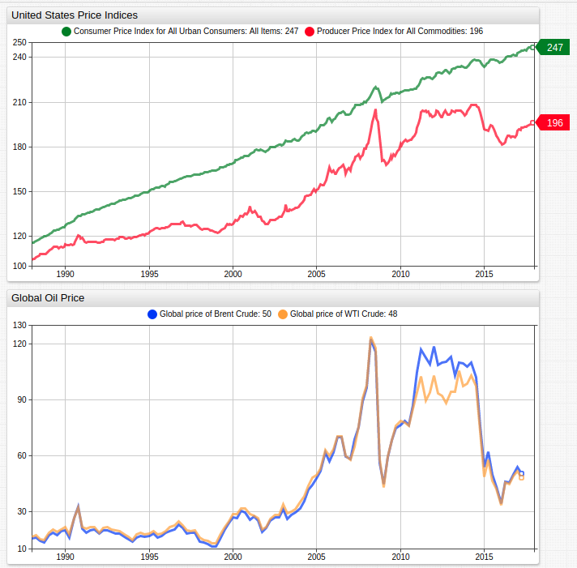
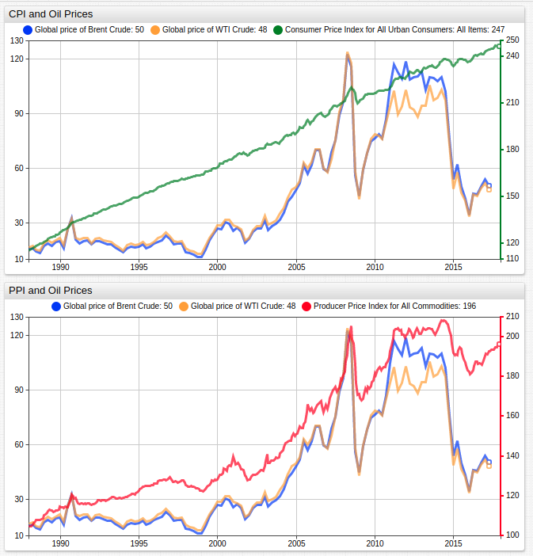

# The Effects of Oil Prices on Inflation

## Overview

* Inflation is tracked with two metrics primarily: consumer price index (CPI) and producer price index (PPI).
  * Each series is indexed for the year 1982.
  * CPI roughly tracks the cost of a hypothetical basket of goods at the consumer level whereas PPI tracks the same basket of goods at the producer level.
* Fluctuations in oil prices have a far greater correlation to PPI than to CPI.
  * The transportation costs of goods to their final sales markets are included in producer price index rather than consumer price index, explain this relationship.

## Graphics

### Grouped by Metric

[](https://trends.axibase.com/363b5710#fullscreen)



### Grouped by Index

[](https://trends.axibase.com/3bd070da#fullscreen)



## Syntax Features

* Hide [`pointer-position`](https://axibase.com/docs/charts/widgets/time-chart/#pointer-position) for series with similar values.

```ls
pointer-position = false
```

* Dual [`axis`](https://axibase.com/docs/charts/widgets/shared/#axis) to display unlike data.

```ls
axis = right
```

* Series [`style`](https://axibase.com/docs/charts/widgets/shared/#widget-style) to customize visualization.

```ls
style = opacity: 0.7; stroke-width: 3
```