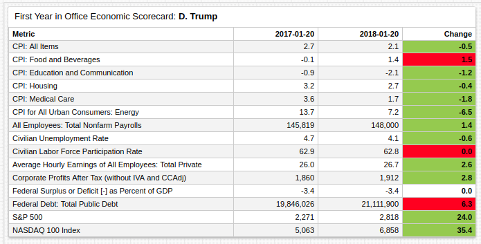
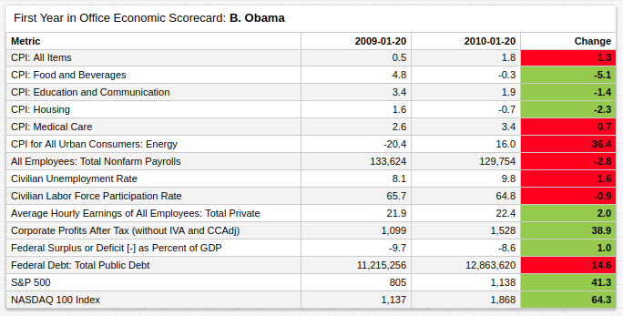
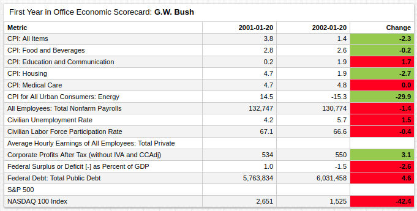
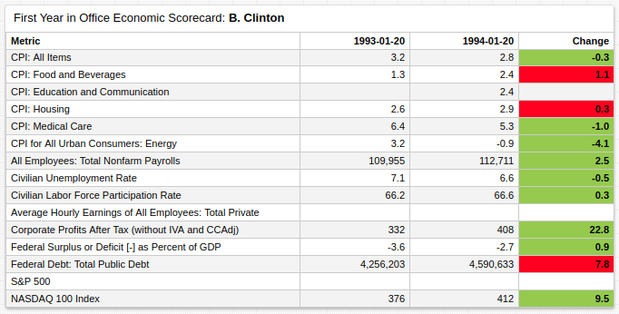

# Presidential Economic Trends

## Contents

* [Overview](#overview)
* [Metrics](#metrics)
* [First Year in Office Economic Scorecard](#first-year-in-office-economic-scorecard)
  * [Donald Trump](#donald-trump)
  * [Barack Obama](#barack-obama)
  * [George W. Bush](#george-w-bush)
  * [Bill Clinton](#bill-clinton)
* [Conclusion](#conclusion)
* [Resources](#resources)

## Overview

Setting aside presidential politics is difficult, but economic analysis requires the effort. The problem inherent in the distribution and usage of scarce resources knows no political party or system, and leaves no room for partisanship. There is only data which either supports or detracts from a given hypothesis.

> <i>"We have always known that heedless self interest was bad morals, we now know that it is bad economics."</i> Franklin Delano Roosevelt [1](http://avalon.law.yale.edu/20th_century/froos2.asp)

Conversely, capturing the full breadth of a country's economic situation using only statistics is likewise impossible as the president's role is inherently and simultaneously social, political, and economic. That is, what they try to accomplish socially, how well they are able to accomplish that which they set out to do politically, and finally, how these endeavors affect change economically.

Indeed, with these three metrics, a presidential term can be viewed empirically and concrete measurements such as those related to the economy, can serve as a foundation for other areas obscured by the subjective and opaque nature of social and political progress. As the Bill Clinton campaign led by political strategist James Carville famously pointed out, ["it's the economy, stupid."](https://en.wikipedia.org/wiki/It%27s_the_economy,_stupid)

## Metrics

Economic data is sourced from the Federal Reserve economic database [FRED](https://fred.stlouisfed.org/), stored in [ATSD](https://axibase.com/docs/atsd/), and visualized using the public-facing [Trends](../../tutorials/shared/trends.md) visualization tool. Each metric is enumerated in the table below along with its database identification name, definition, and a link to a Trends visualization.

Metric | ID | Description| &nbsp;
--|--|--|--
CPI: All Items | `CPIEALL` | Experimental CPI value for a basket of all categories of goods. | [↗](https://trends.axibase.com/3ba91982#fullscreen)
CPI: Food and Beverages | `CPIEBEV` | Experimental CPI value for a basket of good categorized as **Food and Beverages**. | [↗](https://trends.axibase.com/3a3a3f03#fullscreen)
CPI: Education and Communication | `CPIECOMEDU` | Experimental CPI value for a basket of good categorized as **Education and Communication**. | [↗](https://trends.axibase.com/a421e6bb#fullscreen)
CPI: Housing | `CPIEHOUSE` | Experimental CPI value for a basket of good categorized as **Housing**. | [↗](https://trends.axibase.com/279530c6#fullscreen)
CPI: Medical Care | `CPIEMEDCARE` | Experimental CPI value for a basket of good categorized as **Medical Care**. | [↗](https://trends.axibase.com/4870decd#fullscreen)
CPI for All Urban Consumers: Energy | `CPIENGSL` | Experimental CPI value for a basket of good categorized as **Energy**. | [↗](https://trends.axibase.com/2602b23d#fullscreen)
All Employees: Total Nonfarm Payrolls | `PAYEMS` | A measure of the number of US workers in the economy that excludes proprietors, private household employees, unpaid volunteers, farm employees, and the unincorporated self-employed. | [↗](https://trends.axibase.com/b21c455d#fullscreen)
Civilian Unemployment Rate | `UNRATE` | The unemployment rate represents the number of unemployed as a percentage of the labor force. | [↗](https://trends.axibase.com/3afeeacc#fullscreen) |
Civilian Labor Force Participation Rate | `CIVPART` | The percentage of eligible civilians participating in the labor force. | [↗](https://trends.axibase.com/4037ff39#fullscreen)
Average Hourly Earnings of All Employees: Total Private | `CES0500000003` | Average hourly earnings for all employees. | [↗](https://trends.axibase.com/ac341e0c#fullscreen)
Corporate Profits After Tax (without IVA and CCAdj) | `CP` | Corporate profits after tax without corporate capital adjustments. | [↗](https://trends.axibase.com/9265ac0b#fullscreen)
Federal Surplus or Deficit [-] as Percent of GDP | `FYFSGDA188S` | Percent of overall GDP an annual budget represents. | [↗](https://trends.axibase.com/5c7bfa4f#fullscreen)
S&P 500 | `SP500` | Standard and Poor's 500 stock market index. | [↗](https://trends.axibase.com/97a250da#fullscreen)
NASDAQ 100 Index | `NASDAQ100` | Market capitalization-weighted index, which tracks the value of equities issued by 100 of the largest non-financial companies listed on the NASDAQ stock exchange. | [↗](https://trends.axibase.com/b1280136#fullscreen)

### Methodology

Each metric is either tracked with the function [`PercentChangeFromYearAgo`](https://axibase.com/docs/charts/syntax/udf.html#examples) to create two dynamic values which can be compared, or compared in its underlying format.

Each derived value represents a trend at a particular point in time. To compare presidential performance in each field, the two points in time are 20 January the year a particular president was elected (i.e. their inauguration date), and 20 January the following year. As such, each value encapsulates not only the metric itself, but any inertia as well. Thus, a president who is able to maintain falling unemployment rates is more objectively comparable to a president who was able to reverse growing unemployment.

## First Year in Office Economic Scorecard

A president's first year in office is among the most important, if such a comparison can be made. Politically, they are tasked with forming an administration; socially, the promises which got them elected are now potential policy, and economically, the results of their political and social calculus must face the light of day as the ultimate results of their aforementioned machinations are put to the test.

<!-- markdownlint-disable MD105 -->

> <i>"All this will not be finished in the first one hundred days. Nor will it be finished in the first one thousand days... nor even perhaps in our lifetime on this planet. But let us begin."</i> John F. Kennedy [2](https://www.jfklibrary.org/learn/about-jfk/historic-speeches/inaugural-address)

<!-- markdownlint-enable MD105 -->

### Donald Trump

Other than **Food and Beverages** every CPI basket of goods, including the **All Items** basket which tracks overall prices, each iteration of the consumer price index diminished during the observed interval. CPI is an inflation index whereby relative costs are placed on a 100-point scale and assigned a value based on their value relative to the index year. The Federal Reserve uses December 1982 as the index date. Despite the generalized decrease in inflation, the value represents a continuation of the overall arc of inflation change, albeit featuring a slight acceleration in its rate of decrease.

With respect to the labor market, all metrics excluding **Civilian Labor Force Participation Rate**, improved during President Trump's first year. This is a small but crucial area which lacks improvement as unemployment figures consider the participation rate when determining whether or not a person is unemployed. A slight decrease in the participation rate paired with a slight decrease in unemployment is ostensibly no change, as the overall number of civilians considered unemployed decreased.

With respect to balancing the budget, President Trump's first term has been a continuation of past American presidents' habit of borrowing funds early in the hopes of generating revenue later to fill loose ends in the overall budget. The federal debt was increased by more than six percent.

The stock market has been the most consistent and tangible area of growth during the Trump presidency thus far. Both markets tracked in the scorecard above grew more than 20% during the administration's first 365 days.

### Barack Obama

Despite significant decreases in the certain areas of the consumer price index, specifically **Food and Beverages** and **Housing** costs where the erstwhile growing trend was not only halted but reversed, the impact of the Great Recession which is generally considered to have begun with the 2008 financial crisis resulted in a net increase in overall inflation. [3](http://knowledge.wharton.upenn.edu/article/great-recession-american-dream/) Especially hard hit was the energy sector, whereby decreasing energy costs of energy were monumentally reversed and grew over 30% in just a year. Worth noting is the 77% growth in the same metric from July 2007 to July 2008 at the end of George W. Bush's second term as president.

Unsurprisingly, a second victim of the global economic downturn was the labor market. Although the amount that this growth can be attributed to President Obama is debatable. Unemployment indeed grew, but in an atmosphere of ongoing unemployment growth, only a portion of the increase can be attributed to Obama-era policy.

The main sticking point of President Obama's presidency, and indeed, a likely factor in how it will be reflected upon in the future, was the massive increase in the federal debt. In just the first year of his administration, the total public debt grew nearly 15%, and by the end of his eight-year two-term presidency, had more than doubled. [4](http://www.crfb.org/blogs/has-president-obama-doubled-national-debt) After such monumental growth, the debt-to-GDP ratio exceeded 100% for the first time in United States history.

### George W. Bush

The beginning of the economic collapse which would come to be known as the Great Recession, which followed a costly and opaquely successful war in Iraq, which began after the successful but nominally separate conflict in Afghanistan, which was started in response to the September 11th attack on America, which was perpetrated under the auspices of a former US aid beneficiary, Osama Bin Laden, and at the hands of citizens from an allied nation, Saudi Arabia. The George W. Bush presidency will undoubtedly go down in history as a turbulent and sometimes confused period of American history.

Perhaps more telling of the overall economic health of the country as a whole instead of the legacy of George W. Bush, the **First Year in Office Economic Scorecard** shows just how hard hit the country was following the fall of the World Trade Centers. Employment and labor force participation both decreased, and stock markets lost significant value [5](https://files.stlouisfed.org/files/htdocs/publications/review/04/03/Neely.pdf). Indeed, the NASDAQ 100 Index fell nearly 50% during 2001.

If any positive economic indicators can be drawn from the first year of the Bush presidency, it is the dramatic reduction in energy costs. Previously growing at a rate of 14.5% a year, Bush's first year saw that value fall almost 30% to -15.3% by 2002. The [Federation of American Scientists](https://fas.org/) attributed this rapid turnaround in pricing (which in fact, was a continuation of a trend which had begun several months earlier) to the ability of international markets to freely trade on oil-based assets despite the temporary closure of the New York Mercantile Exchange [6](https://fas.org/irp/crs/RL31617.pdf) following September 11th.

### Bill Clinton

President Clinton's greatest economic achievement must surely be his legacy as the only president in recent American history to attain a budget surplus for not just one, but four consecutive fiscal years. [7](https://www.nytimes.com/1998/10/01/us/fiscal-year-ends-with-us-surplus-first-in-3-decades.html) As the US collectively ponders the more than $20 trillion in debt facing the country at present, waxing nostalgic for the late 90s US economy is not difficult; nearly every CPI basket of goods became less expensive during President Clinton's first year. Likewise, amidst wide-reaching tax hikes, namely the [Omnibus Budget Reconciliation Act](https://www.congress.gov/bill/103rd-congress/house-bill/2264), President Clinton's first year recorded more than a 20% increase in corporate profits after tax. In fact, corporate profits after taxes continued to increase demonstrably until 1997.

The Clinton era is generally viewed as peacetime for the United States, with little foreign policy in the Middle East and NATO command of the intervention in the former Yugoslavia, President Clinton was able to focus his efforts on primarily domestic issues, such as the budget and tax reform. Despite some hostility with Iran and Iraq, the Clinton position of dual containment towards the traditionally antagonistic powers sought to minimize US involvement in historically convoluted conflicts. [8](https://www.mepc.org/node/4827)

## Conclusion

> <i>"The only real radicalism in our time will come as it always has— From people who insist on thinking for themselves and who reject party-mindedness."</i> Christopher Hitchens [9](https://historynewsnetwork.org/article/1881)

History shows that simply being President of the United States is not enough to make the economy of the country bend to your will. Implementing coherent policy, maintaining international stability though treaties and deterrence, and sound fiscal practices have proven time and time again to be the only consistent solution.

The irony of dichotomy is the inability of either subset to recognize the tangible successes, or indeed, to accept the circumstances surrounding any particular failure of an antagonist.

## Resources

* To view the complete **First Year in Office Economic Scorecard** portal, visit [Trends](https://trends.axibase.com/e306a37b#fullscreen). Inspect portal configuration by clicking **Editor** to expand the configuration pane.
* Refer to the [Creating a Custom Report With ATSD and Charts](../../tutorials/create-report/README.md) tutorial for more information about creating this or similar reports.
* For more information about using Trends, see the [Using Trends](../../tutorials/shared/trends.md) tutorial.