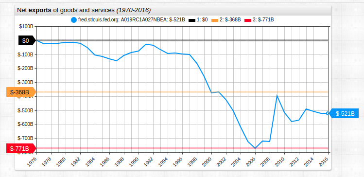
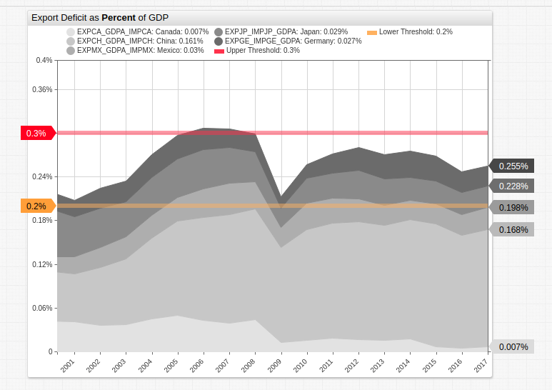
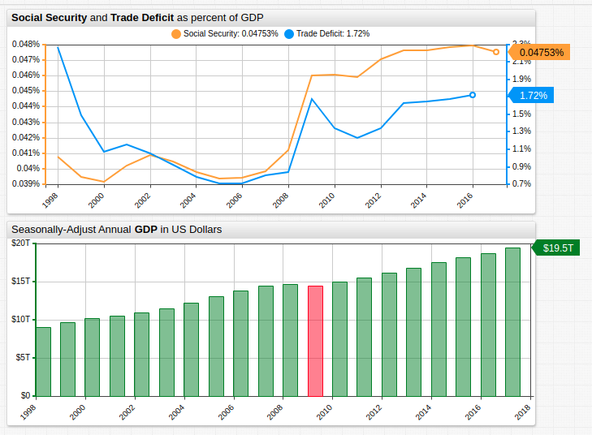
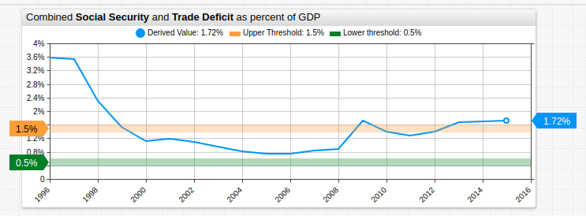
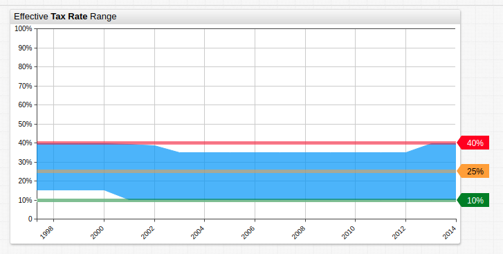
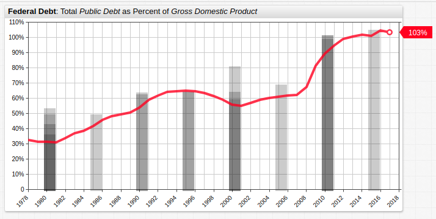

# The Importance of Correcting a Trade Deficit



[](https://trends.axibase.com/a5bd447d#fullscreen)

## Overview

The United States faces an unprecedented national debt of more than [$21 trillion](http://www.usdebtclock.org/). Among the largest contributors to the annual budget deficit are entitlements programs like Social Security, Medicare, and Medicaid (roughly $3.5 trillion each year). Despite this, the areas which consistently receive the most attention remain military spending (roughly $600 billion per year), trade deficits (roughly $520 billion per year), foreign aid (roughly $50.1 billion each year), and education (roughly $670 billion each year).

<!-- markdownlint-disable MD101 -->

Over the last twenty years, net exports of goods and services have stabilized from a two-decade high of $-368 billion and two-decade low of $-711 billion close to the median value of those two parameters, tracked by the [Federal Reserve Economic Research Division](https://fred.stlouisfed.org/): $-521 billion (true median value: $-539.5 billion).

<!-- markdownlint-enable MD101 -->

## Relationship to GDP



[](https://trends.axibase.com/d5a0036c#fullscreen)

The bulk of the trade deficit is generated by five countries: Canada, China, Mexico, Japan, and Germany. The deficit generated among those nations represents 0.2% to 0.3% of annual GDP in the last two decades.

President Trump is a proponent and enactor of trade sanctions against China and was recently successful in the renegotiation of [NAFTA](http://www.naftanow.org/), rebranded as the [USMCA](https://ustr.gov/trade-agreements/free-trade-agreements/united-states-mexico-canada-agreement) with Canada and Mexico in an effort to correct the imbalance.

The chart above features derived values representing the difference between imports and exports for a given country, expressed as the percentage of that year's gross domestic product.

```ls
value = [value('export') - value('import')] / value('gdp')
```

For access to these datasets and a tutorial about creating the series used above, refer to the [FRED Blog](https://fredblog.stlouisfed.org/2018/10/the-usual-suspects-behind-u-s-trade-deficits-china-canada-mexico-japan-and-germany/). Alternatively, use the [`/resources`](./resources/country-specific-trade.csv) directory to download any data from this article.

## Entitlements

The casual relationship between entitlements programs, the trade deficit and overall economic production is shown below. The single year in recent history with negative GDP growth (highlighted <text style="color:red;">red</text> below), correlates to the largest single-year increase in both trade deficit and entitlement expenditures.



[](https://trends.axibase.com/5e511ca2#fullscreen)

> **Note**: Datasets are displayed on independent axes.

The primary difference between entitlements programs and trade deficits, is that the former is subsidized by various taxes while the latter directly impacts GDP. The result is that although the absolute difference between entitlements outlays and those associated with trade deficit is quite significant, the real costs are much smaller when relativity to annual GDP is considered.

The visualization above displays two derived series. The percent value of each year's GDP invested by the government on Social Security, "includ[ing] old-age, survivors, and disability insurance benefits," is shown to be a fraction of what is spent balancing the trade budget.

```ls
## Net exports of goods and services
[series]
  metric = W823RC1
  alias = s001
## Gross domestic product
[series]
  metric = GDP
  alias = s002
## Derived series
 [series]
   value = value('s001') / value('s002')
```



[](https://trends.axibase.com/44b0f6a1#fullscreen)

If the United States could sustain a decreased trade deficit and increase revenue which could be put towards relieving Social Security expenditures, making meaningful headway against the imposing national debt could become tangibly easier.

## The Role of Tax Reform

Among the President's most self-lauded endeavors was his move for tax reform. The [Tax Cuts and Jobs Act of 2017](https://www.congress.gov/bill/115th-congress/house-bill/1) primarily sought to reduce corporate tax burdens and restructure the individual tax code.



[](https://trends.axibase.com/edc3ed20#fullscreen)

The range between the highest and lowest tax brackets' effective tax rate is shown above. The contingencies of the TCJA stipulate that the upper bound of effective tax rate is reduced to 37%, while the lower bound remains constant at 10%. The concession made to lower income brackets is the doubling of the standard deduction, which is more frequently used than itemized deductions. This guarantees more money remains untaxed.

Some economists argue that lower tax rates result in increased tax revenue, as corporations and individuals are less compelled to itemize deductions. This concept is often debated by modifying a [Laffer Curve](https://en.wikipedia.org/wiki/Laffer_curve).

## Ratio of National Debt to GDP



[](https://trends.axibase.com/6d940ff5#fullscreen)

```ls
## Define metric and statistical aggregation function
[widget]
  statistic = avg
  metric = GFDEGDQ188S
## Each series aggregates data by a unique period.
  [series]
    period = 1 year
  [series]
    period = 5 year
  [series]
    period = 10 year  
  [series]
    period = 15 year
  [series]
    period = 20 year
```

The federal debt doubled with the passage of the [American Recovery and Reinvestment Act](https://www.congress.gov/bill/111th-congress/house-bill/1/text) and, for the first time in US history, exceeded gross domestic product. Since the effects of the recession have subsided the otherwise sharp upward growth of this ratio has been arrested somewhat. Nonetheless, greater than 100% debt to GDP remains.

Debt growth by periodic average value was most significant during the 2000s and most severe in 2010.

## Effects of Reduction

Of the expenditures mentioned in the introduction, trade deficit and entitlements programs only represent 1.72% of annual GDP. The complete elimination of both would leave the United States with a GDP-to-debt ratio greater than 100%.

Indeed, the government is likely on the verge of being forced to reduce spending in education or military areas in the near future. The latter has already occurred in the form of the [Budget Control Act of 2011](https://dod.defense.gov/News/Article/Article/694480/sequestration-poses-biggest-threat-to-readiness-military-leaders-say/), but could become an even greater undercut to American foreign policy if continued or expanded upon.

Unfortunately, the kinds of economic trends observed today are a repetition of those from antiquity. [Quantitative easing](https://www.federalreserve.gov/econres/feds/files/2018004pap.pdf) was hypothesized to be the solution to the out-of-control bond market, which had been leveraged to $51 trillion, and was rapidly deteriorating during the Great Recession. Nearly 2000 years ago in 33 AD, the Roman emperor Tiberius used an almost [identical strategy](https://www.businessinsider.com/qe-in-the-financial-crisis-of-33-ad-2013-10) to forestall the ultimate collapse of the Roman economy inherited by his successor. Shortly after Tiberius' heir and grand-nephew Caligula assumed the throne, the empire was again wracked with a [financial crisis and empire-wide famine](https://en.wikipedia.org/wiki/Caligula#Financial_crisis_and_famine).

> <i>"[T]hat it is the task of the conservative not to defeat but to forestall revolutions, that a society which cannot prevent a revolution, will not be able to defeat it by conservative means, [and] that order once shattered can be restored only by the experience of chaos."</i> Klemens von Metternich