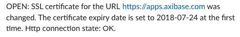
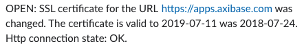
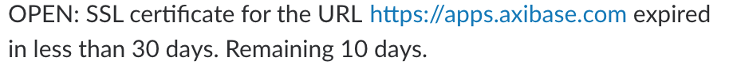

# How to Monitor SSL Certificates Expiry Dates for subdomains

## Overview

[Axibase Collector](https://github.com/axibase/axibase-collector/#overview) provides tools to collect information about SSL certificates. The data stored in ATSD is useful to monitor SSL certificates for the subdomains of a top domain and notify a user via [Slack](https://axibase.com/docs/atsd/api/data/messages/webhook.html#slack) using web notifications triggered by the [Rule Engine](https://github.com/axibase/atsd/tree/master/rule-engine#overview) that notify when a certificate expiry date is approaching or modified. Query a list of domains using SQL in the [CRT Certificate Search](https://crt.sh) portal created by [Comodo Group](https://www.comodo.com).

### Tools and resources

This tutorial uses the following tools:

* [`crt.sh`](https://crt.sh): Certificate search engine to retrieve information about SSL certificates issued by Comodo Group. The portal provides open access to their database.
* [`atsd-sandbox`](https://github.com/axibase/dockers/tree/atsd-sandbox#overview) - Docker image running *ATSD* and *Collector* on one machine.

## Procedure

1. [Prepare job and rules for domain](#prepare-files-for-domain).
2. [Configure and launch ATSD Sandbox](#configure-and-launch-atsd-sandbox).
3. [Begin receiving notifications](#receive-notification).

### Prepare Files for Domain

Create a directory to store tutorial files and navigate to the newly created directory from the terminal.

```bash
mkdir tutorial && cd ./tutorial
```

### Configure Slack Notifications

ATSD Sandbox can pass a path to a file containing web notification properties as the parameters.
Specify Bot User OAuth Access `token` and `channels` for notifications in `slack.properties` file.

```bash
touch slack.properties && printf "token=xoxb-************-************************\nchannels=general\n" > slack.properties
```

> See [Web Notifications Documentation](https://github.com/axibase/dockers/tree/atsd-sandbox#web-notifications-configuration) for more information.

### Configure and Launch ATSD Sandbox

Job file contains placeholder `${ENV.TOP_DOMAIN}` instead of a real domain name. Set `TOP_DOMAIN` environment variable to an actual domain name. Collector replaces the placeholder with variable name during the import process. In the launch command shown below, `TOP.DOMAIN` is set to [axibase.com](https://axibase.com).

Start ATSD Sandbox with the required [environment variables](https://github.com/axibase/dockers/tree/atsd-sandbox#container-parameters):

```bash
docker run -d -p 8443:8443 -p 9443:9443 -p 8081:8081 \
  --name=atsd-sandbox \
  --volume $(pwd):/import \
  --env TOP_DOMAIN=axibase.com \
  --env ATSD_IMPORT_PATH='https://raw.githubusercontent.com/axibase/atsd-use-cases/dev-howto-monitor-ssl-for-domains/how-to/atsd-sandbox/monitor-ssl-expiry-dates/resources/ssl-certificates-files.tar.gz' \
  --env COLLECTOR_IMPORT_PATH='https://raw.githubusercontent.com/axibase/atsd-use-cases/dev-howto-monitor-ssl-for-domains/how-to/atsd-sandbox/monitor-ssl-expiry-dates/resources/job_http_subdomains-ssl-certificates.xml' \
  --env SLACK_CONFIG="slack.properties" \
  axibase/atsd-sandbox:latest
```

### Receive Notifications

ATSD sends a test notification to Slack upon successful launch.


Collector starts the imported monitoring job and imports the data into ATSD. The database sends a message with the certificate expiry date of the monitored domain.

 

Upon modification of SSL certificate expiry date, the database sends the following message:



If less than 30 days remain before SSL certificate expiry date, the database sends the following message:



## Troubleshooting

In the case of unsuccessful launch, review ATSD Sandbox `start.log` file.

```bash
docker logs atsd-sandbox
```
