# Analyzing Econometric Datasets with Calculated Series


## Summary

Use [calculated values](../add-calculated-value/README.md) in [**ChartLab**](https://apps.axibase.com/chartlab)
to create multiple visualizations from one dataset. Axibase Charts
supports a range of [aggregators](https://axibase.com/docs/charts/configuration/aggregators.html#aggregators) to modify underlying data.

The Federal Reserve maintains the open-access database [Federal Reserve Economic Data](https://fred.stlouisfed.org/) (FRED) for use in the exploration and analysis of data collected and published by the Federal Reserve. One important metric tracked
by FRED is [`CPIAUCSL`](https://fred.stlouisfed.org/series/CPIAUCSL#0): Consumer Price Index, or CPI. A consumer price index tracks inflation by measuring the changing costs of goods based on some index year.

## Problem Brief

Replicate and modify the FRED [CPI visualization](https://fred.stlouisfed.org/series/CPIAUCSL#0) using **ChartLab**.

> To learn more about how any of these metrics are calculated from the underlying data, [What Formulas are Used to Calculate Growth Rates?](https://fredhelp.stlouisfed.org/fred/data/understanding-the-data/formulas-calculate-growth-rates/)
provides information about the underlying mathematics.

A brief tutorial on data modification in the FRED interface is shown below:

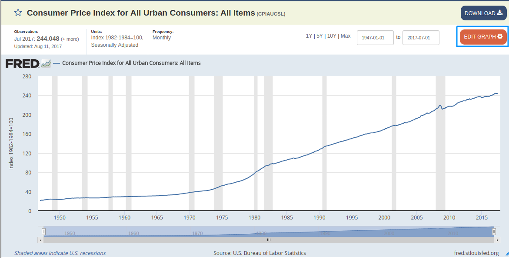

* Open the transformation interface by clicking **EDIT GRAPH**.

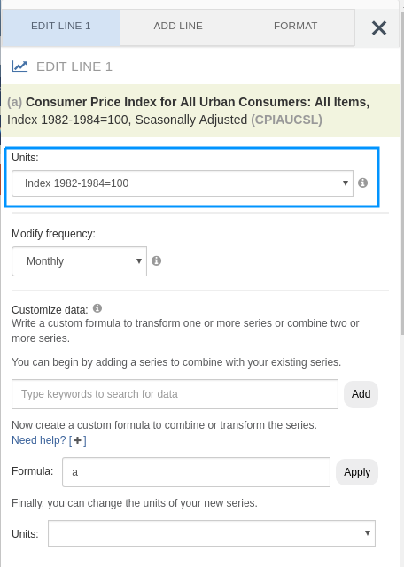

* From the **Units** drop-down list, select a transformation.

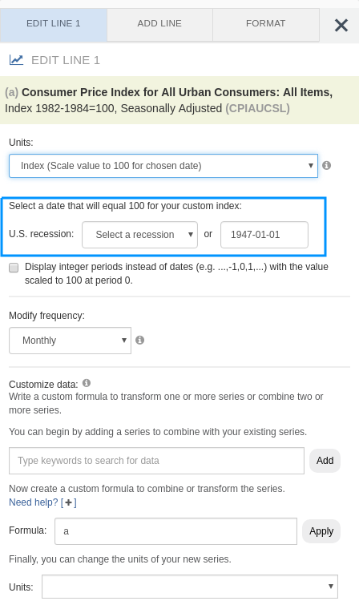

* Modify parameters of the transformation as needed.

## Solution

A side-by-side comparison of each feature of CPI transformation is shown below, as well as links to the accompanying
visualizations.

Note that because ATSD supports storing historical data from the year 1970 onward while the Federal Reserve tracks
data from 1947 onward, small scale differences are expected in the outputs of each graph.

## Index

* [Consumer Price Index](#consumer-price-index)
* [Monthly Change](#monthly-change)
* [CPI Calculated from a Variable Baseline](#cpi-calculated-from-a-variable-baseline)
* [Change from a Year Ago](#change-from-a-year-ago)
* [Monthly Percent Change](#monthly-percent-change)
* [Monthly Percent Change from a Year Ago](#monthly-percent-change-from-a-year-ago)
* [Compounded Annual Rate of Change](#compounded-annual-rate-of-change)
* [Continuously Compounded Rate of Change](#continuously-compounded-rate-of-change)
* [Continuously Compounded Annual Rate of Change](#continuously-compounded-annual-rate-of-change)
* [Natural Logarithm of CPI](#natural-logarithm-of-cpi)
* [Max Index](#max-index)

### Consumer Price Index

*Figure 1*: Consumer Price Index for Baseline Year 1982 (1947-2017) **FRED**

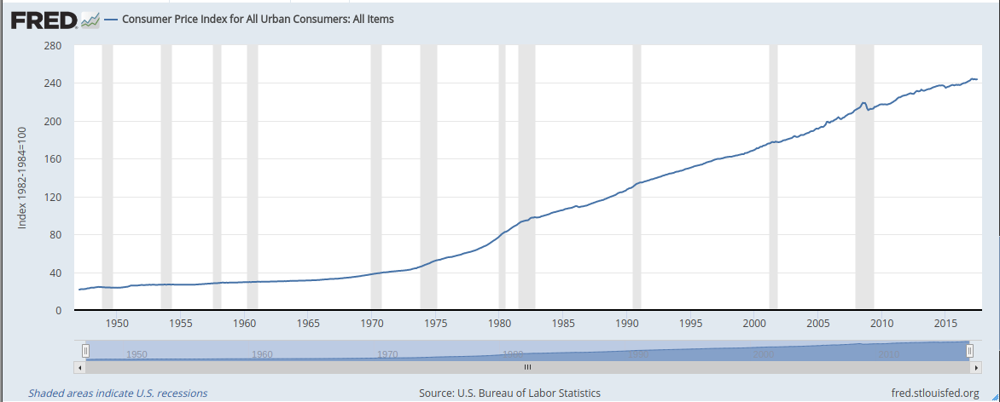

[**View FRED Graph**](https://fred.stlouisfed.org/graph/?graph_id=402645)

*Figure 2*: Consumer Price Index (1970-2017) **ATSD**

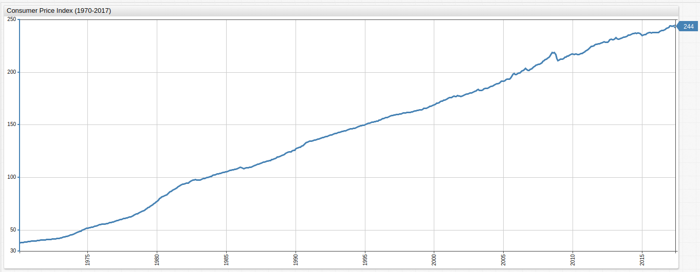

[](https://apps.axibase.com/chartlab/383632d5/#fullscreen)

Return to the [Index](#index)

### CPI Calculated from a Variable Baseline

The index is the baseline year to which previous or subsequent years are compared. Those years with an increase in the cost of consumer
goods are therefore greater than 100.00 while years with deflation in the cost of consumer goods based on the index are less than 100.00.

*Figure 3*: CPI Calculated from a Variable Baseline (1990-07-01) **FRED**


[**View FRED Graph**](https://fred.stlouisfed.org/graph/?graph_id=402648)

*Figure 4*: CPI Calculated from a Variable Baseline (1990-07-01) **ATSD**

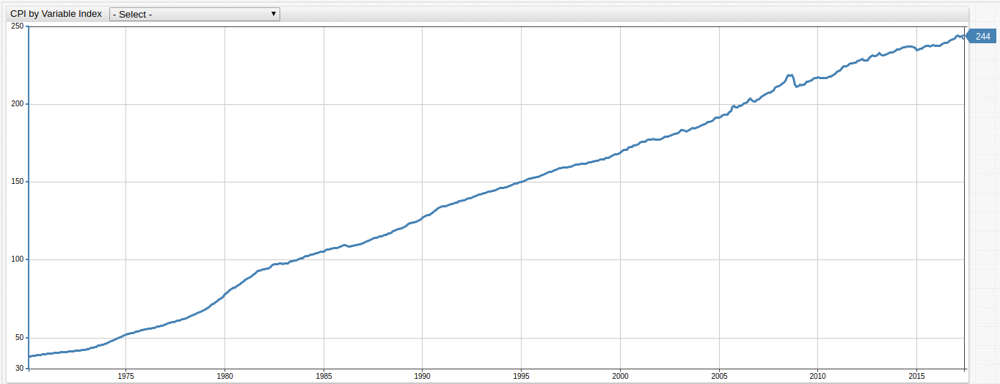

[](https://apps.axibase.com/chartlab/978c79b4/4/#fullscreen)

In **ChartLab**, use the drop-down list at the top of the visualization to select the baseline year, or hardcode
a year not included in the drop-down list by modifying one of the dates in the `keyDates` list.

Key Components of This Visualization:

> Open the ChartLab visualization shown above and view the **Editor** window to inspect chart configuration.

* The list `keyDates` contains the same dates as the FRED chart referenced in the [Problem Brief](#problem-brief):

```javascript
list keyDates = 1970-11-01,
  1973-11-01, 1975-03-01,
  1980-01-01, 1980-07-01,
  1981-07-01, 1982-11-01,
  1990-07-01, 1991-03-01,
  2001-03-01, 2001-11-01,
  2007-12-01, 2009-06-01
endlist
```

* These dates are displayed in the drop-down list and represent official start dates of various United States recessions.

The syntax for this drop-down list is shown below:

```ls
[dropdown]
  on-change = widget.config.series[0].value = this.value; widget.replaceSeries(widget.config.series);
  for date in keyDates
    [option]
      text = Index (Scale to 100 for @{date})
      value = value("cpi") / value("cpi_@{date}") * 100 || null
  endfor
```

> For more information about the above syntax refer to [Charts documentation](https://axibase.com/docs/charts/configuration/drop-down-lists.html#drop-down-lists).

Modify any of the dates contained in the `keyDates` list above to select a date to use as the baseline value. The [`value`](https://axibase.com/docs/charts/widgets/shared/#value) setting under the `[option]` heading of the `[dropdown]` configuration above uses a formula to calculate a new index.

The [`on-change`](https://axibase.com/docs/charts/configuration/drop-down-lists.html#on-change) setting defines the newly calculated series.

Additional configuration components are enumerated below:

* `widget.config.series[0]`: selects the series to be replaced. Series are indexed beginning with `0` and increasing by a single step for each additional series (`0`,`1`,`2`,`3`...). There is only one underlying series in this visualization.
* `value = this.value`: specifies a user-defined value, the option selected in the drop-down list, as the value for the series defined in the the `widget.config` portion of the script. `this` defines the specific object to be modified, in this case the drop-down list.
* `widget.replaceSeries(widget.config.series)`: replaces the underlying values of the original series defined as a parameter of the function, with the newly calculated values defined under the `[option]` heading.

Return to the [Index](#index)

### Monthly Change

Monthly nominal change in CPI value over the observed period.

*Figure 5*: Monthly Change (1947-2017) **FRED**

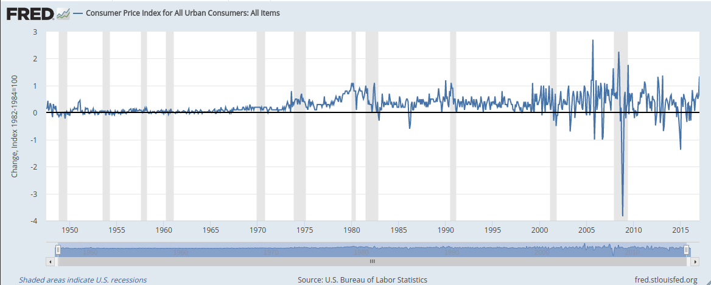

[**View FRED Graph**](https://fred.stlouisfed.org/graph/?graph_id=402654)

*Figure 6*: Monthly Change (1970-2017) **ATSD**

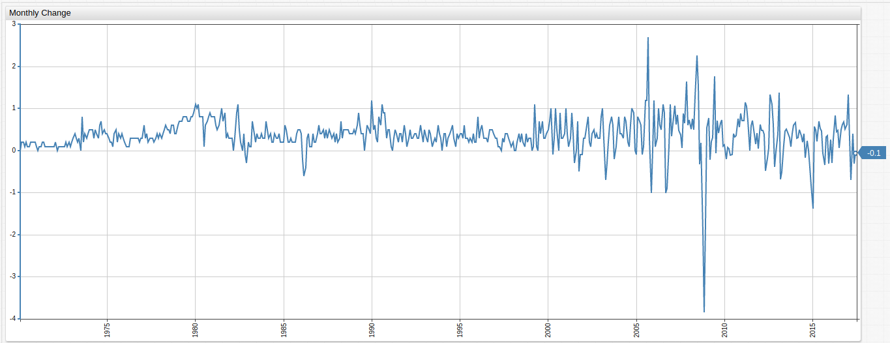

[](https://apps.axibase.com/chartlab/5267b4a7/2/#fullscreen)

Underlying formula:

```ls
value = delta("cpi", "1 month")
```

* This configuration uses the [`delta`](https://axibase.com/docs/charts/syntax/extended-aggregators.html#delta) function.

Return to the [Index](#index)

### Change From a Year Ago

Nominal change in CPI value from the same month of the previous year.

*Figure 7*: Change From Previous Year (1947-2017) **FRED**

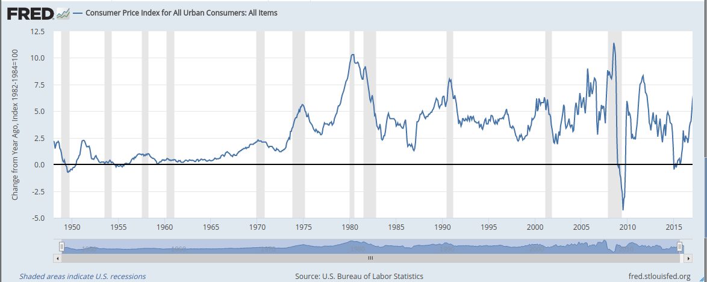

[**View FRED Graph**](https://fred.stlouisfed.org/graph/?graph_id=402657)

*Figure 8*: Change From Previous Year (1970-2017) **ATSD**

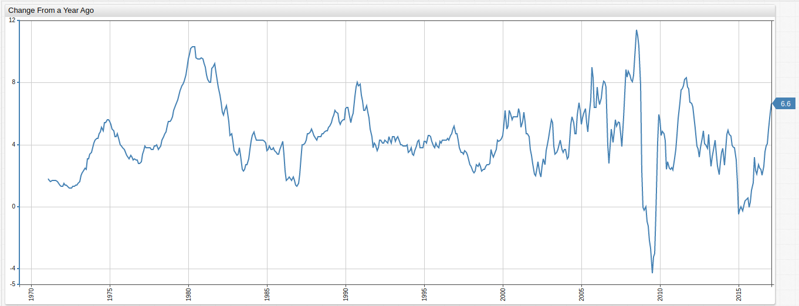

[](https://apps.axibase.com/chartlab/5267b4a7/#fullscreen)

Underlying formula:

```ls
value = var v = value('cpi'); var p = value('prev_cpi'); if(p != null && v != null) return v - p;
```

* This configuration uses a second underlying series to select CPI values from one year ago via the [`time-offset`](https://axibase.com/docs/charts/widgets/time-chart/#time-offset-setting) setting and compares the data to current year values.

Return to the [Index](#index)

### Monthly Percent Change

Monthly percentile change in CPI value over the entire observed period.

*Figure 9*: Monthly Percent Change (1947-2017) **FRED**

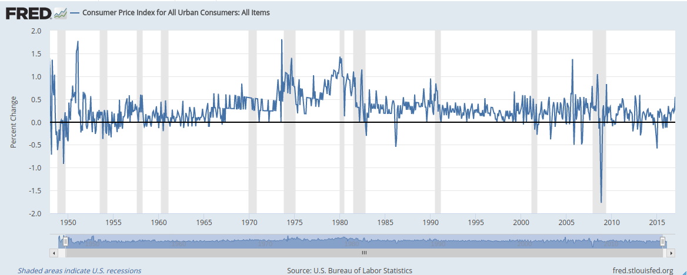

[**View FRED Graph**](https://fred.stlouisfed.org/graph/?graph_id=402658)

*Figure 10*: Monthly Percent Change (1970-2017) **ATSD**

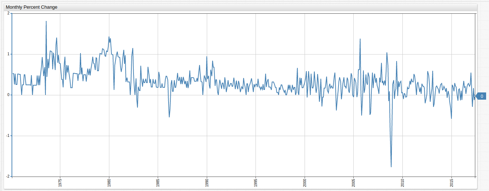

[](https://apps.axibase.com/chartlab/ab06efab/#fullscreen)

Underlying Formula:

```ls
value = (value("cpi") / previous("cpi") - 1) * 100
```

* This configuration uses the [`previous()`](https://axibase.com/docs/charts/syntax/functions.html#previous) function.

Return to the [Index](#index)

### Monthly Percent Change From a Year Ago

CPI percentile change from the same month of the previous year.

*Figure 11*: Monthly Percent Change From Previous Year (1947-2017) **FRED**

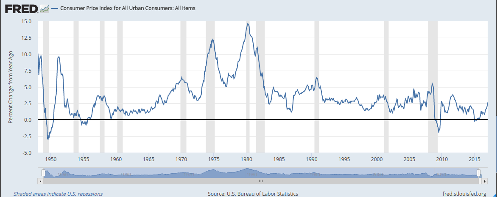

[**View FRED Graph**](https://fred.stlouisfed.org/graph/?graph_id=402660)

*Figure 12*: Monthly Percent Change From Previous Year (1970-2017) **ATSD**

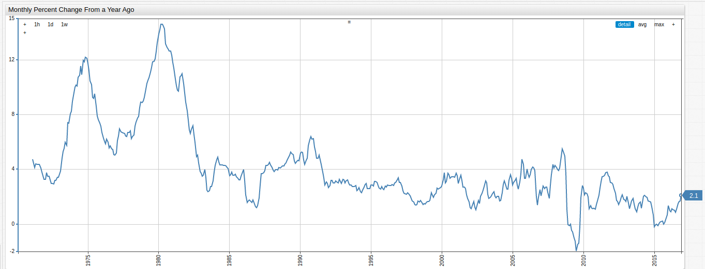

[](https://apps.axibase.com/chartlab/4f192b00/#fullscreen)

Underlying Formula:

```ls
value = var v = value('cpi'); var p = value('prev_cpi'); if(p!=null && v!=null) return (v / p - 1) * 100
```

Return to the [Index](#index)

### Compounded Annual Rate of Change

Mean annual rate of change for CPI.

*Figure 13*: Compounded Annual Rate of Change (1947-2017) **FRED**

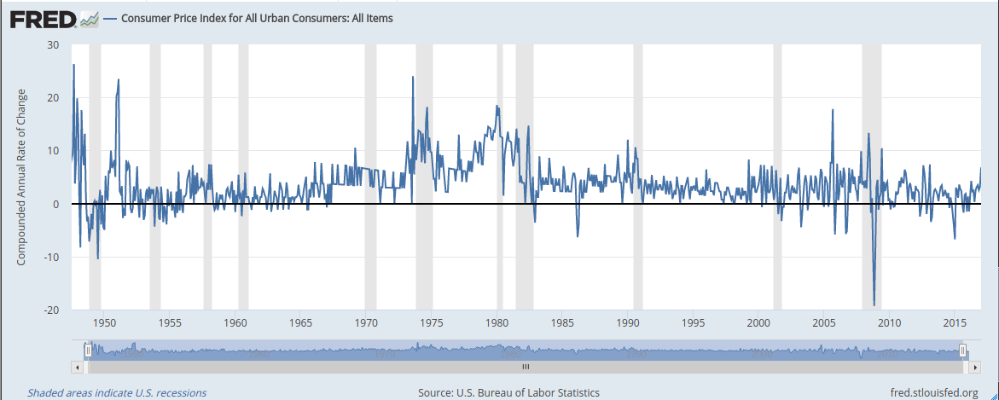

[**View FRED Graph**](https://fred.stlouisfed.org/graph/?graph_id=402666)

*Figure 14*: Compounded Annual Rate of Change (1970-2017) **ATSD**

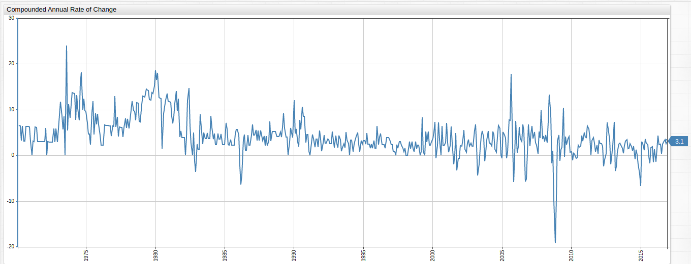

[](https://apps.axibase.com/chartlab/f6fee48e/#fullscreen)

Underlying formula:

```ls
value = (Math.pow(( value("cpi") / previous("cpi") ), 12) - 1) * 100
```

* This configuration uses the [`Math`](https://developer.mozilla.org/en-US/docs/Web/JavaScript/Reference/Global_Objects/Math) JavaScript object.

Return to the [Index](#index)

### Continuously Compounded Rate of Change

Continuously compounded mean rate of change for CPI.

*Figure 15*: Continuously Compounded Rate of Change (1947-2017) **FRED**

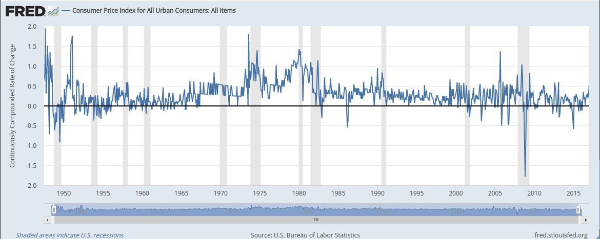

[**View FRED Graph**](https://fred.stlouisfed.org/graph/?graph_id=402668)

*Figure 16*: Continuously Compounded Rate of Change (1970-2017) **ATSD**

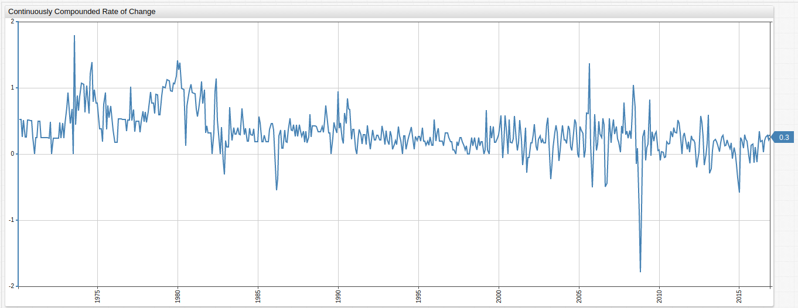

[](https://apps.axibase.com/chartlab/cae3b970/#fullscreen)

Underlying formula:

```ls
value = ( Math.log(value("cpi")) - Math.log(previous("cpi")) ) * 100
```

Return to the [Index](#index)

### Continuously Compounded Annual Rate of Change

 Annual rate of change compounded continuously for the observed period.

*Figure 17*: Continuously Compounded Annual Rate of Change (1947-2017) **FRED**

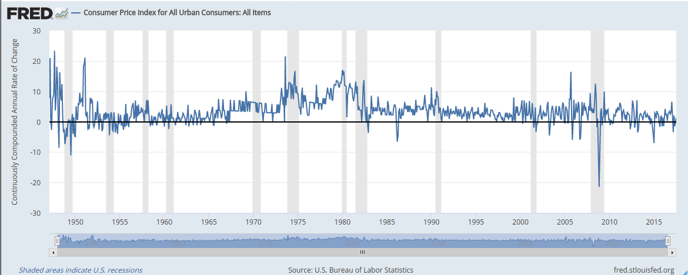

[**View FRED Graph**](https://fred.stlouisfed.org/graph/?graph_id=402818)

*Figure 18*: Continuously Compounded Annual Rate of Change (1970-2017) **ATSD**

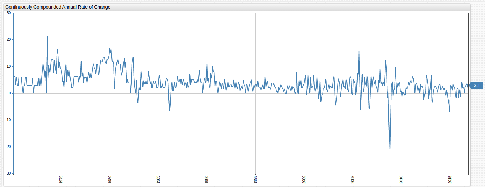

[](https://apps.axibase.com/chartlab/225e74f9/#fullscreen)

Underlying formula:

```ls
value = ( Math.log(value("cpi")) - Math.log(previous("cpi")) ) * 100 * 12
```

Return to the [Index](#index)

### Natural Logarithm of CPI

The logarithm of each value set to base of the mathematical constant `e` (2.71828).

*Figure 19*: Natural logarithm of CPI (1947-2017) **FRED**

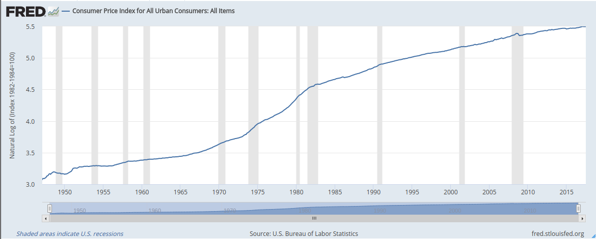

[**View FRED Graph**](https://fred.stlouisfed.org/graph/?graph_id=402819)

*Figure 20*: Natural logarithm of CPI (1970-2017) **ATSD**

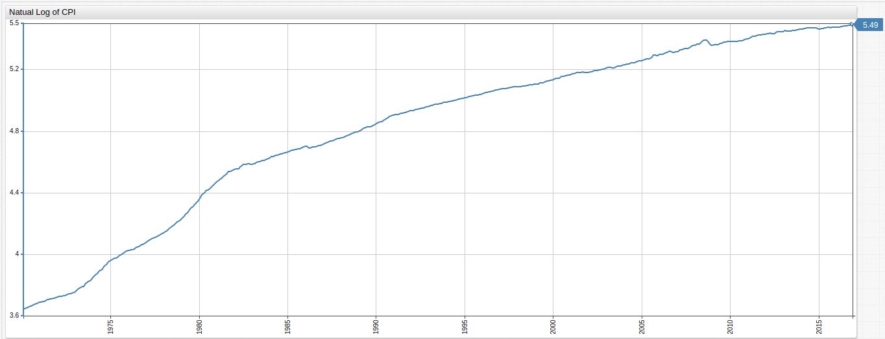

[](https://apps.axibase.com/chartlab/d2ced747/#fullscreen)

 Underlying formula:

```ls
value = Math.log(value("cpi"))
```

Return to the [Index](#index)

### Max Index

Index CPI by maximum value.

*Figure 21*: CPI with Most Recent Data as Index (1947-2017) **FRED**

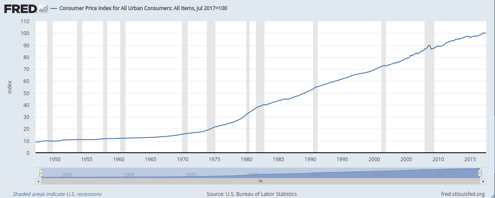

[**View FRED Graph**](https://fred.stlouisfed.org/graph/?graph_id=402820)

*Figure 22*: CPI with Most Recent Data as Index (1970-2017) **ATSD**

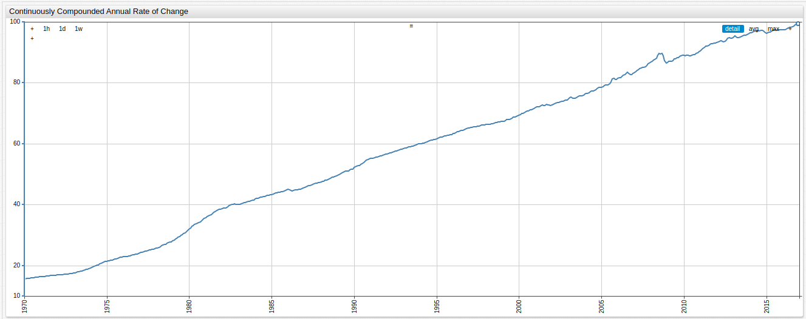

Underlying formula:

```ls
value = value("cpi") / value("cpi_max") * 100 || null
```

Return to the [Index](#index)