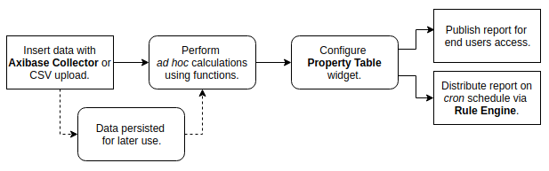

# Creating a Custom Report With ATSD and Charts


[](https://trends.axibase.com/ad4cbbeb#fullscreen)

## Contents

* [Overview](#overview)
* [Requirements](#requirements)
* [Data Collection](#data-collection)
* [Data Modification](#data-modification)
* [Visualization Configuration](#visualization-configuration)
* [Report Distribution](#report-distribution)
* [Additional Examples](#additional-examples)
* [Additional Resources](#additional-resources)

## Overview

Use ATSD to create summary reports for time series data. Collect data from one or more sources, perform *ad hoc* calculations which do not modify the underlying data, and present the information in tabular format with minimal time requirements. Upon report completion, update data and distribute the report to subscribers on a schedule via [Rule Engine](https://axibase.com/docs/atsd/rule-engine/).



This tutorial demonstrates the creation of an economic indicators report in the [Trends](../shared/trends.md) instance of ATSD for the previous four US presidents using macroeconomic metrics such as inflation and stock market value, as well as microeconomic metrics such as unemployment and average hourly earnings. The final result displays statistics for each metric in the month before a particular president has assumed office and again after they have served for some time.

Although dependant on the amount of underlying data, the complexity of the calculations involved, and the method of collection and insertion, the fundamental process of assembly and publication takes about ten minutes.

## Requirements

* [Axibase Time Series Database](https://axibase.com/docs/atsd/installation/)
* [Axibase Collector](https://axibase.com/docs/axibase-collector/)

> Optionally, launch the [ATSD sandbox](https://github.com/axibase/dockers/blob/atsd-sandbox/README.md) Docker Image which contains ATSD, Collector, companion tools, and two-week trial license.

## Data Collection

ATSD provides a number of ways to insert data:

* [Collector Job](https://axibase.com/docs/axibase-collector/job-generic.html)
* [REST API](https://axibase.com/docs/atsd/api/data/)
* [Network API](https://axibase.com/docs/atsd/api/network/)

Refer to the documentation above for specific instructions about each method of data insertion or read the [Getting Started: Inserting Data](https://axibase.com/docs/atsd/tutorials/getting-started-insert.html) tutorial.

## Data Modification

[Charts](https://github.com/axibase/charts/blob/master/README.md) is a graphics library for visualizing time series data with [widgets](https://github.com/axibase/charts/blob/master/widgets/README.md). This tutorial demonstrates report creation using the [**Property Table**](https://github.com/axibase/charts/blob/master/widgets/property-table/README.md), which displays properties collected by an entity in tabular format.

The report compares metric value year-on-year percent change on 1 January after a president is elected to year-on-year percent change on 1 September after a president has served almost nine months and then calculates the difference between each value for each metric for each president.

These calculations require [user-defined functions](https://github.com/axibase/charts/blob/master/syntax/udf.md), a Charts feature whereby particular mathematical formulae not included in the Charts [value functions library](https://github.com/axibase/charts/blob/master/syntax/value_functions.md) are uploaded to a local ATSD server in JavaScript form and invoked within a Charts application to be used for a particular visualization. Additionally, the [Federal Reserve](https://fred.stlouisfed.org/) provides metadata which is uploaded along with series values. Rows are labeled with human-readable names (`CPI: All Items`) instead of their identification code in the FRED database (`CPIEALL`) with the underlying metadata.

```ls
[configuration]
import fred = fred.js
add meta = true
```

### Value Calculation

The user-defined function configuration file [`fred.js`](https://apps-chartlab.axibase.com/portal/resource/scripts/fred.js) includes the [`PercentChangeFromYearAgo`](https://github.com/axibase/charts/blob/master/syntax/udf.md#examples) function which is used to calculate each year-on-year change value.

```ls
[column]
series-value = fred.PercentChangeFromYearAgo(config().alias, '@{term.baseDate}')
```

The `series-value` setting contains placeholder syntax `@{}`; Charts iterates over a list of presidents and dates then inserts this value at each row in the finished table. The `config()` function returns a particular object from the application configuration, in this case, the [`alias`](https://github.com/axibase/charts/blob/master/widgets/shared/README.md#alias) for each series.

```ls
csv terms = name,baseDate,currDate
  D. Trump,2016-01-01,2018-09-01
  B. Obama,2008-01-01,2009-09-01
  G.W. Bush,2000-01-01,2001-09-01
  B. Clinton,1992-01-01,1993-09-01
endcsv
```

With [control structures](https://github.com/axibase/charts/blob/master/syntax/control-structures.md), define [lists](https://github.com/axibase/charts/blob/master/syntax/control-structures.md#list) and [loops](https://github.com/axibase/charts/blob/master/syntax/control-structures.md#for), such as the one shown above. The column `baseDate` is used in the placeholder `@{term.basedate}` where `term` is a separate variable defined in the configuration.

```ls
for term in terms

  [widget]
    title = Economic Indicators Scorecard: @{term.name}
    type = table

for m in metrics
   [series]
    metric = @{m}
    alias = @{m}

endfor
endfor
```

The first `for` loop extracts information from the CSV list `terms` shown above and replaces placeholders containing the `term` argument. The second `for` loop iterates across the list `metrics` and creates a new `[series]` for each object.

```ls
list metrics = cpieall, cpieapparel,
  cpiebev, cpiecomedu, cpiedusl,
  cpiehouse, cpiemedcare, cpiengsl,
  cpieotrgs, cpierec, cpietrans,
  payems, unrate, civpart, ces0500000003,
  cp, fyfsgda188s, gfdebtn, walcl, djia,
  sp500, nasdaq100,
endlist  
```

### Metadata Labeling

Charts applications support JavaScript in the **Editor** window. The leading column identifies each metric by the underlying metadata `label` and the JavaScript string `replace()` function updates this value for each metric.

```ls
[column]
  series-value = replace(replace(meta().metric.label, 'Experimental', ''), 'Consumer Price Index', 'CPI')
```

## Visualization Configuration

> [Charts documentation](https://github.com/axibase/charts/blob/master/README.md) contains a complete list of additional settings not demonstrated in this tutorial.

Format the widget header with the [`header-style`](https://github.com/axibase/charts/blob/master/widgets/shared-table/README.md#header-style) setting at the `[configuration]` level for the changes to apply to the entire portal, or at the `[widget]` level to affect only specific widgets in visualization. This setting supports CSS style syntax.

```ls
header-style = background: white;display: flex;align-items: stretch;padding: 4px;width: auto;
```

Define portal parameters using the [`height-units`](https://github.com/axibase/charts/tree/master/configuration#height-units) and [`width-units`](https://github.com/axibase/charts/tree/master/configuration#width-units) settings. Enable automatic text size formatting with the [`responsive`](https://github.com/axibase/charts/blob/master/widgets/shared-table/README.md#responsive) setting.

```ls
[configuration]
  height-units = 2
  width-units = 3
  responsive = true
```

When a portal does not require an entire window, modify its location with [offset settings](https://github.com/axibase/charts/tree/master/configuration#layout-settings) to specify where the portal is displayed.

```ls
[configuration]
  offset-left = 400
```

## Report Distribution

Upon portal completion, the report can be published within ATSD for both internal or external access. Refer to [User Authentication](https://axibase.com/docs/atsd/administration/user-authentication.html#guest-access-to-portals) documentation for specific instructions to expose a portal to non-authenticated visitors.

Use Rule Engine [actions](https://axibase.com/docs/atsd/rule-engine/#actions) to specify behavior upon automated report creation following data update. For example, [attach portals](https://axibase.com/docs/atsd/rule-engine/email.html#trigger-settings) such as the report demonstrated in this tutorial.


Automate data collection and update with the [FRED Data Crawler](https://github.com/axibase/atsd-data-crawlers/blob/master/crawlers/fred-category-crawler/README.md) or a [JSON Job](https://axibase.com/docs/atsd/rule-engine/email.html#trigger-settings) and set a rule which is triggered each time new data is inserted.


To deploy this rule in a local ATSD instance, download the [template](./resources/rule-template.xml) from the `/resources` directory and add legitimate metric and subscriber information.

> For a detailed tutorial on the design and deployment of a custom reporting rule, refer to the [GitHub Pull Request Report](../../integrations/github/pr-report.md#configure-subscriber-list) and [Rule Engine](https://axibase.com/docs/atsd/rule-engine/) documentation.

## Additional Examples

The following examples demonstrate the display of comparative data for multiple metrics based on change over time.

### First 100 Days


[](https://trends.axibase.com/3cde53d6)

The table above tracks economic performance during the first 100 days of several presidential terms using the `fred.js` function `Index`, which sets the value of a particular metric to `100` for a specified date. Subsequent values are calculated as a proportion of that initial index value, and are thus comparable.

```ls
[series]
value = fred.Index('raw', '2017-01-20') - fred.Index('raw', '2017-04-30')
```

### Two-Year Report Card


[](https://trends.axibase.com/81002545)

The two-year report card tracks economic metrics during the previous two years and calculates the percent change during that period. Each derived value is transformed with the `PercentChangeFromYearAgo` function then checked against an [`alert-expression`](https://github.com/axibase/charts/blob/master/widgets/shared/README.md#alert-expression) and modified when that expression evaluates to `true`.

```ls
[widget]
  value('raw') * (2 - fred.PercentChangeFromYearAgo('raw')/100)
  alert-expression = value < 0
  alert-style = fill: red
```

## Additional Resources

Refer to the following additional resources for more information about using any of the tools or processes from this tutorial.

### Visualization

* [Trends Tutorial](../shared/trends.md)
* [Charts documentation](https://github.com/axibase/charts/blob/master/README.md)
* [Property Table documentation](https://github.com/axibase/charts/blob/master/widgets/property-table/README.md)

### Configuration

* [User-Defined Functions](https://github.com/axibase/charts/blob/master/syntax/udf.md)
* [Control Structures](https://github.com/axibase/charts/blob/master/syntax/control-structures.md)
* [Alert Expressions](https://github.com/axibase/charts/blob/master/syntax/alert-expression.md)

### Demonstration

* [ATSD Use Cases](https://axibase.com/use-cases/)
* [Daily Pull Request Report for GitHub Repositories](../../integrations/github/pr-report.md)