# Creating Rules: Basic Workflow

## Overview

The article outlines steps involved in creating a basic email alert using ATSD [rule engine](https://axibase.com/docs/atsd/rule-engine/).

## Find Series

Open the **Metrics** tab and search for a metric of interest. Enter the full metric name or a partial name containing a `*` wildcard.

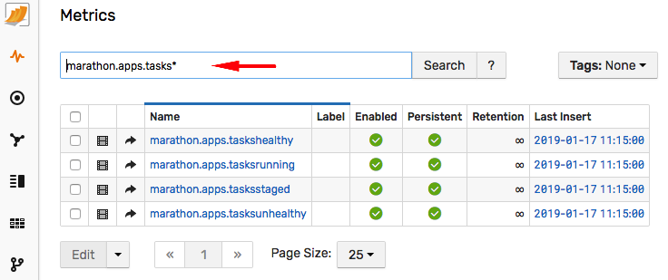

The search input supports various [options](https://axibase.com/docs/atsd/search/metric-search.html) for finding the metrics and customizing the results. For more examples click the help link.

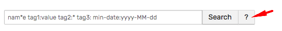

If the metric is present in results, check that its **Last Insert** date is close to current time which means that the metric is being actively collected.

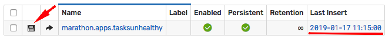

Click the **Series** icon to view specific time series collected for this metric.

Each time series is unique and is identified by the metric name, the entity name and an optional set of tags describing the series. This is called 'series key' in ATSD [schema](https://axibase.com/docs/atsd/schema.html).

The list of series for the given metric can contain thousands of individual series which can be filtered by applying a condition for one or multiple columns.

The entity and tag columns can be filtered by partial text match.

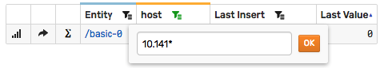

The **Last Insert** column allows limiting the results to recently updated series.

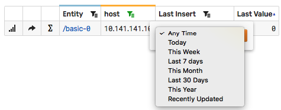

Locate a series that is a good candidate for testing alerts. Typically such series contains measurements that would have caused alerts in the past. For example, when creating a rule that alerts if the value exceeds `50`, search for series that crossed this threshold during the last day or week.

In the absence of obvious candidates, identify such series by opening the **SQL Console** and searching for series using an SQL query.

```sql
SELECT entity, tags, max(datetime), max(value)
  FROM atsd_series
  -- replace <metric-name> with actual value
WHERE metric = '<metric-name>'
  AND datetime > NOW - 7*DAY
  -- replace 50 with threshold value
  AND value > 50
GROUP BY entity, tags
ORDER BY max(datetime) DESC
  LIMIT 10
```

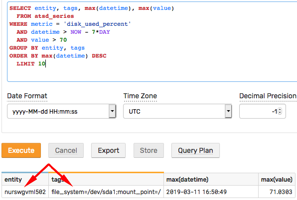

> For more information, review ATSD [SQL documentation](https://axibase.com/docs/atsd/sql/).

Alternatively, create a [portal](https://axibase.com/docs/atsd/portals/) with [conditional series visibility](https://axibase.com/docs/charts/configuration/display-filters.html) which displays only series that crossed the threshold.

```ls
[widget]
  type = table
  # change type to view the series on the time chart
  # type = chart
  timespan = 1 day
  multiple-series = true
  display = max('1 day') > 50
  # use 'enabled' setting instead of 'display' to keep series in the chart legend
  # enabled = max('1 day') > 50

  [series]
    metric = <metric-name>
    entity = *
```

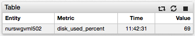

> For more information about ATSD graphics, review the [portal](https://axibase.com/docs/atsd/portals/) and [charts](https://axibase.com/docs/charts/) documentation.

## View Series

Once the series is located, click the ∑ icon to open the **Series Statistics** page. This page analyzes the series and presents summary information about the observed values.

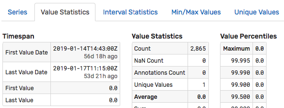

The interval of time for analyzing the measurements can be adjusted using the **Start Date** and **End Date** controls located above the tabs.

Click **Create Rule** to open the rule editor.

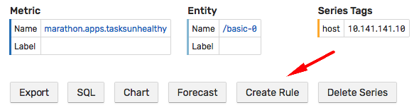

> The list of current rules is also accessible from the top menu under the **Alerts > Rules** link.

## Create Rule

Open the **Overview** tab and customize the rule name. It is recommended that you establish a naming convention to easily categorize and filter rules by name.

Click the **Filters** tab. The tab is automatically pre-filled with the entity name and tag values for the selected series. This filter can be relaxed at a later stage to accept more than one series.

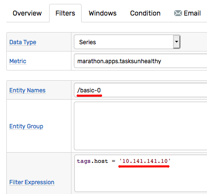

Open the **Windows** tab and set **Window Size** to `count = 1`.

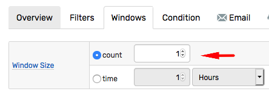

A [count-based](https://axibase.com/docs/atsd/rule-engine/window.html#count-based-windows) window accumulates up to the specified number of samples, and a window of size `1` consists of only one sample.

Open the **Condition** tab and modify the pre-filled boolean expression that creates an alert when it evaluates to `true`.

The example below is `true` when the received value is above the threshold of `50`, and it reverts back to `false` when the value is equal or less than `50`.

```javascript
value > 50
```

Because count-based windows of size `1` contain only one sample, [statistical](https://axibase.com/docs/atsd/rule-engine/functions.html#statistical) functions such as average or maximum are not useful in this context since they operate on a single value and as such return the value itself.

Click **Save** to save the rule.

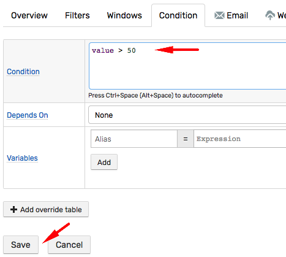

## Test Rule

### Test on Incoming Data

To test the rule on incoming data you can temporarily adjust the condition by lowering the threshold value.

```javascript
value > 10
```

Save the rule and click the **View Windows** link on the **Windows** tab.

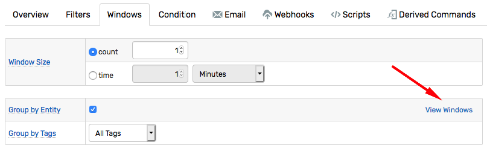

The window list contains all active windows for the series that received at least one sample after the rule is saved. If the metric is collected infrequently wait until a few samples arrive and activate the windows.

The status of the window indicates whether the condition is `true` or `false`. If the condition is `true`, the status is `OPEN` or `REPEAT`.

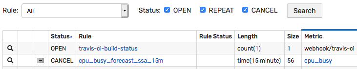

`OPEN` or `REPEAT` status mean that an alert is raised.

If the window list is empty or all windows are in `CANCEL` status, adjust the threshold some more. In case the windows are still missing, open the **Filters** tab in the rule editor and click **Filter Results** link to view which samples are discarded and why.

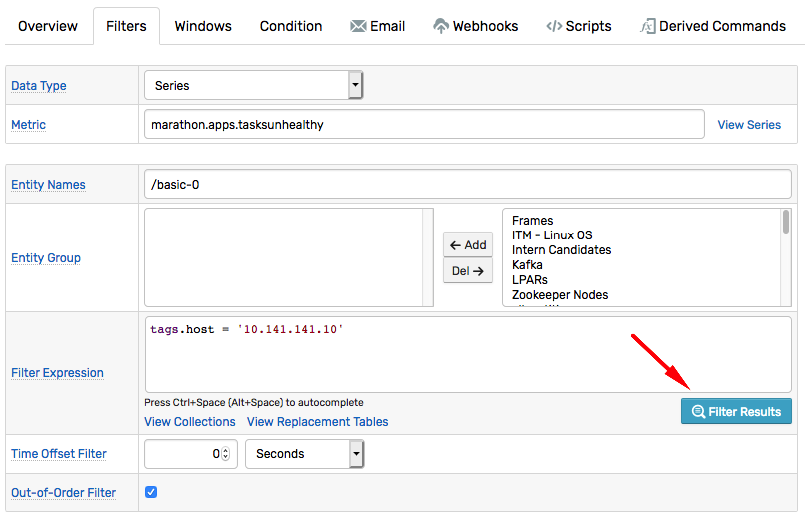

### Test on Historical Data

Click the **Test** tab in the rule editor to back-test the rule on historical data.

Modify the entity name and add or remove tags to filter the results to select a subset of series collected by the metric.

Adjust the **Selection Interval** to increase the back-testing interval.

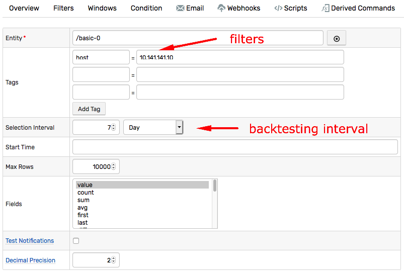

The results contain a chronological list of window status changes based on historical data.

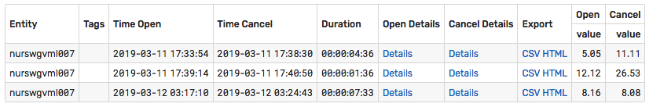

Customize the threshold and re-run the test to arrive at a configuration that captures the observed anomalies.

Click **Save** to save the latest changes.

## Relax Filters

Once the rule is tested and verified for one specific series, the [filter](https://axibase.com/docs/atsd/rule-engine/filters.html) can be relaxed to accept data for the remaining matching series collected by the same metric.

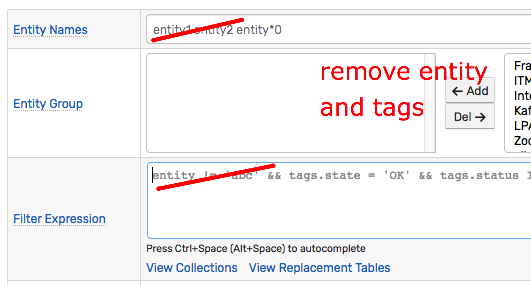

## Send Alert to Email

The rule can be configured to trigger [actions](https://axibase.com/docs/atsd/rule-engine/#actions) of various types.

* Send email
* Trigger webhook to send alert to chat or call a web service.
* Execute script
* Generate derived metrics
* Log event to file

To deliver an email when the condition becomes `true`, open the rule editor and click the **Email** tab.

:::warning Note
Sending emails requires the ATSD [Mail Client](https://axibase.com/docs/atsd/administration/mail-client.html) to be configured and enabled.
:::

Create a new notification, enter one or multiple subscribers, and enable the **On Open** trigger.

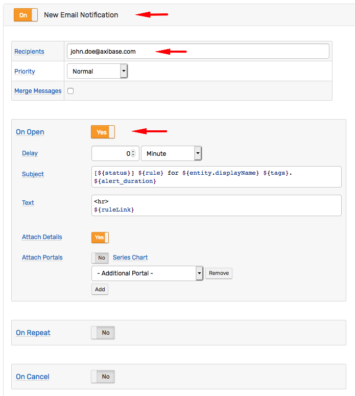

The **On Open** trigger delivers emails only when the window status changes from `false` to `true`. It does not deliver emails when the incoming value confirms the status. Use the **On Repeat** trigger if repeat notifications are required, for example to re-send the email every 2 hours.

Click **Test** to verify email delivery.

The test attempts to find a historical record that both passes the filter and evaluates the condition to `true`. If such sample cannot be found, the test sends an email message assembled from a synthetic sample. Therefore the content of the email message for an actual alert is different.

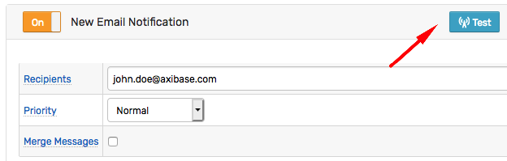

Refer to [email notification](https://axibase.com/docs/atsd/rule-engine/email.html) documentation for additional information on how to customize the message content.