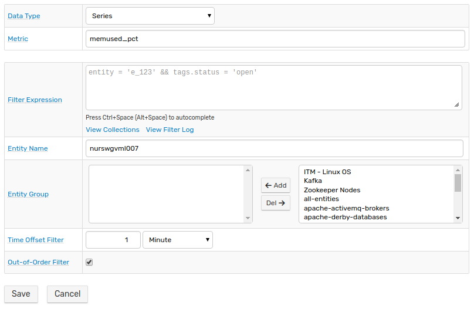

# Creating Rules

## Overview

ATSD [Rule Engine](https://axibase.com/docs/atsd/rule-engine/) enables the automation of repetitive tasks such as daily data collection, group messaging, and script execution.

Rule Engine behavior is governed by user-defined rules, which contain conditions for the database to evaluate and defined responses once rule conditions are met.

This tutorial describes the configuration of a rule which monitors memory usage data, messages a subscribed group of users, and executes a `bash` script.

## Create a Rule

Open the **Alert > Rules** page and select **Create** from the split button at the bottom of the page.


The database automatically defines the current user as the rule **Author**, but this field can be configured. Assign a name for the rule and optionally include a description.


For a rule to be active, set the **Enabled** switch to **Yes**.

## Define Filters

Filters define the data which the rule reads when evaluating condition expressions. On the **Filters** tab, define the metric to monitor. This rule monitors the memory used percentage `memused_pct` metric using `nmon` computer performance monitoring. For information about configuring `nmon` monitoring with a local ATSD instance, see [ATSD Integration Documentation](https://axibase.com/docs/atsd/integration/nmon/). Integrating `nmon` with ATSD enables the creation of user-friendly [portals](https://axibase.com/docs/atsd/portals/) for comprehensive monitoring.


[](https://apps.axibase.com/chartlab/d81bf61c#fullscreen)

On the **Filters** tab define the metric and entity to monitor. Optionally apply other filtering:

* **Filter Expression**: Perform advanced filtering by [Window Fields](https://axibase.com/docs/atsd/rule-engine/window-fields.html) or [User Variables](https://axibase.com/docs/atsd/rule-engine/variables.html).
* [**Entity Group**](https://axibase.com/docs/atsd/configuration/entity_groups.html): Query similar entities grouped into logical collections
* **Time Offset Filter**: Define the limit by which collected data can deviate from current server time.
* **Out-of-Order Filter**: Exclude samples which contain timestamps earlier than the most recently inserted sample. Use this filter to ignore retroactively added samples.

> All options display tooltips when clicked.



## Set Condition

Set the rules parameters on the **Condition** tab. A [condition](https://axibase.com/docs/atsd/rule-engine/condition.html) is a boolean expression evaluated when data is received by or removed from the window. For example, the condition `value > 75` returns `true` if the last received value exceeds `75`.


The expression is evaluated each time data changes to determine whether or not the average is greater than `25%` or any single sample is greater than `75%`. Optionally set additional parameters:

* **Depends On**: Fire a rule based on the behavior of another rule. For example, a second rule which performs minutely `ping` operations evaluates to `false` indicating latency or connectivity issues can cause the `Data Alert` rule to fire as well.
* **Variables**: Create placeholder variables for frequently used expressions and use them in the **Condition** field.

## Configure Email Notification

On the **Email** tab, enable notifications via email by setting the **New Email Notification** switch to **On**.


Define message recipients and set notification priority. Define multiple recipients by separating email addresses with a comma.


Select how Rule Engine should react to status changes:

* **On Open**: Initial sample which causes the condition to evaluate to `true`.
* **On Repeat**: Subsequent data samples where the rule condition evaluates to `true`. This feature is useful to control message flooding caused by high-frequency data collection.
* **On Cancel**: Data sample which causes condition to evaluate to `false` once again.


Set the appropriate switch to **On** to define behavior upon the occurrence of a particular rule event. Configure the behavior:

* **Delay**: Time after event which email action is delayed. 
  * Useful for handling false positives or momentary violations. 
  * If condition evaluates to `false` again during **Delay** time, email alert is canceled for **On Open** and **On Repeat** behaviors.
  * Likewise if **On Cancel** delay is defined and condition once again evaluates to `true`, email notification is cancelled.
* **Subject**: Email subject line which can contain [Window Field](https://axibase.com/docs/atsd/rule-engine/window-fields.html) placeholders, surrounded by `${}`.
* **Text**: Email body. Supports Window Field syntax.
* **Attach Details**: Include HTML data table with email notification.
* **Attach Portals**: If you created a [portal](https://axibase.com/docs/atsd/portals/portals-overview.html) for a group of metrics or entities, email notifications can include these visualizations as a part of the alert. Click **Add** to include multiple portals.

## Execute Script

If necessary, execute scripts that coincide with rule condition evaluation on open, repeat, or cancel. This rule evaluates excessive memory usage, so an **On Open** script only adds to the workload of the struggling machine. Once memory usage normalizes, verifying that the machine is operating as expected is one option.

Set the **On Cancel** switch to **Yes** and clear the **Same as `On Open`** checkbox.


The `ping.sh` script confirms connectivity on the overloaded server to ensure a crash did not occur. Add scripts according to [Rule Engine Documentation](https://axibase.com/docs/atsd/rule-engine/scripts.html).

```sh
#!/usr/bin/env bash

host=${1}
count=${2}

ping -c ${count} ${host}
```

`ping.sh` requires two arguments, defined in the **Arguments** text field on the **Script** tab:
* `${entity}` placeholder defines the server to ping.
* `${count}` parameter defines how many times the server is pinged.

After completing all required information click **Save** to store the rule in the database. The rule is visible on the **Rules** page.


## Troubleshooting

The database notifies if information is missing upon clicking **Save**


Erroneous field are indicated.

