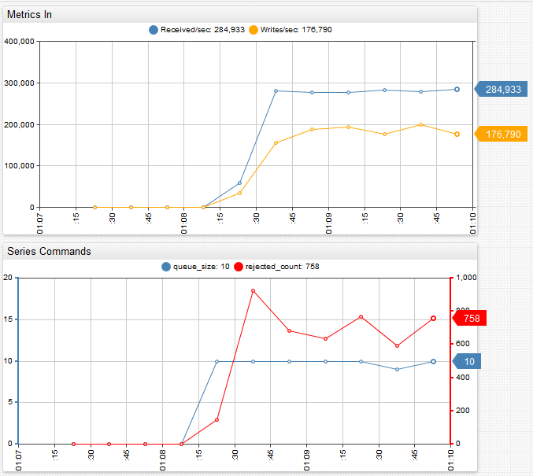
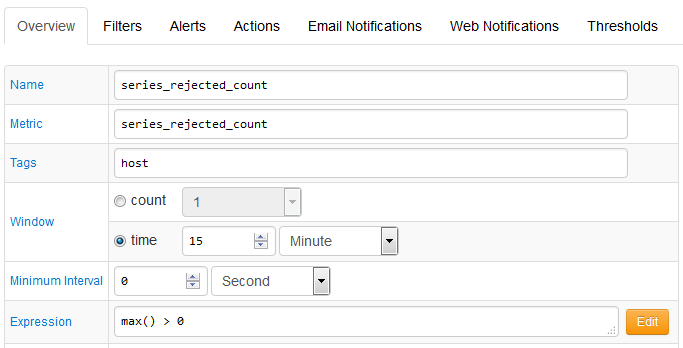

# Data Flow Control in Time Series Database

Time series databases specialize in collecting massive volumes of data at high frequency. With upload speeds reported at a hundred thousand to a million inserts per second, TSDBs are substantially faster than relational databases and messaging middleware such as WebSphere MQ configured in message persistence mode.

Regardless of how fast the upload rate is, make an upfront decision about how the database operates if the amount of data received exceeds the amount of data committed to disk. This imbalance can occur due to a spike in received data or a drop in storage throughput.

The typical reasons for data storms include:

* Concurrent bulk import jobs are initiated.
* Batch upload of large files is started.
* Collectors resend locally buffered data after a network outage.
* Collectors are misconfigured to send data at an abnormally high rate.

Reasons for reduced storage throughput include:

* Storage systems are overloaded with `I/O`-heavy MapReduce jobs.
* Garbage collection pauses.
* Network collisions, errors, outages.
* Disk failures and subsequent RAID reconstructions.

When a database overflows with data because local memory and file buffer limits are reached, there are two options to bring upload and storage rates in sync: slow down collectors or drop incoming data. There is also an option of running out of resources and terminating the database but that is not a viable alternative. The database must be continuously available, irrespective of the workloads.

The setting that controls the choice between slowing down producers and discarding data in ATSD is `series.queue.rejection.policy` and accepts two options:`BLOCK` and `DISCARD`. `BLOCK` is the default.

`series.queue.rejection.policy = BLOCK`

The `BLOCK` policy means that once a series queue reaches the limit specified with the `series.queue.capacity` setting, the database stops receiving data from network commands, [Data API](https://axibase.com/docs/atsd/api/data/) insert requests, and file uploads. The database does not break connections, instead suspending reading data from sockets in blocking mode which cause cause collectors to block as well. Each upload thread that is not able to add series to the persistence queue, which is full, is blocked until there is space in the queue. This ensures that no data is lost while the database copes with a temporary imbalance.

The `DISCARD` policy means that once the queue limit is reached, newly received data is dropped by the database to protect itself from memory or disk shortage. Upload jobs return instantly and the producers is not be subject to any blocking.

The differences between the two policies can be illustrated with metrics collected by ATSD:

## BLOCK policy

Once the queue limit of 10 batches is reached, the database slows down producers and the received rate is bound by the write rate. Each batch is set to 2,048 commands by default, setting the limit to a maximum of 20,480 commands in memory. The queue size oscillates at or slightly below the limit while the producers are writing in blocking mode.


`DISCARD` policy

The delta between received and written commands is large enough to quickly fill the queue up to its limit of ten batches. Once the queue is full, the database starts dropping incremental commands and series rejected count shows an average of 800 batches dropped per 15 second interval. `800×2048/15 = 109000`, thus 109,000 commands dropped per second, which is approximately the difference between received and writes per second.



The trade-off between these policies is clear: what is good for producers is bad for data integrity. Does that mean `BLOCK` policy is best everywhere? Not necessarily. There are situations where `DISCARD` makes for a reasonable design decision, including:

* Value of delayed data is low. Consider real-time alerting or automated trading systems. By the time queued data makes it into a database, the data is of no use for real-time analytics because the metrics potentially changed substantially since they observation.
* Producers can fail if blocked. This applies to storage drivers where collection and transmission is done by the same thread. If the transmission code blocks, the storage driver either stops collecting data or buffered samples exhaust available memory.

## Queue Size

To derive an optimal series queue size, first consider how much memory is available on the server and how much of it is allocated to ATSD Java process (`Xmx`). Review the received rate displayed on the ATSD [default portal](https://axibase.com/docs/atsd/portals/#built-in-portals) and run [HBase Auto Tests](https://hbase.apache.org/0.94/book/hbase.tests.html) to determine recommended thread pool and batch sizes.

```sh
series.batch.size = 1024 #number of series commands sent to disk in each transaction
series.queue.capacity = 32 #series queue limit, specified as number of batches
series.queue.pool.size = 4 #maximum number of concurrent storage workers
```

If `Xmx` exceeds 4 GB, a queue limit of 256 and higher is advisable.

## Metrics

The database exposes the following metrics to ensure data integrity:

* `series_pool_active_count`: Number of concurrent storage workers. Limited by `series.queue.pool.size`.
* `series_queue_size`: Number of series command batches in the queue. Limited by `series.queue.capacity`.
* `series_rejected_count`: Number of series command batches discarded during the 15 second interval because of full queue.
* `metric_received_per_second`: Number of series commands received per second.
* `metric_writes_per_second`: Number of series commands written to disk per second.

## [Rule Engine](https://axibase.com/docs/atsd/rule-engine/)

Use the above metrics to create automated alerts. For example, the following rule sends an email alert if any series commands are rejected:



## [Portal](https://axibase.com/docs/atsd/portals/)

Reviewing the default ATSD portal to identify any occurrences of series rejections is equally important when determining optimal queue size.

