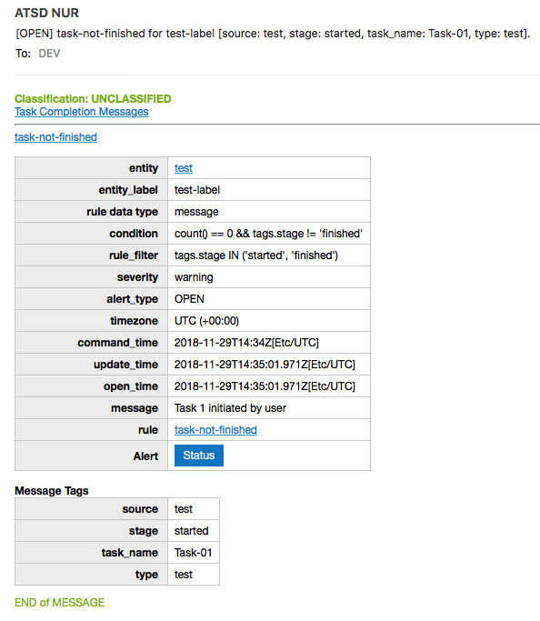
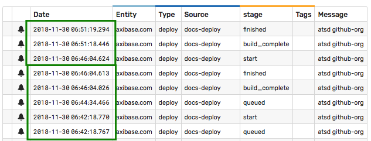
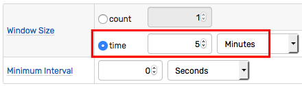
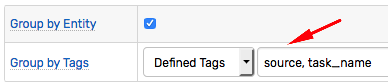
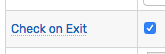
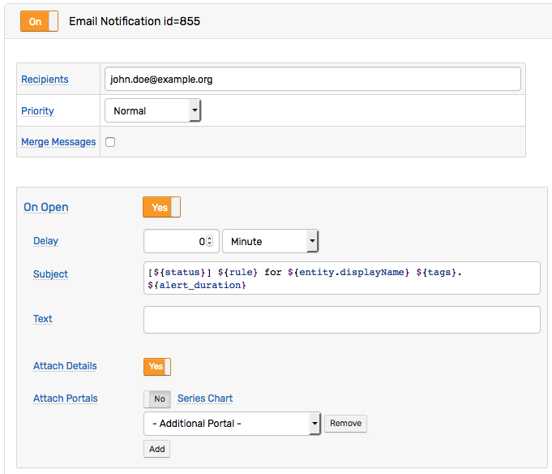
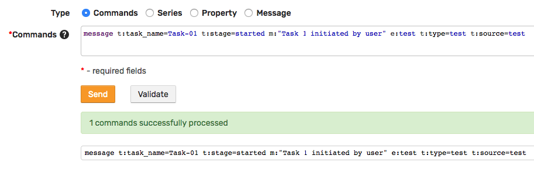
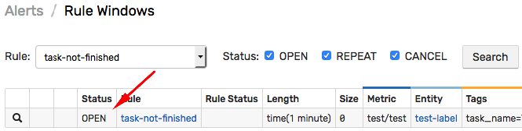

# Monitoring Event Sequences

## Overview

Reacting to incoming messages in the ATSD [rule engine](https://axibase.com/docs/atsd/rule-engine/) is fairly straightforward. Specifying a filter and a response action is sufficient in most situations.


On the other hand, monitoring event **sequences** requires more advanced rule logic especially if some events **fail** to arrive within the expected time window.

Consider a case where the process consists of a sequence of tasks executed sequentially, and the monitoring system needs to raise an alert whenever the process stalls for any reason.

A basic example is a task that normally takes 3 minutes to complete. The instrumented task generates two events:

* `Task-01` started.
* `Task-01` finished.

The objective is to raise an alert if the **`Task-01` finished** event is not received within 5 minutes after the **`Task-01` started** event.



The maximum delay of 5 minutes is calculated as the average (or maximum) task execution time of 3 minutes plus an additional 2 minute grace interval. Review historical data on the **Messages** tab to assist in the measurement of the expected time to completion.

  

## Keywords

* Event sequences, heartbeat monitoring, automation, workflow, task monitoring

## Objective

Create an alert if an event does **not** arrive on time.

## Solution

* Create a [time-based window](https://axibase.com/docs/atsd/rule-engine/window.html) to accumulate incoming events. Set window size to the maximum allowed task duration.

  

* [Group](https://axibase.com/docs/atsd/rule-engine/grouping.html) incoming events by entity and by task name. Enumerate grouping tags to ensure events for the same task are accumulated in the **same window**. If there is no task name, choose **No Tags**.

  

* Enable the **Check on Exit** setting to evaluate the condition when the expired events are removed from the window.

  

* Define a [condition](https://axibase.com/docs/atsd/rule-engine/condition.html) to return `true` for the last exiting event. The boolean expression must combine two checks: a) the window is empty, and b) the last event was intermediate, and not a normal task completion.

  ```javascript
  count() == 0 && tags.stage != 'finished'
  ```

* Define a response action such as an [email alert](https://axibase.com/docs/atsd/rule-engine/email.html) if the condition returns `true`.

  

### Test Rule

#### Prepare Rule

Create a new rule as described above.

Alternatively, import the [sample rule](./resources/task-not-finished-rule.xml) used for this tutorial. Set the correct email address on the **Email** action tab. Refer to [Email Action](https://axibase.com/docs/atsd/rule-engine/email.html) for more details.

#### Failed Task Test

Open the **Data > Data Entry** page and submit the following [`message`](https://axibase.com/docs/atsd/api/network/message.html) command to "start" the task.

```ls
message t:task_name=Task-01 t:stage=started m:"Task 1 initiated by user" e:test t:type=test t:source=test
```

  

Wait for maximum delay (1 minute) and confirm on the **Alerts > Open Alerts** page that an alert is raised for this rule. The alert is raised because the last expiring message is a message with the `stage` tag set to `started` (and not to `finished`).

  

A corresponding alert email is sent with detailed alert information.

#### Normal Task Test

Open the **Data > Data Entry** page and submit the following [`message`](https://axibase.com/docs/atsd/api/network/message.html) command.

```ls
message t:task_name=Task-01 t:stage=started m:"Task 1 initiated by user" e:test t:type=test t:source=test
```

Wait for several seconds (less than 1 minute) and submit the command below to "finish" the task in due time.

```ls
message t:task_name=Task-01 t:stage=finished m:"Task 1 completed successfully" e:test t:type=test t:source=test
```

Wait for maximum delay (1 minute) and confirm on the **Alerts > Open Alerts** page that no alert is raised for this rule. The alert is not raised since the last expiring message is a message with `stage` tag set to `finished`.