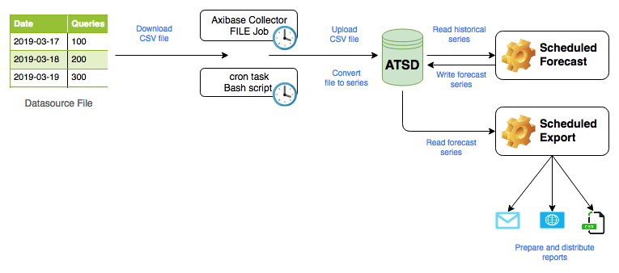
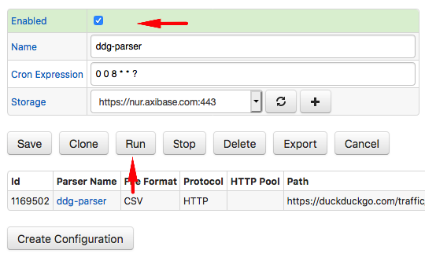

# Basic Forecasting Workflow

## Overview

The article describes how to automate forecast preparation for time series data that is continuously updated. The purpose of such integration is to eliminate manual steps involved in keeping forecasts in line with the most recent historical statistics.



## Dataset

We use the number of direct queries processed by the DuckDuckGo search engine as the sample dataset.

The [daily usage statistics](https://duckduckgo.com/traffic) for the service are available since 2010. The dataset contains just one metric - the total number of search queries processed by DuckDuckGo on a given day.


The metric exhibits an upward trend with a [weekly periodicity](https://apps.axibase.com/chartlab/d34e1e6f/2/).


The results are published as a [CSV file](https://duckduckgo.com/traffic_data/direct.csv) containing all records starting with April 1, 2010. The most recent samples are appended at the end of the file.

```txt
Date,Queries
2010-04-01,33209
# ...
2019-03-17,35711993
2019-03-18,38290015
2019-03-19,37533760
# ↓ new samples ↓
```

The CSV file is updated daily.

The average lag is two days. For example, on March 21, 2019 the historical data is available up until March 19, 2019.

## Automation Workflow

The workflow comprises the following steps.

* Download the latest `direct.csv` CSV file from the publisher URL on a daily basis.
* Upload the CSV file into the database using the pre-configured CSV parser.
* Configure a daily forecast job to re-calculate predicted values based on the most recent history.
* Configure a daily report job to deliver the updated forecasts to users.

## Importing Data

To create a CSV parser configuration, download the [CSV file](https://duckduckgo.com/traffic_data/direct.csv) to your computer.

Open the **Data > CSV Parser Wizard** page and upload the `direct.csv` file for analysis.


Check that the columns in the file are correctly classified as numeric and date columns and review the timespan for the data present in the file. Adjust **Parse Settings** if necessary to override the rules.


Proceed to the **Model** stage and modify fields to adjust the metric and entity names. In this particular case, modify the **Entity** field expression to set it to `ddg` instead of the file name.


> The Model **stage** allows you to map columns in the input file to the built-in data types and fields. For more information on modeling, refer to ATSD [schema](https://axibase.com/docs/atsd/schema.html).

Enter a parser name and click **Save parser**. This parser can now be used to process updated versions of the `direct.csv` file.


Attach the `direct.csv` file again to parse it with the newly created parser.


## Validating Data

The quality of forecasting depends to a large degree on the quality of input data. As such, it is important to identify and address any errors in the historical data prior to building an ETL pipeline.

After the CSV file is uploaded and processed, the database provides a summary page which various tools to explore the imported data including:

* Content Summary
* Series, Entity, and Metric Lists
* Sample SQL Queries
* Sample Portal Configurations
* Upload Options


Locate the **View Metrics** button at the bottom of the page and open the built-in portal to view the data, one series at a time, using the drop-down lists to switch between different metrics and entities.


Click `∑` for the first row in the **Series** list to view time series statistics.


The **Series Statistics** page contains multiple analysis to assist the user in locating abnormal values and data gaps. For example, this particular file has only two gaps which occurred on 2010-09-18 and 2011-01-27.


The page analyzes recorded values to locate minimum and maximum values.


Review the tabs on the **Series Statistics** page to locate and resolve data quality issues.

## Building Forecast Manually

Click the **forward play** icon in the **Series** table.


The initial forecast is built based on the default settings.


Adjust the following key settings to control the result.

* **Start Date**: Reduce the timespan to take into account more recent history.
* **Forecast Horizon**: Modify the prediction interval.
* **Aggregation Period**: Adjust the period to make forecast more or less granular.

:::tip How to choose Forecast Horizon
As a rule of thumb, the **Forecast Horizon** setting needs to be less than 50% of the historical selection interval. For example, to forecast one year into the future, select historical data for two years or more.
:::

The **Aggregation Period** can be increased to show more details in the predicted values. For example, the weekly cycle can be captured by reducing the period to 1 day.


Once you determine settings that are reasonable for the given series, click the **clock** icon to schedule the forecast.


## Scheduling Forecast

The scheduled forecast runs at the specified interval and produces predicted values which are stored back into the database as a separate series. The stored forecast series can be re-used until they are refreshed based on newly arrived historical data.

The job frequency is controlled with the **Schedule** setting.


The default execution time is set to 5:00 AM daily and is in line with the frequency of `direct.csv` changes.

To analyze a sliding window of historical data, the end time of the selection interval must not be fixed. It can be set to `now` or a [calendar expression](https://axibase.com/docs/atsd/shared/calendar.html#previous-time) with a rounding behavior such as `current_day`.


The **Forecast Name** setting controls under which identifier the derived forecast series is stored. To prevent collisions with historical data, the future values are stored either in a separate table or under a different metric name. In case when future values are stored in a separate table, the **Forecast Name** setting allows different forecasts to co-exist.


Click **Run** to execute the job manually. Click the chart links in the list of stored forecast series to ensure that the predicted values are calculated as expected.

Click **Save** to save the settings.


## Enable Data Collection

After the CSV parser is created using the wizard, the database can re-use the parser to process CSV files of the same format. Since the database cannot query external data sources, an intermediate program needs to retrieve the file from the HTTP URL and upload it into the database.

There are two options for automating this step:

* Configure a task using the built-in Linux `cron` scheduler to copy the CSV file between the source and the destination with `curl`.
* Create a [`FILE`](https://axibase.com/docs/axibase-collector/jobs/file.html) job in [Axibase Collector](https://axibase.com/docs/axibase-collector/) to perform download and upload actions. This requires installation of an Axibase Collector instance however it also provides built-in job monitoring and troubleshooting.

### Copy File using `curl`

This option relies on a simple script that downloads the source file to an intermediate server (or ATSD server itself) with a subsequent upload of the file into the database.

Log in to the server and verify connectivity by downloading the `direct.csv` file to `/tmp/direct.csv`.

```bash
curl https://duckduckgo.com/traffic_data/direct.csv -o /tmp/direct.csv
```

Check that the file contains valid records in CSV format.

```bash
tail -n 3 /tmp/direct.csv
```

```txt
2019-03-17,35711993
2019-03-18,38290015
2019-03-19,37533760
```

Go back to the CSV Wizard summary page and click **`curl`: Token Authentication** to issue an API token. The token authentication grants the external program a permission to perform a specific action - in this case to submit a CSV file to the specific CSV parser identified by name `ddg-parser`.


Copy the command template from the summary page. Replace `@direct.csv` with the absolute path `@/tmp/direct.csv` and run the command.

```txt
curl --request POST  "https://atsd.example.org:8443/api/v1/csv?config=ddg-parser" \
 --insecure --header "Authorization: Bearer <token>" \
 --form filedata="@/tmp/direct.csv"
```

The `taskStatus` in the response must be `COMPLETED` and no error message must be present.

```json
{
  "startTime":1553455390850, "endTime":1553455391233, "processed":3277,
  "source":"192.0.2.1", "parser":"ddg-parser",
  "errorMessage":null,
  "taskStatus":"COMPLETED",
  "type":"upload", "fileName":"direct.csv",
  "fileCount":1, "fileSize":62477
}
```

The above output confirms that the CSV parser is properly configured.

Create a script file named `ddg_upload.sh` with the below contents. The script downloads the CSV file to `/tmp/direct.csv` and uploads it into the database using the API Token authentication.

```bash
#!/bin/bash
curl https://duckduckgo.com/traffic_data/direct.csv -o /tmp/direct.csv \
  && curl --request POST  "https://atsd.example.org:8443/api/v1/csv?config=ddg-parser" \
      --insecure --header "Authorization: Bearer <token>" \
      --form filedata="@/tmp/direct.csv"
```

Run the script again to verify that it is working as expected.

```bash
/path/to/script/ddg_upload.sh > /tmp/ddg_upload.log && cat /tmp/ddg_upload.log
```

Open the `cron` editor with `crontab -e` and add the script to the `cron` schedule.

```txt
0 4 * * * /path/to/script/ddg_upload.sh >> /tmp/ddg_upload.log
```

The example above execute the job at 4:00 AM daily with command output saved to `/tmp/ddg_upload.log` for diagnostics.

### Automate File Upload with Axibase Collector

[Axibase Collector](https://axibase.com/docs/axibase-collector) is an ETL tool which implements various job types to collect data into ATSD on schedule. One of such jobs is the [`FILE`](https://axibase.com/docs/axibase-collector/jobs/file.html) job that is capable of fetching files from HTTP/FTP/SFTP URLs or from the local file system and to pass it to the database for processing.

Return to the CSV Wizard summary page and click **Axibase Collector: FILE Job**.

Enter the `direct.csv` URL and click **Export Job**.

```elm
https://duckduckgo.com/traffic_data/direct.csv
```


Open the Axibase Collector user interface and import the XML file containing the file job.


Locate the job in the full list of jobs, change its status to **Enabled**.

Modify the schedule to execute the job at 4:00 AM daily by setting **Schedule** to `0 0 4 * * ?`.

Click **Run** to execute the job manually.



Check the results to ensure the upload is successful.

## Export Forecast

The last step in the automation workflow is to deliver forecast results to end-users.

Open the **Data > Forecast Jobs** page and select the `ddg-queries-1` settings.

Click **Export** to open the **Data > Export** form with pre-filled settings.


Click **Submit** to view the forecast values in HTML format.


Expand **Export Options** and select one of the options to retrieve forecast results:

* **Download CSV**: Direct link to results in CSV format.
* **Schedule Job**: Save results in CSV/Excel format to file or deliver via email.
* **`curl`: User/Token Authentication**: Execute `curl` command to retrieve results in CSV format.


To receive the report via email, add subscribers and customize the message subject.


Click **Run** to test report delivery.


The test generates CSV or Excel report files, persisted to disk or delivered via email.


Modify the schedule to execute the job at 8:00 AM daily by setting **Schedule** to `0 0 8 * * ?`.


For more flexible reports with history and forecast joins, aggregations, and advanced filtering, configure the scheduled forecast to store results in a derived metric to make the new series accessible in the [SQL engine](https://axibase.com/docs/atsd/sql/).

* SQL Example 1:

```sql
SELECT datetime,
  ROUND(value, -5) AS "value",
  CASE
    WHEN metric = 'queries' THEN 'history'
    ELSE 'predicted'
  END AS "type"
FROM atsd_series
  WHERE metric IN('queries', 'queries-forecast')
  AND datetime BETWEEN now - 3*DAY AND now + 3*DAY
ORDER BY datetime
```

```txt
| datetime    |    value | type      |
|-------------|----------|-----------|
| Mar-24, Sun | 35700000 | history   |
| Mar-25, Mon | 38600000 | history   |
| Mar-26, Tue | 37800000 | history   |
| Mar-27, Wed | 38200000 | predicted |
| Mar-28, Thu | 38300000 | predicted |
| Mar-29, Fri | 37200000 | predicted |
```

* SQL Example 2:

```sql
SELECT datetime,
  ROUND(t1.value, -5) AS "history",
  ROUND(t2.value, -5) AS "forecast",
  ROUND(t2.value - t1.value, -5) AS "error",
  (t2.value - t1.value)/t1.value*100 AS "error, %"
FROM queries t1 OUTER JOIN "queries-forecast" t2
  WHERE t1.datetime BETWEEN now - 7*DAY AND now + 2*DAY
ORDER BY isnull(t1.datetime, t2.datetime)
```

```txt
| datetime |  history | forecast |   error | error, % |
|----------|----------|----------|---------|----------|
| Mar-20   | 37500000 | 38000000 |  500000 |        1 |
| Mar-21   | 37000000 | 38100000 | 1100000 |        3 |
| Mar-22   | 35800000 | 37000000 | 1200000 |        3 |
| Mar-23   | 34100000 | 35600000 | 1600000 |        5 |
| Mar-24   | 35700000 | 36900000 | 1100000 |        3 |
| Mar-25   | 38600000 | 39000000 |  400000 |        1 |
| Mar-26   | 37800000 | 39000000 | 1200000 |        3 |
| Mar-27   |          | 38400000 |         |          |
| Mar-28   |          | 38500000 |         |          |
```

In addition to file and email delivery, the SQL engine allows distributing the reports in HTML format including [publishing](https://axibase.com/docs/atsd/sql/scheduled-sql.html#publishing) the results on publicly accessible URLs.