# Historizing Metrics Stored in Database

## Overview

This tutorial describes the process of historizing operational metrics stored in a relational database.

## Scenario

Consider a scenario where one of the tables in the target relational database contains a list of customer orders. The number of daily orders is high and to isolate the primary database from analytical queries, the records must be copied to a separate warehouse database as part of the daily pruning procedure. Assume now that a business analyst needs to monitor incoming orders to spot baseline outliers as quickly as possible. The baseline itself is calculated by averaging the number of orders received from customers during the same hour on the same weekday one, two, and four weeks ago.

Since the company stores intraday and historical records in different databases, it is impossible to run a single query that returns the number of orders spanning several weeks. Moreover, the baseline-calculating query against the warehouse table may be too expensive to run continuously. Further still, if the queries against the operations database are executed by multiple monitoring tools, this can introduce unwanted overhead.

## Solution

Address this challenge by scheduling the execution of an analytical query (one that calculates a multi-dimensional count of orders, for example) and persisting the results in ATSD. This minimizes the load on the operational databases and therefore storing order statistics in the same database is inadvisable. Execute the analytical query under a `read-only` user account with the permission to `SELECT` data from a specific view encapsulating the query business logic.

The steps below describe how to enable this type of monitoring using [Axibase Time Series Database](https://axibase.com/docs/atsd/).

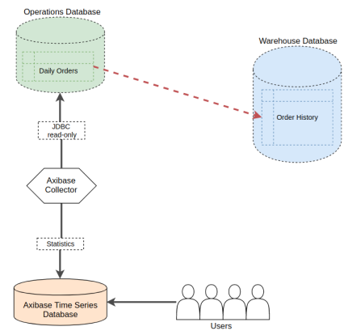

---

### Analyze Raw Data

Start by understanding available data to determine useful statistics for end users. For the purpose of this tutorial, assume the operations database stores incoming orders in the `daily_orders` table.

```sql
CREATE TABLE daily_orders
  (customer VARCHAR(64), amount DECIMAL(9,2), received timestamp DEFAULT CURRENT_TIMESTAMP)
```

The database continuously adds new records to the table as customers place new orders.

```sql
INSERT INTO daily_orders (customer, amount) VALUES ('Pizza 101', 90.00)
...
INSERT INTO daily_orders (customer, amount) VALUES ('TravelGuru', 430.00)
...
INSERT INTO daily_orders (customer, amount) VALUES ('eBank', 920.00)
```

The `daily_orders` table contains all orders received during the current business day.

```sql
SELECT * FROM daily_orders
```

```ls
| customer    | amount | received             |
|-------------|--------|----------------------|
| Pizza 101   | 90     | 2018-04-18T03:02:00Z |
| TravelGuru  | 430    | 2018-04-18T08:06:21Z |
| eBank       | 920    | 2018-04-18T09:16:25Z |
```

Select the orders received during the last hour by adding a time condition.

```sql
SELECT * FROM daily_orders
  WHERE received > NOW() - INTERVAL 1 HOUR
```

---

### Calculate Statistics with Analytical Queries

The monitoring and reporting team is not interested in specific orders but rather, the total number and perhaps dollar amount of orders received during the last hour.

```sql
SELECT SUM(amount), COUNT(amount)
  FROM daily_orders
WHERE received > NOW() - INTERVAL 1 HOUR
```

```ls
| SUM(amount) | COUNT(amount) |
|-------------|---------------|
| 920         | 1             |
```

In addition, the business analysts might be interested in tracking the top customers during the given hour and therefore another query grouping orders by customer is necessary:

```sql
SELECT customer, SUM(amount), COUNT(amount)
  FROM daily_orders
WHERE received > NOW() - INTERVAL 1 HOUR
  GROUP BY customer
```

```ls
| customer | SUM(amount) | COUNT(amount) |
|----------|-------------|---------------|
| eBank    | 920         | 1             |
```

### Preparing Queries for Historical Retention

To differentiate between collected metrics by name, assign [aliases](https://axibase.com/docs/atsd/sql/#aliases) to each column.

For summary statistics (without [`GROUP BY`](https://axibase.com/docs/atsd/sql/#grouping) customer clause), apply the `total_` prefix.

```sql
SELECT SUM(amount) AS total_amount, COUNT(amount) AS total_count
  FROM daily_orders
WHERE received > NOW() - INTERVAL 1 HOUR
```

For statistics grouped by customer, add the customer name to the list of columns in the `SELECT` expression.

```sql
SELECT customer, SUM(amount) AS customer_amount, COUNT(amount) AS customer_count
  FROM daily_orders
WHERE received > NOW() - INTERVAL 1 HOUR
  GROUP BY customer
```

## Creating Views and Granting Permissions

Creating views is optional but recommended to ensure the monitoring account under which the queries are executed cannot customize the query text, inadvertently retrieving more data than necessary.

```sql
CREATE VIEW stat_orders_hourly_total AS
  SELECT sum(amount) AS total_amount, count(amount) AS total_count
    FROM daily_orders
  WHERE received > NOW() - INTERVAL 1 HOUR
```

```sql
CREATE VIEW stat_orders_hourly_detail AS
  SELECT customer, SUM(amount) AS customer_amount, COUNT(amount) AS customer_count
    FROM daily_orders
  WHERE received > NOW() - INTERVAL 1 HOUR
    GROUP BY customer
```

Create a read-only account and restrict it to executing `SELECT` queries on specific views.

```sql
GRANT SELECT ON mysql.stat_orders_hourly_total TO 'axibase-readonly'@'%';
```

```sql
GRANT SELECT ON mysql.stat_orders_hourly_detail TO 'axibase-readonly'@'%';
```

* `stat_orders_hourly_total` results.

```ls
| total_amount | total_count |
|--------------|-------------|
| 920          | 1           |
```

* `stat_orders_hourly_detail` results.

```ls
| customer | customer_amount | customer_count |
|----------|-----------------|----------------|
| eBank    | 920             | 1              |
```

## Scheduling Job in Axibase Collector

The [JDBC Job](https://axibase.com/docs/axibase-collector/jobs/jdbc.html) in Axibase Collector executes any query against wide range of databases and persist the results in ATSD for visualization, alerting, and forecasting.

### Create Data Source

To connect the Collector to a database, create a new data source connection on the **Data Sources > Databases** page.

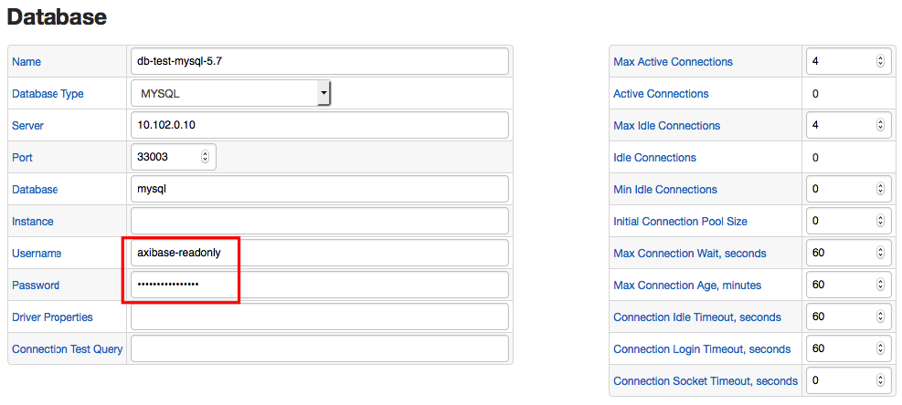

Click **Meta Data** to test the connection.

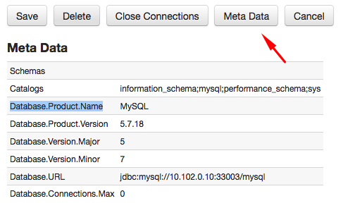

Execute a sample query to verify permissions.

Add [`LIMIT`](https://axibase.com/docs/atsd/sql/#limiting) clause to the test query to restrict the number of returned rows, just in case.

```sql
SELECT * FROM stat_orders_hourly_total LIMIT 5
```

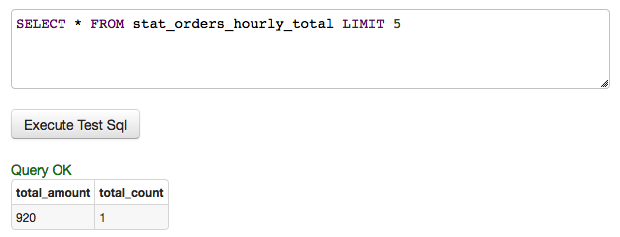

### Create JDBC Job

After the data source is configured and validated, create a new JDBC job on the **Jobs** tab.

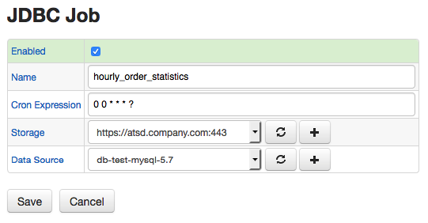

To execute the job once per hour, set schedule as `0 0 * * * ?`.

Each query requires a separate configuration in the JDBC job. The job executes configurations within one job sequentially to minimize the load on the database.

The configuration determines rules for mapping results of the query to ATSD schema.

The ATSD schema requires that each series have an entity name, metric name, time, and value. Optionally, set [series tags](https://axibase.com/docs/atsd/#glossary) for series with extra dimensions.

Both of the queries below store data under the manually specified `ops_db` value.

Set a common `orders.` metric prefix to distinguish these series from other similarly named metrics and avoid naming collision.

> Accomplish the same result by modifying column aliases, which is less convenient in case of `SELECT *` queries.

* Configuration for `stat_orders_hourly_total` view:

This query does not have any text columns and as such does not require any series tags.

```ls
series e:ops_db d:2018-04-18T10:24:08.493Z m:orders.total_amount=920 m:orders.total_count=1
```

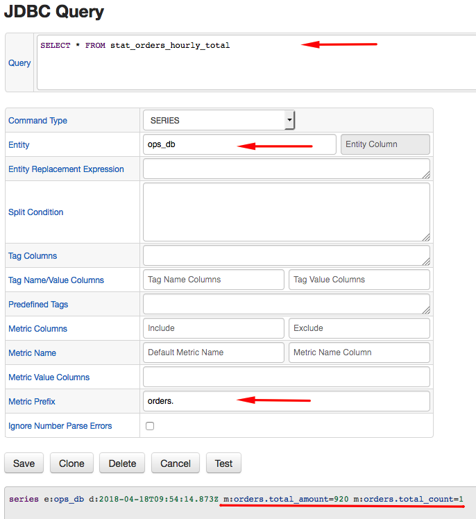

* Configuration for `stat_orders_hourly_detail` view:

This query extracts customer name as an extra dimension which is captured with the `customer` tag in the configuration.

```ls
series e:ops_db d:2018-04-18T10:25:10.126Z t:customer=eBank m:orders.customer_amount=920 m:orders.customer_count=1
```

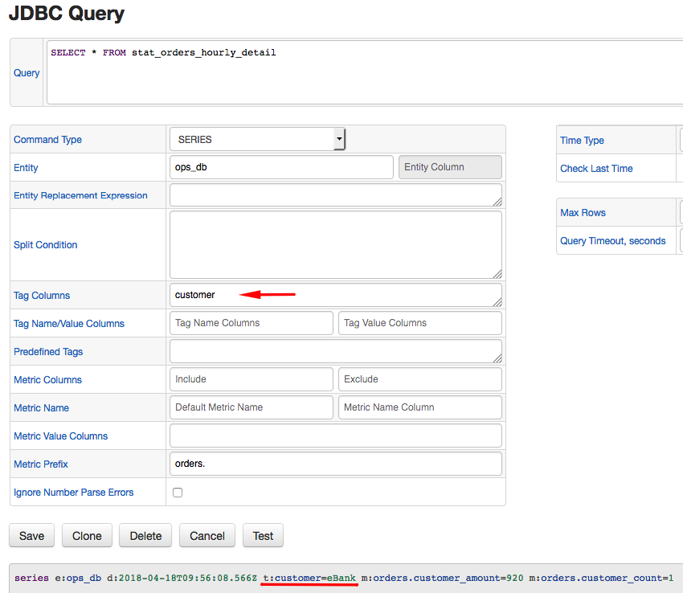

Ensure that the job is enabled.

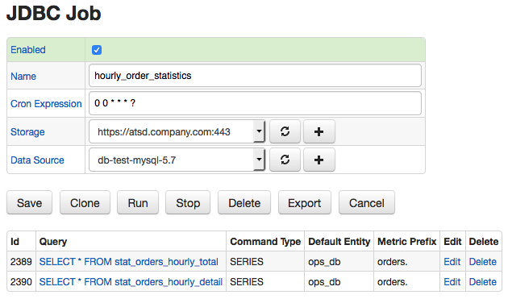

Click **Run** to execute the job manually for the first time.

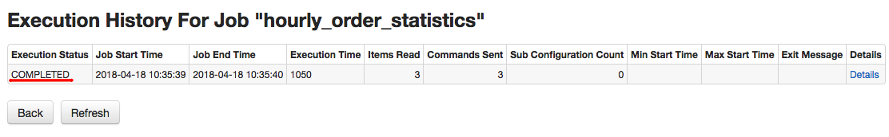

## Locate Metrics in ATSD

Locate the series collected by Collector in ATSD using series search, metrics for entity, metrics by name, etc.

Open the **Metrics** tab and search metrics by name or prefix.

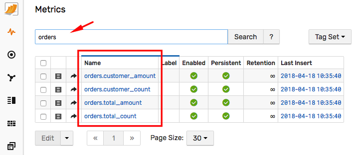

To view individual series, click the **Series** icon and then the chart link.

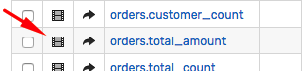

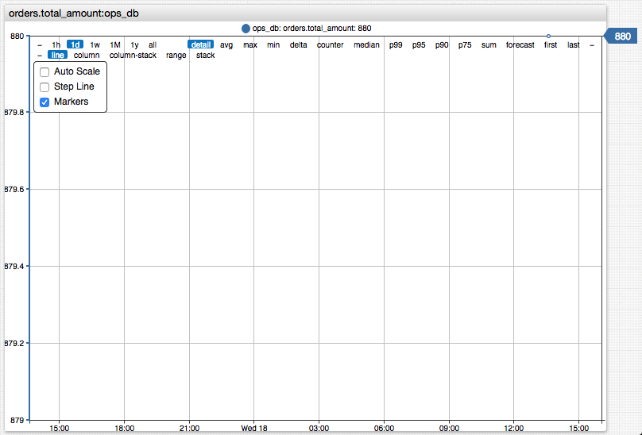

## Monitoring Data

Data being continuously inserted into ATSD by Collector enables:

* Data visualization with [portals](https://axibase.com/docs/atsd/portals/). Show hourly orders overlaid with previous day/week/etc.

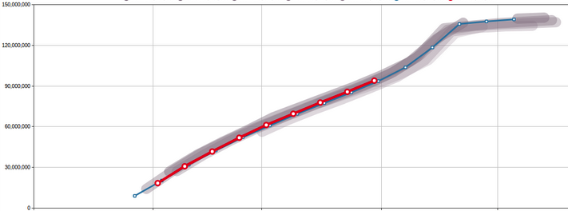

* Automated [forecasting](https://axibase.com/docs/atsd/forecasting/).
* The creation of Slack/email [alerts](https://axibase.com/docs/atsd/rule-engine/notifications/#creating-notifications) using the [Rule Engine](https://axibase.com/docs/atsd/rule-engine/) which notifies upon abnormal order activity.
