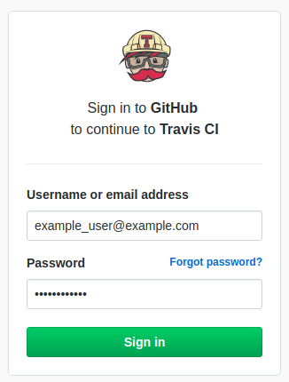

# Deploying Axibase Technical Writing Guidelines


## Overview

This tutorial demonstrates the application of [Axibase Technical Writing Guidelines](../../workshop/technical-writing.md) to a local GitHub repository. Manage your software documentation directly in the GitHub interface with all of the tools available from a more purpose-specific service. This process uses the [Travis CI](https://docs.travis-ci.com/) continuous integration tool to automatically review newly created pull requests for [`markdownlint` errors](https://github.com/markdownlint/markdownlint/blob/master/docs/RULES.md#rules) and user-defined syntax rules as well as [ATSD](https://axibase.com/docs/atsd/) for email and messenger notifications via webhook. Follow this procedure to enable checks on any local repository.

## Getting Started

Visit the [Travis CI](https://travis-ci.com/) website and click **Sign up with GitHub**.


Complete the Sign-In form with valid GitHub credentials to connect the Travis CI tool to your GitHub profile. Note that Travis CI does not support use with more than 50 repositories.



Click **Activate** on the following page to assign Travis CI to one or more repositories in your personal library.

On the subsequent GitHub page under the **Repository Access** header, set preferences to enable the tool for one or more repositories. Click **Approve and install** once you have defined the correct repositories.


## Installing Travis CI

Each repository monitored by the Travis CI tool requires a `.travis.yml` file which defines the build configuration.

Download the included [`.travis.yml`](./resources/.travis.yml) file from the `/resources` directory and upload it to the repositories which are to be monitored. The file is visible in the base directory for each monitored repository.


The `.travis.yml` file references the `.travis-functions.sh` file which controls certain components of the tool such as the repository language and custom dictionary.

```sh
spellchecker --language=en-US
```

Download the [`.travis-functions.sh`](./resources/.travis-functions.sh) file from the attached `/resources` directory and upload it to your monitored repositories.

After uploading the `.travis.yml` and `.travis-functions.sh` files to your local repository, the tool is operational. New builds are triggered upon the opening of a new pull request, or any push made directly to a repository such as those performed by a repository administrator.


New pull requests are automatically checked by the Travis CI tool. To configure email and messenger notifications for completed builds, see [Configure Notifications](#configure-notifications)

## Configuring Custom Rules

The attached configuration contains a number of [custom rules](https://github.com/axibase/docs-util#custom-rules) which reflect the guidelines outlined in the [Axibase Technical Writing Style Guide](../../workshop/technical-writing.md). Modify existing custom rules or create your own according to the instructions in the [How To Add Custom `markdownlint` Rules Tutorial](https://github.com/axibase/docs-util/blob/master/docs/CONTRIBUTING.md#how-to-add-custom-markdownlint-rule).

### Custom Dictionaries

By default, the Travis CI tool is configured to use words included in the `.dictionary-*` files. These documents are divided into two categories: [**Names**](https://github.com/axibase/atsd/blob/master/.dictionary-names) and [**Other**](https://github.com/axibase/atsd/blob/master/.dictionary-other). Words in `.dictionary-names` are **case sensitive** and must be expressed with letters capitalized exactly as they are in the dictionary. Words in `.dictionary-other` can be expressed in upper or lower case as the situation requires and can optionally include syntax which allows plural forms to be used.

```txt
acknowledgement[s]?
```

Append `[s]?` to the end of the word to support plural forms of the word.

To modify words included in the dictionary create a local `.dictionary` file, optionally append `-names` or `-other` if necessary. Words included in these files are converted to regular expressions which are recognized by Travis CI during the `spellcheck` portion of the build process. To replace the base dictionary and create a new dictionary from scratch, modify the `BASE_DICTIONARY` parameter in [`dictionaries_generator.py`](./resources/dictionaries_generator.py):

```python
BASE_DICTIONARY_LOCATION = "https://raw.githubusercontent.com/path/to/dictionary/"
```

Upload the modified file to the target repository.

Default dictionaries are generated by [Python script](https://raw.githubusercontent.com/axibase/docs-util/master/python-scripts/dictionaries_generator.py) and contain common abbreviations such as units of measurement (`GWh`, `lbs`, etc.), days of the week (`Mon`, `Tue`, etc.), US state abbreviations (`CA`, `WA`, etc.) among others.

### Ignoring Link Patterns

Because of the nature of the Travis CI tool, some active URLs are read as invalid. This is caused by sites which require an additional authorization such as CAPTCHA, or which take more than ten seconds to resolve as valid.

To convene a list of links to be ignored by Travis CI, create a local JSON document called `.linkcheck-config.json`.

```JSON
{
    "ignorePatterns":[
        {"pattern": "https://example.org"},
    ]
}
```

Update the list to include those URL patterns which are to be ignored by the tool during the `linkcheck` phase of the build process.

On line 37 of `.travis-functions.sh`, define the literal URL link to the file whose contents include the enumeration of links to be ignored by Travis CI if the file is not stored locally in the directory.

```json
wget https://raw.githubusercontent.com/axibase/atsd/master/.linkcheck-config.json
```

Refer to the Axibase `linkcheck` document for a formatting template.

## Usage

Travis CI automatically triggers a new build each time a pull request is opened or a new push is performed to the subscribed repositories.

The configuration files attached in the `/resources` directory contain a webhook which notifies the GitHub user via the email address attached to their account upon build completion, thus no further configuration is required to receive email notices. Notification emails contain a link to the newly finished build.


Pull requests associated with failing builds can be merged without correcting the errors therein.

Builds associated with repositories without any errors are passing builds, designated by the green box at the top of the build page.


Within the GitHub interface, build statistics are displayed on the **Conversation** page.


## Configure Notifications

ATSD supports incoming and outgoing webhooks for use with GitHub notifications. Launch ATSD via one of the available [deployment methods](https://axibase.com/docs/atsd/installation/). Configure [Travis CI Incoming Webhooks](https://axibase.com/docs/atsd/rule-engine/incoming-webhooks.html#travis-ci) to begin receiving notifications upon build completion.

Webhook is visible on line 18 of the attached `.travis.yml` file:

```json
webhooks: https://apps.axibase.com/api/v1/messages/wk-travis-ci/travis-ci?json.parse=payload&exclude=payload.id;payload.number;payload.config*;payload.repository*;payload.matrix*;payload.*commit*;payload.status_message;payload.result&include=payload.repository.name&command.message=payload.result_message
```

Complete [Mail Client](https://axibase.com/docs/atsd/administration/mail-client.html) and [Outgoing Webhook](https://axibase.com/docs/atsd/rule-engine/notifications/) configuration to define where notifications messages are sent by ATSD.


Notifications for pull requests which pass all applied checks contain a link to the newly opened pull request.

Messages associated with failing pull requests contain links to compare the new and old branches, the author name and email address, as well as a link to the failing build for inspection.


