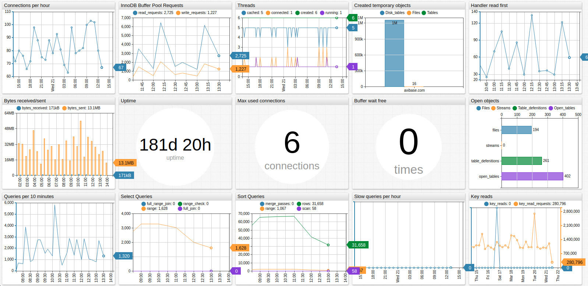
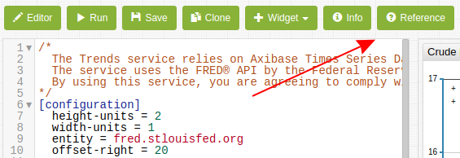

# Using Trends



## Overview

[**Trends**](https://trends.axibase.com/) is a data visualization sandbox based on the [Axibase Charts](https://axibase.com/products/axibase-time-series-database/visualization/widgets/) library which uses ATSD to provide essential data storage and processing tasks. Trends contains data from the Federal Reserve database [FRED](https://fred.stlouisfed.org/).

The **Trends** service enables users to interact with data by creating custom visualizations as well as modifying examples shared by other users.

**Trends** does not require readers to be proficient in any programming language however a certain familiarity with key concepts and general schema is helpful.

## Syntax

**Trends** uses a convenient [syntax](https://axibase.com/products/axibase-time-series-database/visualization/widgets/) to create graphs, briefly described by this guide. Feel free to ask questions or suggest datasets or topics by raising an issues on the [Axibase GitHub](https://github.com/axibase/atsd-use-cases/issues) page.

In the **Editor** window you see the configuration for the current portal. All portals have several levels of settings:

* `[configuration]`: Overall settings for the entire portal. Even the most complex visualizations have one set of `[configuration]` settings. Define base parameters for the portal such as layout, offset, formatting, as well as the default parameters that are inherited by all widgets in the portal.

* `[group]`: **Trends** defines each row of widgets as a group. `[group]` level settings are applied to an entire row by the service.

* `[widget]`: Widget represents a chart. Define the [type](https://axibase.com/products/axibase-time-series-database/visualization/widgets/) of chart and other parameters such as title, timespan, formatting.

For detailed information about `[widget]` level settings, see additional [Charts Documentation](https://axibase.com/products/axibase-time-series-database/visualization/widgets/configuring-the-widgets/#series).

* `[series]`: Each widget must have at least one series. A series is an ordered and timestamped array of samples loaded from the database and visualized by the widget. `[series]` settings include the metric name, entity name, optional tags, as well as any series-specific transformations.

Read more about selecting series in the [Charts Documentation](https://axibase.com/products/axibase-time-series-database/visualization/widgets/selecting-series/).

> Configure some settings at multiple levels. Settings defined at the `[configuration]` level are inherited by nested levels: `[group]` > `[widget]` > `[series]`. Settings defined at the lower level override those set at the upper level. For example, if you define an entity `x` at the `[configuration]` level for several widgets, and at the `[series]` level for one chart you define a different entity `y`, the service uses entity `x` for all widgets **EXCEPT** the one where you defined `entity = y`.  This is a useful setting when including an additional set of data from a unique entity.

## Metrics Reference Page

For a [listing](https://trends.axibase.com/public/reference.html) of available metrics stored in ATSD and accessible to **Trends** users, click the **Reference** button in the top toolbar.



On the **Reference** page, you see a list of all metrics stored by **Trends**.

Search available metrics in the **Search Bar**.


Filter dictionary columns by value. Click the **Filter** icon to open the menu of available values.


Preview metrics with the **Portal** icon. Click the icon to open a preview of the data associated with the particular metric.


## Modifying Portals

Open the **Editor** window in the **Trends** interface by clicking the button in the top menu.


[](https://trends.axibase.com/e91b896e#fullscreen)

Using the chart above as a configuration example:

```ls
[configuration]
  height-units = 2
  width-units = 1
  offset-right = 20
  entity = fred.stlouisfed.org

  [group]
    [widget]
      title = Crude Birth Rates vs. Over 65 Population
      timespan = all
      markers = false
      type = chart
      starttime = 1980
      endtime = 2016

      [series]
        metric = SPDYNCBRTINUSA
        label = Live Births per 1000 Individuals
        style = stroke-width: 2

      [series]
        metric = SPPOP65UPTOZSUSA
        label = Over 65 Population (Percent of Total)
        replace-value = value/100
        format = %
        axis = right
        style = stroke-width: 2
```

Modify these settings or add new settings based on Charts syntax. Additionally, perform ad hoc transformations according to the [Calculated Values](../../tutorials//calculated-values), which details common transformations. which details common transformations. For more information about advanced portal configuration, refer to the [Portal Layout Guide](https://axibase.com/products/axibase-time-series-database/visualization/widgets/portal-settings/).

Likewise, derive new series from existing data according to [Managing Calculated Values](../../tutorials//add-calculated-value/README.md), which shows each step from one series to another.

For baselines and thresholds, manually input data using the `value = x` setting at the `[series]` level, where `x` is a constant value.

Once you modify a configuration, click **Run** to apply the new settings.


If you would like to create a new version of the current portal by adding a version suffix to the current URL, click **Save**.

To save the portal under an entirely new URL click **Clone**.


**Trends** is a sandbox for everyone, create your own charts and share the chart with others.

## Pre-Defined Widgets

Click the **Widgets** button in the upper toolbar to copy pre-defined widget sections, use these widgets as templates for unique charts.


The two pre-defined widgets are described below:

* **Inflation Index**: Experimental Consumer Price Index (CPIE) is the measure of a particular basket of consumer goods. It is often used by economists to track inflation across a given period of time or compare current dollar value to historic dollar value.

* **Annual Inflation**: Percentile inflation for the United States. Inflation is calculated by comparing CPI, money supply, gross domestic product (GDP), and average wages. This widget relies on calculated metrics to created a derived measurement.

## User-Defined Functions

The Charts API supports user-defined functions, enabling users to store and re-use statistical functions.


[](https://trends.axibase.com/3a3b1c01#fullscreen)

The above visualization applies user-defined functions for each of the series. An abbreviated version of the configuration is shown here:

```ls
### On the [configuration] level, the 'import' command is used to load functions from the `fred.js` file
### The library is assigned the name 'fred'.
### Multiple function libraries may be imported into the same portal.

[configuration]
  import fred = fred.js

  offset-right = 50
  height-units = 2
  width-units = 1
  start-time = 1980

  entity = fred.stlouisfed.org
  metric = unrate

[series]
  alias = base
  display = false

[series]
  value = fred.MonthlyChange('base')
```

Using two series, **Trends** calculates the monthly change as a new series with a `value` expression which applies `MonthlyChange` function from the `fred` library to the series identified with alias `base`.

### `fred` Library

Any **Trends** user may access the `fred.js` library, which contains the following functions:

| Function Name                      | Arguments       | Description |
|------------------------------------|-----------------|-------------|
| [`MonthlyChange`](https://trends.axibase.com/c5e043b5)                      | alias           | Month-on-month change |
| [`ChangeFromYearAgo`](https://trends.axibase.com/34165ff1)                  | alias           | Year-on-year change |
| [`ChangeByOffset`](https://trends.axibase.com/90cfadae)                     | alias, [interval](https://axibase.com/products/axibase-time-series-database/visualization/end-time/) | Customizable interval-on-interval change |
| [`MonthlyPercentChange`](https://trends.axibase.com/7bca24b2)               | alias           | Month-on-month percent change |
| [`PercentChangeFromYearAgo`](https://trends.axibase.com/44627e1d)           | alias           | Year-on-year percent change |
| [`PercentChangeByOffset`](https://trends.axibase.com/b0deb565)              | alias, [interval](https://axibase.com/products/axibase-time-series-database/visualization/end-time/) | Customizable interval-on-interval change |
| [`CompoundedAnnualRateOfChange`](https://trends.axibase.com/f04b65fc)       | alias           | Geometric-progression ratio which compounds change annually
| [`ContinuouslyCompoundedRateOfChange`](https://trends.axibase.com/16ea90bf) | alias           | Geometric-progression ratio which continuously compounds change over an infinitesimally small interval
| [`NaturalLog`](https://trends.axibase.com/897f53e1)                         | alias           | Natural Logarithm (`LOG` base constant `e`)
| [`IndexMax`](https://trends.axibase.com/3db3bfa7)                           | alias           | Maximum series value is used as index value
| [`Index`](https://trends.axibase.com/964a4b97)                              | alias, [time](https://axibase.com/products/axibase-time-series-database/visualization/end-time/)     | User-selected value is used as index value

Open any of the visualizations above to see syntax and visual demonstrations of each function.

## Further Reading

For more detailed information about ATSD, the underlying mechanics, or download instructions see the [ATSD Documentation](https://axibase.com/docs/atsd/).

Reach out with questions, comments, or suggestions by raising an [issue](https://github.com/axibase/atsd-use-cases/issues) on the Axibase GitHub page.

For a complete list of metrics stored in **Trends**, see the [Index](https://trends.axibase.com/public/reference.html). Good luck and happy data hunting!