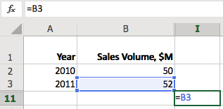
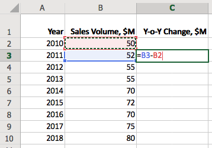
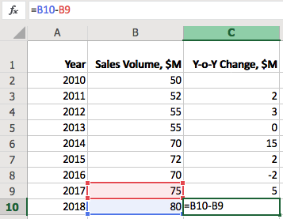
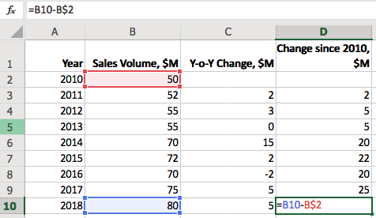
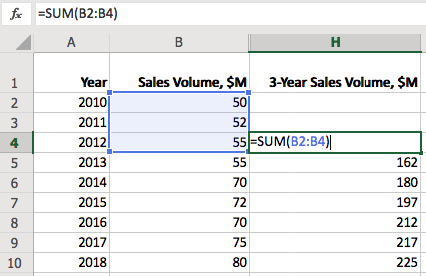
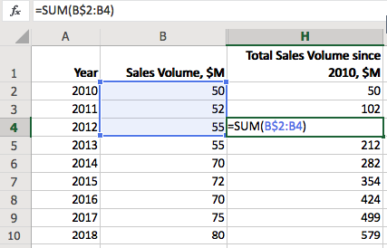

# Cell References in SQL and Excel

## Overview

This article contains examples of how analytic functions in SQL can be used to emulate step-by-step calculations in Microsoft Excel.

**Analytic** functions in SQL allow developers to access grouped statistics without reducing the number of rows returned by the query.

```sql
SELECT value,
  -- SUM calculated without GROUP BY
  value/SUM(value) OVER() AS weight
  FROM table-name
ORDER BY weight DESC
```

Often called **windowing** functions due to their ability to operate on ordered and partitioned groups of records, analytic functions are different from **aggregate** functions which reduce several rows into a **single** result row.

Many aggregate functions such as `SUM`, `AVG`, and `COUNT` can be invoked as analytic functions using the `OVER` clause. However the class of analytic functions also includes **reference** functions which operate on an ordered set of records. Such reference functions include:

* `LAG`. Provides access to a previous row at a specified offset from the current position.
* `LEAD`. Provides access to a following row at a specified offset from the current position.
* `FIRST_VALUE`. Provides access to the first row.
* `LAST_VALUE`. Provides access to the last row.

## Documentation Links

* ATSD [`LAG`](https://axibase.com/docs/atsd/sql/#lag) function
* Oracle [`LAG`](https://docs.oracle.com/cd/B19306_01/server.102/b14200/functions070.htm) function
* Excel [`cell referencing`](https://support.office.com/en-us/article/switch-between-relative-absolute-and-mixed-references-dfec08cd-ae65-4f56-839e-5f0d8d0baca9)

## Staged Calculations in Excel

To assist users in organizing complex analysis into step-by-step calculations, Excel provides a convenient `A1` [addressing](https://support.office.com/en-us/article/ADDRESS-function-D0C26C0D-3991-446B-8DE4-AB46431D4F89) notation, or reference style, to pass calculation results between cells _by value_:

* Columns are assigned letter names, starting with `A` for the left-most column.
* Rows are assigned ordinal numbers, starting with `1` for the top row.
* `=B2` returns the value of cell located in column `B` and row `2`.
* `=B3 - B2` returns the difference between values of cells `B3` and `B2`.

  

Users can easily calculate the year-over-year change by entering `=B3 - B2` formula as the value of the current cell.



Since the reference in relative, the row and column indexes are automatically updated when we copy the cell value to the remaining cells in the `Y-o-Y Change, $M` column.



The above references are relative to the current cell position but they can also refer to an absolute address using `$` prefix, for example `=B3 - B$2` to calculate change in sales since 2010.



## Referencing in SQL

The purpose of the [`LAG`](https://axibase.com/docs/atsd/sql/#lag) and [`LEAD`](https://axibase.com/docs/atsd/sql/#lag) functions in SQL is similar - to access a column value in a preceding or following row.

Assuming the same dataset is loaded in the database, it can be queried with a `SELECT` statement as follows:

```sql
SELECT date_format(time, 'yyyy') AS "Year",
  value AS "Sales Volume, $M"
FROM "win-sales"
  ORDER BY time
```

```txt
| Year | Sales Volume, $M |
|------|------------------|
| 2010 |               50 |
| 2011 |               52 |
| 2012 |               55 |
| 2013 |               55 |
| 2014 |               70 |
| 2015 |               72 |
| 2016 |               70 |
| 2017 |               75 |
| 2018 |               80 |
```

### Relative References

Similar to Excel, the reference in `LAG` function consists of the column name and the row offset, which starts with `1` by default. Excel assigns column names automatically, starting with `A` (up to 16,384 are allowed). In SQL, the function must to refer to the name of an existing column or alias such as `LAG(value)`.

```sql
SELECT date_format(time, 'yyyy') AS "Year",
  value AS "Sales Volume, $M",
  LAG(value) AS "Previous Sales Volume, $M",
  value - LAG(value) AS "Y-o-Y Change, $M"
FROM "win-sales"
```

```txt
| Year | Sales Volume, $M | Previous Sales Volume, $M | Y-o-Y Change, $M |
|------|------------------|---------------------------|------------------|
| 2010 |               50 |                           |                  |
| 2011 |               52 |                        50 |                2 |
| 2012 |               55 |                        52 |                3 |
| 2013 |               55 |                        55 |                0 |
| 2014 |               70 |                        55 |               15 |
| 2015 |               72 |                        70 |                2 |
| 2016 |               70 |                        72 |               -2 |
| 2017 |               75 |                        70 |                5 |
| 2018 |               80 |                        75 |                5 |
```

The `value - LAG(value)` expression returns the same results as `=B3 - B2` in Excel. In this case `B` and `value` are equivalent column names.

To accomplish the same result in Oracle Database, add [`OVER`](https://docs.oracle.com/cd/E11882_01/server.112/e41084/functions004.htm#SQLRF06174) clause after each analytical function.

* Oracle SQL version:

```sql
SELECT time AS "Year",
  value AS "Sales Volume, $M",
  LAG(value) OVER (ORDER BY time) AS "Previous Sales Volume, $M",
  value - LAG(value) OVER (ORDER BY time) AS "Y-o-Y Change, $M"
FROM win_sales
```

### Absolute References

`FIRST` and `LAST` functions can be used to access first and last rows in the partition respectively. This is equivalent to `=B3 - B$2` in Excel which calculates the change in sales since 2010.

```sql
SELECT date_format(time, 'yyyy') AS "Year",
  value AS "Sales Volume, $M",
  LAG(value) AS "Previous Sales Volume, $M",
  value - LAG(value) AS "Y-o-Y Change, $M",
  value - FIRST_VALUE(value) AS "Change since 2010, $M"
FROM "win-sales"
```

```txt
| Year | Sales Volume, $M | Previous Sales Volume, $M | Y-o-Y Change, $M | Change since 2010, $M |
|------|------------------|---------------------------|------------------|-----------------------|
| 2010 |               50 |                         0 |                0 |                     0 |
| 2011 |               52 |                        50 |                2 |                     2 |
| 2012 |               55 |                        52 |                3 |                     5 |
| 2013 |               55 |                        55 |                0 |                     5 |
| 2014 |               70 |                        55 |               15 |                    20 |
| 2015 |               72 |                        70 |                2 |                    22 |
| 2016 |               70 |                        72 |               -2 |                    20 |
| 2017 |               75 |                        70 |                5 |                    25 |
| 2018 |               80 |                        75 |                5 |                    30 |
```

* Oracle SQL version:

```sql
SELECT time AS "Year",
  value AS "Sales Volume, $M",
  LAG(value) OVER (ORDER BY time) AS "Previous Sales Volume, $M",
  value - LAG(value) OVER (ORDER BY time) AS "Y-o-Y Change, $M",
  value - FIRST_VALUE(value) OVER (ORDER BY time) AS "Change since 2010, $M"
FROM win_sales
```

### Aggregate Functions

#### Sliding Total

To calculate a running (sliding) total in Excel, one can pass a relative range of cell values, for example: `=SUM(B2:B4)`.



To return the same result in SQL one can add `LAG` results with increasing offsets.

```sql
SELECT date_format(time, 'yyyy') AS "Year",
  value AS "Sales Volume, $M",
  value + LAG(value) + LAG(value,2) AS "3-Year Sales Volume, $M"
FROM "win-sales"
```

```txt
| Year | Sales Volume, $M | 3-Year Sales Volume, $M |
|------|------------------|-------------------------|
| 2010 |               50 |                         |
| 2011 |               52 |                         |
| 2012 |               55 |                     157 |
| 2013 |               55 |                     162 |
| 2014 |               70 |                     180 |
| 2015 |               72 |                     197 |
| 2016 |               70 |                     212 |
| 2017 |               75 |                     217 |
| 2018 |               80 |                     225 |
```

* Oracle SQL version:

```sql
SELECT time AS "Year",
  value AS "Sales Volume, $M",
  value + LAG(value) OVER (ORDER BY time) + LAG(value,2) OVER (ORDER BY time) AS "3-Year Sales Volume, $M"
FROM win_sales
```

However, if the number of rows is large enough, applying an aggregate function to all values within the fixed-length partition is more efficient.

```sql
SELECT date_format(time, 'yyyy') AS "Year",
  value AS "Sales Volume, $M",
  SUM(value) AS "3-Year Sales Volume, $M"
FROM "win-sales"
  WITH ROW_NUMBER(entity, tags ORDER BY time) <= 3
```

The above query produces the same result using the `SUM` function with the size of the sliding window controlled in the `ROW_NUMBER` clause.

* Oracle version:

```sql
SELECT time AS "Year",
  value AS "Sales Volume, $M",
  SUM(value) OVER(ORDER BY time ROWS BETWEEN 2 PRECEDING AND CURRENT ROW) AS "3-Year Sales Volume, $M"
FROM win_sales
```

#### Growing Total

To calculate a growing total in Excel, set the starting row to an absolute value `=SUM(B$2:B4)`.



To calculate a growing total for all values in the column in SQL, create a single partition ordered by time and disable row filtering with `ROW_NUMBER > 0`.

```sql
SELECT date_format(time, 'yyyy') AS "Year",
  value AS "Sales Volume, $M",
  SUM(value) AS "Total Volume since 2010, $M"
FROM "win-sales"
  WITH ROW_NUMBER(entity, tags ORDER BY time) > 0
```

```txt
| Year | Sales Volume, $M | Total Volume since 2010, $M |
|------|------------------|-----------------------------|
| 2010 |               50 |                          50 |
| 2011 |               52 |                         102 |
| 2012 |               55 |                         157 |
| 2013 |               55 |                         212 |
| 2014 |               70 |                         282 |
| 2015 |               72 |                         354 |
| 2016 |               70 |                         424 |
| 2017 |               75 |                         499 |
| 2018 |               80 |                         579 |
```

* Oracle SQL version:

```sql
SELECT time AS "Year",
  value AS "Sales Volume, $M",
  SUM(value) OVER (ORDER BY time) AS "Total Volume since 2010, $M"
FROM win_sales
```

### Appendix: Sample Dataset

* ATSD data commands

```ls
series e:win-test d:2010-01-01T00:00:00Z m:win-sales=50
series e:win-test d:2011-01-01T00:00:00Z m:win-sales=52
series e:win-test d:2012-01-01T00:00:00Z m:win-sales=55
series e:win-test d:2013-01-01T00:00:00Z m:win-sales=55
series e:win-test d:2014-01-01T00:00:00Z m:win-sales=70
series e:win-test d:2015-01-01T00:00:00Z m:win-sales=72
series e:win-test d:2016-01-01T00:00:00Z m:win-sales=70
series e:win-test d:2017-01-01T00:00:00Z m:win-sales=75
series e:win-test d:2018-01-01T00:00:00Z m:win-sales=80
```

* Oracle SQL:

```sql
CREATE TABLE win_sales (
 time int,
 value NUMBER
)
```

```sql
INSERT INTO win_sales (time, value) VALUES (2010, 50);
INSERT INTO win_sales (time, value) VALUES (2011, 52);
INSERT INTO win_sales (time, value) VALUES (2012, 55);
INSERT INTO win_sales (time, value) VALUES (2013, 55);
INSERT INTO win_sales (time, value) VALUES (2014, 70);
INSERT INTO win_sales (time, value) VALUES (2015, 72);
INSERT INTO win_sales (time, value) VALUES (2016, 70);
INSERT INTO win_sales (time, value) VALUES (2017, 75);
INSERT INTO win_sales (time, value) VALUES (2018, 80);
```