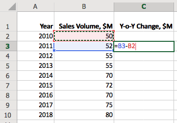
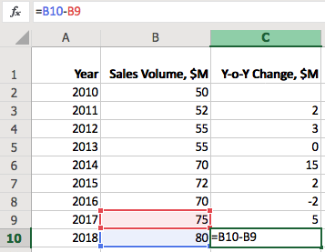
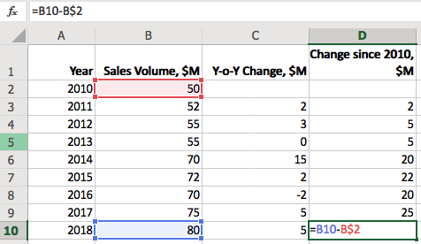

# Window Functions in SQL

## Overview

It is probably an overstatement, but [`LAG`](https://axibase.com/docs/atsd/sql/#lag) functions bring SQL as close as possible to [Excel reference style](../../blog/excel.md)  as possible.

## Referencing in Excel

In Excel, the user can refer to another cell by its address using one of the following notations to refer to rows and columns:

* `A1` reference style: `=B3-B2`
* `R1C1` reference style: `=RC[-1] - R[-1]C[-1]`

The following table contains time series data which shows the amount of goods sold since 2010.

```txt
| Year | Sales Volume, $M |
|------|------------------|
| 2010 |               50 |
| 2011 |               52 |
| 2012 |               55 |
| 2013 |               55 |
| 2014 |               70 |
| 2015 |               72 |
| 2016 |               70 |
| 2017 |               75 |
| 2018 |               80 |
```

To calculate the year-over-year change, enter `=B3 - B2` as the value of the current cell.



Since the reference in relative, the row and column indexes are automaticaly updated when we copy the cell value to the remaining cells in the `Y-o-Y Change, $M` column.



The above references are relative to the current cell position but they can also refer to an absolute address using `$` prefix, for example `=B3 - B$2` to calculate change in sales since 1010.



## Referencing in SQL

The purpose of the [`LAG`](https://axibase.com/docs/atsd/sql/#lag) and [`LEAD`](https://axibase.com/docs/atsd/sql/#lag) window functions in SQL is similar - to provide an ability to reference a column value in one of the preceding or following columns.

Assuming the same dataset is loaded in the database, it can be queried with a `SELECT` statement as follows:

```sql
SELECT date_format(time, 'yyyy') AS "Year",
  value AS "Sales Volume, $M"
FROM "win-sales"
  ORDER BY time
```

```txt
| Year | Sales Volume, $M |
|------|------------------|
| 2010 |               50 |
| 2011 |               52 |
| 2012 |               55 |
| 2013 |               55 |
| 2014 |               70 |
| 2015 |               72 |
| 2016 |               70 |
| 2017 |               75 |
| 2018 |               80 |
```

:::tip Tip
Note that unless `ORDER BY` is specified in the query, the database does not guarantee the particular order of rows. Always add `ORDER BY` clause if sorting is necessary for the results to be correct. In this particular case, the results are sorted by `time` column in ascending order.
:::

### Relative References

Unlike Excel, the reference in `LAG` function consists of the column name and the offset index, which starts with `1` by default.

```sql
SELECT date_format(time, 'yyyy') AS "Year",
  value AS "Sales Volume, $M",
  LAG(value) AS "Previous Sales Volume, $M",
  value - LAG(value) AS "Y-o-Y Change, $M"
FROM "win-sales"
```

```txt
| Year | Sales Volume, $M | Previous Sales Volume, $M | Y-o-Y Change, $M |
|------|------------------|---------------------------|------------------|
| 2010 |               50 |                           |                  |
| 2011 |               52 |                        50 |                2 |
| 2012 |               55 |                        52 |                3 |
| 2013 |               55 |                        55 |                0 |
| 2014 |               70 |                        55 |               15 |
| 2015 |               72 |                        70 |                2 |
| 2016 |               70 |                        72 |               -2 |
| 2017 |               75 |                        70 |                5 |
| 2018 |               80 |                        75 |                5 |
```

The `value - LAG(value)` expression returns the same results as `B3 - B2` in Excel. In this case `B` and `value` are equivalent column names.