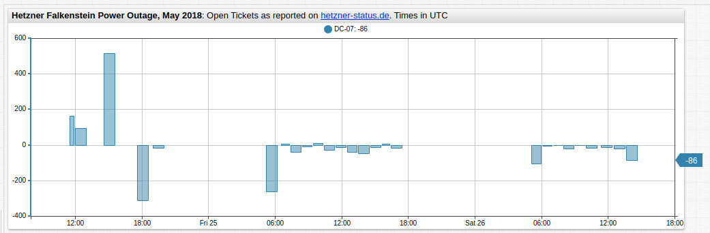

# Calculating the Difference Between Consecutive Series Values

## Purpose

ATSD has several methods to perform *ad hoc* calculations without modifying any underlying data. A common example is the computation of the difference between consecutive values for a given series.

This tutorial demonstrates such a calculation via three methods:

* [**SQL Console**](https://axibase.com/docs/atsd/sql/sql-console.html)
* [REST API `series: query`](https://axibase.com/docs/atsd/api/data/series/query.html)
* [Charts Functions](https://axibase.com/docs/charts/)

## Dataset

The dataset in this tutorial is represented by:

* Entity `hetzner`
* Metric `outage-tickets`
* Series tags: `DC=07`, `DC=10`, and `DC=12`

The `outage-tickets` metric measures the number of tickets open in the service provider support desk during a power outage incident.

> For more information about the dataset, refer to [Hetzner Outage, May 2018](../../chart-of-the-day/hetzner-outage/README.md)

## SQL Console

**SQL Console** is a web-based interface to submit [SQL queries](https://axibase.com/docs/atsd/sql) to ATSD and display the results.

```sql
SELECT datetime, value AS "VALUE", (value - LAG(value)) AS "DIFF"
  FROM "outage-tickets"
WHERE entity = 'hetzner' AND tags.dc = '07'
  ORDER BY datetime
```

Compute the difference between consecutive values with the [`LAG`](https://axibase.com/docs/atsd/sql/#lag) function. When `LAG` encounters a non-existent sample, it returns [`null`](https://axibase.com/docs/atsd/sql/#null).

```txt
| datetime             | VALUE| DIFF |
|----------------------|------|------|
| 2018-05-24T10:43:00Z | 237  | null |
| 2018-05-24T11:29:00Z | 402  | 165  |
| 2018-05-24T12:00:00Z | 497  | 95   |
| 2018-05-24T14:36:00Z | 1013 | 516  |
| 2018-05-24T17:35:00Z | 704  | -309 |
| 2018-05-24T19:01:00Z | 690  | -14  |
| 2018-05-25T05:13:00Z | 429  | -261 |
| 2018-05-25T06:34:00Z | 437  | 8    |
| 2018-05-25T07:25:00Z | 398  | -39  |
| 2018-05-25T08:29:00Z | 390  | -8   |
| 2018-05-25T09:28:00Z | 401  | 11   |
| 2018-05-25T10:25:00Z | 374  | -27  |
| 2018-05-25T11:30:00Z | 362  | -12  |
| 2018-05-25T12:30:00Z | 324  | -38  |
| 2018-05-25T13:29:00Z | 279  | -45  |
| 2018-05-25T14:36:00Z | 266  | -13  |
| 2018-05-25T15:38:00Z | 272  | 6    |
| 2018-05-25T16:27:00Z | 256  | -16  |
| 2018-05-26T05:05:00Z | 151  | -105 |
| 2018-05-26T06:04:00Z | 149  | -2   |
| 2018-05-26T07:06:00Z | 149  | 0    |
| 2018-05-26T08:00:00Z | 130  | -19  |
| 2018-05-26T09:03:00Z | 131  | 1    |
| 2018-05-26T10:02:00Z | 117  | -14  |
| 2018-05-26T11:22:00Z | 105  | -12  |
| 2018-05-26T12:31:00Z | 86   | -19  |
| 2018-05-26T13:38:00Z | 0    | -86  |
```

To filter data for another series tag, modify the `tags.dc` condition in the [`WHERE`](https://axibase.com/docs/atsd/sql/#where-clause) clause.

## Series Query

The [`series: query`](https://axibase.com/docs/atsd/api/data/series/query.html) API endpoint allows you to query time series records for specified metric, entity, tag, and interval filters.

```json
[{
    "startDate": "2018-05-24T00:00:00Z",
    "endDate": "2018-05-27T00:00:00Z",
    "entity": "hetzner",
    "metric": "outage-tickets",
    "tags": {"dc" : "07"}
}]
```

```json
[{"entity":"hetzner","metric":"outage-tickets","tags":{"dc":"07"},"type":"HISTORY","aggregate":{"type":"DETAIL"},"data":[
{"d":"2018-05-24T10:43:00","v":237.0},
{"d":"2018-05-24T11:29:00","v":402.0},
{"d":"2018-05-24T12:00:00","v":497.0},
{"d":"2018-05-24T14:36:00","v":1013.0},
{"d":"2018-05-24T17:35:00","v":704.0},
{"d":"2018-05-24T19:01:00","v":690.0},
{"d":"2018-05-25T05:13:00","v":429.0},
{"d":"2018-05-25T06:34:00","v":437.0},
{"d":"2018-05-25T07:25:00","v":398.0},
{"d":"2018-05-25T08:29:00","v":390.0},
{"d":"2018-05-25T09:28:00","v":401.0},
{"d":"2018-05-25T10:25:00","v":374.0},
{"d":"2018-05-25T11:30:00","v":362.0},
{"d":"2018-05-25T12:30:00","v":324.0},
{"d":"2018-05-25T13:29:00","v":279.0},
{"d":"2018-05-25T14:36:00","v":266.0},
{"d":"2018-05-25T15:38:00","v":272.0},
{"d":"2018-05-25T16:27:00","v":256.0},
{"d":"2018-05-26T05:05:00","v":151.0},
{"d":"2018-05-26T06:04:00","v":149.0},
{"d":"2018-05-26T07:06:00","v":149.0},
{"d":"2018-05-26T08:00:00","v":130.0},
{"d":"2018-05-26T09:03:00","v":131.0},
{"d":"2018-05-26T10:02:00","v":117.0},
{"d":"2018-05-26T11:22:00","v":105.0},
{"d":"2018-05-26T12:31:00","v":86.0},
{"d":"2018-05-26T13:38:00","v":0.0}]}]
```

Include [rate processor](https://axibase.com/docs/atsd/api/data/series/rate.html) to compute the difference between consecutive samples per unit of time, or rate period.

```json
"rate": {
  "period": {"count": 1, "unit": "MINUTE"},
  "counter": false
}
```

Omit the `period` parameter, or set its count to zero, to return the difference between consecutive samples.

```json
[{
    "startDate": "2018-05-20T00:00:00Z",
    "endDate": "2018-05-27T00:00:00Z",
    "entity": "hetzner",
    "metric": "outage-tickets",
    "tags": {"dc" : "07"},
    "rate": {
      "counter": false
     }
}]
```

```json
[{"entity":"hetzner","metric":"outage-tickets","tags":{"dc":"07"},"type":"HISTORY","aggregate":{"type":"DETAIL"},"rate":{"period":{"count":0,"unit":"SECOND"},"counter":false,"order":0},"data":[
{"d":"2018-05-24T11:29:00","v":165.0},
{"d":"2018-05-24T12:00:00","v":95.0},
{"d":"2018-05-24T14:36:00","v":516.0},
{"d":"2018-05-24T17:35:00","v":-309.0},
{"d":"2018-05-24T19:01:00","v":-14.0},
{"d":"2018-05-25T05:13:00","v":-261.0},
{"d":"2018-05-25T06:34:00","v":8.0},
{"d":"2018-05-25T07:25:00","v":-39.0},
{"d":"2018-05-25T08:29:00","v":-8.0},
{"d":"2018-05-25T09:28:00","v":11.0},
{"d":"2018-05-25T10:25:00","v":-27.0},
{"d":"2018-05-25T11:30:00","v":-12.0},
{"d":"2018-05-25T12:30:00","v":-38.0},
{"d":"2018-05-25T13:29:00","v":-45.0},
{"d":"2018-05-25T14:36:00","v":-13.0},
{"d":"2018-05-25T15:38:00","v":6.0},
{"d":"2018-05-25T16:27:00","v":-16.0},
{"d":"2018-05-26T05:05:00","v":-105.0},
{"d":"2018-05-26T06:04:00","v":-2.0},
{"d":"2018-05-26T07:06:00","v":0.0},
{"d":"2018-05-26T08:00:00","v":-19.0},
{"d":"2018-05-26T09:03:00","v":1.0},
{"d":"2018-05-26T10:02:00","v":-14.0},
{"d":"2018-05-26T11:22:00","v":-12.0},
{"d":"2018-05-26T12:31:00","v":-19.0},
{"d":"2018-05-26T13:38:00","v":-86.0}]}]
```

## Charts Functions

[Charts](https://axibase.com/docs/charts/) services provide several alternatives to visualize raw data and perform delta calculations in the browser.

The `outage-tickets` dataset visualized in **ChartLab**:


[](https://apps.axibase.com/chartlab/6d7ab88d#fullscreen)

To calculate and display the difference between consecutive values, there are three options.

### Rate Setting

Use the [`rate`](https://axibase.com/docs/charts/widgets/shared/#rate) setting to calculate the difference between the current data sample and the previous sample and return this amount in place of the current data sample.

```ls
[series]
  rate = 0 minute
  rate-counter = false
```

The `rate` setting defines the period to prorate the value change. The underlying formula is shown here:

*Sample Value* = (value<sub>1</sub> - value<sub>0</sub>) / (time<sub>1</sub> - time<sub>0</sub>) * `rate`

* value<sub>1</sub>: current value
* value<sub>0</sub>: previous value
* time<sub>1</sub>: current value in Unix milliseconds
* time<sub>0</sub>: previous value in Unix milliseconds
* `rate`: period in Unix milliseconds

For example, `rate = 1 minute` calculates the change in value (first derivative) per unit of time equal to **one** minute.

If the rate period is zero, the formula is:

*Sample Value* = value<sub>1</sub> - value<sub>0</sub>

The `rate-counter` parameter ignores negative differences when set to `true`.

The visualization created by the `rate` setting configuration is shown below.



[](https://apps.axibase.com/chartlab/6d7ab88d/2/)

### Create Derived Series Using `replace-value`

Use `value` and `previousValue` placeholders in the [`replace-value`](https://axibase.com/docs/charts/widgets/shared/#replace-value) function.

```ls
[series]
  replace-value = value - previousValue
```

[](https://apps.axibase.com/chartlab/af56007b#fullscreen)

### Derived Series Using Aliases

Create a derived series using the [`previous()`](https://axibase.com/docs/charts/syntax/functions.html#previous) function.  Hide both the raw series and the derived series. Create a third series and calculate the difference in consecutive values for each timestamp by referencing values of the hidden series.

```ls
/* raw series data */
[series]
 alias = raw
 display = false

/* series where each value is equal to previous value */
[series]
 value = previous('raw')
 alias = prev
 display = false

/* derived series that calculated the delta */
[series]
 value = value('raw') - value('prev')
```

[](https://apps.axibase.com/chartlab/a7b29712)

Both methods create the same visualization, shown below.


For more function examples, view [Charts Functions](https://axibase.com/docs/charts/syntax/functions.html#-functions).
