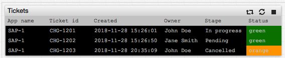
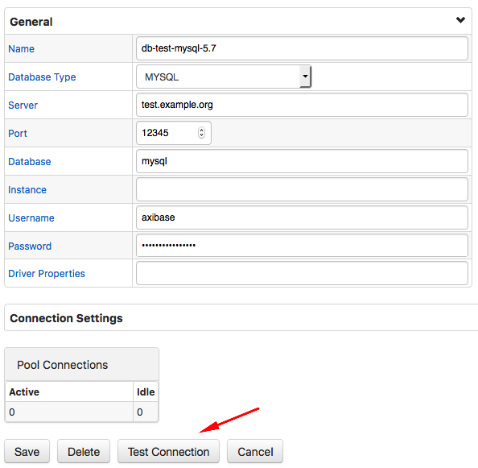
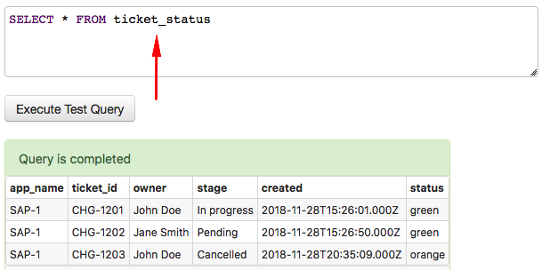
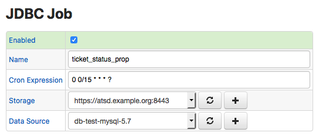
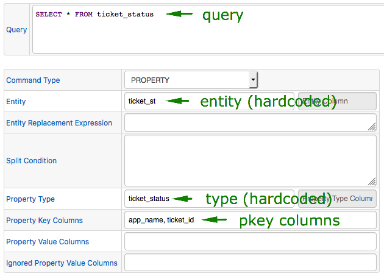
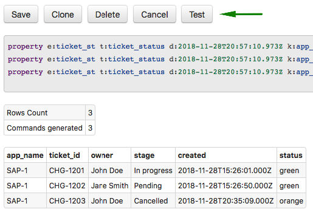
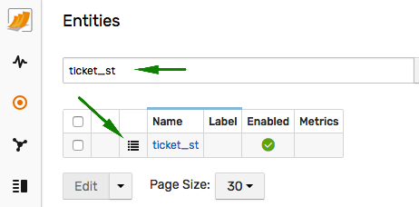
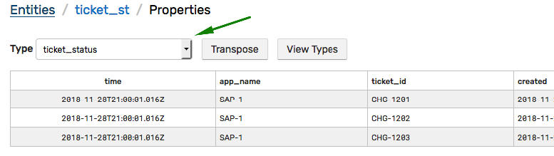

# Copying Static Data to ATSD

## Overview

This tutorial describes the process of copying static data (without a time dimension) from a relational database into [Axibase Time Series Database](https://axibase.com/docs/atsd/).



## Types of Static Data

* Configuration records
* Current alerts
* Active service tickets

## Objective

In this scenario, the results of a custom query need to be copied into ATSD with the most recently collected rows displayed in a [property table](https://axibase.com/docs/charts/widgets/property-table/).

The list of rows retrieved by the query at each iteration may change and the property table must contain the exact same records as retrieved by the query in the latest iteration.

## Solution

Schedule the custom query via [JDBC job](https://axibase.com/docs/axibase-collector/jobs/jdbc.html) in Axibase Collector to store results as `property` records in ATSD.

For added protection, execute the query under a `read-only` user account with the permission to `SELECT` data from a specific view encapsulating the query business logic.

---

### Analyze Data

Review query results to determine how to map columns to property fields.

Consider the following table that stores open service desk tickets.

```sql
CREATE TABLE ticket_status (
  app_name varchar(64),
  ticket_id varchar(64),
  owner varchar(128),
  stage varchar(16),
  created timestamp,
  status varchar(16)
);
```

```sql
INSERT INTO ticket_status (app_name, ticket_id, owner, stage, created, status)
  VALUES ('SAP-1', 'CHG-1201', 'John Doe', 'In progress', current_timestamp, 'green');
INSERT INTO ticket_status (app_name, ticket_id, owner, stage, created, status)
  VALUES ('SAP-1', 'CHG-1202', 'Jane Smith', 'Pending', current_timestamp, 'green');
INSERT INTO ticket_status (app_name, ticket_id, owner, stage, created, status)
  VALUES ('SAP-1', 'CHG-1203', 'John Doe', 'Cancelled', current_timestamp, 'orange');
```

```sql
SELECT * FROM ticket_status
```

```txt
| app_name  | ticket_id  | owner       | stage        | created                   | status |
|-----------|------------|-------------|--------------|---------------------------|--------|
| SAP-1     | CHG-1201   | John Doe    | In progress  | 2018-11-28T15:26:01.000Z  | green  |
| SAP-1     | CHG-1202   | Jane Smith  | Pending      | 2018-11-28T15:26:50.000Z  | green  |
| SAP-1     | CHG-1203   | John Doe    | Cancelled    | 2018-11-28T20:35:09.000Z  | orange |
```

* Records are stored in a company-wide database without separation by monitored object.
* Records are stored with a unique record identifier specified in the `ticket_id` column.
* It is not clear from the record if the `app_name` is part of the primary key.

### Create JDBC Job in Axibase Collector

#### Install Collector

Install [Axibase Collector](https://axibase.com/docs/axibase-collector/#installation).

#### Setup Data Source

Open the **Data Sources > Databases > Add** page and enter connection parameters to the target database.

Test the database connection.



Execute the custom query to validate permissions.



#### Create JDBC Job

Open the **Jobs > Add Job > JDBC** page.

Select the previously created data source and the target ATSD. Set the job to enabled status and customize the schedule as necessary. The default schedule is every 15 minutes.



Click **Create Configuration** and enter the query text.

Set property `type` to the name of the table, in this case `ticket_status`. If the query joins multiple tables, set property `type` to any value, for example to query name.

Based on the above schema, there is no entity dimension and therefore the entity field can be hard-coded to a constant value, such as `ticket_st`.

Two columns of the apparent primary key are `app_name` and `ticket_id`. Set these columns `key` fields in the property model.



Click **Test** to run the query and review `property` commands.



Save the configuration, click **Cancel** and execute the job manually, ahead of schedule, by clicking **Run**.

### Verify Data in ATSD

Open the **Entities** tab in the ATSD web interface.

Locate the `ticket_st` entity and click the **Properties** icon.



Select `ticket_status` in the **Type** drop-down list and review the records, which match rows retrieved by the query.



### Create Property Table

Create a new [portal](https://axibase.com/docs/atsd/portals/portals-overview.html) or open an existing portal to insert a [property table](https://axibase.com/docs/charts/widgets/property-table/).

The [`last`](https://axibase.com/docs/charts/widgets/property-table/#last) setting ensures that only records collected during the latest iteration are presented in the widget.

```ls
[widget]
  type = property
  class = terminal
  title = Tickets
  timespan = 1 day
  column-entity = null
  column-time = null
  expand-tags = true
  last = true

  [column]
    key = status
    label = Status
    position = last
    style = 'background-color:' + value

  [property]
    type = ticket_status
    entity = ticket_st
```

[](https://apps.axibase.com/chartlab/4026a4bf)

