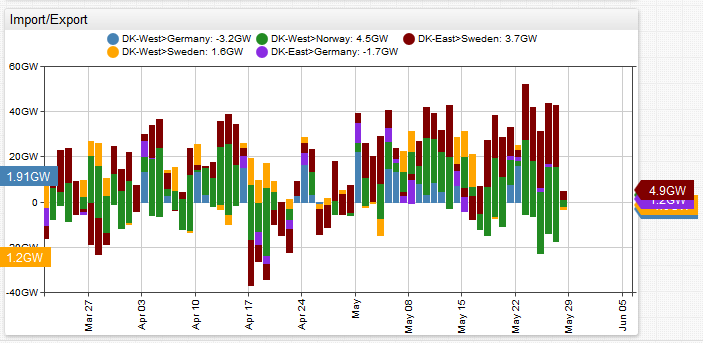
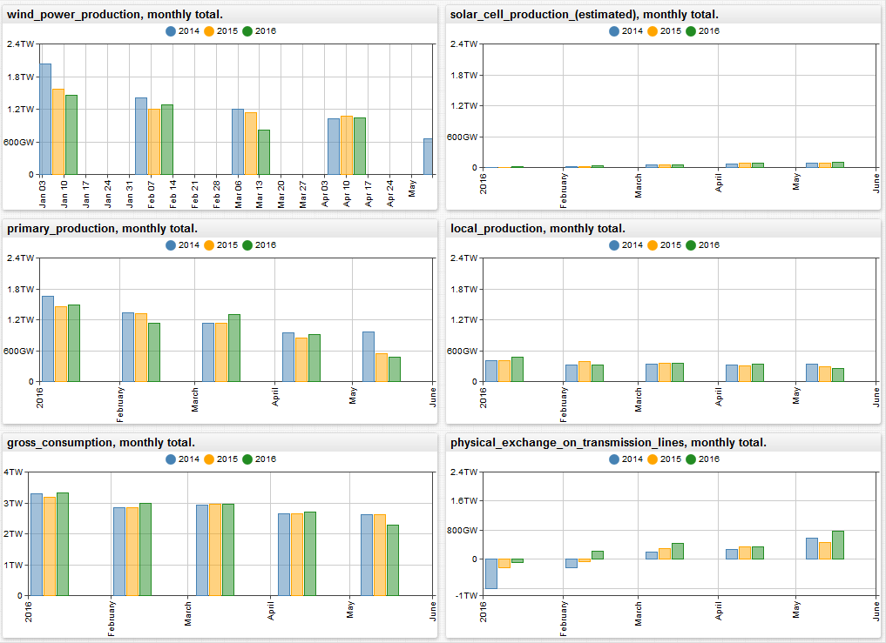

# The Time Series Database is about Reducing Complexity

Axibase set out to build a time series database with two primary design objectives:

1. Simplify the data collection process.
2. Simplify dashboarding, reporting, and analytics.

The Axibase Time Series Database (ATSD) is able to deliver on both counts, and here is an example:

Take a data source that is passive and non-standard. A data source that is passive cannot be instrumented to stream data into ATSD on its own. A data source that is non-standard provides data in neither CSV nor JSON format.

An HTML file hosted by a SharePoint reporting server returning HTML text in XLS format works well for this example, [`energinet.dk`](https://energinet.dk) market data reporting service fits the bill well.

Energinet is an all-in-one energy regulator and operator in Denmark. Energinet performs research and development into sustainable energy, collects industry data, and participates in policy action. Download publicly available datasets from the Danish energy industry from the official [Energinet](https://energinet.dk/EN/El/Engrosmarked/Udtraek-af-markedsdata/Sider/default.aspx) website.

The recurring effort involved in analyzing this data and preparing a report is substantial.

Enter the Axibase Time Series Database.

With ATSD you do not have to stage a database, design table schema, provision an application server, and write programs to parse and upload this type of file. Instead, simply configure a scheduled job to fetch the file from a specified endpoint and have ATSD parse it according to pre-defined rules. Once you have raw data in ATSD, creating and sharing reports with built-in widgets is simple. The reports are continuously updated as new data comes in.

[Sample Raw Data](https://apps.axibase.com/chartlab/fcce7fb8)

The built-in visualization also allows you to combine wildcards, aggregators, and simple control functions to build a fairly complex report in less than 50 lines:

* [`for/endfor` loop](https://axibase.com/docs/charts/syntax/control-structures.html#for): create a set of similar widgets for different metrics
* [inheritance](https://axibase.com/docs/charts/configuration/inheritance.html#inheritance): apply similar settings to all widgets
* [`group-statistic`](https://axibase.com/docs/charts/widgets/shared/#group-statistic): merge multiple series
* [`group-period`](https://axibase.com/docs/charts/widgets/shared/#group-period): aggregate data by month
* [`end-time`](https://axibase.com/docs/charts/widgets/shared/#end-time): syntax to align start/end times to calendar units
* [`time-offset`](https://axibase.com/docs/charts/widgets/shared/#time-offset): setting to overlay data from previous comparable intervals onto one chart
* [layout settings](https://axibase.com/docs/atsd/portals/portal-settings.html#portal-settings): arrange, style, and format graphs

Imagine the time and effort required using traditional reporting tools.

[Consolidated Report](https://apps.axibase.com/chartlab/8c11fc48/2/)

