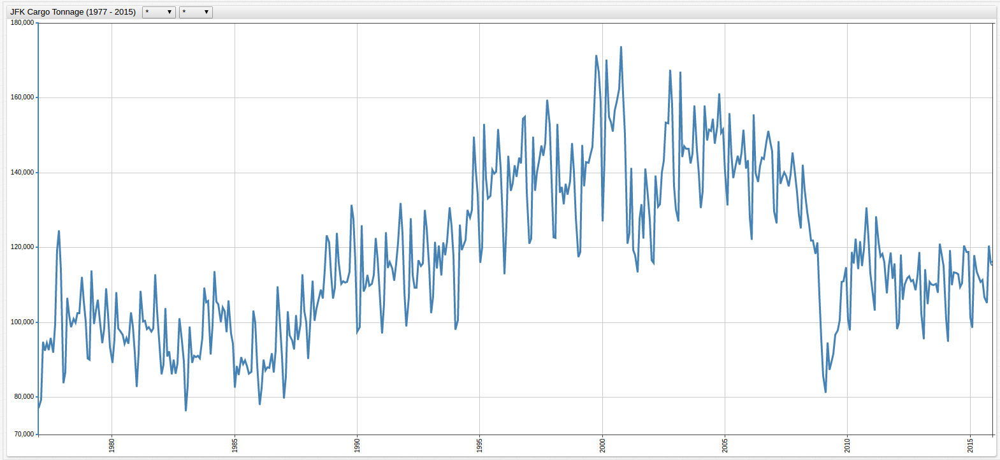
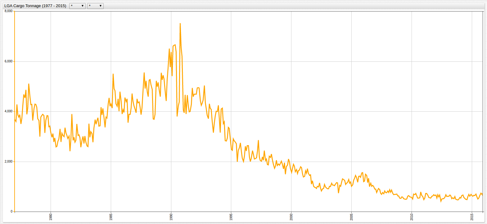
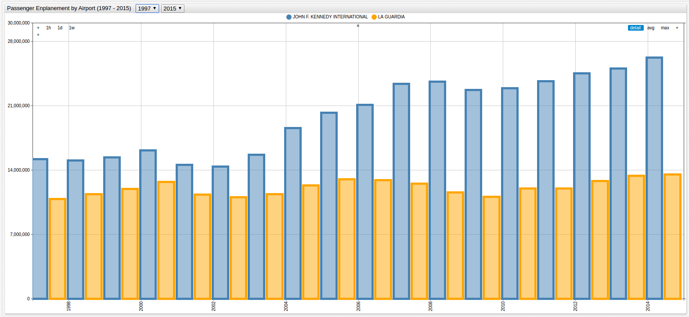
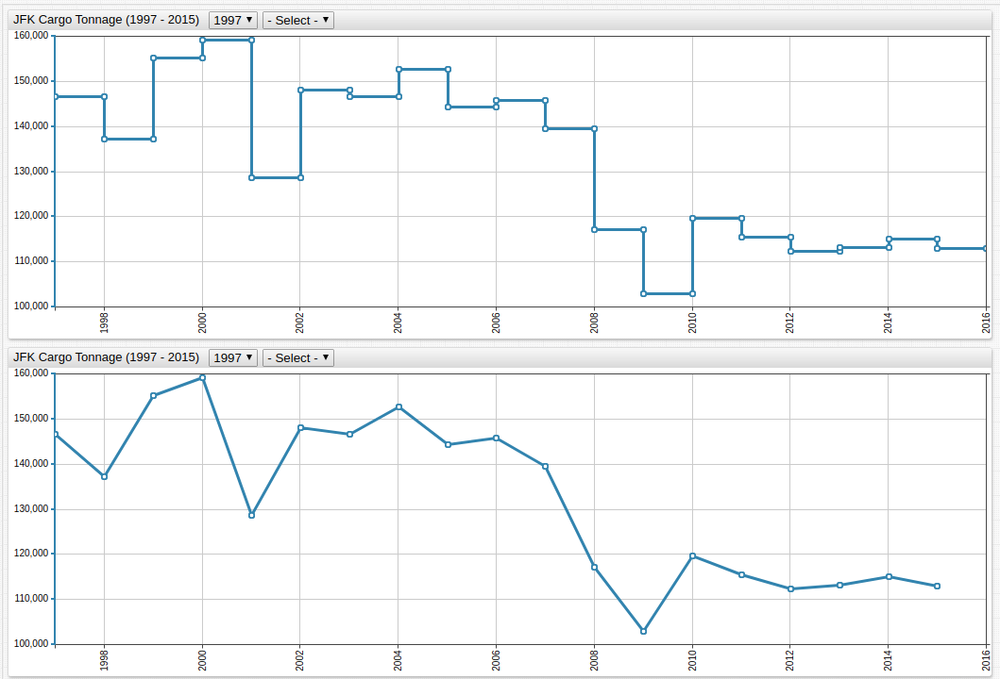
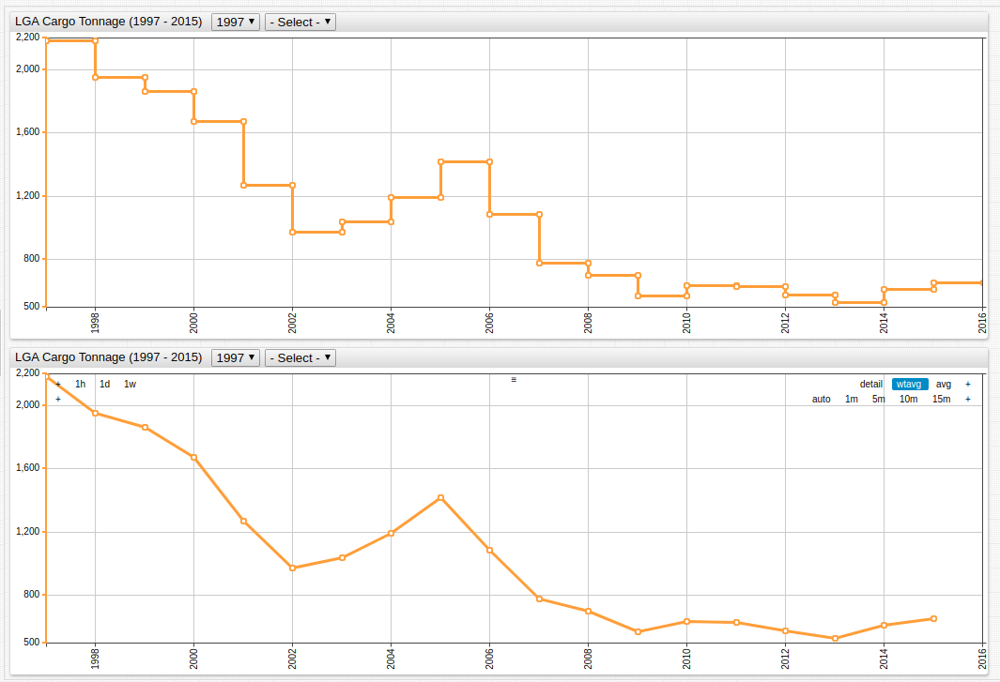
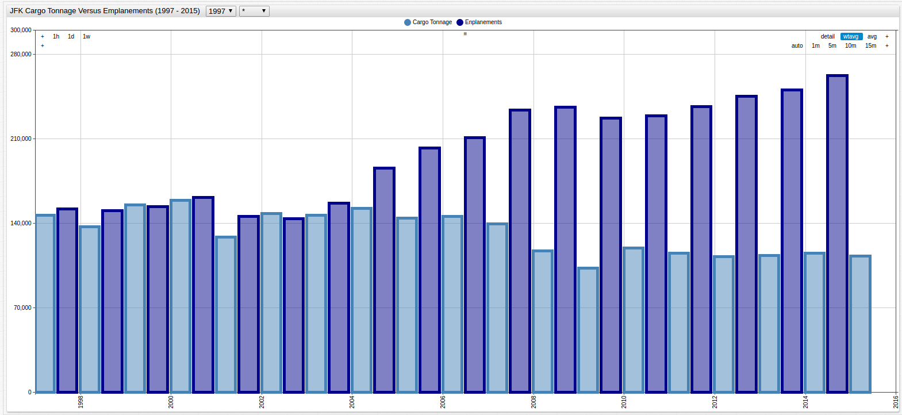
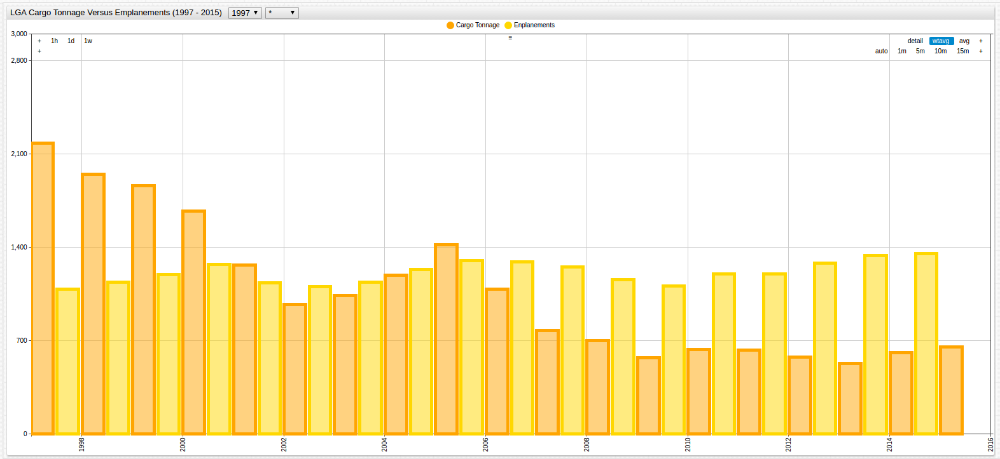
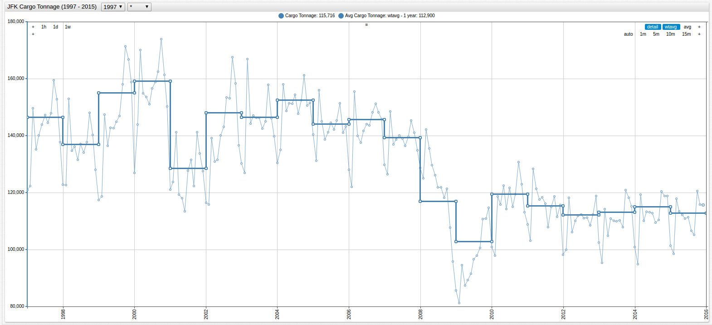
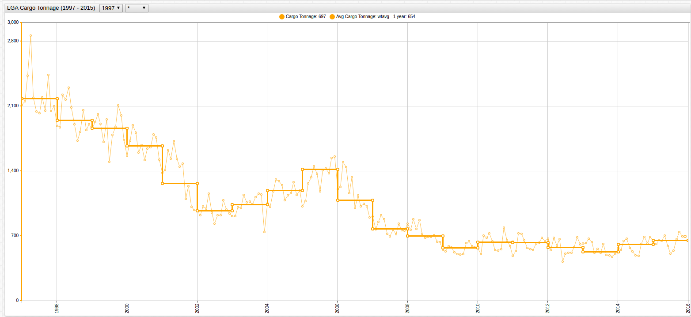

# Curve Smoothing Using Weighted Averages

## Overview

An operations analyst has with two datasets, [cargo tonnage data](https://axibase.com/datasets/socrata/nthh-fhwt.html) from the two largest airports in the New York City Metropolitan Area and [passenger enplanement data](https://axibase.com/datasets/socrata/vpv5-zd4k.html)
from the same airports both available from the [Axibase Dataset Catalog](https://axibase.com/datasets/). The analyst must create a relational model between the two datasets for an airline looking to expand their presence at either LaGuardia (LGA) or John F. Kennedy Airport (JFK) to facilitate the maximum number of passengers and cargo.

The first dataset, collected by the [Port Authority of New York and New Jersey](https://www.panynj.gov/) is aggregated monthly while the second dataset from
the [New York Department of Transportation](https://www.dot.ny.gov/index) is aggregated annually.

* Annually aggregating the Port Authority Cargo data would destroy the granularization created by monthly collection over the observation period.
* Using an average baseline calculated over the entire observation period would neglect recent trends because four decades of data would be regarded equally.

With the [`wtavg`](https://axibase.com/docs/charts/configuration/aggregators.html#wtavg) function, data with differing granularization is readily comparable.

## Data

The tonnage dataset is visualized below. Because of the differences in the ranges of the data, there are two charts to show the high variance for each of the metrics:

*Figure 1*: JFK Cargo Tonnage (1977-2015)



[](https://apps.axibase.com/chartlab/479e4525/#fullscreen)

*Figure 2*: LGA Cargo Tonnage (1977-2015)



[](https://apps.axibase.com/chartlab/f36262ee/#fullscreen)

Passenger enplanement data, aggregated annually, is shown below:

*Figure 3*: LGA and JFK Passenger Enplanement Data (1997-2015)



[](https://apps.axibase.com/chartlab/00cf9be3/#fullscreen)

The granularization is mismatched and the observed periods differ by twenty years. The latter problem has a simple solution: modify the observation period using the [drop-down lists](https://axibase.com/docs/charts/configuration/drop-down-lists.html) in **ChartLab** or hardcode the specific timespan in the editor
window with the [`start-time`](https://axibase.com/docs/charts/widgets/shared/#start-time) setting. However, the former problem does not offer such an obvious solution.

The syntax to compute a weighted average is two-part and shown below.

```ls
statistic = wtavg
period = 1 year
```

> Use the `wtavg` function under the `[widget]` heading to modify all available series or under an individual `[series]` heading to modify only one series.

The time-based window [`period`](https://axibase.com/docs/charts/widgets/shared/#period) is set by the user and able to be as precise as millisecond granularity and as long as any
number of years.

The two-line syntax above calculates the average of each annual input and aggregates the value to return one value
per specified period. This type of *ad hoc* modification does nothing to the underlying data.

## Implementation

Application of the weighted average to *Figure 1* and *Figure 2* is shown below:

*Figure 4*: Annual Average of JFK Cargo Tonnage (1997-2015)



[](https://apps.axibase.com/chartlab/4a974ea6)

> Each chart display the same function, but the lower chart contains the [`step-line = false`](https://axibase.com/docs/charts/widgets/time-chart/#step-line) setting.

*Figure 5*: Annual Average of LGA Cargo Tonnage (1997-2015)



[](https://apps.axibase.com/chartlab/af7417f2)

> Open the ChartLab visualizations above to inspect the syntax on lines 17 and 18

The analyst is now able to more accurately judge the relationship between the two datasets because of the equal rate of
granularization.

Combining the JFK and LGA elements from each of the two datasets, and using the [`mode = column`](https://axibase.com/docs/charts/widgets/time-chart/#mode) setting,
produces the following visualizations:

*Figure 6*: JFK Cargo Tonnage vs. Passenger Enplanement (1997-2015)



[](https://apps.axibase.com/chartlab/897c0429/#fullscreen)

*Figure 7*: LGA Cargo Tonnage vs. Passenger Enplanement (1997-2015)



[](https://apps.axibase.com/chartlab/0de58b58/#fullscreen)

Once the comparison is complete, remove the [`statistics`](https://axibase.com/docs/charts/widgets/shared/#statistics) setting from the configuration in the **Editor** window to return the data to its original state.

It may be helpful to compare the modified chart with the original to calculate monthly baselines. Airport traffic and use is seasonal, as such comparing values month-to-month is misleading.

The transformed series is superimposed over the underlying data in the visualization below.



[](https://apps.axibase.com/chartlab/6b3e4ed6/#fullscreen)



[](https://apps.axibase.com/chartlab/a4d77c47/#fullscreen)