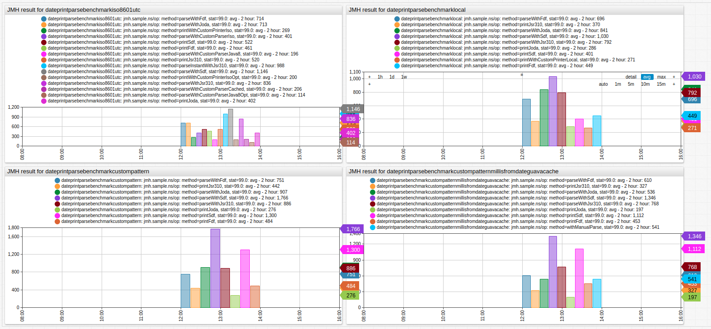
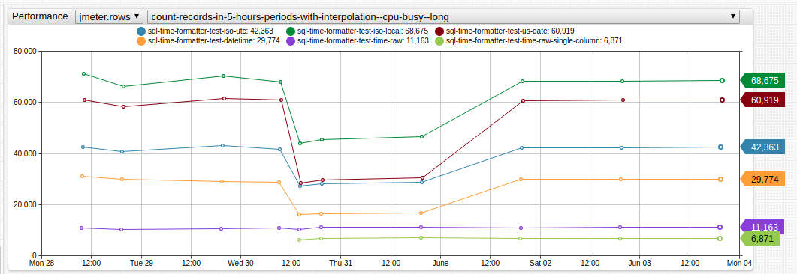

# Practical Java Performance: Date Formatting Optimization

## Table of Contents

* [Introduction](#introduction)
* [JMH: Ultimate Java Benchmarking Tool](#jmh-the-ultimate-java-benchmarking-tool)
  * [Date Formatters Performance Comparison](#date-formatters-performance-comparison)
* [The Formatters Used by ATSD](#the-formatters-used-by-atsd)
* [New at the Zoo: ATSD `DatetimeProcessor`](#new-at-the-zoo-atsd-datetimeprocessor)
* Supported Patterns
  * [Implementation](#implementation)
  * [Caching](#caching)
  * [Breaking Good](#breaking-good)
  * [Performance](#performance)
* [Slides](#slides)
* [References](#references)

## Introduction

One does not simply measure JVM code performance. A performance engineer must consider numerous aspects which affect the resulting data. Several of these are enumerated below:

* Interpreting and compiled modes ([implementation details](http://hg.openjdk.java.net/jdk8u/jdk8u/hotspot/file/2b2511bd3cc8/src/share/vm/runtime/advancedThresholdPolicy.hpp#l34)).
* Preemptive compiler optimizations based on collected profiling information.
* Other optimizations such as: constant folding, loop unrolling, dead code elimination.

## JMH: The Ultimate Java Benchmarking Tool

[Java Microbenchmarking Harness](http://openjdk.java.net/projects/code-tools/jmh/) (JMH) is a Java harness for building, running, and analysing
nano/micro/milli/macro benchmarks written in Java and other languages targeting the JVM.

To use this tool, create a `maven` project from the JMH archetype.

```sh
mvn archetype:generate \
          -DinteractiveMode=false \
          -DarchetypeGroupId=org.openjdk.jmh \
          -DarchetypeArtifactId=jmh-java-benchmark-archetype \
          -DgroupId=com.github.raipc \
          -DartifactId=benchmark \
          -Dversion=1.0
```

A sample JMH benchmark is shown below:

```java
@State(Scope.Benchmark)
@BenchmarkMode(Mode.AverageTime)
@OutputTimeUnit(TimeUnit.NANOSECONDS)
public class CharIsDigitBenchmark {
    @Param(value = {"+7(955)123-45-67", "79551234567"} )
    private String input;

    @Benchmark
    public String writeDigitsCharacter() {
        final int length = input.length();
        final StringBuilder sb = new StringBuilder(length);
        for (int i = 0; i < length; i++) {
            char ch = input.charAt(i);
            if (Character.isDigit(ch)) {
                sb.append(ch);
            }
        }
        return sb.toString();
    }

    @Benchmark
    public String writeDigitsString() {
        final String digits = "0123456789";
        final int length = input.length();
        final StringBuilder sb = new StringBuilder(length);
        for (int i = 0; i < length; i++) {
            String ch = input.substring(i, i+1);
            if (digits.contains(ch)) {
                sb.append(ch);
            }
        }
        return sb.toString();
    }
}
```

Each instrumented method is annotated with `@Benchmark` annotation.

The `@State` annotation marks the class that contains the benchmark state.
This annotation defines either the same class as the one containing instrumented methods, or a separate class, in this case the state object is provided to benchmark method as a method parameter.

The `@Param` annotation marks parameterized fields. The initialization values can be provided
via annotation parameters or by using command line parameter `-p {param-name}={param-value}`.

It is certainly worth learning the principles of writing a good JMH benchmark by studying the provided [Examples](http://hg.openjdk.java.net/code-tools/jmh/file/tip/jmh-samples/src/main/java/org/openjdk/jmh/samples/).

### Date Formatters Performance Comparison

> Review date formatters benchmarks on [Github](https://github.com/raipc/benchmarks/blob/master/src/main/java/com/github/raipc/BetterIso8601Benchmarks.java).

To record benchmarks, build and run the project.

```sh
mvn clean package
java -jar target/benchmarks.jar
```

```csv
Benchmark                       Mode      Cnt        Score    Error   Units
parseCustomCurrentATSD        sample  3722617      504.680 ±  8.328   ns/op
parseJoda                     sample  2381165      934.201 ± 15.333   ns/op
parseOptimized                sample  2845261      142.150 ±  4.712   ns/op
printJodaIso8601              sample  3662844      509.362 ±  8.079   ns/op
printWithCustomPrinterIsoOpt  sample  2369326      271.344 ± 10.401   ns/op
```



[](https://apps.axibase.com/chartlab/51e517df/2/)

## The Formatters Used by ATSD

ATSD uses different date parsing and formatting libraries to cover all use cases. The following table clarifies which ATSD subsystem uses which date formatting library.

**ATSD Subsystem** | **Date Formatter**
-----|-----
Data API | `joda.time` for parsing, custom formatter for printing
SQL | `Apache Commons`
Rule Engine | `joda.time`
Forecasts | `SimpleDateFormat`
CSV Parser | `SimpleDateFormat`
User Interface | `SimpleDateFormat`

Each formatter supports different patterns, hence all of them need to be documented with the differences among them emphasized.

## New at the Zoo: ATSD `DatetimeProcessor`

The introduction of yet-another-date-formatter is dictated by the desire to improve maintainability by reducing the number of
supported libraries, date patterns, documentation notes. After analyzing common use cases, the following API was created.

```java
public interface DatetimeProcessor {
    long parseMillis(String datetime);

    long parseMillis(String datetime, @NotNull ZoneId zoneId);

    ZonedDateTime parse(String datetime);

    ZonedDateTime parse(String datetime, @NotNull ZoneId zoneId);

    String print(long timestamp);

    String print(long timestamp, @NotNull ZoneId zoneId);
}
```

`DatetimeProcessor API` use cases:

```java
DatetimeProcessor fmt = DateTimeFormatterManager.createFormatter(pattern); // for multiple usage of custom format
String datetime = TimeUtils.formatDateTime(millis, pattern, zoneId); // for single usage of custom format
String datetime = TimeUtils.formatDateTime(millis, pattern);
long timestamp = TimeUtils.parseMillis(timestamp, pattern);

long timestamp = TimeUtils.parseWithDefaultParser(datetime); // for tests or best-effort parsing

long timestamp = parseISO8601(String date);
String datetime = formatISO8601(long time);
String datetime = formatISO8601millis(long time);
String datetime = formatLocalNoTimezone(long time);
String datetime = formatLocalMillisNoTz(long time);
```

### Supported Patterns

DatetimeProcessor supports Java 8 `DateTimeFormatter` patterns with several differences:

* No need to escape `T` literal.
* `u` pattern is translated to `ccccc`, day of week starting from Monday.
* `Z` pattern is translated to `XX`, `RFC822` offset, `Z` for `zulu`.
* `ZZ` pattern is translated to `XXX`, `ISO8601` offset, `Z` for `zulu`.
* `ZZZ` pattern is translated to `VV`, Zone ID.

### Implementation

`DatetimeProcessor` interface is implemented by three classes.
`DatetimeProcessorIso8601` and `DatetimeProcessorLocal` represent highly optimized date processors for
ISO pattern `yyyy-MM-ddTHH:mm:ss[.SSSSSSSSS][Z]` and local time pattern `yyyy-MM-dd HH:mm:ss[.SSSSSSSSS][Z]`.
`DatetimeProcessorCustom` is a wrapper for `java.time.format.DateTimeFormatter` objects. Formatting strictly delegates to default implementation. The parsing operation is performed in semi-manually: After the resolving step, which includes validating, combining and simplifying the various fields into more useful ones, is performed the date object is
constructed manually by providing default field values if needed.

By design, `DatetimeProcessor` objects must not be constructed manually. Instead, use the `DateTimeFormatterManager.createFormatter(pattern)`
factory method.

This method is responsible for a number of tasks:

1) Attempt to acquire the `DatetimeProcessor` for the specified `pattern` from [cache](#caching).
2) In case of cache-miss, normalize the pattern.
3) Insert the most appropriate `DatetimeProcessor` implementation to cache.

### Caching

Caching date formatters is not an innovative idea: Previous libraries used this approach under the hood.

* `joda.time` cached formatters using `ConcurrentHashMap` limited by 5000 items.
* `Apache Commons` used unlimited `ConcurrentHashMap` cache.
* `DatetimeProcessor` objects are cached in the managed LRU cache `dateTimeFormatters` limited by `cache.formatters.maximum.size` property (defaults to `100`) which is cleared on demand with the **Settings > Cache Management** form.

`DatetimeProcessor` caching method advantages:

1) Defense from cache pollution.
2) Cache replacement policy (LRU) demonstrates higher throughput in worst scenarios, which is when many formatters are used.
3) Size is controlled by the user.

### Breaking Good

Here is an example of cache pollution attack:

```sql
SELECT *, date_format(time, CONCAT('''time: ''', 'yyyy-MM-dd HH:mm:ss', ''', value: ', value, '''')) AS "time_and_value"
FROM "mpstat.cpu_busy"
LIMIT 500000
```

The above query only affects date formatting with a dynamic pattern, when `DatetimeProcessor` is returned by `DateTimeFormatterManager`. It does not affect the performance of date formatting in Data API or other subsystems.

A better query is shown here:

```sql
SELECT *, CONCAT('time: ', date_format(time, 'yyyy-MM-dd HH:mm:ss'), ', value: ', value) AS "time_and_value"
FROM "mpstat.cpu_busy"
LIMIT 500000
```

### Performance



[](https://apps.axibase.com/chartlab/972babb9/16/)

Some performance considerations:

* Use `JSR-310` `ZoneOffset` instead of `TimeZone` to parse zone offsets. It gives free `RFC822` offsets support.
* Manipulate datetime units using `OffsetDateTime` instead of `Calendar`.
* Optimize `parseInt` function with limited characters support.
* Implement `sizeInDigits` function using divide-and-conquer approach.
* Use [JVM intrinsics](https://gist.github.com/apangin/7a9b7062a4bd0cd41fcc) if possible.

## Slides

[Part 1](https://github.com/raipc/slides/tree/master/perf-presentation)

[Part 2](https://github.com/raipc/slides/tree/master/time-presentation)

## References

[JMH home page](http://openjdk.java.net/projects/code-tools/jmh/)

[Aleksey Shipilev's Talk about Java Benchmarking](https://www.youtube.com/watch?v=8pMfUopQ9Es)

[Tagir Valeev's Talk about JIT Optimizations](https://www.youtube.com/watch?v=obMArSvmhx4&t=3156s)

[`SimpleDateFormat` Pattern Reference](https://docs.oracle.com/javase/8/docs/api/java/text/SimpleDateFormat.html)

[`Joda Time` Documentation](http://www.joda.org/joda-time/userguide.html)

[`DateTimeFormatter` Pattern Reference](https://docs.oracle.com/javase/8/docs/api/java/time/format/DateTimeFormatter.html)

[ATSD Date Format Pattern Reference](https://axibase.com/docs/atsd/shared/time-pattern.html)