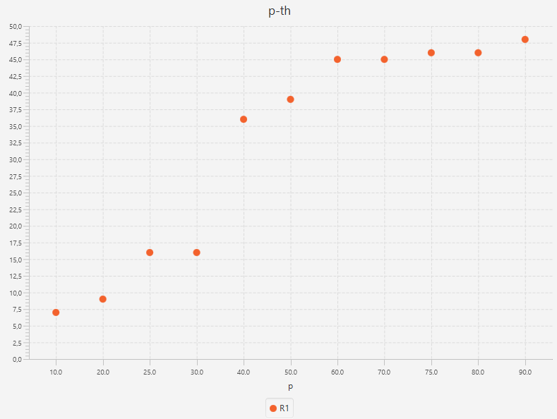
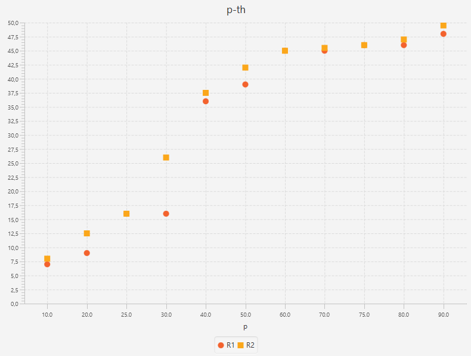
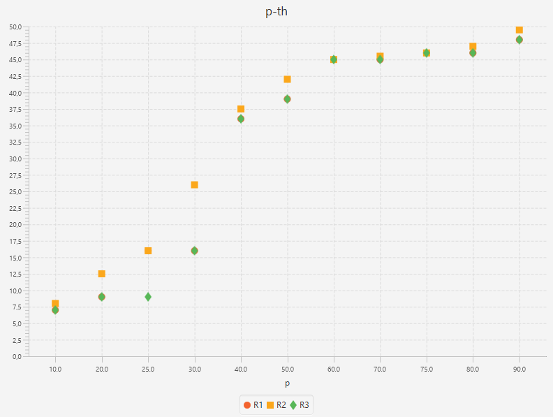
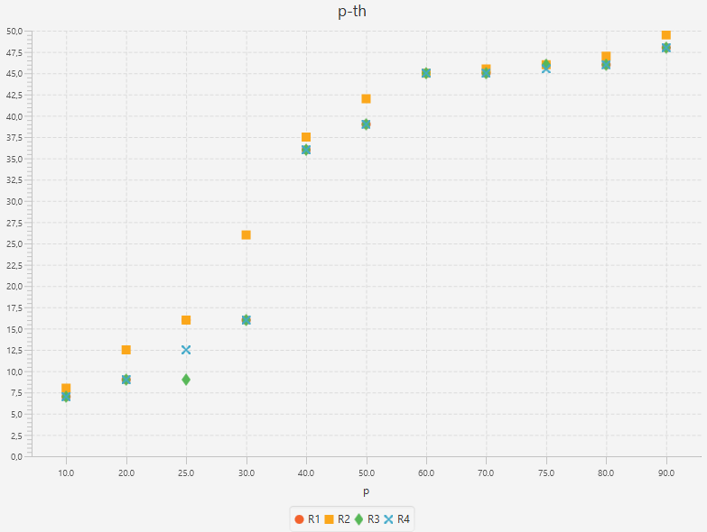
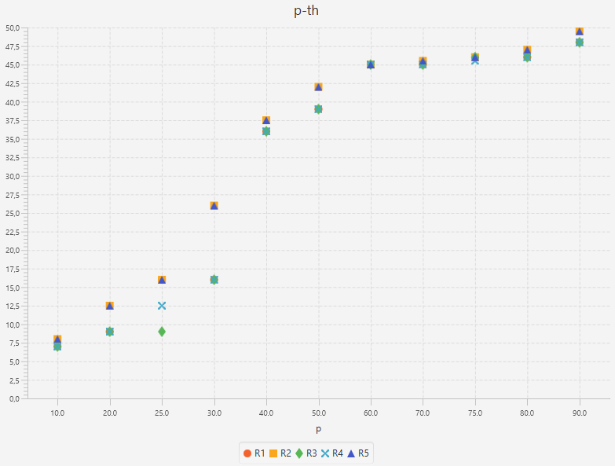
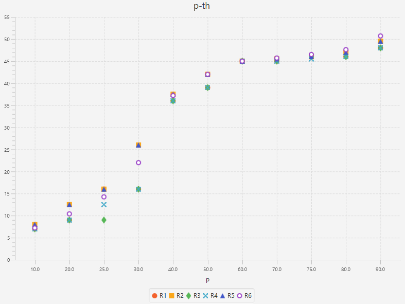
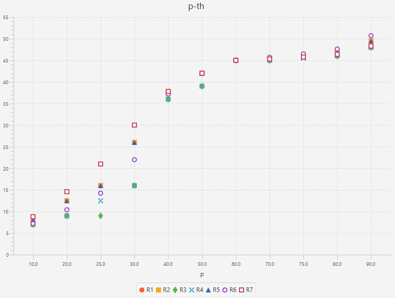
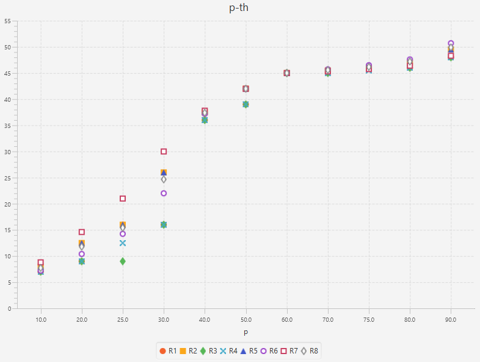
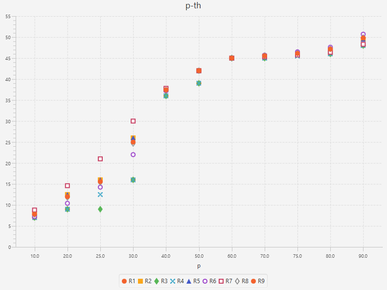

# How To Calculate The Percentiles

## Terminology

### Order statistics

For a series of measurements **X<sub>1</sub>**, ..., **X<sub>N</sub> = {4, 2, 1, 3}**, denote the data ordered in increasing order of magnitude by
**X<sub>(1)</sub>**, ..., **X<sub>(N)</sub> = {1, 2, 3, 4}**. These ordered data are called **order statistics**.

### Rank

**X<sub>(j)</sub>** corresponds to **X<sub>i</sub>**, than **rank<sub>i</sub> = j**

**Ranking** is the data transformation in which original values are replaced by their rank.

From the example above `ranks = {3, 2, 4, 1}`.

### Percentiles

Below is the definition of percentile proposed by [NIST Engineering Statistics Handbook](https://www.itl.nist.gov/div898/handbook/prc/section2/prc262.htm):

*the p-th percentile is a value, **P<sub>p</sub>**, such that at most p% of the measurements are less than this value and at most (1−p)% are greater.*


Life example: if your exam score is in the 20th percentile, that means you scored better than 20% of people who took the test.

### Percentile Rank

A percentile rank is the proportion defined in percentile: for p-th percentile, rank is **p**. For instance, in the above example for 20-th percentile the rank is 20.

### Quantile vs Percentile

It is more common in statistics to refer to quantiles. These are the same as percentiles, but are indexed by sample fractions rather than by sample percentages.

In general, the concepts of quantile and percentile are interchangeable, as well as the scales of probability calculation — absolute and percentage.

Statistics use the term **q-quantiles**. It stands for values that divide the order statistic into **q** subsets of equal sizes.

This means that the term **percentiles** is the name for 100-quantiles.

Also some other q-quantiles have special names:

* **decile** ~ 10-quantile is any of the nine values that divide the order statistic into ten equal parts, and each part represents 1/10 of the sample or population.

* **median** ~ 2-quantile is the value that divide the order statistic to the two equal parts.

* **quartile** ~ 4-quantile is any of the three values that divide the order statistic to the four equal parts, named quarters.

The difference between upper and lower quartiles is also called the **interquartile range** → `IQR = Q3 −  Q1`.

There are relations between different types of quantiles:

```txt

0 quartile = 0.00 quantile = 0 percentile

1 quartile = 0.25 quantile = 25 percentile

2 quartile = 0.50 quantile = 50 percentile = median

3 quartile = 0.75 quantile = 75 percentile

4 quartile = 1.00 quantile = 100 percentile

```


## Estimation Of Percentiles

When there is a small sample of measurements, the [CDF](https://en.wikipedia.org/wiki/Cumulative_distribution_function) of the underlying population is unknown, that is why the percentile can not be calculated, it can be only **estimated** instead.

Often the percentile of interest is not correspond to a specific data point. In this case, interpolation between points is required. There is no a standard univerally accepted way to perform this interpolation. [Hyndman, R. J. and Fan, Y.](https://www.amherst.edu/media/view/129116/original/Sample+Quantiles.pdf) described nine different methods for computing percentiles, most of statistical software use one of them.

### Example Data

Consider these methods in the following example:

i|X<sub>i</sub>|X<sub>(i)</sub>
---|---|---
1| 39 | 7
2| 45 | 9
3| 46 | 16
4| 9 | 36
5| 16 | 39
6| 7 | 45
7| 48 | 45
8| 51 | 46
9| 45 | 48
10| 36 | 51

N = 10

**Notation**:

`p` - the percentile rank divided by 100, i.e. p = p / 100

`h` - a computed real valued index

X<sub>j</sub> - the j-th element of the order statistics, X<sub>3</sub> = 16

`⌈⌉` - ceil function, for example `⌈3.2⌉ = 4`

`⌊⌋` - floor function, for example `⌊3.2⌋ = 3`

`⌊⌉` - rounding to the nearest even integer, for example `⌊3.2⌉ = 4`

### R1. Inverse of [EDF](https://en.wikipedia.org/wiki/Empirical_distribution_function)

* `h = N × p + 1/2`

* <code>P<sub>p</sub> = X<sub>⌈h – 1/2⌉</sub></code>

* if `p = 0`, <code>P<sub>0</sub> = X<sub>1</sub></code>

Percentile | Calculations<sup>[data](#example-data)</sup>
---|---
25-th | <code>* h = 10 × 0.25 + 0.5 = 3 => ⌈h – 1/2⌉ = ⌈2.5⌉ = 3 <br>* P<sub>25</sub> = X<sub>3</sub> = 16</code>
50-th | <code>* h = 10 × 0.5 + 0.5 = 5.5 => ⌈h – 1/2⌉ = ⌈5⌉ = 5 <br>* P<sub>50</sub> = X<sub>5</sub> = 39</code>
90-th | <code>* h = 10 × 0.9 + 0.5 = 9.5 => ⌈h – 1/2⌉ = ⌈9⌉ = 9 <br>* P<sub>90</sub> = X<sub>9</sub> = 48</code>



### R2. Inverse of EDF with averaging at discontinuities

* `h = N × p + 1/2`

* <code>P<sub>p</sub> = (X<sub>⌈h – 1/2⌉</sub> + X<sub>⌊h + 1/2⌋</sub>) / 2</code>

* if `p = 0`, <code>P<sub>0</sub> = X<sub>1</sub></code>

* if `p = 1`, <code>P<sub>1</sub> = X<sub>N</sub></code>

Percentile | Calculations<sup>[data](#example-data)</sup>
---|---
25-th | <code>* h = 10 × 0.25 + 0.5 = 3 => ⌈h – 1/2⌉ = ⌈2.5⌉ = 3, ⌊h + 1/2⌋ = ⌊3.5⌋ = 3<br>* P<sub>25</sub> = (X<sub>3</sub> + X<sub>3</sub>) / 2 = 16</code>
50-th | <code>* h = 10 × 0.5 + 0.5 = 5.5 => ⌈h – 1/2⌉ = ⌈5⌉ = 5, ⌊h + 1/2⌋ = ⌊6⌋ = 6<br>* P<sub>50</sub> = (X<sub>5</sub> + X<sub>6</sub>) / 2 = 42 </code>
90-th | <code>* h = 10 × 0.9 + 0.5 = 9.5 => ⌈h – 1/2⌉ = ⌈9⌉ = 9, ⌊h + 1/2⌋ = ⌊10⌋ = 10<br>* P<sub>90</sub> = (X<sub>9</sub> + X<sub>10</sub>) / 2 = 49.5</code>



The approach is used by<sup>[1](#tools-implementing-all-methods)</sup>:
[NumPy v1.15](https://docs.scipy.org/doc/numpy/reference/generated/numpy.percentile.html), [Pandas 0.23.4](https://pandas.pydata.org/pandas-docs/stable/generated/pandas.DataFrame.quantile.html) (`interpolation : 'midpoint'`)

### R3. [SAS](http://support.sas.com/documentation/cdl/en/statug/68162/HTML/default/viewer.htm#statug_boxplot_details10.htm) definition: nearest even

* `h = N × p`

* <code>P<sub>p</sub> = X<sub>⌈h⌋</sub></code>

* if `p ≤ (1/2) / N`, <code>P<sub>p</sub> = X<sub>1</sub></code>

Percentile | Calculations<sup>[data](#example-data)</sup>
---|---
25-th | <code>* h = 10 × 0.25 = 2.5 => ⌈h⌋ = 2<br>* P<sub>25</sub> = X<sub>2</sub> = 9</code>
50-th | <code>* h = 10 × 0.5 = 5 => ⌈h⌋ = 6<br>* P<sub>50</sub> = X<sub>6</sub> = 45</code>
90-th | <code>* h = 10 × 0.9 = 9 => ⌈h⌋ = 10<br>* P<sub>90</sub> = X<sub>10</sub> = 51</code>



The approach is used by<sup>[1](#tools-implementing-all-methods)</sup>:
[NumPy v1.15](https://docs.scipy.org/doc/numpy/reference/generated/numpy.percentile.html), [Pandas 0.23.4](https://pandas.pydata.org/pandas-docs/stable/generated/pandas.DataFrame.quantile.html) (`interpolation : 'nearest'`)

All subsequent methods use linear interpolation:

* <code>P<sub>p</sub> = X<sub>⌊h⌋</sub> + (h − ⌊h⌋) × (X<sub>⌊h⌋ + 1</sub> - X<sub>⌊h⌋</sub>)</code>

### R4. Linear interpolation of the EDF

* `h = N × p`

* <code>P<sub>p</sub> = X<sub>⌊h⌋</sub> + (h − ⌊h⌋) × (X<sub>⌊h⌋ + 1</sub> - X<sub>⌊h⌋</sub>)</code>

* if `p < 1 / N`, <code>P<sub>p</sub> = X<sub>1</sub></code>

* if `p = 1`, <code>P<sub>1</sub> = X<sub>N</sub></code>

Percentile | Calculations<sup>[data](#example-data)</sup>
---|---
25-th | <code>* h = 10 × 0.25 = 2.5 => ⌊h⌋ = ⌊2⌋ = 2<br>* P<sub>25</sub> = X<sub>2</sub> + (2.5 - 2) × (X<sub>3</sub> - X<sub>2</sub>) = 9 + 0.5 × (16 - 9) = 12.5</code>
50-th | <code>* h = 10 × 0.5 = 5 => ⌊h⌋ = ⌊5⌋ = 5<br>* P<sub>50</sub> = X<sub>5</sub> + (5 - 5) × (X<sub>6</sub> - X<sub>5</sub>) = 39</code>
90-th | <code>* h = 10 × 0.9 = 9 => ⌊h⌋ = ⌊9⌋ = 9<br>* P<sub>90</sub> = X<sub>9</sub> + (9 - 9) × (X<sub>10</sub> - X<sub>9</sub>) = 48</code>



### R5. Piecewise linear function

* `h = N × p + 1/2`

* <code>P<sub>p</sub> = X<sub>⌊h⌋</sub> + (h − ⌊h⌋) × (X<sub>⌊h⌋ + 1</sub> - X<sub>⌊h⌋</sub>)</code>

* if `p < (1/2) / N`, <code>P<sub>p</sub> = X<sub>1</sub></code>

* if `p ≥ (N - 1/2) / N`, <code>P<sub>p</sub> = X<sub>N</sub></code>

Percentile | Calculations<sup>[data](#example-data)</sup>
---|---
25-th | <code>* h = 10 × 0.25 + 0.5 = 3 => ⌊h⌋ = ⌊3⌋ = 3<br>* P<sub>25</sub> = X<sub>3</sub> + (3 - 3) × (X<sub>4</sub> - X<sub>3</sub>) = 16 </code>
50-th | <code>* h = 10 × 0.5 + 0.5 = 5.5 => ⌊h⌋ = ⌊5⌋ = 5<br>* P<sub>50</sub> = X<sub>5</sub> + (5 - 5) × (X<sub>6</sub> - X<sub>5</sub>) = 39</code>
90-th | <code>* h = 10 × 0.9 + 0.5 = 9.5 => ⌊h⌋ = ⌊9⌋ = 9<br>* P<sub>90</sub> = X<sub>9</sub> + (9 - 9) × (X<sub>10</sub> - X<sub>9</sub>) = 48</code>



### R6. Linear interpolation of the mathematical expectations

* `h = (N + 1) × p`

* <code>P<sub>p</sub> = X<sub>⌊h⌋</sub> + (h − ⌊h⌋) × (X<sub>⌊h⌋ + 1</sub> - X<sub>⌊h⌋</sub>)</code>

* if `p ≤ 1 / (N + 1)`, <code>P<sub>p</sub> = X<sub>1</sub></code>

* if `p ≥ N / (N + 1)`, <code>P<sub>p</sub> = X<sub>N</sub></code>

Percentile | Calculations<sup>[data](#example-data)</sup>
---|---
25-th | <code>* h = (10 + 1) × 0.25 = 2.75 => ⌊h⌋ = ⌊2.75⌋ = 2<br>* P<sub>25</sub> = X<sub>2</sub> + (2.75 - 2) × (X<sub>3</sub> - X<sub>2</sub>) = 14.25 </code>
50-th | <code>* h = (10 + 1) × 0.5 = 5.5 => ⌊h⌋ = ⌊5.5⌋ = 5<br>* P<sub>50</sub> = X<sub>5</sub> + (5.5 - 5) × (X<sub>6</sub> - X<sub>5</sub>) = 42</code>
90-th | <code>* h = (10 + 1) × 0.9 = 9.9 => ⌊h⌋ = ⌊9.9⌋ = 9<br>* P<sub>90</sub> = X<sub>9</sub> + (9.9 - 9) × (X<sub>10</sub> - X<sub>9</sub>) = 50.7</code>



The approach is used by<sup>[1](#tools-implementing-all-methods)</sup>: [Apache Commons Math 3.0 Percentile](https://commons.apache.org/proper/commons-math/javadocs/api-3.0/org/apache/commons/math3/stat/descriptive/rank/Percentile.html), [Excel PERCENTILE.EXC](https://support.office.com/en-us/article/percentile-exc-function-bbaa7204-e9e1-4010-85bf-c31dc5dce4ba),
[NumPy v1.15](https://docs.scipy.org/doc/numpy/reference/generated/numpy.percentile.html), [Pandas 0.23.4](https://pandas.pydata.org/pandas-docs/stable/generated/pandas.DataFrame.quantile.html) (`interpolation : 'linear'`)

### R7. Linear interpolation of the modes

> **Mode** is the value that appears most often.

* `h = (N - 1) × p + 1`

* <code>P<sub>p</sub> = X<sub>⌊h⌋</sub> + (h − ⌊h⌋) × (X<sub>⌊h⌋ + 1</sub> - X<sub>⌊h⌋</sub>)</code>

* if `p = 1`, <code>P<sub>1</sub> = X<sub>N</sub></code>

Percentile | Calculations<sup>[data](#example-data)</sup>
---|---
25-th | <code>* h = (10 - 1) × 0.25 + 1 = 3.25 => ⌊h⌋ = ⌊3.25⌋ = 3<br>* P<sub>25</sub> = X<sub>3</sub> + (3.25 - 3) × (X<sub>4</sub> - X<sub>3</sub>) = 21 </code>
50-th | <code>* h = (10 - 1) × 0.5 + 1 = 5.5 => ⌊h⌋ = ⌊5.5⌋ = 5<br>* P<sub>50</sub> = X<sub>5</sub> + (5.5 - 5) × (X<sub>6</sub> - X<sub>5</sub>) = 42</code>
90-th | <code>* h = (10 - 1) × 0.9 + 1 = 9.1 => ⌊h⌋ = ⌊9.1⌋ = 9<br>* P<sub>90</sub> = X<sub>9</sub> + (9.1 - 9) × (X<sub>10</sub> - X<sub>9</sub>) = 48.3</code>



The approach is used by<sup>[1](#tools-implementing-all-methods)</sup>: [Excel PERCENTILE.INC](https://support.office.com/en-us/article/percentile-inc-function-680f9539-45eb-410b-9a5e-c1355e5fe2ed),
[Guava: Google Core Libraries for Java 23.0 API](https://google.github.io/guava/releases/23.0/api/docs/com/google/common/math/Quantiles.html), [Oracle DB 10.2](https://docs.oracle.com/cd/B19306_01/server.102/b14200/functions110.htm)

### R8. Linear interpolation of the approximate medians

* `h = (N + 1/3) × p + 1/3`

* <code>P<sub>p</sub> = X<sub>⌊h⌋</sub> + (h − ⌊h⌋) × (X<sub>⌊h⌋ + 1</sub> - X<sub>⌊h⌋</sub>)</code>

* if `p ≤ (2/3) / (N + 1/3)`, <code>P<sub>p</sub> = X<sub>1</sub></code>

* if `p ≥ (N - 1/3) / (N + 1/3)`, <code>P<sub>p</sub> = X<sub>N</sub></code>

Percentile | Calculations<sup>[data](#example-data)</sup>
---|---
25-th | <code>* h = (10 + 0.33) × 0.25 + 0.33 = 2.91 => ⌊h⌋ = ⌊2.91⌋ = 2<br>* P<sub>25</sub> = X<sub>2</sub> + (2.91 - 2) × (X<sub>3</sub> - X<sub>2</sub>) = 21 </code>
50-th | <code>* h = (10 + 0.33) × 0.5 + 0.33 = 5.5 => ⌊h⌋ = ⌊5.5⌋ = 5<br>* P<sub>50</sub> = X<sub>5</sub> + (5.5 - 5) × (X<sub>6</sub> - X<sub>5</sub>) = 42</code>
90-th | <code>* h = (10 + 0.33) × 0.9 + 0.33 = 9.63 => ⌊h⌋ = ⌊9.63⌋ = 9<br>* P<sub>90</sub> = X<sub>9</sub> + (9.63 - 9) × (X<sub>10</sub> - X<sub>9</sub>) = 49.89</code>



### R9. Approximately unbiased estimates

* `h = (N + 1/4) × p + 3/8`

* <code>P<sub>p</sub> = X<sub>⌊h⌋</sub> + (h − ⌊h⌋) × (X<sub>⌊h⌋ + 1</sub> - X<sub>⌊h⌋</sub>)</code>

* if `p < (5/8) / (N + 1/4)`, <code>P<sub>p</sub> = X<sub>1</sub></code>

* if `p ≥ p ≥ (N - 3/8) / (N + 1/4)`, <code>P<sub>p</sub> = X<sub>N</sub></code>

Percentile | Calculations<sup>[data](#example-data)</sup>
---|---
25-th | <code>* h = (10 + 0.25) × 0.25 + 0.375 = 2.93 => ⌊h⌋ = ⌊2.94⌋ = 2<br>* P<sub>25</sub> = X<sub>2</sub> + (2.94 - 2) × (X<sub>3</sub> - X<sub>2</sub>) = 16.54 </code>
50-th | <code>* h = (10 + 0.25) × 0.5 + 0.375 = 5.5 => ⌊h⌋ = ⌊5.5⌋ = 5<br>* P<sub>50</sub> = X<sub>5</sub> + (5.5 - 5) × (X<sub>6</sub> - X<sub>5</sub>) = 42</code>
90-th | <code>* h = (10 + 0.25) × 0.9 + 0.375 = 9.6 => ⌊h⌋ = ⌊9.6⌋ = 9<br>* P<sub>90</sub> = X<sub>9</sub> + (9.6 - 9) × (X<sub>10</sub> - X<sub>9</sub>) = 49.8</code>



## Tools Implementing All Methods

The following software provides functonality to use any of solutions above:

* [Apache Commons Math 3.6 Percentile](https://commons.apache.org/proper/commons-math/javadocs/api-3.0/org/apache/commons/math3/stat/descriptive/rank/Percentile.html) (in particular [Percentile.EstimationType](http://commons.apache.org/proper/commons-math/javadocs/api-3.6/org/apache/commons/math3/stat/descriptive/rank/Percentile.EstimationType.html))
* [NIST Dataplot](https://www.itl.nist.gov/div898/software/dataplot/refman2/auxillar/percenti.htm)
* [R](https://www.rdocumentation.org/packages/stats/versions/3.5.1/topics/quantile)

## NaN

* [Apache Commons Math 3.6 NaNStrategy](http://commons.apache.org/proper/commons-math/javadocs/api-3.6/org/apache/commons/math3/stat/ranking/NaNStrategy.html):

    ```txt
    MINIMAL - NaNs are treated as minimal in the ordering, equivalent to (that is, tied with) Double.NEGATIVE_INFINITY.
    MAXIMAL - NaNs are treated as maximal in the ordering, equivalent to Double.POSITIVE_INFINITY
    REMOVED - NaNs are removed before the rank transform is applied
    FIXED - NaNs are left "in place," that is the rank transformation is applied to the other elements in the input array, but the NaN elements are returned unchanged.
    FAILED - If any NaN is encountered in the input array, an appropriate exception is thrown
    ```
* [R quantile()](https://www.rdocumentation.org/packages/stats/versions/3.5.1/topics/quantile):

    ```txt
    na.rm - if true, any NA and NaN's are removed from x before the quantiles are computed
            if false NA and NaN values are not allowed
    ```

## Approximation

For small samples, where data can be stored and processed in memory, these methods are enough. To estimate percentile from either distributed data or streaming data the approximation methods are used:

1. [P<sup>2</sup> Algorithm for Dynamic Calculation of Quantiles and Histogram Without Storing Observations](https://www.cse.wustl.edu/~jain/papers/ftp/psqr.pdf)

    Used by used by [Apache Commons Math 3.6 PSquarePercentile](http://commons.apache.org/proper/commons-math/javadocs/api-3.6/org/apache/commons/math3/stat/descriptive/rank/PSquarePercentile.html). 

2. [q-Digest](https://papercruncher.wordpress.com/2011/07/31/q-digest/)

3. [t-Digest](https://github.com/tdunning/t-digest/blob/master/docs/t-digest-paper/histo.pdf)

    Used by [Elasticsearch](https://www.elastic.co/guide/en/elasticsearch/reference/current/search-aggregations-metrics-percentile-aggregation.html). See [implementations on Java and other](https://github.com/tdunning/t-digest#implementations-in-other-languages).
