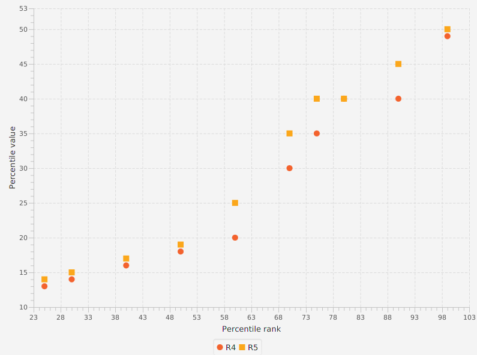
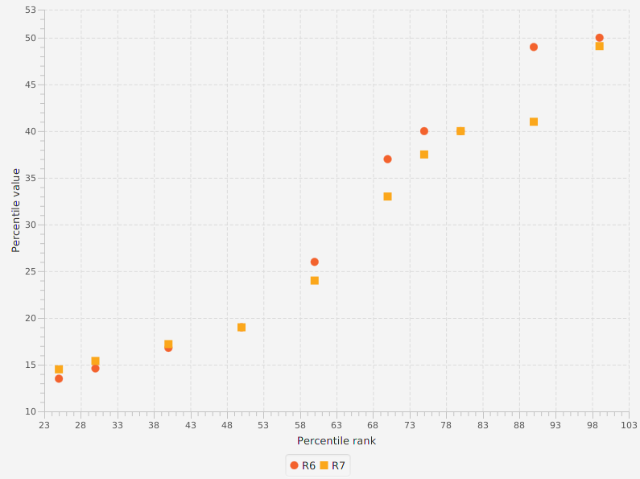
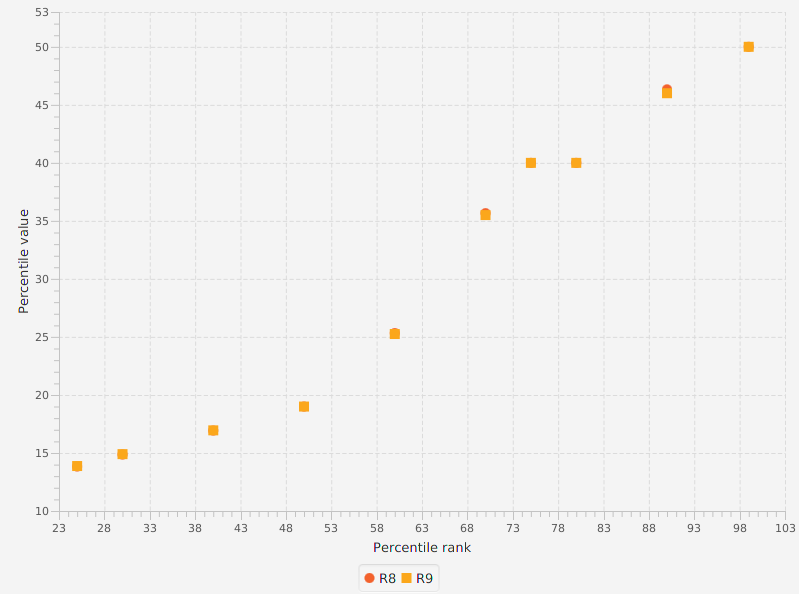
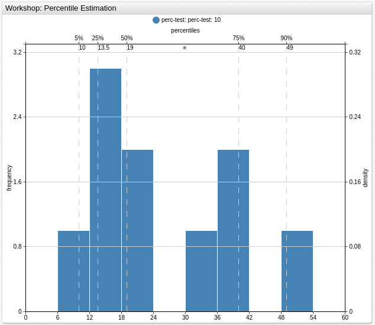

# How To Calculate The Percentiles

## Terminology

### Order statistics

For a series of measurements **X<sub>1</sub>**, ..., **X<sub>N</sub>**, denote the data ordered in increasing order of magnitude by **X<sub>(1)</sub>**, ..., **X<sub>(N)</sub>**. These ordered data are called **order statistics**:

i|X<sub>i</sub>|X<sub>(i)</sub>
---|---|---
1| 50 | 10
2| 40 | 12
3| 40 | 14
4| 30 | 16
5| 20 | 18
6| 18 | 20
7| 16 | 30
8| 14 | 40
9| 12 | 40
10| 10 | 50

### Rank

If **X<sub>(j)</sub>** is the order statistic that corresponds to the measurement **X<sub>i</sub>** then the rank for **X<sub>i</sub>** is **j**, i.e. <center><b>X<sub>(j)</sub> ~ <b>X<sub>i</sub></b></b> => <b>r<sub>i</sub></b> = <b>j</b></center>

**Ranking** is the data transformation in which original values are replaced by their rank.

i|X<sub>i</sub>|X<sub>(i)</sub>| r<sub>i</sub>
---|---|---|---
1| 50 | 10 | 10
2| 40 | 12 | 9
3| 40 | 14 | 8
4| 30 | 16 | 7
5| 20 | 18 | 6
6| 18 | 20 | 5
7| 16 | 30 | 4
8| 14 | 40 | 3
9| 12 | 40 | 2
10| 10 | 50 | 1

### Percentiles

Below is the definition of percentile proposed by [NIST Engineering Statistics Handbook](https://www.itl.nist.gov/div898/handbook/prc/section2/prc262.htm):

*the p-th percentile is a value, **P<sub>p</sub>**, such that at most p% of the measurements are less than this value and at most (1−p)% are greater.*


[](https://apps.axibase.com/chartlab/09315b88/9/)

For the example above, in 20% of measurements the amount of available memory is less than 427.232, that means that **P<sub>20</sub>=427.232**.

### Percentile Rank

A percentile rank is the proportion defined in percentile: for p-th percentile, rank is **p**. For instance, in the above example for 20-th percentile the rank is 20.

### Quantile vs Percentile

It is more common in statistics to refer to quantiles. These are the same as percentiles, but are indexed by sample fractions rather than by sample percentages.

In general, the concepts of quantile and percentile are interchangeable, as well as the scales of probability calculation — absolute and percentage.

Statistics use the term **q-quantiles**. It stands for values that divide the order statistic into **q** subsets of equal sizes.

This means that the term **percentiles** is the name for 100-quantiles.

Also some other q-quantiles have special names:

* **decile** ~ 10-quantile is any of the nine values that divide the order statistic into ten equal parts, and each part represents 1/10 of the sample or population.

* **median** ~ 2-quantile is the value that divide the order statistic to the two equal parts.

* **quartile** ~ 4-quantile is any of the three values that divide the order statistic to the four equal parts, named quarters.

The difference between upper and lower quartiles is also called the **interquartile range** → `IQR = Q3 −  Q1`.

There are relations between different types of quantiles:

```txt

0 quartile = 0.00 quantile = 0 percentile

1 quartile = 0.25 quantile = 25 percentile

2 quartile = 0.50 quantile = 50 percentile = median

3 quartile = 0.75 quantile = 75 percentile

4 quartile = 1.00 quantile = 100 percentile

```


## Estimation Of Percentiles

When there is a small sample of measurements, the [CDF](https://en.wikipedia.org/wiki/Cumulative_distribution_function) of the underlying population is unknown, that is why the percentile can not be calculated, it can be only **estimated** instead.

Often the percentile of interest is not correspond to a specific data point. In this case, interpolation between points is required. There is no a standard univerally accepted way to perform this interpolation. [Hyndman, R. J. and Fan, Y. (1986)](https://www.amherst.edu/media/view/129116/original/Sample+Quantiles.pdf) described nine different methods for computing percentiles, most of statistical software use one of them.

### Example Data

Consider these methods in the following example:

i|X<sub>i</sub>|X<sub>(i)</sub>
---|---|---
1| 50 | 10
2| 40 | 12
3| 40 | 14
4| 30 | 16
5| 20 | 18
6| 18 | 20
7| 16 | 30
8| 14 | 40
9| 12 | 40
10| 10 | 50

N = 10

**Notation**:

`p` - the percentile rank divided by 100, i.e. p = p / 100

`h` - a computed real valued index

X<sub>j</sub> - the j-th element of the order statistics, X<sub>3</sub> = 16

`⌈⌉` - ceil function, for example `⌈3.2⌉ = 4`

`⌊⌋` - floor function, for example `⌊3.2⌋ = 3`

`⌊⌉` - rounding to the nearest even integer, for example `⌊3.2⌉ = 4`

### Discontinuous sample

#### R1. Inverse of [EDF](https://en.wikipedia.org/wiki/Empirical_distribution_function)

* `h = N × p`

* <code>P<sub>p</sub> = X<sub>⌈h⌉</sub></code>

* if `p = 0`, <code>P<sub>0</sub> = X<sub>1</sub></code>

Percentile | Calculations<sup>[data](#example-data)</sup>
---|---
25-th | <span>&#8226;</span> <code>h = 10 × 0.25 = 2.5 => ⌈h⌉ = ⌈2.5⌉ = 3</code><br><span>&#8226;</span> <code>P<sub>25</sub> = X<sub>3</sub> = 14</code>

The approach is used by<sup>[1](#tools-summary)</sup>:

1. [Azure Kusto](https://docs.microsoft.com/en-us/azure/kusto/query/percentiles-aggfunction#nearest-rank-percentile)
2. [SAS](http://support.sas.com/documentation/cdl/en/procstat/68142/HTML/default/viewer.htm#procstat_univariate_details14.htm)

#### R2. Inverse of EDF with averaging at discontinuities

* `h = N × p + 1/2`

* <code>P<sub>p</sub> = (X<sub>⌈h – 1/2⌉</sub> + X<sub>⌊h + 1/2⌋</sub>) / 2</code>

* if `p = 0`, <code>P<sub>0</sub> = X<sub>1</sub></code>

* if `p = 1`, <code>P<sub>1</sub> = X<sub>N</sub></code>

Percentile | Calculations<sup>[data](#example-data)</sup>
---|---
25-th | <code><span>&#8226;</span> h = 10 × 0.25 + 0.5 = 3 => ⌈h – 1/2⌉ = ⌈2.5⌉ = 3, ⌊h + 1/2⌋ = ⌊3.5⌋ = 3<br><span>&#8226;</span> P<sub>25</sub> = (X<sub>3</sub> + X<sub>3</sub>) / 2 = 14</code>

The approach is used by<sup>[1](#tools-summary)</sup>:

1. [SAS](http://support.sas.com/documentation/cdl/en/procstat/68142/HTML/default/viewer.htm#procstat_univariate_details14.htm)

#### R3. [SAS](http://support.sas.com/documentation/cdl/en/statug/68162/HTML/default/viewer.htm#statug_boxplot_details10.htm) definition: nearest even

* `h = N × p`

* <code>P<sub>p</sub> = X<sub>⌈h⌋</sub></code>

* if `p ≤ (1/2)/N`, <code>P<sub>p</sub> = X<sub>1</sub></code>

Percentile | Calculations<sup>[data](#example-data)</sup>
---|---
25-th | <span>&#8226;</span> <code>h = 10 × 0.25 = 2.5 => ⌈h⌋ = 2</code><br><span>&#8226;</span> <code>P<sub>25</sub> = X<sub>2</sub> = 12</code>

The approach is used by<sup>[1](#tools-summary)</sup>:

1. [SAS](http://support.sas.com/documentation/cdl/en/procstat/68142/HTML/default/viewer.htm#procstat_univariate_details14.htm)

The graph below shows a comparison of the first three methods:


All subsequent methods use linear interpolation:

* <code>P<sub>p</sub> = X<sub>⌊h⌋</sub> + (h − ⌊h⌋) × (X<sub>⌊h⌋ + 1</sub> - X<sub>⌊h⌋</sub>)</code>

### Continuous sample

#### R4. Linear interpolation of the EDF

* `h = N × p`

* <code>P<sub>p</sub> = X<sub>⌊h⌋</sub> + (h − ⌊h⌋) × (X<sub>⌊h⌋ + 1</sub> - X<sub>⌊h⌋</sub>)</code>

* if `p < 1/N`, <code>P<sub>p</sub> = X<sub>1</sub></code>

* if `p = 1`, <code>P<sub>1</sub> = X<sub>N</sub></code>

Percentile | Calculations<sup>[data](#example-data)</sup>
---|---
25-th | <span>&#8226;</span> <code>h = 10 × 0.25 = 2.5 => ⌊h⌋ = ⌊2⌋ = 2</code><br><span>&#8226;</span> <code>P<sub>25</sub> = X<sub>2</sub> + (2.5 - 2) × (X<sub>3</sub> - X<sub>2</sub>) = 13</code>

The approach is used by<sup>[1](#tools-summary)</sup>:

1. [SAS](http://support.sas.com/documentation/cdl/en/procstat/68142/HTML/default/viewer.htm#procstat_univariate_details14.htm)

#### R5. Piecewise linear function

* `h = N × p + 1/2`

* <code>P<sub>p</sub> = X<sub>⌊h⌋</sub> + (h − ⌊h⌋) × (X<sub>⌊h⌋ + 1</sub> - X<sub>⌊h⌋</sub>)</code>

* if `p ≤ (1/2)/N`, <code>P<sub>p</sub> = X<sub>1</sub></code>

* if `p ≥ (N - 1/2)/N`, <code>P<sub>p</sub> = X<sub>N</sub></code>

Percentile | Calculations<sup>[data](#example-data)</sup>
---|---
25-th | <span>&#8226;</span> <code>h = 10 × 0.25 + 0.5 = 3 => ⌊h⌋ = ⌊3⌋ = 3</code><br><span>&#8226;</span> <code>P<sub>25</sub> = X<sub>3</sub> + (3 - 3) × (X<sub>4</sub> - X<sub>3</sub>) = 14</code>

The approach is used by<sup>[1](#tools-summary)</sup>:

1. [Matlab R2018b `prctile()`](https://www.mathworks.com/help/stats/prctile.html#btgyzpd-1)<sup><b>*</b></sup>

<sup><b>*</b></sup>*Note for the percentiles corresponding to the probabilities outside the range, `prctile` assigns the minimum or maximum values of the elements in `X`.*

The graph below shows a comparison of the 4-th and 5-th methods:



#### R6. Linear interpolation of the mathematical expectations

* `h = (N + 1) × p`

* <code>P<sub>p</sub> = X<sub>⌊h⌋</sub> + (h − ⌊h⌋) × (X<sub>⌊h⌋ + 1</sub> - X<sub>⌊h⌋</sub>)</code>

* if `p ≤ 1/(N + 1)`, <code>P<sub>p</sub> = X<sub>1</sub></code>

* if `p ≥ N/(N + 1)`, <code>P<sub>p</sub> = X<sub>N</sub></code>

Percentile | Calculations<sup>[data](#example-data)</sup>
---|---
25-th | <span>&#8226;</span> <code>h = (10 + 1) × 0.25 = 2.75 => ⌊h⌋ = ⌊2.75⌋ = 2</code><br><span>&#8226;</span> <code>P<sub>25</sub> = X<sub>2</sub> + (2.75 - 2) × (X<sub>3</sub> - X<sub>2</sub>) = 13.5 </code>

The approach is used by<sup>[1](#tools-summary)</sup>:

1. [Excel PERCENTILE.EXC](https://support.office.com/en-us/article/percentile-exc-function-bbaa7204-e9e1-4010-85bf-c31dc5dce4ba)
2. [SAS](http://support.sas.com/documentation/cdl/en/procstat/68142/HTML/default/viewer.htm#procstat_univariate_details14.htm)
3. [SciPy v1.1.0](https://docs.scipy.org/doc/scipy/reference/generated/scipy.stats.mstats.mquantiles.html)

#### Legacy Apache Commons Math

This method differs from the R6 only in selecting the limits with which the first and last elements are used:

* `h = (N + 1) × p`

* <code>P<sub>p</sub> = X<sub>⌊h⌋</sub> + (h − ⌊h⌋) × (X<sub>⌊h⌋ + 1</sub> - X<sub>⌊h⌋</sub>)</code>

* if `p = 0`, <code>P<sub>p</sub> = X<sub>1</sub></code>

* if `p = N`, <code>P<sub>N</sub> = X<sub>N</sub></code>

> `p` must be in interval `p ∈ (0, 1]`, otherwise `org.apache.commons.math3.exception.OutOfRangeException` is thrown.

The approach is used by<sup>[1](#tools-summary)</sup>:

1. [ATSD SQL PERCENTILE](https://axibase.com/docs/atsd/sql/#percentile)
2. [ATSD Rule Engine percentile()](https://axibase.com/docs/atsd/rule-engine/functions-statistical.html#percentile)
3. [ATSD Data API PERCENTILE](https://axibase.com/docs/atsd/api/data/aggregation.html#percentile)
4. [Charts PERCENTILE](https://axibase.com/docs/charts/syntax/value_functions.html#statistical-functions)

#### R7. Linear interpolation of the modes

> **Mode** is the value that appears most often.

* `h = (N - 1) × p + 1`

* <code>P<sub>p</sub> = X<sub>⌊h⌋</sub> + (h − ⌊h⌋) × (X<sub>⌊h⌋ + 1</sub> - X<sub>⌊h⌋</sub>)</code>

* if `p = 1`, <code>P<sub>1</sub> = X<sub>N</sub></code>

Percentile | Calculations<sup>[data](#example-data)</sup>
---|---
25-th | <span>&#8226;</span> <code>h = (10 - 1) × 0.25 + 1 = 3.25 => ⌊h⌋ = ⌊3.25⌋ = 3</code><br><span>&#8226;</span> <code>P<sub>25</sub> = X<sub>3</sub> + (3.25 - 3) × (X<sub>4</sub> - X<sub>3</sub>) = 14.5 </code>

The approach is used by<sup>[1](#tools-summary)</sup>:

1. [Excel PERCENTILE.INC](https://support.office.com/en-us/article/percentile-inc-function-680f9539-45eb-410b-9a5e-c1355e5fe2ed)
2. [Guava: Google Core Libraries for Java 23.0 API](https://google.github.io/guava/releases/23.0/api/docs/com/google/common/math/Quantiles.html)
3. [NumPy v1.15](https://docs.scipy.org/doc/numpy/reference/generated/numpy.percentile.html) with `interpolation : 'linear'`
4. [Pandas 0.23.4](https://pandas.pydata.org/pandas-docs/stable/generated/pandas.DataFrame.quantile.html) with `interpolation : 'linear'`
5. [Oracle DB 10.2](https://docs.oracle.com/cd/B19306_01/server.102/b14200/functions110.htm)

> This method is default in [R](https://www.rdocumentation.org/packages/stats/versions/3.5.1/topics/quantile).

The graph below shows a comparison of the 6-th and 7-th methods:



#### R8. Linear interpolation of the approximate medians

The resulting quantile estimates are approximately median-unbiased regardless of the distribution of `X`.

> The bias of an estimator is the difference between this estimator's expected value and the true value of the parameter being estimated.
> An estimator or decision rule with zero bias is called unbiased. Otherwise the estimator is said to be biased.

* `h = (N + 1/3) × p + 1/3`

* <code>P<sub>p</sub> = X<sub>⌊h⌋</sub> + (h − ⌊h⌋) × (X<sub>⌊h⌋ + 1</sub> - X<sub>⌊h⌋</sub>)</code>

* if `p ≤ (2/3)/(N + 1/3)`, <code>P<sub>p</sub> = X<sub>1</sub></code>

* if `p ≥ (N - 1/3)/(N + 1/3)`, <code>P<sub>p</sub> = X<sub>N</sub></code>

Percentile | Calculations<sup>[data](#example-data)</sup>
---|---
25-th | <span>&#8226;</span> <code>h = (10 + 0.33) × 0.25 + 0.33 = 2.91 => ⌊h⌋ = ⌊2.91⌋ = 2</code><br><span>&#8226;</span> <code>P<sub>25</sub> = X<sub>2</sub> + (2.91 - 2) × (X<sub>3</sub> - X<sub>2</sub>) = 13.83 </code>

> This method was recomended by Hyndman and Fan.

#### R9. Approximately unbiased estimates (if `X` is normally distributed)

* `h = (N + 1/4) × p + 3/8`

* <code>P<sub>p</sub> = X<sub>⌊h⌋</sub> + (h − ⌊h⌋) × (X<sub>⌊h⌋ + 1</sub> - X<sub>⌊h⌋</sub>)</code>

* if `p < (5/8)/(N + 1/4)`, <code>P<sub>p</sub> = X<sub>1</sub></code>

* if `p ≥ (N - 3/8)/(N + 1/4)`, <code>P<sub>p</sub> = X<sub>N</sub></code>

Percentile | Calculations<sup>[data](#example-data)</sup>
---|---
25-th | <span>&#8226;</span> <code>h = (10 + 0.25) × 0.25 + 0.375 = 2.93 => ⌊h⌋ = ⌊2.94⌋ = 2</code><br><span>&#8226;</span> <code>P<sub>25</sub> = X<sub>2</sub> + (2.94 - 2) × (X<sub>3</sub> - X<sub>2</sub>) = 13.875 </code>

The graph below shows a comparison of the 6-th and 7-th methods:



## Summaries

### Key Percentiles Summary

Percentile | R1 | R2 | R3 | R4 | R5 | R6 | Legacy | R7 | R8 | R9 |
:---|:---:|:---:|:---:|:---:|:---:|:---:|:---:|:---:|:---:|:---:|
0   | 10  | 10  | 10  | 10  | 10  | 10  | 10  | 10  | 10  |  10 |
25  | 14  | 14  | 12  | 13  | 14  | 13.5| 13.5| 14.5| 13.83 |  13.875  |
50  | 18  | 19  | 18  | 18  | 19  | 19  | 19  | 19  | 19  |  19 |
75  | 40  | 40  | 40  | 35  | 40  | 40  | 40  | 37.5| 40  |  40  |
90  | 40  | 45  | 40  | 40  | 45  | 49  | 49  | 41  | 46.33  |  46  |
99  | 50  | 50  | 50  | 49  | 50  | 50  | 50  | 49.1| 50  |  50  |
100 | 50  | 50  | 50  | 50  | 50  | 50  | 50  | 50  | 50  |  50  |


### Methods Differences

Method|Index `h`| Interpolation| Limits Selection
:---:|:---|:---|:---
R1|`N × p`|<code>P<sub>p</sub> = X<sub>⌈h⌉</sub></code>|<span>&#8226;</span>  `p = 0` ⇒ <code>P<sub>0</sub> = X<sub>1</sub></code>
R2|`N × p + 1/2`|<code>P<sub>p</sub> = (X<sub>⌈h – 1/2⌉</sub> + X<sub>⌊h + 1/2⌋</sub>) / 2</code>|<span>&#8226;</span>  `p = 0` ⇒ <code>P<sub>0</sub> = X<sub>1</sub></code><br><span>&#8226;</span>  `p = 1` ⇒ <code>P<sub>1</sub> = X<sub>N</sub></code>
R3|`N × p`|<code>P<sub>p</sub> = X<sub>⌈h⌋</sub></code>|<span>&#8226;</span>  `p ≤ (1/2)/N` ⇒ <code>P<sub>p</sub> = X<sub>1</sub></code>
R4|`N × p`|<code>X<sub>⌊h⌋</sub> + (h − ⌊h⌋) × (X<sub>⌊h⌋ + 1</sub> - X<sub>⌊h⌋</sub>)</code>|<span>&#8226;</span> `p < 1/N` ⇒ <code>P<sub>p</sub> = X<sub>1</sub></code><br><span>&#8226;</span>  `p = 1` ⇒ <code>P<sub>1</sub> = X<sub>N</sub></code>
R5|`N × p + 1/2`|<code>X<sub>⌊h⌋</sub> + (h − ⌊h⌋) × (X<sub>⌊h⌋ + 1</sub> - X<sub>⌊h⌋</sub>)</code>|<span>&#8226;</span> `p ≤ (1/2)/N` ⇒ <code>P<sub>p</sub> = X<sub>1</sub></code><br><span>&#8226;</span>  `p ≥ (N - 1/2)/N` ⇒ <code>P<sub>p</sub> = X<sub>N</sub></code>
R6|`(N + 1) × p`|<code>X<sub>⌊h⌋</sub> + (h − ⌊h⌋) × (X<sub>⌊h⌋ + 1</sub> - X<sub>⌊h⌋</sub>)</code>|<span>&#8226;</span> `p ≤ 1/(N + 1)` ⇒ <code>P<sub>p</sub> = X<sub>1</sub></code><br><span>&#8226;</span>  `p ≥ N/(N + 1)` ⇒ <code>P<sub>p</sub> = X<sub>N</sub></code>
Legacy|`(N + 1) × p`|<code>X<sub>⌊h⌋</sub> + (h − ⌊h⌋) × (X<sub>⌊h⌋ + 1</sub> - X<sub>⌊h⌋</sub>)</code>|<span>&#8226;</span> `p = 0` ⇒ <code>P<sub>p</sub> = X<sub>1</sub></code><br><span>&#8226;</span>  `p = N` ⇒ <code>P<sub>N</sub> = X<sub>N</sub></code>
R7|`(N - 1) × p + 1`|<code>X<sub>⌊h⌋</sub> + (h − ⌊h⌋) × (X<sub>⌊h⌋ + 1</sub> - X<sub>⌊h⌋</sub>)</code>|<span>&#8226;</span> `p = 1` ⇒ <code>P<sub>1</sub> = X<sub>N</sub></code>
R8|`(N + 1/3) × p + 1/3`|<code>X<sub>⌊h⌋</sub> + (h − ⌊h⌋) × (X<sub>⌊h⌋ + 1</sub> - X<sub>⌊h⌋</sub>)</code>|<span>&#8226;</span> `p ≤ (2/3)/(N + 1/3)` ⇒ <code>P<sub>p</sub> = X<sub>1</sub></code><br><span>&#8226;</span>  `p ≥ (N - 1/3)/(N + 1/3)` ⇒ <code>P<sub>p</sub> = X<sub>N</sub></code>
R9|`(N + 1/4) × p + 3/8`|<code>X<sub>⌊h⌋</sub> + (h − ⌊h⌋) × (X<sub>⌊h⌋ + 1</sub> - X<sub>⌊h⌋</sub>)</code>|<span>&#8226;</span> `p < (5/8)/(N + 1/4)` ⇒ <code>P<sub>p</sub> = X<sub>1</sub></code><br><span>&#8226;</span>  `p ≥ (N - 3/8)/(N + 1/4)` ⇒ <code>P<sub>p</sub> = X<sub>N</sub></code>

### Tools Summary

The following software provides functonality to use any of solutions above:

* [Apache Commons Math 3.6 Percentile](https://commons.apache.org/proper/commons-math/javadocs/api-3.0/org/apache/commons/math3/stat/descriptive/rank/Percentile.html), refer to [Percentile.EstimationType](http://commons.apache.org/proper/commons-math/javadocs/api-3.6/org/apache/commons/math3/stat/descriptive/rank/Percentile.EstimationType.html)
* [R](https://www.rdocumentation.org/packages/stats/versions/3.5.1/topics/quantile)

Method|Tools
:---:|:---
R1|<span>&#8226;</span> [Azure Kusto](https://docs.microsoft.com/en-us/azure/kusto/query/percentiles-aggfunction#nearest-rank-percentile)<br><span>&#8226;</span> [Apache Commons Math 3.6 `EstimationType.R_1`](https://commons.apache.org/proper/commons-math/javadocs/api-3.0/org/apache/commons/math3/stat/descriptive/rank/Percentile.html)<br><span>&#8226;</span> [R `type=1`](https://www.rdocumentation.org/packages/stats/versions/3.5.1/topics/quantile)<br><span>&#8226;</span> [SAS `PCTLDEF=3`](http://support.sas.com/documentation/cdl/en/procstat/68142/HTML/default/viewer.htm#procstat_univariate_details14.htm)
R2|<br><span>&#8226;</span> [Apache Commons Math 3.6 `EstimationType.R_2`](https://commons.apache.org/proper/commons-math/javadocs/api-3.0/org/apache/commons/math3/stat/descriptive/rank/Percentile.html)<br><span>&#8226;</span> [R `type=2`](https://www.rdocumentation.org/packages/stats/versions/3.5.1/topics/quantile)<br><span>&#8226;</span> [SAS `PCTLDEF=5`](http://support.sas.com/documentation/cdl/en/procstat/68142/HTML/default/viewer.htm#procstat_univariate_details14.htm)
R3|<br><span>&#8226;</span> [Apache Commons Math 3.6 `EstimationType.R_3`](https://commons.apache.org/proper/commons-math/javadocs/api-3.0/org/apache/commons/math3/stat/descriptive/rank/Percentile.html)<br><span>&#8226;</span> [R `type=3`](https://www.rdocumentation.org/packages/stats/versions/3.5.1/topics/quantile)<br><span>&#8226;</span> [SAS `PCTLDEF=2`](http://support.sas.com/documentation/cdl/en/procstat/68142/HTML/default/viewer.htm#procstat_univariate_details14.htm)
R4|<br><span>&#8226;</span> [Apache Commons Math 3.6 `EstimationType.R_4`](https://commons.apache.org/proper/commons-math/javadocs/api-3.0/org/apache/commons/math3/stat/descriptive/rank/Percentile.html)<br><span>&#8226;</span> [R `type=4`](https://www.rdocumentation.org/packages/stats/versions/3.5.1/topics/quantile)<br><span>&#8226;</span> [SAS `PCTLDEF=1`](http://support.sas.com/documentation/cdl/en/procstat/68142/HTML/default/viewer.htm#procstat_univariate_details14.htm)<br><span>&#8226;</span> [SciPy v1.1.0 `alphap=0, betap=1`](https://docs.scipy.org/doc/scipy/reference/generated/scipy.stats.mstats.mquantiles.html)
R5|<br><span>&#8226;</span> [Apache Commons Math 3.6 `EstimationType.R_5`](https://commons.apache.org/proper/commons-math/javadocs/api-3.0/org/apache/commons/math3/stat/descriptive/rank/Percentile.html)<br><span>&#8226;</span> [Matlab R2018b `prctile()`](https://www.mathworks.com/help/stats/prctile.html#btgyzpd-1)<br><span>&#8226;</span> [R `type=5`](https://www.rdocumentation.org/packages/stats/versions/3.5.1/topics/quantile)<br><span>&#8226;</span> [SciPy v1.1.0 `alphap=0.5, betap=0.5`](https://docs.scipy.org/doc/scipy/reference/generated/scipy.stats.mstats.mquantiles.html)
R6|<br><span>&#8226;</span> [Apache Commons Math 3.6 `EstimationType.R_6`](https://commons.apache.org/proper/commons-math/javadocs/api-3.0/org/apache/commons/math3/stat/descriptive/rank/Percentile.html)<br><span>&#8226;</span> [Excel PERCENTILE.EXC](https://support.office.com/en-us/article/percentile-exc-function-bbaa7204-e9e1-4010-85bf-c31dc5dce4ba)<br><span>&#8226;</span> [NIST Dataplot `R6`](https://www.itl.nist.gov/div898/software/dataplot/refman2/auxillar/percenti.htm)<br><span>&#8226;</span> [R `type=6`](https://www.rdocumentation.org/packages/stats/versions/3.5.1/topics/quantile)<br><span>&#8226;</span> [SAS `PCTLDEF=4`](http://support.sas.com/documentation/cdl/en/procstat/68142/HTML/default/viewer.htm#procstat_univariate_details14.htm)<br><span>&#8226;</span> [SciPy v1.1.0 `alphap=0, betap=0`](https://docs.scipy.org/doc/scipy/reference/generated/scipy.stats.mstats.mquantiles.html)
Legacy|<br><span>&#8226;</span> [Apache Commons Math 3.6 `EstimationType.LEGACY`](https://commons.apache.org/proper/commons-math/javadocs/api-3.0/org/apache/commons/math3/stat/descriptive/rank/Percentile.html)<br><span>&#8226;</span> [ATSD SQL PERCENTILE](https://axibase.com/docs/atsd/sql/#percentile)<br><span>&#8226;</span> [ATSD Rule Engine percentile()](https://axibase.com/docs/atsd/rule-engine/functions-statistical.html#percentile)<br><span>&#8226;</span> [ATSD Data API PERCENTILE](https://axibase.com/docs/atsd/api/data/aggregation.html#percentile)<br><span>&#8226;</span> [Charts PERCENTILE](https://axibase.com/docs/charts/syntax/value_functions.html#statistical-functions)
R7|<br><span>&#8226;</span> [Apache Commons Math 3.6 `EstimationType.R_7`](https://commons.apache.org/proper/commons-math/javadocs/api-3.0/org/apache/commons/math3/stat/descriptive/rank/Percentile.html)<br><span>&#8226;</span> [Excel PERCENTILE.INC](https://support.office.com/en-us/article/percentile-inc-function-680f9539-45eb-410b-9a5e-c1355e5fe2ed)<br><span>&#8226;</span> [Guava: Google Core Libraries for Java 23.0 API](https://google.github.io/guava/releases/23.0/api/docs/com/google/common/math/Quantiles.html)<br><span>&#8226;</span> [NIST Dataplot `R7`](https://www.itl.nist.gov/div898/software/dataplot/refman2/auxillar/percenti.htm)<br><span>&#8226;</span> [NumPy v1.15 `interpolation : 'linear'`](https://docs.scipy.org/doc/numpy/reference/generated/numpy.percentile.html)<br><span>&#8226;</span> [Oracle DB 10.2](https://docs.oracle.com/cd/B19306_01/server.102/b14200/functions110.htm)<br><span>&#8226;</span> [Pandas 0.23.4 `interpolation : 'linear'`](https://pandas.pydata.org/pandas-docs/stable/generated/pandas.DataFrame.quantile.html)<br><span>&#8226;</span> [R `type=7`](https://www.rdocumentation.org/packages/stats/versions/3.5.1/topics/quantile)<br><span>&#8226;</span> [SciPy v1.1.0 `alphap=1, betap=1`](https://docs.scipy.org/doc/scipy/reference/generated/scipy.stats.mstats.mquantiles.html)
R8|<br><span>&#8226;</span> [Apache Commons Math 3.6 `EstimationType.R_8`](https://commons.apache.org/proper/commons-math/javadocs/api-3.0/org/apache/commons/math3/stat/descriptive/rank/Percentile.html)<br><span>&#8226;</span> [NIST Dataplot `R8`](https://www.itl.nist.gov/div898/software/dataplot/refman2/auxillar/percenti.htm)<br><span>&#8226;</span> [R `type=8`](https://www.rdocumentation.org/packages/stats/versions/3.5.1/topics/quantile)<br><span>&#8226;</span> [SciPy v1.1.0 `alphap=1/3, betap=1/3`](https://docs.scipy.org/doc/scipy/reference/generated/scipy.stats.mstats.mquantiles.html)
R9|<br><span>&#8226;</span> [Apache Commons Math 3.6 `EstimationType.R_9`](https://commons.apache.org/proper/commons-math/javadocs/api-3.0/org/apache/commons/math3/stat/descriptive/rank/Percentile.html)<br><span>&#8226;</span> [R `type=9`](https://www.rdocumentation.org/packages/stats/versions/3.5.1/topics/quantile)<br><span>&#8226;</span> [SciPy v1.1.0 `alphap=3/8, betap=3/8`](https://docs.scipy.org/doc/scipy/reference/generated/scipy.stats.mstats.mquantiles.html)

### NaN Strategy

* [Apache Commons Math 3.6](https://commons.apache.org/proper/commons-math/javadocs/api-3.0/org/apache/commons/math3/stat/descriptive/rank/Percentile.html)

    [Apache Commons Math 3.6 NaNStrategy](http://commons.apache.org/proper/commons-math/javadocs/api-3.6/org/apache/commons/math3/stat/ranking/NaNStrategy.html):<br><code><br>MINIMAL - NaNs are treated as minimal in the ordering, equivalent to (that is, tied with) Double.NEGATIVE_INFINITY.<br>MAXIMAL - NaNs are treated as maximal in the ordering, equivalent to Double.POSITIVE_INFINITY<br>REMOVED - NaNs are removed before the rank transform is applied<br>FIXED - NaNs are left "in place," that is the rank transformation is applied to the other elements in the input array, but the NaN elements are returned unchanged.<br>FAILED - If any NaN is encountered in the input array, an appropriate exception is thrown</code>

* [R](https://www.rdocumentation.org/packages/stats/versions/3.5.1/topics/quantile)

    <code><br>na.rm - if true, any NA and NaN's are removed from x before the quantiles are computed<br>if false NA and NaN values are not allowed</code>

* ATSD

    <code>
    NaN values are removed before the percentiles are estimated.
    </code>

## Graphical Representation Of Percentiles

Box-And-Whiskers Diagram or Box Plot is the visual representation of the several percentiles of a given data set:


Below is the [Box Plot](https://axibase.com/docs/charts/widgets/box-chart/) for the example [data](#example-data):


[](https://apps.axibase.com/chartlab/10c4b5b4/2/)

Sometimes it is more convenient to present the percentiles with the [Histogram Chart](https://axibase.com/docs/charts/widgets/histogram/):



[](https://apps.axibase.com/chartlab/ba84ee52)

Percentiles are also great for [thresholds](https://axibase.com/docs/charts/syntax/thresholds.html#thresholds) checking, below values that are greater than P<sub>70</sub> = 37 are colored in red:


[](https://apps.axibase.com/chartlab/9a32b716/2/)

## Approximation

For small samples, where data can be stored and processed in memory, these methods are enough. To estimate percentile from either distributed data or streaming data the approximation methods are used:

1. [P<sup>2</sup> Algorithm for Dynamic Calculation of Quantiles and Histogram Without Storing Observations](https://www.cse.wustl.edu/~jain/papers/ftp/psqr.pdf)

    Used by used by [Apache Commons Math 3.6 PSquarePercentile](http://commons.apache.org/proper/commons-math/javadocs/api-3.6/org/apache/commons/math3/stat/descriptive/rank/PSquarePercentile.html).

2. [q-Digest](https://papercruncher.wordpress.com/2011/07/31/q-digest/)

3. [t-Digest](https://github.com/tdunning/t-digest/blob/master/docs/t-digest-paper/histo.pdf)

    Used by [Elasticsearch](https://www.elastic.co/guide/en/elasticsearch/reference/current/search-aggregations-metrics-percentile-aggregation.html). See [implementations on Java and other](https://github.com/tdunning/t-digest#implementations-in-other-languages).
