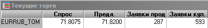

# Integrating Quik with ATSD: Board Arbitrage

## Table of Contents

* [Quik Overview](#quik-overview)
* [Quik Features](#quik-features)
* [Market Data](#market-data)
* [ATSD Quik ODBC Driver](#atsd-quik-odbc-driver)
* [Board Arbitrage](#board-arbitrage)
* [Availability Monitoring](#availability-monitoring)
* [Reference](#reference)

## Quik Overview

[Quik Workstation](https://arqatech.com/ru/products/quik/terminals/user-applications/quik-workstation/) is a brokerage application. It allows professional traders to buy and sell stocks, bonds, derivatives, and currencies on the [Moscow Exchange](https://moex.com) through a broker.

Quik UI


The workstation supports two-factor authentication and connects securely to the Quik server installed at the broker.

The Quik server validates and routes orders to the exchange while also interfacing with the broker's back-end systems.

The orders are executed by the exchange at the best available price determined at continuous auctions.


Quik is a 32-bit Windows program developed by `Arqatech` and is installed from an `msi` package. The package is custom built by each broker to hard-code particular features and connection parameters to the broker's Quik servers.


Current version as of May 2019 at Sberbank is `v7.19.3.1`.

## Quik Features

* Create and cancel orders

  

* View real-time market data

  

* View historical OHLC history using charts

  

* Read news released by Reuters and Interfax
* Export current data into Excel, databases (ODBC), other trading tools

  

* Create reports, submit non-trading requests
* Execute transactions from file
* Execute Lua and `QPILE` scripts

  Sample script to buy [Gazprom](http://iss.moex.com/iss/engines/stock/markets/ccp/boards/eqrp/securities/gazp) stock:

  ```lua
  local transaction = {
    ACCOUNT   = 'XXX-XXXXXXXX',
    TRANS_ID  = '123',
    ACTION    = 'NEW_ORDER',
    TYPE      = 'L',            -- limit order
    OPERATION = 'B',            -- buy order
    CLASSCODE = 'TQBR',         -- equities
    SECCODE   = 'GAZP',         -- Gazprom common
    QUANTITY  = '1',
    PRICE     = '200.0',
    EXECUTION_CONDITION = 'FILL_OR_KILL'
  }
  sendTransaction(transaction)
  ```

## Market Data

### Data Exposed by Quik

The Quik workstation provides access to market data of various types:

* Trades

  

* Best bid and offer Quotes (Level 1)

  

* Quote Book (Level 2)

  

* OHLC history, aggregated from trade data

  

* News

### Data Available from Exchange

Data available as a [subscription](https://www.moex.com/ru/orders?historicaldata) from the exchange.

* Trades

```txt
|    TRADENO | TRADEDATE  | TRADETIME | SECID | BOARDID |  PRICE | QUANTITY |    VALUE | TYPE | BUYSELL |
|------------|------------|-----------|-------|---------|--------|----------|----------|------|---------|
| 2914349072 | 29.12.2018 | 09:59:42  | MTSS  | TQBR    |    237 |       10 |     2370 |      | B       |
| 2914349073 | 29.12.2018 | 09:59:42  | NVTK  | TQBR    | 1126.8 |      150 |   169020 |      | B       |
| 2914349074 | 29.12.2018 | 09:59:42  | NVTK  | TQBR    | 1126.8 |       10 |    11268 |      | B       |
| 2914349075 | 29.12.2018 | 09:59:44  | GAZP  | TQBR    | 153.69 |       10 |   1536.9 |      | S       |
| 2914349076 | 29.12.2018 | 09:59:44  | GAZP  | TQBR    | 153.69 |      140 |  21516.6 |      | S       |
| 2914349077 | 29.12.2018 | 09:59:44  | GAZP  | TQBR    | 153.69 |      750 | 115267.5 |      | S       |
```

* Orders, Type A

```txt
|     NO | SECCODE | BUYSELL |         TIME | ORDERNO | ACTION |  PRICE | VOLUME | TRADENO | TRADEPRICE |
|--------|---------|---------|--------------|---------|--------|--------|--------|---------|------------|
| 412833 | ROSN    | B       | 105304715636 |  228871 |      0 | 425.95 |     40 |         |            |
| 412834 | POLY    | B       | 105304718116 |  227693 |      0 |  734.8 |     29 |         |            |
| 412835 | ROSN    | S       | 105304745167 |  227393 |      0 |  427.2 |    170 |         |            |
| 412836 | ROSN    | S       | 105304746264 |  229592 |      1 |  427.2 |     90 |         |            |
| 412837 | RUAL    | B       | 105304800443 |  229593 |      1 | 30.455 |     20 |         |            |
| 412838 | PLZL    | B       | 105304812871 |  229529 |      0 | 5366.5 |     65 |         |            |
| 412839 | PLZL    | S       | 105304813282 |  229531 |      0 | 5409.5 |     65 |         |            |
| 412840 | PLZL    | B       | 105304813336 |  229539 |      0 |   5367 |     52 |         |            |
| 412841 | PLZL    | B       | 105304813772 |  229594 |      1 | 5312.5 |     52 |         |            |
| 412842 | RUAL    | S       | 105304824440 |  229217 |      0 |  30.62 |    930 |         |            |
| 412843 | RUAL    | S       | 105304849448 |  229595 |      1 |  30.57 |     50 |         |            |
| 412844 | CHMF    | S       | 105304852240 |  225438 |      0 |    947 |    210 |         |            |
```

* Orders, Type B

```txt
| SECCODE | BUYSELL |         TIME |    TRADENO |  PRICE | VOLUME |
|---------|---------|--------------|------------|--------|--------|
| MOEX    | B       | 133408030288 | 2914434812 |  80.97 |     10 |
| MOEX    | B       | 133408030288 |            |  80.97 |    990 |
| MOEX    | S       | 133408030288 |            |  80.97 |     10 |
| MOEX    | S       | 133408030288 | 2914434812 |  80.97 |     10 |
| MOEX    | S       | 133408030288 |            |     81 |     20 |
| MOEX    | B       | 133408033424 |            |  80.98 |    280 |
| ROSN    | B       | 133408205588 |            | 423.45 |     10 |
| SNGS    | B       | 133408239317 |            |  26.78 |   2000 |
| MOEX    | B       | 133408243551 |            |  80.97 |   1140 |
| POLY    | B       | 133408751686 |            |  732.7 |      1 |
```

* Consolidated Example

```txt
| Data Type | Symbol | Operation |         Time |   Trade No |  Price | Quantity |
|-----------|--------|-----------|--------------|------------|--------|----------|
| ORDER B   | SNGS   | S         | 100004425331 |            | 26.855 |     1700 |
| TRADE     | SNGS   | B         | 100004735095 | 2914349804 | 26.855 |      800 |
| TRADE     | SNGS   | S         | 100004735095 | 2914349804 | 26.855 |      800 |
| ORDER A   | SNGS   | S         | 100004735095 |            | 26.855 |      900 |
```

## ATSD Quik ODBC Driver

### Driver Setup

Install 32-bit ATSD ODBC driver for Quik from `atsd_odbc_x32.msi`.

Open **Control Panel** and created a User DSN.


### Export Trade Data

Create a new table **Таблица обезличенных сделок** in Quik.

Right click the table and select **Вывод по ODBC**.


Connect to the data source. Choose `ATSD.quik_tx_all` from the list of available tables.

Include and map only those columns that are present in the target `quik_tx_all` table.


Ensure that **Формальные имена** setting is checked.


Click **Начать вывод данных**.

### Export Quotes (Level 1) Data

Create a new table **Текущая таблица параметров** in Quik. Include **all** columns to the table.

Right click on the table and select **Вывод по ODBC**.

Choose `ATSD.quik_tx_all` from the list of available tables.

Map **all** available columns.


Ensure that **Формальные имена** setting is checked.
  


Click **Начать вывод данных**.

### Check Data

Enter `quik_tx_all` on the **Metrics** tab in ATSD and check that at least price and volume metrics are listed.


Enter `*[tqbr]` on the **Entities** tab and check that the list contains symbol names with class code as a suffix.


Select one of the entities from the list and check that the `quik_current` is collected.


## Board Arbitrage

### Strategy Description

The strategy generates a paired buy and sell signal when the price of identical securities diverges between different boards by a spread exceeding the brokerage fees, exchange fees, and the cost of capital.

### Boards / Classes

Main [boards](http://fs.moex.com/files/3864)

Class | Description
---|---
TQBR | Т+ Акции и ДР
TQIF | Т+ Паи
TQTF | Т+ ETF
TQOB | Т+ Облигации
TQBD | Т+ Акции и ДР (расч. в USD)
TQTD | Т+ ETF (расч. в USD)
TQOD | Т+ Облигации (расч.в USD)
SMAL | Т+ Неполные лоты
CETS | Валютная секция

### Create Data Rules

To analyze and correlate data in memory, create rules to maintain last trade and quote for each instrument.

Open **Rules > Import** page in ATSD and upload the following two rules from [`quote-base-rules.xml`](./resources/quote-base-rules.xml).

The `quik_trade` rule maintains the last trade for each instrument.


The `quik_quote` rule maintains the consolidated quote for each instrument.


The in-memory [windows](https://axibase.com/docs/atsd/rule-engine/window.html) created by these rules for each instrument are continuously updated as the data from the Quik workstation is received and processed by ATSD.

### Create Arbitrage Rules

Create a separate analytical rule for each strategy that reference base rules using the [`rule_window()`](https://axibase.com/docs/atsd/rule-engine/functions-rules.html#rule_window).

The analytical rules can now operate on **all matching** instruments using in-memory data of various types (trades, quotes, statistics) to trigger algorithmic trades.


To automatically execute trades, send the trade signal command using the [`sendTcpMessageReply`](https://axibase.com/docs/atsd/rule-engine/functions-utility.html#sendtcpmessagereply) function, execute a [script](https://axibase.com/docs/atsd/rule-engine/scripts.html), or trigger an outgoing [webhook](https://axibase.com/docs/atsd/rule-engine/notifications/) to an external service.

```java
@if{in_white_list && signal == 'buy'}
${sendTcpMessageReply('quik-01.example.org', 13770, buy_order_command)}
@end{}
```

The advantage of executing strategy rules in ATSD compared to local Lua scripts executed directly by the Quik workstation are as follows:

* Offload heavy calculations to the server.
* Apply strategies to **all** active instruments without sacrificing performance.
* Correlate data from different sources - Quik and other sources.

## Availability Monitoring

Open **Сервисы > Lua Скрипты** and load the [`quik-monitor.lua`](./resources/quik-monitor.lua) script.

Modify connection parameters to the ATSD TCP service.

```lua
local host, port = "atsd.example.org", 8081
```

Start the script which collects key Quik workstation parameters every 5 seconds including:

* Connection status.
* Quik server response time (`ping`).
* Number of records in tables: `orders`, `trades`, `depo_limits`.


To deploy this portal, create a new portal in ATSD based on [`quik-monitor.config`](./resources/quik-monitor.config).

To receive email/chat alerts when the data stops arriving, open **Rules > Import** page in ATSD and upload the following rules from [`quik-monitor-rules.xml`](./resources/quik-monitor-rules.xml).

* Alert when the workstation disconnects from the broker's Quik server.
* Alert when no connection status commands are received from the workstation within 3 minutes.
* Alert when no `BUY` trades are received within 3 minutes for `sber_[tqbr]`.
* Alert when no quotes are received within 10 minutes for `sber_[tqbr]` and `sber_[smal]`.


## Reference

### Brokers

Top 5 brokers [by equity trade volume](https://www.moex.com/ru/spot/members-rating.aspx?rid=115) in April 2019, in billion ₽.

Broker | Volume
---|---:
БКС | 475
Ренессанс Брокер | 200
Сбербанк | 164
ВТБ | 152
Открытие | 94

Top 5 brokers [by active clients](https://www.moex.com/ru/spot/members-rating.aspx?rid=110) in April 2019.

Broker | Count
---|---:
Сбербанк | 45,696
Тинькофф Банк | 36,077
ВТБ | 23,330
Открытие | 22,338
БКС | 22,232

### Broker and Exchange Fees

The exchange and brokers charge fees based on the daily trade volume.

[Sberbank](https://www.sberbank.ru/ru/person/investments/broker_service/tarifs) trading commissions:

Daily Range | Broker Fee, % | 1,000 ₽ Stock Trade Fee
---|---:|---
< 1M ₽ | `0.060%` | `0.60 ₽`
1M - 50M ₽ | `0.035%` | `0.35 ₽`
50M - 100M ₽ | `0.012%` | `0.12 ₽`
100M+ ₽ | `0.006%` | `0.06 ₽ (6 kopeeks)`

[Exchange](https://www.moex.com/s428) fee: `0.01%` (`10 kopeeks` above) with a minimum of `0.02 ₽` per trade.