# Calendars of Ancient Rome: Roman Time Keeping

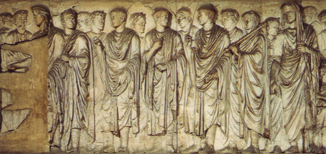

> To view the original slideshow, download the [`.zip` archive](./resources/roman_time_keeping.zip) and open `roman_time_keeping/index.html` in any web browser by right-clicking and selecting your preferred web browser from the **Open With** list.

## Agenda

* [Time-keeping basics](#time-keeping-basics)
* Customs and society in [Ancient Rome](#ancient-rome).
* Roman [calendars](#calendar-overview).
  * [Kingdom Calendar](#kingdom-calendar)
  * [Julian Calendar](#julius-calendar)
  * [Augustan Calendar](#augustan-calendar)
  * [Commodus Calendar](#commodus-calendar)

## Time Keeping Basics

### Moon Phases

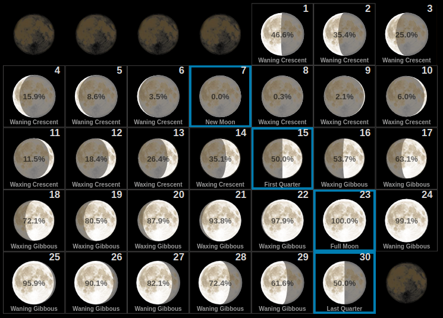

* Solar [model](https://www.edumedia-sciences.com/en/media/216-sun-earth-moon) was not known to ancient people.
* Difficult to determine [phase](https://www.moongiant.com/calendar/November/2018/) transitions, e.g. 0% visibility for New Moon.
* Transitions occur during various times of the day, for example during midday.
* Everyone must agree on the exact time by observation. To this day, the Islamic calendar is based on an authorized sighting and the next phase is not set (known) in advance.

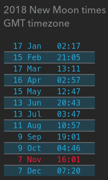

### Moon Quiz

* Compare the two moon images captured at the same time on February 4th, 2016 by NASA Lunar Reconnaissance Orbiter.
* What does each image tell you about the observer's location?

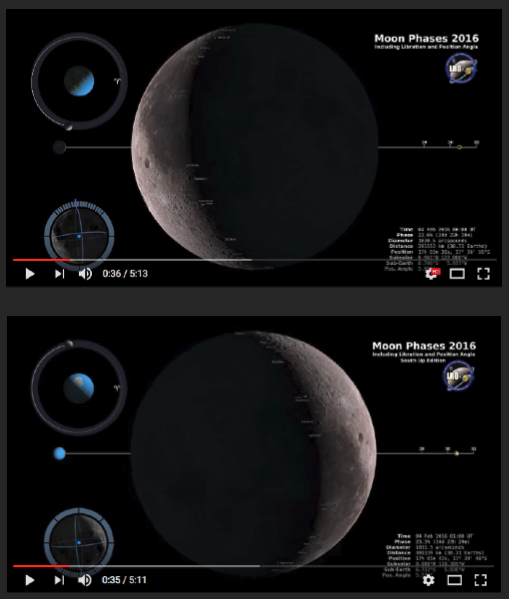

<!-- markdownlint-disable MD026 -->

### What is a Year?

<!-- markdownlint-ensable MD026 -->

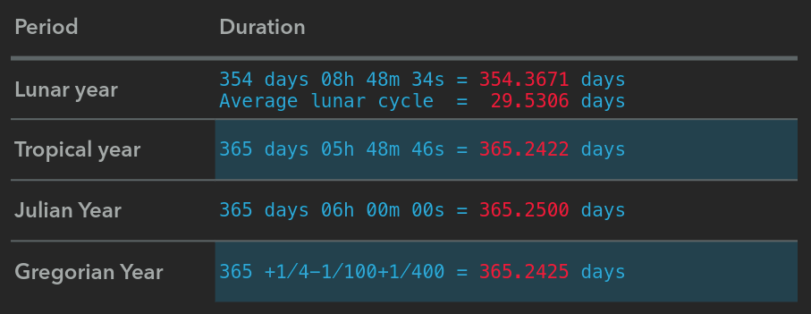

> Münchhausen Year (with May 32): 365 days, 6 hours, 3 seconds.

## Ancient Rome

### Decimal Culture

* Army
  * Unit Counts: *Centuria* (later reduced to eight, which became a favorite number).
  * Capital punishment: 1/10 executed in case of desertion (hence, decimate).
  * Gate width to 10 (and then 8) shields ([*scutums*](https://en.wikipedia.org/wiki/Scutum_(shield)))

  

* Government
  * Senate, *Quaria*, *Comita* composition
  * *Decemviri*, `X` tables (later `XII` tables)
* Family
  * 10 witnesses required during [*confarreatio*](https://en.wikipedia.org/wiki/Confarreatio) (noble wedding).
  * Newborn children remained unnamed until 10 days old.
* Roman Numbering
  * Large numbers: CI&#8579; = 1,000; CCI&#8579;&#8579; = 10,000; CCCI&#8579;&#8579;&#8579; = 100,000; 10n * 1000.
  * Which mathematical symbol do you get if you continue?
    

Show answer.

The infinity sign. <big>&#x221e;</big>

### Religion

* Priest *collegium* ("*co leges*")
  * Pontificies supervised sacrifices, ceremonies and **calendars**. *Collegium Pontificum*, *Pontifex Maximus*.
  * [Augurs](https://en.wikipedia.org/wiki/Augur) observed and recorded unnatural incidents (*auspicia oblativa*) and watched birded (*auspicia imperativa* - per request).
  * [Sibyls](https://en.wikipedia.org/wiki/Sibyl) were oracles who interpreted ancient scripts. When to make major sacrifices, e.g. human burials in 228 BCE, 216 BCE, 214 BCE to avert Gaul invasions.

### Political Timeline

* Founded: 753 BCE
* Kingdom: 753 - 509 BCE (244 years)
* Republic: 509 - 27 BCE (482 years)
* Empire (Western): 27 BCE - 476 CE (503 years)

### Calendar Timeline

* Kingdom
* Republican
* Julian
* Augustan
* Commodus

## Calendar Overview

* Era: starting date(s).
* Type: lunar/solar/lunisolar
* Units: Months, Weeks, Days, etc.
* Intervals

### Kingdom Calendar

* Era is AUC - "*ab urbe condita*, from the founding of the city of Rome in 753 BCE.
* Lunisolar model.

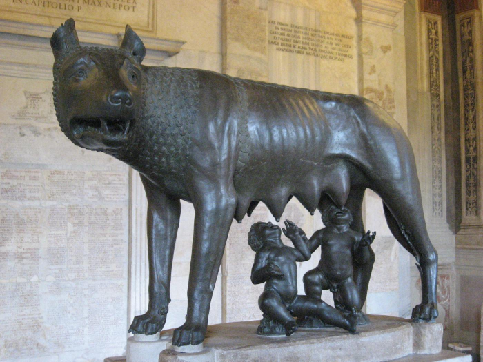

#### Kingdom Month

* 10 months
* *Pleni* (full) and *cavi* (hollow) months.
* 304 days in named months followed by winter of 50&plusmn; days.
* [Intercalation](https://en.wikipedia.org/wiki/Intercalation_(timekeeping)) (annual calendar adjustment) determined by Pontifex Maximus.

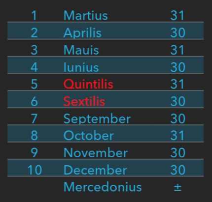

#### Week

* [*Nundinae*](https://en.wikipedia.org/wiki/Nundinae)
* Sequential numbering
* 8 days
* A, B, C, D, E, F, G, H
* 38 weeks per year (304/8)

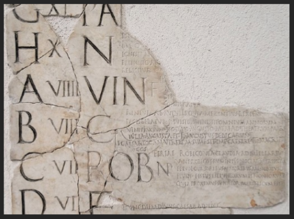

### Republican Calendar

* 509 BCE- [King Tarquin the Proud](https://en.wikipedia.org/wiki/Lucius_Tarquinius_Superbus) expelled.
* Formation of the *Senatus Populusque Romanus*, often abbreviated to SPQR meaning "The Roman Senate and People."

#### Days

* Days classified by type, which determines the allowed activities on a particular day:
  * *Dies fasti*
  * *Dies comitiles*
  * *Dies nefasti* (no assembly permitted)
  * *Dies endotercisi*
  * *Dies nefasti publici*
  * *Dies fasti trimphales*

#### *Ides*

* Fractional month based on moon phases: new moon, first moon, full moon.
* [*Kalends*](https://en.wikipedia.org/wiki/Calends) (*Kal*)
  * First day of the month.
  * Day following the appearance of the new moon.
  * Debt and interest must be paid on *kalends*.
* [*Ides*](https://en.wikipedia.org/wiki/Roman_calendar#Months) (*Eid*)
  * Thirteenth day in short (*cavi*) months or fifteenth day in long (*pleni*) months.
  * Day before full moon.
* [*Nones*](https://en.wikipedia.org/wiki/Roman_calendar#Months) (*Non*)
  * Eight days before *ides*.
  * Fifth day in short months, seventh day in long months.

#### January *Ides*

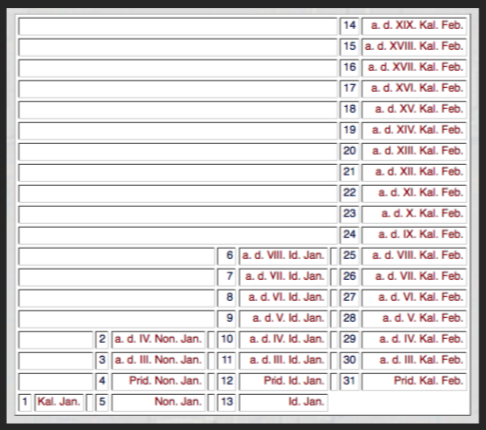

#### Moon Phase Quiz: April/May 2022

* Calculate:
  * *Kalends*
  * *Nones*
  * *Ides*
* [Greek *kalends*](https://en.wikipedia.org/wiki/Calends#Expressions)

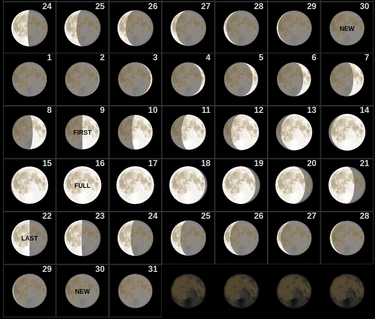

Show answer.

<li><i>Kalends</i>: 1 May, 2022</li><li><i>Nones</i>: 7 May, 2022</li><li><i>Ides</i>: 15 May, 2022</li>

#### Intervals

* Inclusive numbering, e.g. the 8-day week called *Nundinae* (from *nunus*, meaning ninth).
* Days measured as distance to a specific date +1, for example 5 October is expressed as "4 days until 8 October".
* Truce agreements with enemy states measured in lunar months because enemies did not use the Roman calendar.

#### Republican Reforms

* Introduced by either [King Numa](https://en.wikipedia.org/wiki/Numa_Pompilius) or during the Republican period.
* AUC but also regal years referring to consul names (no kings), since consuls were selected for one-year terms.
* January and February added.
* Two intercalation periods:
  * 4-year cycle: 355 + 377 + 355 + 378
  * 19-year cycle: 19 solar years in very close to 235 [lunations](https://en.wikipedia.org/wiki/New_moon).

  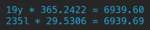

  * Leap years were considered unluckey and were occasionally skipped during tough years, for example during the [Punic Wars](https://en.wikipedia.org/wiki/Punic_Wars), against Carthage. Sometimes they were "closed" early, for example 363 BCE was called to terminate early to fight plague.

#### Republican Month

* Twelve months.
* 355 or 3777(+1) days.
* [*Intercalaris*](https://en.wikipedia.org/wiki/Mercedonius) inserted on February 24 - *Terminalia* Day (*a.d. VII Kal. Mar.*).
* Feb 1-24 + *Intercalaris* 1-27.

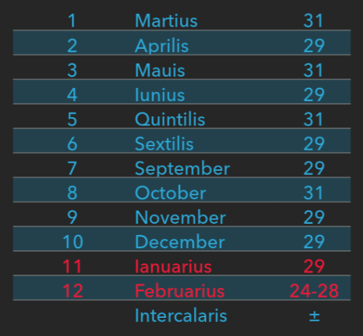

### Julian Calendar

#### Julian Reforms

* Introduced in 45 BCE after Julius Caesar is elected *Pontifex Maximus*.
* Borrows the cycle from the Egyptian 365-day <u>solar</u> calendar.
  * Caesar spent 48-46 BCE in Egypt.
* Enacted in 46 BCE.
* 10 days added to the [Republican Calendar](#republican-calendar).
* Leap years: every fourth year has an extra day in February. Repeat day: 24 February (not 29 February).
* Year starts on 1 January as the day of the new moon in 45 BCE.
* *Quintilius* renamed to *Julius* in 44 BCE.

#### Julian Month

* 12 months
* 365 days (+1 leap)
* Modern day counts
* Duplicate 24 February in leap years
* Year start is set to January, but this occurred casually as early as 4000 BCE.

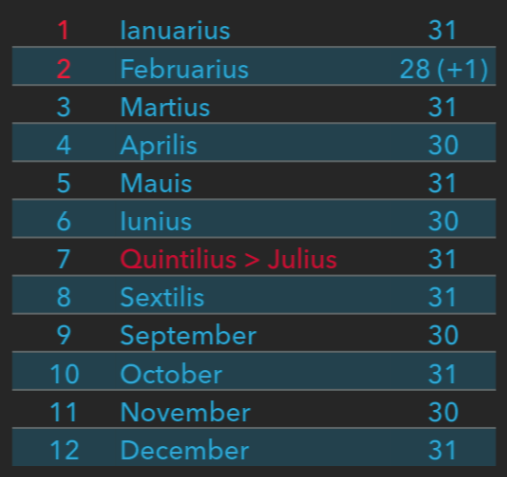

#### Transitional (Leap) Year 46 BCE

* Introduced to fix accumulated errors.
* *Annus confusionis* - the year of confusion.
* 15 months
* 445 days to last until new moon after shortest day in winter in 45 BCE.

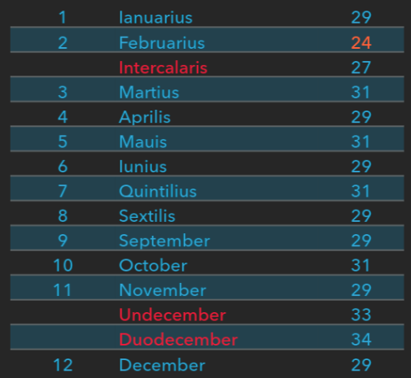

### Augustan Calendar

#### Augustan Reforms

* Introduced in 8 BCE.
* Error detected: for 30+ years, leap year was erroneously declared.
* After [Julian reforms](#julian-reforms), leap year were added every third year instead of every fourth year: 45, 42, 39, 36, 33, 30, 27, 24, 21, 18, 15, 12 BCE.
* To correct the accumulated errors, five leap years were skipped. Next leap year was set to 12 CE.

> Java Calendar [docs](https://docs.oracle.com/javase/8/docs/api/java/util/GregorianCalendar.html): "Dates obtained using `GregorianCalendar` are historically accurate only from **March 1, 4 AD** onward, when modern Julian calendar rules were adopted. Before this date, leap year rules were applied irregularly."

* *Sextilis* renamed to *Augustus.* *Romulus* was also considered as a possible name.

#### Augustan Month

* *Sextilis* renamed to *Augustus*.
* That February lost one day to make *Augustus* a <u>long</u> month is a myth.

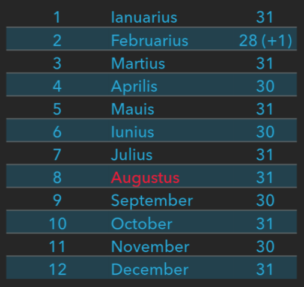

### Commodus Calendar

* Introduced in 192 CE by [Commodus](https://en.wikipedia.org/wiki/Commodus), son of [Marcus Aurelius](https://en.wikipedia.org/wiki/Marcus_Aurelius).
* Renamed all months. Most names come from Commodus' own [regnal name](https://en.wikipedia.org/wiki/Regnal_name) (below).
* The exact order of new month names is unknown.
* Renamed Rome to *Colonia Lucia Annia Commondiana*.
* Reforms rolled back in 193 CE after Cev 192 CE assassination as part of the *damnatio memoriae*.

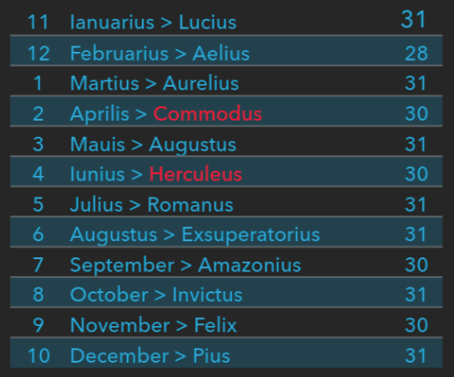

> The Emperor **Caesar Lucius Aelius Aurelius Commodus Augustus Pius Felix Sarmaticus Germanicus Maximus Britannicus**, Pacifier of the Whole Earth, Invincible, the Roman Hercules, Pontifex Maximus, Holder of the Tribunician Authority for the eighteenth time, Emperor for eighth time, Consul for the seventh time, Father of his Country, to consuls, [praetors](https://en.wikipedia.org/wiki/Praetor), tribunes, 6 and the fortunate Senate, greetings!

### Alternatives

#### Best Leap Cycle for Ancient Times

* Gregorian calendar spans hundreds of years, which was beyond the recording capabilities and planning horizon of ancient peoples.
* Gregorian calendar also has an accumulating error: 365.2422 (actual) versus 365.2425 (calendar). The error of +26 seconds per year translates to one day per 3,323 years but will occur in ~10,000 years due to changes in solar year duration.
* What could be the shortest leap cycle duration within a life expectancy of 30 years with mimimal errors?
  * **20-year Cycle**: 365*3+366 and skip every twentieth leap year: `365 + 1/4 - 1/20 = 365.2000`. Error is **61** minutes per year.
  * **40-year Cycle**: 365*3+366 and skip every fortieth leap year: `365 + 1/4 - 1/40 = 365.2250`. Error is **25** minutes per year.
  * **100-year Cycle**: 265*3+366 and skip every hundredth leap year: `365 + 1/4 - 1/100 = 365.2400`. Error is **3** minutes per year.

> Only the 100-year cycle has greater precision than the [Julian calendar](#julian-calendar): 365.2500.

### Final Quiz

* Christmas in Russia is celebrated on 25 December, [Julian calendar](#julian-calendar).
* The Gregorian calendar was adopted by the Soviet Union in 1918.
* Christmas falls on 7 January on the Gregorian calendar.
* When and how will this date change the next time?

Show answer.

2100. Christmas will be celebrated on 8 January.

