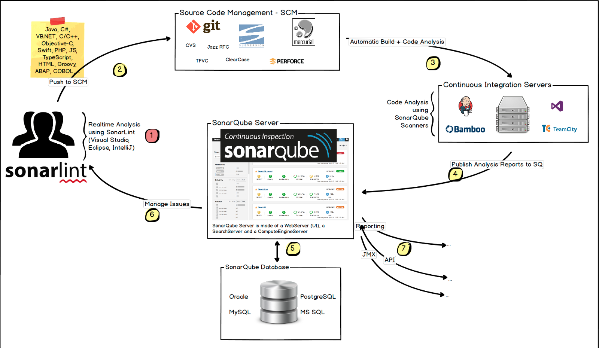
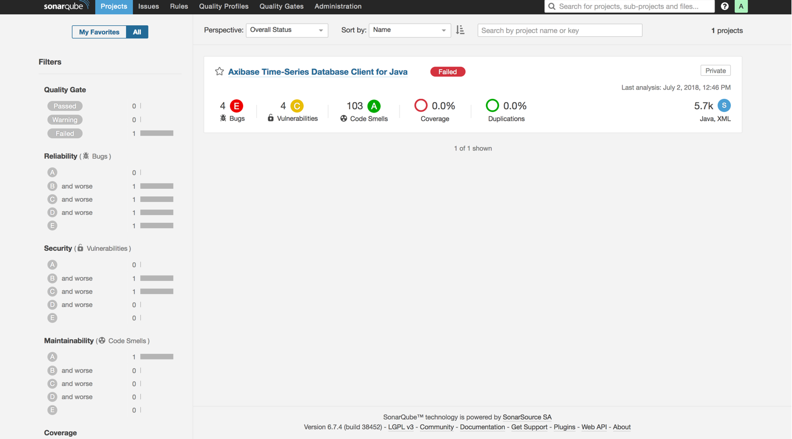
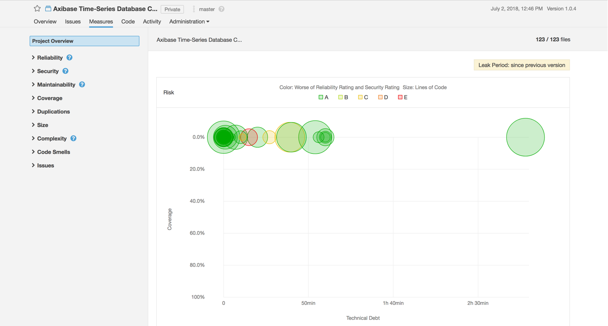
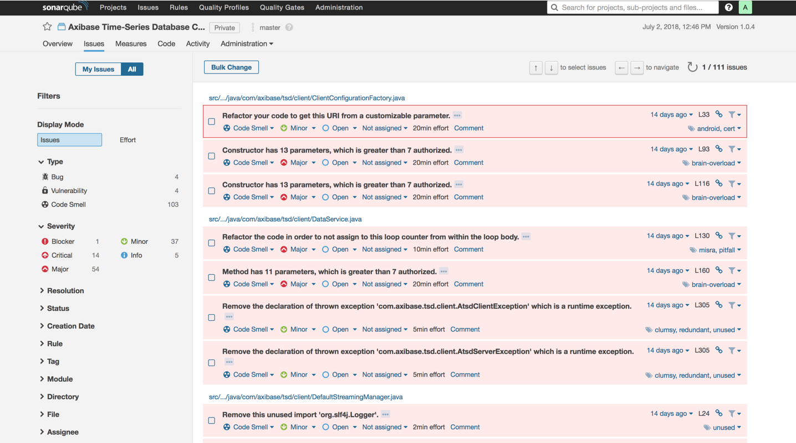
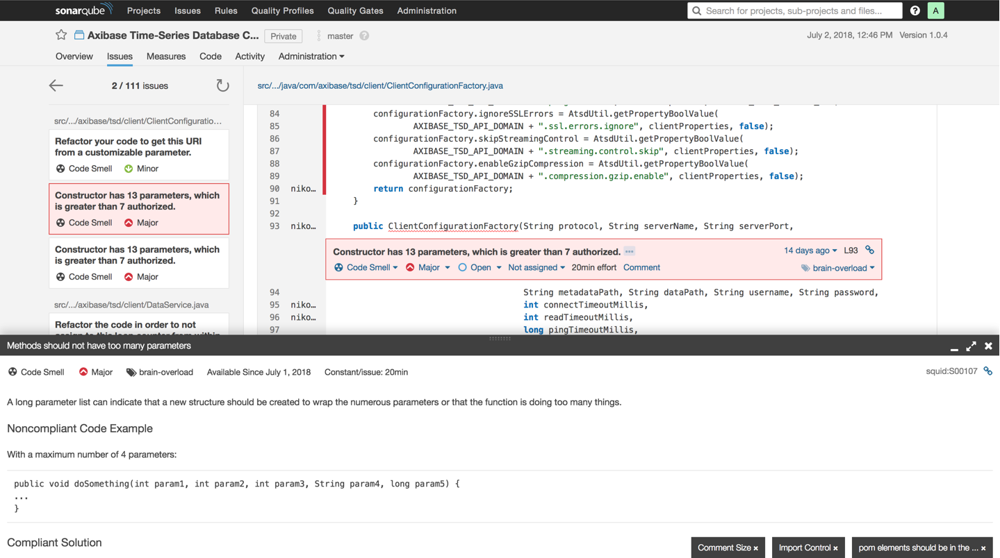
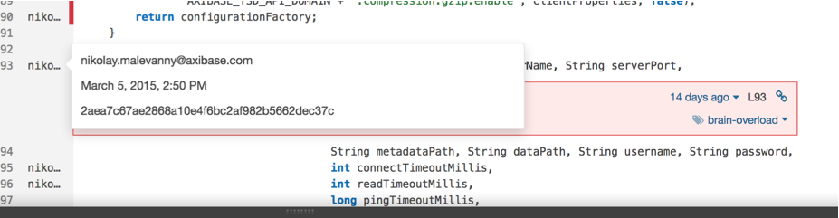
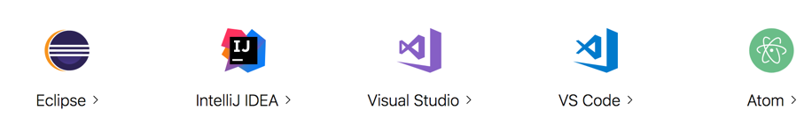
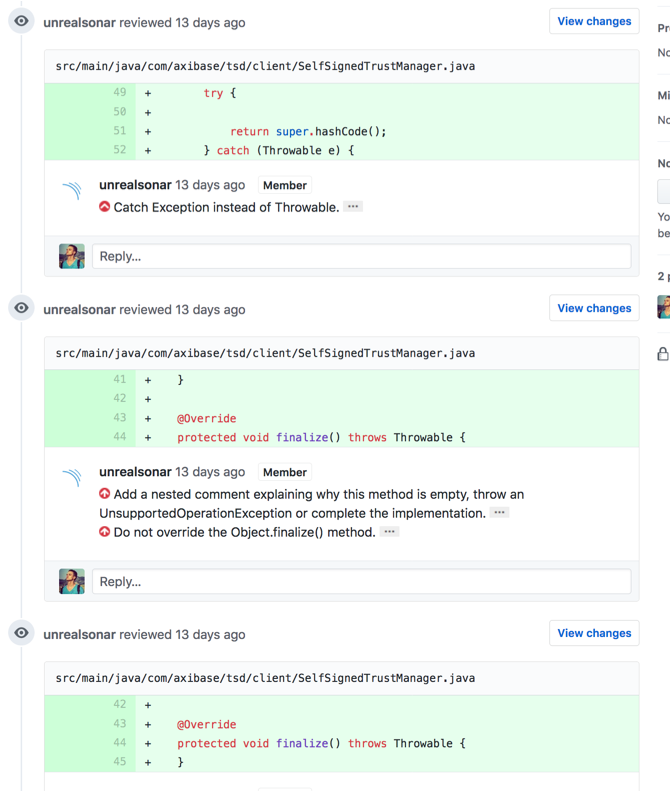
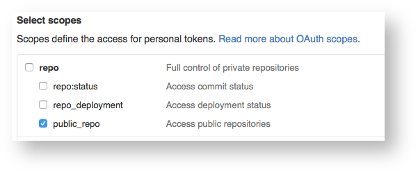

# Code Inspection with SonarQube


## Contents

* [Overview](#overview)
* [Static Analysis](#static-analysis)
  * [Benefits](#benefits)
  * [Tools](#tools)
* [SonarQube](#sonarqube)
  * [Capabilities](#capabilities)
  * [Advantages](#advantages)
  * [Disadvantages](#disadvantages)
  * [Assessing Code Quality](#assessing-code-quality)
* [Installation](#installation)
  * [Process](#process)
  * [Requirements](#requirements)
  * [Compose File](#compose-file)
* [Interface](#interface)
  * [Homepage](#homepage)
  * [Project Metrics](#project-metrics)
  * [Navigation](#navigation)
  * [Rules, Quality Profiles, and Quality Gates](#rules-quality-profiles-and-quality-gates)
* [IDE Integration](#ide-integration)
  * [Supported IDEs](#supported-ides)
* [GitHub Integration](#github-integration)
  * [Plugin Requirements](#plugin-requirements)
  * [Sonar Analysis in CI](#sonar-analysis-in-ci)

## Overview

[SonarQube](https://www.sonarsource.com/products/sonarqube/) (formerly Sonar) is an open source platform developed by [SonarSource](https://www.sonarsource.com/) which continuously inspects code quality and performs automatic reviews via *static analysis* to detect bugs, [code smells](https://en.wikipedia.org/wiki/Code_smell), and security vulnerabilities in over twenty programming languages.

## Static Analysis

*Static analysis* is the analysis of computer software which is performed without executing programs, in contrast with *dynamic analysis*, which is analysis performed on programs as they execute.

There are two types of code which may be analyzed without execution: **source code** and **object code**.

### Benefits

There are many reasons to perform static analysis:

* Improve development and component testing processes.
* Identify potential quality issues at the development phase, before software goes into production.
* Detect areas in code that require refactoring or simplification.
* Locate programming errors or flaws.
* Increase development team communication and encourage developers to produce high-quality code.

### Tools

* [**Checkstyle**](http://checkstyle.sourceforge.net/) is a tool which checks Java source code for adherence to a Code Standard or set of validation rules (best practices).
* [**SpotBugs**](https://spotbugs.github.io/) is a program which uses static analysis to look for bugs in `Java` code. SpotBugs is the spiritual successor of [FindBugs](http://findbugs.sourceforge.net/), carrying on from the point where it left off with the support of its community.
* [**ESLint**](https://eslint.org/) is a tool for identifying and reporting on patterns found in ECMAScript/JavaScript code.

> The major benefit of static code analysis is that bugs are identified early in the development cycle, which means less cost to fix them.
Static code analysis is best utilized as part of the build process.

## SonarQube

SonarQube is an open source platform, designed for continuous analysis and code quality analysis.

The main difference between SonarQube and the other tools is that the code analysis **runs externally** in a CI server and the result is sent to SonarQube. Then, this analysis is processed by SonarQube and stored in a database before being served. That means extra effort in configuring your CI server.



### Capabilities

* Many languages are supported:
  * Java
  * C
  * C++
  * C#
  * Objective-C
  * Swift
  * PHP
  * JavaScript
  * Python
* Reports for:
  * Code duplication
  * Compliance with the coding standards
  * Unit tests coverage
  * Possible errors in the code
  * Code comment density
  * Technical debt
* Store metric history and build charts of changes in metrics over time.
* CI integration:
  * Maven
  * Ant
  * Gradle
  * Jenkins
* IDE integration:
  * IntelliJ IDEA
  * Visual Studio
  * Eclipse
  * VSCode
  * Via SonarLint plugin
* External tool integration:
  * JIRA
  * Mantis
  * LDAP
  * Fortify
* Extend existing functionality using third-party plugin. For example, add integration with GitHub for automatic code review within Pull Requests.
* Technical debt is evaluated according to [SQALE](https://en.wikipedia.org/wiki/SQALE) (Software Quality Assessment based on Lifecycle Expectations) methodology.

### Advantages

* One's own fully configured server.
* Change history is stored in any supported database.  
* Quality profiles for each project.
* Support for the integration of custom static analysis programs.

### Disadvantages

* Plugins for some languages are available only in commercial versions of the platform.
* Additional time for configuration and resources for administration of SonarQube.

### Assessing Code Quality

A SonarQube quality model implements  SQALE methodology with certain improvements. SQALE methodology focuses mainly on the complexity of code maintainability and does not take consider project risks.

SonarQube developers modified the quality model, based on SQALE to focus on the following important points:

* Simple quality model.
* Bugs and vulnerabilities are not get lost among maintainability issues.
* Serious bugs or security vulnerabilities prevent [Quality Gate](https://docs.sonarqube.org/7.4/user-guide/quality-gates/) requirements from being fulfilled.
* Maintainability issues are not ignored.
* Estimation of remediation cost is completed.

The standard SonarQube Quality Gate uses the following metric values to assess if code has successfully passed all checks:

* No new bugs
* No new vulnerabilities
* Technical debt ratio for new code &le; 5%
* New code coverage &#8814; 80%

The Sonar team defines seven deadly developer sins which increase technical debt:

* Bugs and potential bugs.
* Code standards violations.
* Code duplication.
* Insufficient unit test coverage.
* Poor complexity distribution.
* [Spaghetti code](https://en.wikipedia.org/wiki/Spaghetti_code).
* Too few or too many comments.

## Installation

The SonarQube Platform is a Java Web Server which uses a database to store history, settings, etc. Several database engines are supported.

### Process

* Install preferred database.
* Create an empty schema and `sonarqube` user
* Grant `sonarqube` user permissions to create, update, and delete objects for this schema.
* Copy web application files.
* Specify database credentials in configuration files.
* Run the platform using the provided script.

Refer to SonarQube [documentation](https://docs.sonarqube.org/display/SONAR/Installing+the+Server#InstallingtheServer-installingDatabaseInstallingtheDatabase) for more information.

### Requirements

* Docker Engine `1.9`
* Docker Compose `1.6`

### Compose File

Create a Docker Compose file for use with a PostgreSQL database:

```yaml
version: "2"

services:
  sonarqube:
    image: sonarqube
    ports:
      - "9000:9000"
    networks:
      - sonarnet
    environment:
      - SONARQUBE_JDBC_URL=jdbc:postgresql://db:5432/sonar
    volumes:
      - sonarqube_conf:/opt/sonarqube/conf
      - sonarqube_data:/opt/sonarqube/data
      - sonarqube_extensions:/opt/sonarqube/extensions
      - sonarqube_bundled-plugins:/opt/sonarqube/lib/bundled-plugins

  db:
    image: postgres
    networks:
      - sonarnet
    environment:
      - POSTGRES_USER=sonar
      - POSTGRES_PASSWORD=sonar
    volumes:
      - postgresql:/var/lib/postgresql
      - postgresql_data:/var/lib/postgresql/data

networks:
  sonarnet:
    driver: bridge

volumes:
  sonarqube_conf:
  sonarqube_data:
  sonarqube_extensions:
  sonarqube_bundled-plugins:
  postgresql:
  postgresql_data:
```

Use [`docker-compose`](https://github.com/docker/compose) to start containers:

```bash
docker-compose up
```

Restart containers , after plugin upgrade or install for example:

```bash
docker-compose restart sonarqube
```

Analyse a project using `Maven`:

```bash
mvn sonar:sonar \
  -Dsonar.host.url=http://localhost:9000 \
  -Dsonar.jdbc.url=jdbc:postgresql://localhost/sonar
```

## Interface

### Homepage

On the SonarQube homepage, there is a list of projects added to the system with brief statistics for each project:

* Build version.
* Number of lines of code.
* Number of bugs, vulnerabilities, and code smells.
* Date of last analysis.



The content of the home page can be customized to your goals with built-in widgets which allow you to visualize the status of the code in SonarQube projects.

### Project Metrics

For additional information regarding project status open **Project > Measures**.



The following code metrics are tracked:

* Reliability
* Security
* Maintainability
* Coverage
* Duplications
* Codebase size
* Cyclomatic and cognitive complexity
* Documentation and issues

### Navigation

To see how SonarQube handles code problems open the **Issues** page.



Filter code problems and focus on the most important issues. SonarQube supports saving filter settings for later use.

Double click an error message to review the code where the problem. Refer to the detailed error description for recommendations on its repair:



Because of integration with version control systems, change history is tracked:



### Rules, Quality Profiles and Quality Gates

[Rules](https://docs.sonarqube.org/7.4/user-guide/rules/), [Quality Profiles](https://docs.sonarqube.org/7.4/instance-administration/quality-profiles/), and [Quality Gates](https://docs.sonarqube.org/7.4/user-guide/quality-gates/) are  key concepts of the SonarQube platform.

Each plugin for SonarQube which performs static code analysis, contains a repository with the description of diagnostic Rules that this plugin performs.

Violations of these rules are used to determine technical debt in your code and evaluate the time to fix these issues. For ease-of-use, the rules are grouped as Quality Profiles. By default, SonarQube creates a default quality profile for each supported language; create custom quality profiles containing useful diagnostic rules.

> For the analysis of critically important projects, which have the highest quality requirements, define a quality profile which contains all available diagnostics; for less critical projects define a less pedantic quality profile, which only alerts for serious bugs.

A Quality Gate  is a compliance or inconsistency indicator for a project representing its conformity to specified threshold code metrics. By default, all projects added to SonarQube, use a standard Quality Gate, with the following metrics and threshold values:

```txt
New bugs = 0
New vulnerabilities = 0
Technical debt ratio on new code <= 5%
Coverage of new code >= 80%
```

### IDE Integration

[SonarLint](https://www.sonarlint.org/) is an IDE extension that helps you detect and fix quality issues as you write code such as a spell checker.

#### Supported IDEs



### GitHub Integration

The [GitHub plugin](https://docs.sonarqube.org/display/PLUG/GitHub+Plugin) analyzes GitHub pull requests without pushing results to SonarQube. Any issues that are found are published as comments on the pull request.

The plugin adds comments to the commit:

* For each issue.
* A global comment that gives a summary of the analysis.



#### Plugin Requirements

* SonarQube
  * SonarQube Server must be up and running.
  * The SonarQube GitHub plugin must be installed on SonarQube Server.
* GitHub
  * Dedicated technical GitHub user which inserts comments when there are issues and updates the status of a pull request.
  * To insert comments, generate a token for that user that has only the `public_repo` scope (or `repo` for private repositories).

  

> For more information about generating a GitHub token, refer to the [GitHub Pull Request Report](../integrations/github/pr-report.md/#generate-oauth-access-token) tutorial.

#### Sonar Analysis in CI

```bash
function sonar_analysis {
    if [[ -n ${PULL_REQUEST} ]]; then
        mvn  sonar:sonar \
            -DskipTests=true \
            -Dsonar.host.url=${SONAR_HOST} \
            -Dsonar.login=${SONAR_TOKEN} \
            -Dsonar.github.pullRequest=${PULL_REQUEST} \
            -Dsonar.github.repository=unrealworkteam/atsd-api-java \
            -Dsonar.github.oauth=${GITHUB_ACCESS_TOKEN}

    else
       mvn  sonar:sonar \
            -DskipTests=true \
            -Dsonar.host.url=${SONAR_HOST} \
            -Dsonar.login=${SONAR_TOKEN}
    fi
}
```
