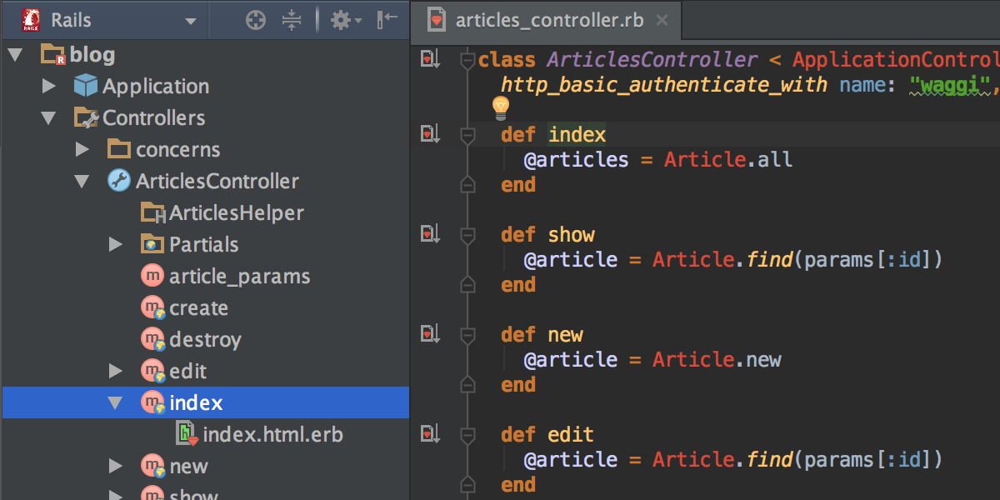

# Technical Writing for Software Developers

 

## Introduction

Technical writing is one of the four primary expressions of written language, these forms are known as different things to different people but the general concept is usually the same across languages and nations:

* **Creative / Narrative Writing:** Fictional or non-fictional writing meant to serve an entertaining or informative purpose by telling a story or recounting an event.
* **Pursuasive Writing:** Fictional or non-fictional writing meant to convince the reader of an opinion, or at least consider a viewpoint.
* **Academic / Scientific Writing:** Non-fictional writing meant to define and defend a thesis / hypothesis for the intellectual community.
* **Technical / Expository Writing:** Non-fictional writing meant to explain a process or product, the advantages therein, and its usage for an unfamiliar audience.

Technical writing comes in many different flavors for many different fields, each has their own idosyncracies and norms. Even though software development is one of the most widely-known and frequently talked-about fields in the modern age, it remains one of the least-understood on a technical level. When writing for others, especially end users and non-technical personnel, it's important to communicate effectively and concisely so that the meaning of the writing isn't drowned out by white noise or excessive verbosity. 

### Key Parameters

The easiest way to assess and analyze meaningful technical writing is to use quantifiable metrics which may be judged impartially. These parameters are broad enough that they may be applied to any piece of technical writing, but specific enough as to be informative and useful. 

Just remember your ABCs: 

* **Accuracy:** Although seemingly obvious, an astoundning amount of technical writing contains factural errors, careless mistakes, or otherwise thoughtless omittions that discourage users from advancing their understanding of a product or pursuing its implementation in their working environment. Unused software is no software at all.

* **Brevity:** When attempting to use a new feature or sample a new product, no audience has unlimited time. Make sure that technical writing is produced with the understanding that readers have places to be and people to see. Make a point before losing their attention.

* **Clarity:** The average reader will spend roughly one percent of the amount of time working with the final product that you spend developing it, probably less. The minutae and subtle features of the product or process may largely escape them. Acknowledge this fact and adjust technical pieces to respect it. 

## Schools of Thought: Classicalism versus Modernism

Like software development itself, technical writing has evolved throughout its existence. Although the descerning reader may point to many subcategories within the two most general: classical and modern, osctensibly each new iteration of technical writing practice is either a continuation of what was, or an attempt at something new.

Classical technical writing tends to use more formal language, and constructions that are rarely spoken:

* "The container *in which* the new instance was launched *shall* begin logging information immediately."

Modern technical writing tends to resemble the spoken dialect more closely:

* "The container *where* the new instance was launched *will* begin logging information immediately."

Like with almost everything else, good technical writing will find the balance between these two schools of thought: 

* "The container *in which* the new instance was launched *will* begin logging information immediately."

### In Practice

When applied to real-world scenarios, a balanced technical writing style is often apparent to any reader regardless of their technical knowledge. Try to read a technical piece from the position of someone who has inferior and superior knowledge to the theme as they will most likely be reading the document before publication as a member of your team, and after publication as a member of the general public.

Delegating technical writing to one person is dangerous. A person with a general understanding of many parts of a system but lacking a thorough knowledge of any one part will never be able to produce the level of user required to make any software a truly global solution. Cooperatively-generated technical documentation and instruction means an in-depth result that provides the answers to questions a reader didn't even know they had.

Picture the operating instructions for the most widely-used or popular programmatic solutions in the world, chances are their operation is supported by technical documentation that is easy to interact with.

### In Style

The presentation of writing is nearly as important as the writing itself. A great document published with an oppressive design forces readers to pre-suppose an overly-complex and esoteric document which may discourage a thorough reading of a piece. A technical document of any length should be well indexed and annotated but presenting a first-time reader with a multi-paged list of every feature available to end users will often serve only to frustrate. Don't let a well-written piece go un-read because it looks like a legal document. 

## The Global Audience

Write technical documentation with the world in mind. Whether this means simplifying the launguage in a technical document or using industry-standard terminology, be sure that the writing may be read by anyone with access to a translator, or a basic understanding of the language of the document. In the field of software development and computer science, the common and widely-understood lexicon should be used to properly name and describe operations and features. 

**Literary Language:** Avoid the desire to use words based on length or complexity. Words should be choosen for their ability to properly convey the required information.

* "Leveraging programmatic solutions to common problems in the legacy API should be considered before seeking a new solution entirely."

* "Leveraging programmatic resolutions to prosaic botherations in the legacy API must be pondered before combing for a new elucidation entirely."

**Thesaurus Syndrome:** Avoid overuse of the thesaurus. Demonstrating a well-ranged vocabulary is important, but conveying clear information is even more important. Don't be afraid of using the same word several times if it applies to several situations. Common words are the place to use the thesaurus. Using too many variations of a word can easily create a confusing sentence that neither proposes a solution nor offers an explanation. 

*Good Thesaurus Usage*

* "After the user has done the installation process, they need to do the set-up procedure, then do the operation."

* "After the user has executed the installation process, they need to perform the set-up procedure, then complete the operation."

*Bad Thesaurus Usage*

* "A device operating on a secure network is able to easily connect with other devices using the network as well. Network traffic among devices may be monitored and throttled using IPv6 protocol."

* "A device oprating on a secture network is able to easily connect with other equipment using the structure as well. System traffic among apparatus may be monitored and throttled using IPv6 protocol."

## Technical Points

No technical writing guide would be complete without a technical explanation of the finer points of writing accurately, briefly, and clearly. The inarguable features of writing of any kind are explored here.

**Grammar:** One of the most important parts of any written document is the attention to grammar and punctuation. A misplaced comma or improperly emphasized clause is able to change the entire meaning of the sentence.

* "One lunch per student. No student may have two lunches."

* "One lunch per student? No! Student may have two lunches." 

**The Third Person:** When writing technical documents, it's usually best to avoid personal pronouns such as I, you, and we unless it is explicitly required. Often this means restructuring sentences to use different registers or tenses.

* "We have been been developing the rule engine since 2004."

* "The rule engine has been in development since 2004."

**Contractions:** Using contractions is part of the choice between classicism and modernism. Classical knowledge is that the use of contractions should be avoided in any technical document whereas modern documents often feature at least a few. Use common sense or refer to other technical documents when faced with a difficult decision.

* "Let's move on to the next topic, it'll have several components, they're not difficult to explain."

* "Let us move on to the next topic, it will have several components, they are not difficult to explain."

**The Passive Voice:** It is generally recommended avoiding the passive voice in technical writing other than using it to soften the accusitory tone of a particular expression. Some situations dictate the use of the passive voice, in which case, its use is perfectly acceptable. Example include the mention of an activty or process which the reader has no part in.

*Accusation*

* "If the launch fails to initiate, the *user did not* complete the installation process correctly."

* "If the launch fails to initate, the *installation was not* completed correctly."

*Non-Participation*

* " *SQL Console is used* to query data stored in ATSD using a convenient syntax."

* " *A user uses* SQL Console to query data stored in ATSD using a convenient syntax."

**The Oxford Comma:** Either use it, or don't use it. You can't do both.

* "Technical writing is about accuracy, brevity, and clarity."
* "Technical writing is about accuracy, brevity and clarity."

## Resources
