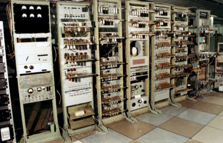

# The Evolution of Time Zones


> *Landscape with the Arrival of Aeneas before the City of Pallanteum* by Claude Lorrain (c. 1625)

## Contents

<!-- markdownlint-disable MD101 -->

* [Overview](#overview)
* [Methodology](#methodology)
  * [Apparent Solar Time](#apparent-solar-time)
  * [Mean Solar Time](#mean-solar-time)
  * [Problem Solving](#problem-solving)
* [Historical Time Keeping](#historical-time-keeping)
  * [Antiquity](#antiquity)
  * [Middle Ages](#middle-ages)
  * [Age of Exploration](#age-of-exploration)
* [Early Time Zones](#early-time-zones)
  * [Navigational Necessity](#navigational-necessity)
  * [Expansion and Standardization](#expansion-and-standardization)
* [Modern Time Zones](#modern-time-zones)
  * [International Demarcation](#international-demarcation)
  * [Daylight Savings Time](#daylight-savings-time)
  * [Information Age](#information-age)
* [Applications](#applications)
  * [Officiating Bodies](#officiating-bodies)
  * [True Solar Time](#true-solar-time)
  * [True Zenith Time](#true-zenith-time)
  * [Martian Time Zones](#martian-time-zones)
    * [Comparative Statistics](#comparative-statistics)
    * [The Martian Day](#the-martian-day)
    * [Mars Retrograde](#mars-retrograde)

<!-- markdownlint-enable MD101 -->

---

## Overview

Time zones were conceived to standardize the differences in time between geographical locations by reliable method. The idea of relative time began as a tool of *navigation*, but grew into a tool of *administration*, as technology allowed and globalization necessitated.

<!-- markdownlint-disable MD105 -->

Modern time zones are standardized to Greenwich Mean Time (GMT) also called Coordinated Universal Time (UTC). Modern time keeping is so precise the Earth's slowing rotation is considered during calculation.<sup>[1](https://www.ietf.org/timezones/data/leap-seconds.list)</sup>

<!-- markdownlint-enable MD105 -->

---

## Methodology

### Apparent Solar Time

* Solar day (24 hours) is derived via measurement of one complete solar cycle.
* Used in conjunction with the sidereal day (23 hours 56 minutes), calculated from the location of the stars.
* Problems:
  * Elliptical orbit of Earth around the sun.
  * Imperfect rotational axis; effects of latitude.
  * Difference in solar and sidereal day lengths.


### Mean Solar Time

* Day begins at 00:00 which corresponds to midnight, 12:00 is set at the zenith of the sun.
* Mean solar day is calculated based on a one year solar cycle.
* The length of the mean solar day is gradually increasing each year.


### Problem Solving

Find apparent solar time (AST) at 8:00 a.m. MST on 21 July in Phoenix, AZ, which is located at 112&deg; W longitude and 33.43&deg; N latitude.

**Parameters**:

* Phoenix does not observe DST.
* 21 July is day 202.
* [Local Standard Time Meridian](http://pvcdrom.pveducation.org/SUNLIGHT/SOLART.HTM): <b>*LSTM* = 15&deg; * &Delta;T<sub>GMT</sub></b>
* The [equation of time](http://info.ifpan.edu.pl/firststep/aw-works/fsII/mul/mueller.pdf): <b>*EoT =* 9.87<small>sin</small>(2*B*) - 7.53<small>cos</small>(*B*) - 1.5<small>sin</small>(*B*)</b> where, <b>*B* = 360&deg;/365 * (*d* - 81)</b> and *d* is the number of days since the start of the year.
  * For these purposes, *B* = 119.342
* The [time correction factor](https://sailtraininginternational.org/sailtraining/the-rule-of-rating-and-time-correction-factor-explained/): <b>*TC* = 4(*LSTM* - *Longitude*) + *EoT*</b>

**Solution**:

*EoT* = 9.87<small>sin</small>(288.384&deg;) - 7.53<small>cos</small>(119.342&deg;) - 1.5<small>sin</small>(119.342&deg;)<br>
  = -6.05 minutes

*LSTM* = 15&deg; * (112&deg;/15&deg;)<br>
  = 105&deg;

TC = 4 <small>minutes</small> * (105&deg; - 112&deg;) - 6.05<small>minutes</small><br>
  = -34.05 <small>minutes</small>

At 8:00 a.m. on 21 July, apparent solar time is 7:26 a.m.

> Refer to [Applications](#applications) for additional calculations which relate to apparent solar time and local time.

---

## Historical Time Keeping

Early time keeping methods were localized. Very few municipal standardization methods emerged until the Late Middle Ages (1250-1500).

### Antiquity

* **1500 BCE**: Oldest extant continuous time-keeping device found in the Valley of the Kings.<sup>[2](http://www-history.mcs.st-andrews.ac.uk/HistTopics/Sundials.html)</sup>
  * Nocturnal time keeping impossible.
  * Discrete measurement imprecise.
  * Changing location changes measurement.

  

* **200 BCE**: Water clocks used for discrete measurements of time during the Han dynasty.<sup>[3](https://www.metmuseum.org/art/collection/search/696219)</sup>
  * Nocturnal time keeping introduced.
  * Tedious to maintain.

  

> The [Antikythera mechanism](https://youtu.be/BoS75-0BRWo?t=2880), discovered in 1902 amidst wreckage off the coast of the Greek island of Antikythera. Phenomenon tracked by the device were observed and studied by Greek astronomer Hipparchus in the second century BCE, as such, he is thought to have been involved in its creation and design.

### Middle Ages

* Three distinct periods, none of which are particularly good for time-keeping advancements:
  * Early Middle Ages: **400 - 999 CE**
  * High Middle Ages: **1000 - 1249 CE**
  * Late Middle Ages: **1250 - 1500 CE**
* **300 - 1200 CE**: The development of continuous escapement mechanisms.<sup>[4](https://www.mas.bg.ac.rs/_media/istrazivanje/fme/vol40/1/03_mstoimenov.pdf)</sup> The [sliding rope paradox](https://arxiv.org/pdf/1002.1586.pdf) remains unsolved until the invention of calculus in the 17th century.

  Century | Number of Major Battles | Year-on-Year Change | Annual Average<sup>*</sup> | Percent Change
  :--:|:--:|:--:|:--:|:--:
  5th<sup>&#10013;</sup> | 7 | +0% | 7 | +0%
  6th | 14 | +100% |  11 | +57%
  7th<sup>^</sup> | 17 | +21% | 13| +18%
  8th | 5 | -70% | 11 | -15%
  9th<sup>**</sup> | 36 | +720% | 16 | +45%
  10th | 15 | -58% | 16 | +0%
  11th | 20 | +33% | 16 | +0%

> Source: *Battlefield Trust*, 2018<sup>[5](http://www.battlefieldstrust.com/media/733.pdf)</sup><br><sup>*</sup> Values rounded to nearest whole **integer**.<br><sup>&#10013;</sup> Collapse of the Roman Empire.<br><sup>^</sup> Foundation of Islam.<br><sup>**</sup> Invasion of the [Great Heathen Army](https://thehistoryofengland.co.uk/2011/01/17/6-the-great-heathen-army/).

* **1237**: The development of *verge-and-foilet* escapement improves the accuracy of timekeeping.<sup>[6](https://aapt.scitation.org/doi/10.1119/1.3479712)</sup>
  * Time-keeping devices become larger and more public.
  * Early standardization begins.
* **1287**: The Dubstable Priory clock, believed to be the first mechanical clock in the world is erected in Bedfordshire, England.<sup>[7](https://www.dunstablehistory.co.uk/archives/PQR/Dunstable%20Priory%20in%201283_oldest%20recorded%20mechanical%20clock.htm)</sup>

  

* **1347-1351**: Peak of the Black Death.

  
  > *Danse Macabre* by Michael Wolgemut (1493)

* **c.1250-1500**: Major wars of the Late Middle Ages.
  * Mongol Invasion of Kievan Rus' (1237-1242)
  * Wars of Scottish Independence (1296-1357)
  * Hundred Years' War (1337-1453)
  * War of the Roses (1455-1487)
  * Burgundian Wars (1474-1477)
  * Muscovite-Lithuanian Wars (1492-1537)
  * Rapid Ottoman expansion.

### Age of Exploration


> *Map of the New World*, Sebastian Münster, 1540

* **1507**: Amerigo Vespucci demonstrates that what will come to be known as the Americas are not connected to Asia, but represent a "fourth area" of the world.<sup>[8](https://www.history.com/topics/exploration/amerigo-vespucci)</sup>
* **1657**: The first pendulum clock is patented on 16 June by Christiaan Huygens in the Spanish Netherlands;<sup>[9](https://faculty.history.wisc.edu/sommerville/351/dutch%20republic.htm)</sup> this method will remain the most accurate way of keeping time until the 1930s.<sup>[10](http://www.cs.rhul.ac.uk/~adrian/timekeeping/galileo/)</sup>
  * Entire process is uniform.
  * Maintenance is trivial.
  * Precise time-keeping technology paves the road for Enlightenment thinkers to perform repeatable scientific experimentation.

  

* **1675**: Greenwich Mean Time established to aid mariners in the calculation of longitude.<sup>[11](http://adsabs.harvard.edu/full/1970JBAA...80..208H)</sup>
* **1698**: Thomas Savery invents the steam engine.<sup>[12](https://www.egr.msu.edu/~lira/supp/steam/)</sup>
* **1715**: The death of Louis XIV marks the beginning of the Age of Enlightenment.

---

## Early Time Zones

The Age of Enlightenment (1715-1799) fostered growth in every area of human life; the Romantic period (1800-1850) brought the world closer together through globalization.

### Navigational Necessity

* The advent of long-distance water-based travel necessitated the use of celestial phenomenon for navigational purposes.
* **1731**: Longitude derived using tools of the Age of Exploration such as the sextant.<sup>[13](http://www.mat.uc.pt/~helios/Mestre/Novemb00/H61iflan.htm)</sup>


### Expansion and Standardization

* The locomotive is invented in **1804** by Richard Trevithick.<sup>[14](https://railroad.lindahall.org/essays/locomotives.html)</sup>
* The emergence of railroad networks created the need for coordinated time across vast distances relative to multiple positions.

  

* **1847**: Using telegraph technology, time signals are transmitted great distances across Great Britain (~1,000 km) to coordinate railroad activities and thus became known as *Railway time*.<sup>[15](https://www.campop.geog.cam.ac.uk/research/projects/transport/onlineatlas/railways.pdf)</sup>
* **New Zealand Mean Time** (GMT +11:30): The first recognized time zone established in **1868**.<sup>[16](https://teara.govt.nz/en/timekeeping/print)</sup>
* Other railroad systems were far less compact, and therefore able to function using far sloppier time keeping methods.
  * Local standardization in the Russian Empire occurred in **1880** with the introduction of **Moscow Mean Time** which was unaffiliated with GMT.<sup>[17](https://www.iana.org/time-zones)</sup>
  * North American standardization occurred in **1883**, with major railroad stations used as delimiting points.<sup>[18](https://www.smithsonianmag.com/smithsonian-institution/how-standardization-time-changed-american-society-180961503/)</sup>
  * By **1884**, 85% of American cities used GMT standardized time.
    * Detroit: Operated on non-standard local time until **1900**, then Central Standard Time, local mean time, and Eastern Standard Time before a May 1915 ordinance settled on EST and was ratified by popular vote in August 1916.
  * The Soviet Union standardized **Moscow Time** to GMT +2:00 in **1919**, as well as other Russian time zones, and implemented the use of the Gregorian calendar.

---

## Modern Time Zones

### International Demarcation

* First proposed in **1858** by Italian mathematician Quirico Filopanti.<sup>[19](http://www.scienzagiovane.unibo.it/English/scientists/filopanti-2.html)</sup>
* Scottish-Canadian Sandford Fleming successfully proposed the creation of a "universal time," upon which all other time zones would eventually be based in **1879**.<sup>[20](https://www.erudit.org/fr/revues/scientia/1990-v14-n1-2-scientia3118/800302ar.pdf)</sup>
* By **1900**, nearly every country had approximately standardized its own time, but international cooperation was still rare.
* Between **1900-1929** all major countries standardized their own time to a derivation of GMT.
* **1956**: Nepal is the last country to standardize its time to GMT.<sup>[21](https://web.archive.org/web/20110725100005/http://www.nepalitimes.com.np/issue/155/Heritage/10013)</sup>


### Daylight Savings Time

> Daylight savings time is a one-hour correction applied to local time during summer months to account for discrepancies between apparent solar time and mean solar time.

* First proposed in **1895** by New Zealand entomologist George Hudson.<sup>[22](https://www.fi.edu/benjamin-franklin/daylight-savings-time)</sup>
* **1908**: Port Arthur, Ontario, Canada is the first municipality to implement daylight savings time. Several other Northern Canadian municipalities followed suit.<sup>[23](https://www.northernontario.travel/thunder-bay/the-thunder-bay-connection-to-daylight-savings-time)</sup>
* **1916**: Implemented for the first time on a national level by the German and Austro-Hungarian Empires.<sup>[24](http://www.aaham.org/About/Blogs/ExecutiveDirectorsBlog/tabid/649/ArticleID/190/DST-DAYLIGHT-SAVING-TIME.aspx)</sup>
  * Justification for this move emphasized the electrical energy which could be diverted to the war effort (First World War: 28 July 1914 - 11 November 1918).

    

  * Britain and most of western Europe matched the change. Russia implemented the change in 1917. The United States implemented the change in 1918.
  * The British Empire, its dominions, and the United States maintained the practice after the war but it was abandoned by other countries during the interwar period.
* Daylight savings time reintroduced at the global level during World War II.<sup>[25](https://www.atlasobscura.com/articles/the-extreme-daylight-savings-time-of-world-war-ii)</sup>
  * British time is pushed ahead two hours instead of the usual one, called "Double Summer Time".
  * America creates "War Time," or permanent daylight savings time.

    

  * Vichy France enforces Double Summer Time during its alliance with the Axis.
  * **1945**: The Soviet sector in Berlin, as well as the German Democratic Republic as a whole, practice Double Summer Time to align local time with Moscow.

### Information Age

* **1921**: Crystal oscillation technology is independently discovered and experimented upon in various locations; Alexander Nicholson of Bell Telephone Laboratories is generally credited with the invention.<sup>[26](https://tf.nist.gov/general/pdf/2534.pdf)</sup>
* **1936**: Alan Turing proposes the modern computer in his paper [*On Computable Numbers, With an Application to the Entscheidungsproblem*](https://www.cs.virginia.edu/~robins/Turing_Paper_1936.pdf).
* **1948**: "Manchester Baby" runs its first program 21 June.<sup>[27](http://www.computinghistory.org.uk/det/6013/The-Manchester-Baby-the-world-s-first-stored-program-computer-ran-its-first-program)</sup>

  

* During the 1970s energy crisis, daylight savings time is adopted by most affected nations to conserve fuel reserves.<sup>[26](http://americanhistory.si.edu/american-enterprise-exhibition/consumer-era/energy-crisis)</sup>
* `time_t` format: number of seconds elapsed since Thursday, January 1, 1970.<sup>[28](https://en.cppreference.com/w/c/chrono/time)</sup>
* GMT renamed Coordinated Universal Time (UTC), most Unix-like operating systems determine `time_t` from UTC time by default.
* **1988**: International Organization for Standardization creates [ISO 8601](https://axibase.com/docs/atsd/shared/date-format.html) format to establish a standard expression of time and date.
* The second: International System of Units standard unit for time.
  * "The duration of 9,192,631,770 periods of the radiation corresponding to the transition between the two hyperfine levels of the ground state of the caesium 133 atom," in an environment whose temperature is **not** 0 K (-273.15&deg;C).<sup>[29](https://www.nist.gov/sites/default/files/documents/2016/12/07/sp330.pdf)</sup>
* The [atomic clock](https://time.is/UTC): measurement of a finite discontinuous event (quantum leap) serves as the basis of time.


> <b><big>The Fate of Daylight Savings Time</big></b><br>Russian Federation ceases the practice of Daylight Savings Time in <b>2010</b>.<sup>[30](https://www.npr.org/templates/story/story.php?storyId=131104637)</sup><br>European Union plans to eliminate daylight savings time in the coming years.<sup>[31](https://www.bbc.com/news/world-europe-45366390)</sup><br>Most nations still observing daylight savings time are former British colonies or territories.<sup>[32](https://en.wikipedia.org/wiki/Daylight_saving_time_by_country)</sup>

---

## Applications

### Officiating Bodies

Despite international cooperation in a number of practices, different components of international time are still organized by different agencies.

  

* The [Internet Assigned Numbers Authority](https://www.iana.org/) maintains the `tz` or `zoneinfo` database, which contains code and data for many representative locations around the globe. It is updated periodically to reflect changes made by political bodies to time zone boundaries, UTC offsets, and daylight-saving rules.<sup>[33](https://tools.ietf.org/html/rfc6557)</sup>
* Historical time zones are recorded from 1 June, 1970 (Unix epoch) for the entire planet, as well as other celestial bodies.
* Pre-1970 time zones are recorded on a best-effort basis.

  

* The [International Telecommunications Union](https://www.itu.int/en/Pages/default.aspx) regulates the precise definition of UTC according to guideline [*Rec. ITU-R TF.460-6*](http://www.itu.int/dms_pubrec/itu-r/rec/tf/R-REC-TF.460-6-200202-I!!PDF-E.pdf).
* Current regulatory issues revolve around correcting discrepancies between International Atomic Time and Universal Coordinated Time.<sup>[32](https://hpiers.obspm.fr/iers/bul/bulc/bulletinc.dat)</sup>

  

* The [Bureau International des Poids et Mesures](https://www.bipm.org/en/about-us/) coordinates time among roughly 400 atomic clocks throughout its 60 member countries to definitively establish a scientific standard time.
* Established 20 May, 1875 to standardize units of measurement among disparate nations.

<!-- markdownlint-disable MD101 -->

### True Solar Time

As an observer travels longitudinally, that is, east to west or vice versa, true solar time is constantly changing. Because of the complications this introduces to calculation, large tracts of land are often given a derived mean time zone, as seen on the map below.


<a name="table"></a>

Listed below are various large cities, their central latitude and longitude, the UTC offset applied to calculate local time, and their populations.

City | Latitude | Longitude | UTC Offset (hours) | Population (million)
--|:--:|:--:|:--:|:--:
Berlin | 51&deg;30'35'' N | 13&deg;23'20'' E | +1 | 3.58
Chicago |41&deg;52'55'' N | 87&deg;41'05'' W | -6 | 2.72
Kamchatka Peninsula | 56&deg;20' N | 160&deg; E | +12 | 0.32
London | 51&deg;30'35'' N | 0&deg;7'39'' W | 0 | 8.14
Los Angeles | 34&deg;3' N | 118&deg;15' W | -8 | 4.0
Moscow | 55&deg;45'7'' N | 37&deg;37' E | +3 | 11.9
New York | 40&deg;43'50'' N | 70&deg;0'21'' W | -5 | 8.6
Omsk | 54&deg;59'32'' N | 73&deg;22' E | +6 | 1.2
Rio de Janeiro | 22&deg;54'39'' S | 43&deg;11'47'' W | -3 | 6.3
Saint Petersburg | 59&deg;57' N  | 30&deg;18'31'' E | +3 | 5.0
Tokyo | 36&deg;39'10'' N | 139&deg;41' E | +9 | 9.3
Warsaw | 52&deg;14'13'' N | 21&deg;1' E | +1 | 1.8

> Source: Google Maps, 2018<sup>[33](https://www.google.com/maps)</sup>

**Assumptions**:

* The Earth is a sphere.
* The sun traverses this sphere in 23 hours 56 minutes and 4.1 seconds (23.933 hours for calculation).<sup>[34](https://plus.maths.org/content/how-long-day)</sup>
  * Each longitudinal degree represents &pm;4 minutes from the origin.

**Procedure**:

* Calculate true solar time using SQL.
* Derive margin of error of UTC offset.

> Download the [`true-solar-time` CSV](./resources/true-solar-time.csv) file and [parser configuration](./resources/time-zone-parser.xml) used to insert data into ATSD.

**Calculation**:

```sql
SELECT longitude.tags.city AS "City", longitude.value AS "Longitude", "offset".value AS "Offset (Hours)", abs(longitude.value*4) AS "True Offset (Minutes)", abs("offset".value*60) AS "UTC Offset (Minutes)", abs((longitude.value*4) - abs("offset".value*60)) AS "Margin of Error (Minutes)"
  FROM "longitude"
  JOIN "offset"
  WHERE longitude.tags.city != 'null'
ORDER BY "Margin of Error (Minutes)" ASC
```

| City| Longitude | Offset (Hours) | True Offset (Minutes) | UTC Offset (Minutes) | Margin of Error (Minutes) |
|---|:---:|:---:|:---:|:---:|:---:|
| London | 0.0| 0.0| 0.0| 0.0| 0.0
| Berlin | 13.3 | 1.0| 53.2| 60.0 | 6.8
| Los Angeles | 118.3| 8.0| 473.2 | 480.0| 6.8
| Rio de Janeiro | 43.2 | 3.0| 172.8 | 180.0| 7.2
| Chicago | 87.6 | 6.0| 350.4 | 360.0| 9.6
| New York | 70.0 | 5.0| 280.0 | 300.0| 20.0
| Warsaw | 21.0 | 1.0| 84.0| 60.0 | 24.0
| Moscow | 37.6 | 3.0| 150.4 | 180.0| 29.6
| Tokyo | 149.6| 9.0| 598.4 | 540.0| 58.4
| Saint Petersburg | 30.3 | 3.0| 121.2 | 180.0| 58.8
| Omsk| 73.3 | 6.0| 293.2 | 360.0| 66.8
| Kamchatka Peninsula | 160.0| 12.0 | 640.0 | 720.0| 80.0

### True Zenith Time

According to the principles of mean solar time, 12:00 corresponds to the sun's highest point in the sky during the day. Because time zones are regulated by a longitudinally oriented system, significant latitudinal distance is encapsulated within one time zone.


Because Earth orbits the sun on an elliptical path and rotates about an axis whose absolute angle is not 0&deg;, the length of days differs throughout the year naturally.


**Assumptions**:

* [Local Standard Time Meridian](http://pvcdrom.pveducation.org/SUNLIGHT/SOLART.HTM): <b>*LSTM* = 15&deg; * &Delta;T<sub>GMT</sub></b>
* The [equation of time](http://info.ifpan.edu.pl/firststep/aw-works/fsII/mul/mueller.pdf): <b>*EoT =* 9.87<small>sin</small>(2*B*) - 7.53<small>cos</small>(*B*) - 1.5<small>sin</small>(*B*)</b> where, <b>*B* = 360&deg;/365 * (*d* - 81)</b> and *d* is the number of days since the start of the year.
* The [time correction factor](https://sailtraininginternational.org/sailtraining/the-rule-of-rating-and-time-correction-factor-explained/): <b>*TC* = 4(*Longitude* - *LSTM*) + *EoT*</b>
* The Earth rotates about an axis at an angle of 23.45&deg;.

**Procedure**:

* Calculate LSTM and EoT values to derive time correction factor.
* Check answers using the formula for local solar time: <b>*LST* = *LT* + *TC*/60</b>

**Calculation**:

```sql
SELECT city AS "City", RADIANS(lat) AS "Latitude (rad)", RADIANS("long") AS "Longitude (rad)", lstm AS "LSTM", (4 * RADIANS("long") - lstm) + ((9.87 * sin(2 * DEGREES(360/365 * jan1))) - (7.53 * cos(DEGREES(360/365 * jan1))) - (1.5 * sin(DEGREES(360/365 * jan1)))) AS "1 Jan", (4 * RADIANS("long") - lstm) + ((9.87 * sin(2 * DEGREES(360/365 * may1))) - (7.53 * cos(DEGREES(360/365 * may1))) - (1.5 * sin(DEGREES(360/365 * may1)))) AS "1 May", (4 * RADIANS("long") - lstm) + ((9.87 * sin(2 * DEGREES(360/365 * sep1))) - (7.53 * cos(DEGREES(360/365 * sep1))) - (1.5 * sin(DEGREES(360/365 * sep1)))) AS "1 Sep"
  FROM
  (
  SELECT latitude.tags.city AS "city", latitude.value AS "lat", longitude.value AS "long", -80 AS "jan1", 40 AS "may1", 161 AS "sep1",  RADIANS(15) * "offset".value AS "lstm"
  FROM "latitude"
  JOIN "longitude"
  JOIN "offset"
  WHERE longitude.tags.city != 'null'
  )
ORDER BY city ASC
```

| City     | Latitude (rad) | Longitude (rad) | LSTM | 1 Jan | 1 May | 1 Sep |
|---------------------|-----------------|-----------------|------|-------|-------|-------|
| Berlin   | 0.899  | 0.232  | 0.262  | 5.6   | 0.5   | 3.1  |
| Chicago  | 0.731  | 1.529  | -1.571 | 12.6  | -7.5   | -3.9   |
| Kamchatka Peninsula | 0.983  | 2.793  | 3.1  | 13.0  | 7.9   | 4.3   |
| London   | 0.899  | 0.000  | 0.000  | 4.9   | -0.1  | 23.8  |
| Los Angeles | 0.595  | 2.065  | -2.065 | -15.3  | -10.2  | 6.6 |
| Moscow   | 0.970  | 0.656  | 0.785  | 6.8   | 10.7   | 21.9  |
| New York | 0.709  | 1.279  | -1.222 | 1.1  | -6.1   | -2.4   |
| Omsk     | 0.958  | 1.371  | 1.571  | 8.5   | 3.4   | 2.0  |
| Rio de Janeiro | -0.398 | 0.754  | -0.785 | 8.7   | -3.7   | 0.0   |
| Saint Petersburg | 1.045  | 0.529  | 0.785  | 6.3   | 1.2   | -2.4  |
| Tokyo    | 0.639  | 2.611  | 2.356  | -13.0  | -17.9   | -14.3   |
| Warsaw   | 0.913  | 0.367  | 0.262  | -6.1   | 15.1   | 32.6  |

**Margin of Error**:

City | 1 Jan Derived | 1 Jan Recorded | 1 Jan Error | 1 May Derived | 1 May Recorded | 1 May Error | 1 Sep Derived | 1 Sep Recorded | 1 Sep Error | &nbsp;| Overall Error|
--|:--:|:--:|:--:|:--:|:--:|:--:|:--:|:--:|:--:|:--:|--
Berlin | 12:07 | 12:09 | 0.27% | 12:01 | 12:03 | 0.27% | 12:03 | 12:06 | 0.43% | &nbsp; | 0.32%
Chicago | 11:47 | 11:54 | 0.98% | 11:52 | 11:47 | 0.70% | 11:56 | 11:50 | 0.82% | &nbsp; | 0.83%
Kamchatka Peninsula | 12:13 | 12:28 | 2.05% | 12:08 | 12:17 | 1.24% | 12:04 | 12:20 | 2.16% | &nbsp; | 1.82%
London | 12:05 | 12:04 | 0.14% | 12:00 | 11:57 | 0.42% | 12:24 | 12:24 | 0.00% | &nbsp; | 0.19%
Los Angeles | 11:55 | 11:56 | 0.14% | 11:45 | 11:50 | 0.70% | 11:50 | 11:52 | 0.27% | &nbsp; | 0.37%
Moscow | 12:07 | 12:13 | 0.82% | 12:11 | 12:16 | 0.68% | 12:22 | 12:29 | 0.94% | &nbsp; | 0.81%
New York | 12:01 | 11:59 | 0.27%| 11:54 | 11:53 | 0.14% | 11:57 | 11:55 | 0.27% | &nbsp; | 0.23%
Omsk | 12:09 | 12:09 | 0.00% | 12:03 | 12.03 | 0.00% | 12:02 | 12:06 | 0.55% | &nbsp; | 0.18%
Rio de Janeiro | 11:51 | 11:56 | 0.42% | 11:56 | 11:49 | 0.99% | 11:56 | 11:52 | 0.56% | &nbsp; | 0.66%
Saint Petersburg | 12:06 | 12:02 | 0.55% | 11:59 | 11:55 | 0.55% | 11:58 | 11:58 | 0.00% | &nbsp; | 0.36%
Tokyo | 11:51 | 11:44 | 0.99% | 11:43 | 11:38 | 0.82% | 11:46 | 11:41 | 0.42% | &nbsp; | 0.42%
Warsaw | 11:54 | 11:54 | 0.00% | 12:25 | 12:33 | 1.01% | 12:33 | 12:36 | 0.43% | &nbsp; | 0.48%

> <big><b>Average Margin of Error</b><sup>^</sup>:</big><br>
1 January: 0.48%<br>1 May: 0.52%<br>1 Sep: 0.57%<br>Overall: 0.52%<br><sup>^</sup>Does not include <b>Kamchatka Peninsula</b> data.

<!-- markdownlint-enable MD101 -->

### Martian Time Zones

[Mars](https://mars.nasa.gov/#red_planet/0), pictured below, is the fourth of eight planets in our solar system and among the most similar to Earth.<sup>[35](http://curious.astro.cornell.edu/about-us/63-our-solar-system/planets-and-dwarf-planets/comparisons-with-earth/264-which-planet-is-most-similar-to-earth-intermediate)</sup>


* Coordinated Mars Time (MTC) is a proposed Martian derivative of UTC along the prime meridian proposed by German astronomers Wilhelm Beer and Johann Heinrich Mädler in **1830**.<sup>[36](https://www.jpl.nasa.gov/spaceimages/details.php?id=PIA03207)</sup>

#### Comparative Statistics

| &nbsp; | Earth | Mars |
|--|--|--|
Angle of Rotation | 23.5&deg; | 25.2&deg;
Diameter | 12,742 km | 6,787 km |
Length of Day | 24 hours | 24 hours 39 minutes (24.655 for calculations)|
Orbital Period | 365 days | 687 days
Average Distance from the Sun | 149.6 * 10<sup>6</sup> km (1 AU) | 1.524 AU
Highest Point on Surface | 6,263 m | 24,000 m

> Source: NASA [Jet Propulsion Lab](https://pds.jpl.nasa.gov/planets/special/mars.htm).

* The [Darian System](http://ops-alaska.com/time/gangale_converter/calendar_clock.htm), established by American aerospace engineer Thomas Gangale, is the most widely used Martian calendar.
* Due to Mars' longer orbital path and period, the Martian calendar is 22 months long.


> A sol is the duration of a solar day on Mars: 24 hours 39 minutes and 35.244 seconds.<sup>[37](https://www.jpl.nasa.gov/news/fact_sheets/viking.pdf)</sup><br>Adopted during the [Viking Lander](https://mars.nasa.gov/programmissions/missions/past/viking/) missions.

* Each longitudinal degree represents &pm; 4.11 minutes from the origin.


> Source: University of Texas, Richard Fitzpatrick.<sup>[38](http://farside.ph.utexas.edu/Books/Syntaxis/Almagest/node37.html)</sup>

* Mars' severe axis of rotation, and its asynchronous orbit create a distorted version of the Equation of Time function.
* Longer orbital path as well as angle of rotation increases the amount of time by which solar days differentiate throughout the year.

#### The Martian Day

* The diameter of Earth is roughly 187% that of Mars, but sidereal and solar days only differ by 2%.
  * Within our solar system, planetary days range from 10 (Jupiter) to 5832 (Venus) hours.
* This similarity is explained by the culmination of billions of years, billions of events, and in the end: coincidence.
  * Mars and Earth are different sizes.
  * Mars and Earth have a different number of moons (Mars has two).<sup>[39](https://solarsystem.nasa.gov/moons/mars-moons/overview/?page=0&per_page=40&order=name+asc&search=&condition_1=6%3Aparent_id&condition_2=moon%3Abody_type%3Ailike)</sup>
  * Mars and Earth are dramatically different distances from the sun.

#### Mars Retrograde


> Mars retrograde, visualized by position.<br>Source: [NASA Mars Expedition](https://mars.nasa.gov/).

* Biennial event whereby the position of Mars in the night sky moves from east to west, caused by relative differences in planetary orbits.<sup>[40](https://mars.nasa.gov/allaboutmars/nightsky/retrograde/)</sup>