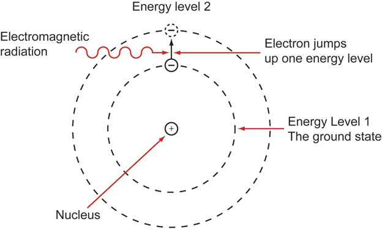

# The Evolution of Time Zones


> *Landscape with the Arrival of Aeneas before the City of Pallanteum* by Claude Lorrain (c. 1625)

## Contents

<!-- markdownlint-disable MD101 -->

* [Overview](#overview)
  * [Technology Timeline](#technology-timeline)
* [Methodology](#methodology)
  * [Apparent Solar Time](#apparent-solar-time)
  * [Mean Solar Time](#mean-solar-time)
* [Early Time Zones](#early-time-zones)
  * [Navigational Necessity](#navigational-necessity)
  * [Expansion and Standardization](#expansion-and-standardization)
* [Modern Time Zones](#modern-time-zones)
  * [International Demarcation](#international-demarcation)
  * [Information Age](#information-age)
* [Application](#application)
  * [True Solar Time](#true-solar-time)
  * [True Zenith Time](#true-zenith-time)

<!-- markdownlint-enable MD101 -->

---

## Overview

Time zones were conceived to standardize the differences in time between geographical locations by reliable method. The idea of relative time began as a tool of *navigation*, but grew into a tool of *administration*, as technology allowed and globalization necessitated.

<!-- markdownlint-disable MD105 -->

Modern time zones are standardized to Greenwich Mean Time (GMT) also called Coordinated Universal Time (UTC). Modern time keeping is so precise the Earth's slowing rotation is considered during calculation.<sup>[1](https://www.ietf.org/timezones/data/leap-seconds.list)</sup>

<!-- markdownlint-enable MD105 -->

### Technology Timeline

#### Antiquity

* **1500 BCE**: Oldest extant continuous time-keeping device found in the Valley of the Kings.<sup>[2](http://www-history.mcs.st-andrews.ac.uk/HistTopics/Sundials.html)</sup>
  * Nocturnal time keeping impossible.
  * Discrete measurement imprecise.
  * Changing location changes measurement.

  

* **200 BCE**: Water clocks used for discrete measurements of time during the Han dynasty.<sup>[3](https://www.metmuseum.org/art/collection/search/696219)</sup>
  * Nocturnal time keeping introduced.
  * Tedious to maintain.

  

> The [Antikythera mechanism](https://youtu.be/BoS75-0BRWo?t=2880), discovered in 1902 amidst wreckage off the coast of the Greek island of Antikythera. Phenomenon tracked by the device were observed and studied by Greek astronomer Hipparchus in the second century BCE, as such, he is thought to have been involved in its creation and design.

#### Middle Ages

* Three distinct periods, none of which are particularly good for time-keeping advancements:
  * Early Middle Ages: **400 - 999 CE**
  * High Middle Ages: **1000 - 1249 CE**
  * Late Middle Ages: **1250 - 1500 CE**
* **300 - 1200 CE**: The development of continuous escapement mechanisms.<sup>[4](https://www.mas.bg.ac.rs/_media/istrazivanje/fme/vol40/1/03_mstoimenov.pdf)</sup> The [sliding rope paradox](https://arxiv.org/pdf/1002.1586.pdf) remains unsolved until the invention of calculus in the 17th century.

  Century | Number of Major Battles | Annual Average<sup>*</sup> | Percent Change
  :--:|:--:|:--:|:--:
  5th<sup>&#10013;</sup> | 7 | 7 | +0%
  6th | 14 | 11 | +57%
  7th<sup>^</sup> | 17 | 13| +18%
  8th | 5 | 11 | -15%
  9th<sup>**</sup> | 36 | 16 | +45%
  10th | 15 | 16 | +0%
  11th | 20 | 16 | +0%

    > Source: *Battlefield Trust*, 2018<sup>[5](http://www.battlefieldstrust.com/media/733.pdf)</sup>

  * <sup>*</sup> Values rounded to nearest whole **integer**.
  * <sup>&#10013;</sup> Collapse of the Roman Empire.
  * <sup>^</sup> Foundation of Islam.
  * <sup>**</sup> Invasion of the [Great Heathen Army](https://thehistoryofengland.co.uk/2011/01/17/6-the-great-heathen-army/).

* **1237**: The development of *verge-and-foilet* escapement improves the accuracy of timekeeping.<sup>[6](https://aapt.scitation.org/doi/10.1119/1.3479712)</sup>
  * Time-keeping devices become larger and more public.
  * Early standardization begins.
* **1287**: The Dubstable Priory clock, believed to be the first mechanical clock in the world is erected in England.<sup>[7](https://www.dunstablehistory.co.uk/archives/PQR/Dunstable%20Priory%20in%201283_oldest%20recorded%20mechanical%20clock.htm)</sup>

  

* **1347-1351**: Peak of the Black Death.

  

* **c.1250-1500**: Major wars of the Late Middle Ages.
  * Mongol Invasion of Kievan Rus' (1237-1242)
  * Wars of Scottish Independence (1296-1357)
  * Hundred Years' War (1337-1453)
  * War of the Roses (1455-1487)
  * Burgundian Wars (1474-1477)
  * Muscovite-Lithuanian Wars (1492-1537)
  * Rapid Ottoman expansion.

#### Age of Exploration


> *Map of the New World*, Sebastian Münster, 1540

* **1507**: Amerigo Vespucci demonstrates that what will come to be known as the Americas are not connected to Asia, but represent a "fourth area" of the world.<sup>[8](https://www.history.com/topics/exploration/amerigo-vespucci)</sup>
* **1657**: The first pendulum clock is patented on 16 June by Christiaan Huygens in the Spanish Netherlands;<sup>[9](https://faculty.history.wisc.edu/sommerville/351/dutch%20republic.htm)</sup> this method will remain the most accurate way of keeping time until the 1930s.<sup>[10](http://www.cs.rhul.ac.uk/~adrian/timekeeping/galileo/)</sup>
  * Entire process is uniform.
  * Maintenance is trivial.
  * Precise time-keeping technology paves the road for Enlightenment thinkers to perform repeatable scientific experimentation.

  

* **1675**: Greenwich Mean Time established to aid mariners in the calculation of longitude.<sup>[11](http://adsabs.harvard.edu/full/1970JBAA...80..208H)</sup>
* **1698**: Thomas Savery invents the steam engine.<sup>[12](https://www.egr.msu.edu/~lira/supp/steam/)</sup>
* **1715**: The death of Louis XIV marks the beginning of the Age of Enlightenment.

---

## Methodology

### Apparent Solar Time

* Apparent solar day is derived via measurement of one complete solar cycle.
* Used in conjunction with sidereal time, calculated from the location of the stars.
* Problems:
  * Elliptical orbit of Earth around the sun.
  * Imperfect rotational axis; effects of latitude.


### Mean Solar Time

* Day begins at 00:00 which corresponds to midnight, 12:00 is set at the zenith of the sun.
* Mean solar day is calculated based on a one year solar cycle.
* The length of the mean solar day is gradually increasing each year.


---

## Early Time Zones

The Age of Enlightenment (1715-1799) fostered growth in every area of human life; the Romantic period (1800-1850) brought the world closer together through globalization.

### Navigational Necessity

* The advent of long-distance water-based travel necessitated the use of celestial phenomena for navigational purposes.
* **1731**: Longitude derived using tools of the Age of Exploration such as the sextant.<sup>[13](http://www.mat.uc.pt/~helios/Mestre/Novemb00/H61iflan.htm)</sup>


### Expansion and Standardization

* The locomotive is invented in **1804** by Richard Trevithick.<sup>[14](https://railroad.lindahall.org/essays/locomotives.html)</sup>
* The emergence of railroad networks created the need for coordinated time across vast distances relative to multiple positions.

  

* **1847**: Using telegraph technology, time signals are transmitted great distances across Great Britain (~1,000 km) to coordinate railroad activities and thus became known as *Railway time*.<sup>[15](https://www.campop.geog.cam.ac.uk/research/projects/transport/onlineatlas/railways.pdf)</sup>
* **New Zealand Mean Time** (GMT +11:30): The first recognized time zone established in **1868**.<sup>[16](https://teara.govt.nz/en/timekeeping/print)</sup>
* Other railroad systems were far less compact, and therefore able to function using far sloppier time keeping methods.
  * Local standardization in the Russian Empire occurred in **1880** with the introduction of **Moscow Mean Time** which was unaffiliated with GMT.<sup>[17](https://www.iana.org/time-zones)</sup>
  * North American standardization occurred in **1883**, with major railroad stations used as delimiting points.<sup>[18](https://www.smithsonianmag.com/smithsonian-institution/how-standardization-time-changed-american-society-180961503/)</sup>
  * By **1884**, 85% of American cities used GMT standardized time.
    * Detroit: Operated on non-standard local time until **1900**, then Central Standard Time, local mean time, and Eastern Standard Time before a May 1915 ordinance settled on EST and was ratified by popular vote in August 1916.
  * The Soviet Union standardized **Moscow Time** to GMT +2:00 in **1919**, as well as other Russian time zones, and implemented the use of the Gregorian calendar.

---

## Modern Time Zones

### International Demarcation

* First proposed in **1858** by Italian mathematician Quirico Filopanti.<sup>[19](http://www.scienzagiovane.unibo.it/English/scientists/filopanti-2.html)</sup>
* Scottish-Canadian Sandford Fleming successfully proposed the creation of a "universal time," upon which all other time zones would eventually be based in **1879**.<sup>[20](https://www.erudit.org/fr/revues/scientia/1990-v14-n1-2-scientia3118/800302ar.pdf)</sup>
* By **1900**, nearly every country had approximately standardized its own time, but international cooperation was still rare.
* Between **1900-1929** all major countries standardized their own time to a derivation of GMT.
* **1956**: Nepal is the last country to standardize its time to GMT.<sup>[21](https://web.archive.org/web/20110725100005/http://www.nepalitimes.com.np/issue/155/Heritage/10013)</sup>


### Information Age

* **1921**: Crystal oscillation technology is independently discovered and experimented upon in various locations; Alexander Nicholson of Bell Telephone Laboratories is generally credited with the invention.<sup>[22](https://tf.nist.gov/general/pdf/2534.pdf)</sup>
* **1936**: Alan Turing proposes the modern computer in his paper [*On Computable Numbers, With an Application to the Entscheidungsproblem*](https://www.cs.virginia.edu/~robins/Turing_Paper_1936.pdf).
* **1948**: "Manchester Baby" runs its first program 21 June.<sup>[23](http://www.computinghistory.org.uk/det/6013/The-Manchester-Baby-the-world-s-first-stored-program-computer-ran-its-first-program)</sup>

  

* `time_t` format: number of seconds elapsed since Thursday, January 1, 1970.<sup>[24](https://en.cppreference.com/w/c/chrono/time)</sup>
* GMT renamed Coordinated Universal Time (UTC), most Unix-like operating systems determine `time_t` from UTC time by default.
* **1988**: International Organization for Standardization creates [ISO 8601](https://axibase.com/docs/atsd/shared/date-format.html) format to establish a standard expression of time and date.
* The second: International System of Units standard unit for time.
  * "The duration of 9,192,631,770 periods of the radiation corresponding to the transition between the two hyperfine levels of the ground state of the caesium 133 atom," in an environment whose temperature is **not** 0 K (-273.15&deg;C).<sup>[25](https://www.nist.gov/sites/default/files/documents/2016/12/07/sp330.pdf))</sup>
* The [atomic clock](https://time.is/UTC): Measurement of a finite discontinuous event (quantum leap) serves as the basis of time.



---

## Application

<!-- markdownlint-disable MD101 -->

### True Solar Time

As an observer travels longitudinally, that is, east to west or vice versa, true solar time is constantly changing. Because of the complications this introduces to calculation, large tracts of land are often given a derived mean time zone, as seen on the map below.


Listed below are various large cities, their central longitude, the UTC offset applied to calculate local time.

City | Longitude | UTC Offset (hours) | Population (million)
--|:--:|:--:|:--:
Berlin | 13&deg;23'20'' E | +1 | 3.58
Chicago | 87&deg;41'05'' W | -6 | 2.72
Kamchatka Peninsula | 160&deg; E | +12 | 0.32
London | 0&deg;7'39'' W | 0 | 8.14
Los Angeles | 118&deg;15' W | -8 | 4.0
Midway Atoll | 177&deg;20' W | -11 | 0.0
Monrovia | 10&deg;48'5'' W | 0 | 1.0
Moscow | 37&deg;37' E | +3 | 11.9
New York | 70&deg;0'21'' W | -5 | 8.6
Omsk | 73&deg;22' E | +6 | 1.2
Paris | 2&deg;21'03'' E | +1 | 2.2
Rio de Janeiro | 43&deg;11'47'' W | -3 | 6.3
Saint Petersburg | 30&deg;18'31'' E | +3 | 5.0
Tokyo | 139&deg;41' E | +9 | 9.3
Tomsk | 84&deg;58' E | +6 | 0.5
Warsaw | 21&deg;1' E | +1 | 1.8

> Source: Google Maps, 2018<sup>[26](https://www.google.com/maps)</sup>

**Assumptions**:

* The Earth is a sphere.
* The sun traverses this sphere in 23 hours 56 minutes and 4.1 seconds (23.933 hours for calculation).<sup>[27](https://plus.maths.org/content/how-long-day)</sup>
  * This amount can be expressed as 0.25&deg;/min.
  * Each longitudinal degree represents &pm;4 minutes from the origin.
* The [atomic clock](https://time.is/UTC) is accurate to within 0.02-0.10 seconds.<sup>[28](https://time.is/about)</sup>

**Procedure**:

* Calculate true solar time using SQL.
* Derive margin of error of UTC offset.

> Download the [`true-solar-time` CSV](./resources/true-solar-time.csv) file and [parser configuration](./resources/time-zone-parser.xml) used to insert data into ATSD.

**Calculation**:

```sql
SELECT longitude.tags.city AS "City", longitude.value AS "Longitude", "offset".value AS "Offset (Hours)", longitude.value*4 AS "True Offset (Minutes)", "offset".value*60 AS "UTC Offset (Minutes)", abs((longitude.value*4) - ("offset".value*60)) AS "Margin of Error (Minutes)"
  FROM "longitude"
  JOIN "offset"
  WHERE longitude.tags.city != 'null'
ORDER BY "Margin of Error (Minutes)" ASC
```

| City| Longitude | Offset (Hours) | True Offset (Minutes) | UTC Offset (Minutes) | Margin of Error (Minutes) |
|---|:---:|:---:|:---:|:---:|:---:|
| London | 0.0| 0.0| 0.0| 0.0| 0.0
| Berlin | 13.3 | 1.0| 53.2| 60.0 | 6.8
| Los Angeles | 118.3| 8.0| 473.2 | 480.0| 6.8
| Rio de Janeiro | 43.2 | 3.0| 172.8 | 180.0| 7.2
| Chicago | 87.6 | 6.0| 350.4 | 360.0| 9.6
| New York | 70.0 | 5.0| 280.0 | 300.0| 20.0
| Tomsk | 84.9 | 6.0| 339.6 | 360.0| 20.4
| Warsaw | 21.0 | 1.0| 84.0| 60.0 | 24.0
| Moscow | 37.6 | 3.0| 150.4 | 180.0| 29.6
| Monrovia | 10.8 | 0.0| 43.2| 0.0| 43.2
| Midway Atoll | 177.3| 11.0 | 709.2 | 660.0| 49.2
| Paris | 2.3| 1.0| 9.2| 60.0 | 50.8
| Tokyo | 149.6| 9.0| 598.4 | 540.0| 58.4
| Saint Petersburg | 30.3 | 3.0| 121.2 | 180.0| 58.8
| Omsk| 73.3 | 6.0| 293.2 | 360.0| 66.8
| Kamchatka Peninsula | 160.0| 12.0 | 640.0 | 720.0| 80.0

### True Zenith Time

According to the principles of mean solar time, 12:00 corresponds to the sun's highest point in the sky during the day. Because time zones are regulated by a longitudinally oriented system, significant latitudinal distance is encapsulated within one time zone.


Because Earth orbits the sun on an elliptical path and rotates about an axis whose absolute angle is not 0&deg;, the length of days differs throughout the year naturally.


Capital City | Country | Latitude |
:--|:--|:--:|
Brazzaville | Republic of the Congo | 4&deg;16'4'' S |
Canberra | Australia | 35&deg;18'27'' S
London | England | 51&deg;30'26'' N |
Monrovia | Liberia | 6&deg;18'48'' N |
Nairobi | Kenya | 1&deg;17' S |
North Pole | N/A | 90&deg; N
Rio de Janeiro | Brazil | 22&deg;54' S |
Reykjavík | Iceland | 64&deg;08' N
Stanley | Falkland Islands | 51&deg;42' S
South Pole | N/A | 90&deg; S

> Source: Google Maps, 2018<sup>[29](https://www.google.com/maps)</sup>

**Assumptions**:

* The validity of the [dynamical mean sun](http://www.astro.gla.ac.uk/~martin/a1notes/pos_astro/PA12.pdf): a satisfactory approximation of the varied speed at which Earth orbits the sun.
* The validity of the [equation of time](http://info.ifpan.edu.pl/firststep/aw-works/fsII/mul/mueller.pdf): <b>*EoT =* 9.87*sin*(2*d*) - 7.53*cos*(*d*) - 1.5*sin*(*d*)</b> where *d* is the number of days since the start of the year.
* The Earth rotates about an axis at an angle of 23.45&deg;.
  * Relative angle of declination is calculated as <b>&#948; = 23.45*sin*[360/365 * (*d* - 81)]</b> where *d* is the number of days since the start of the year.

**Procedure**:

* Compute the equation of time for several dates throughout the year.
* Transform each latitudinal offset to determine margin of error from zenith of the sun.
* Visualize data using [Desmos](https://www.desmos.com/) graphing tools.

> Download the [`true-zenith-time` CSV](./resources/true-solar-time.csv) file, the parser configuration above also works with this document.

**Visualization**:

[](https://www.desmos.com/calculator/yomny7xm8g)

Open the Desmos widget and visualize the true zenith time offset for various cities listed above by substituting the value for latitude into **function 4** in the initial argument <b>(*x*/90)</b>.

> Values in the southern hemisphere must be expressed as &lt; 0.

<!-- markdownlint-enable MD101 -->