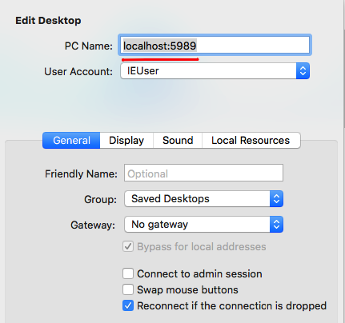
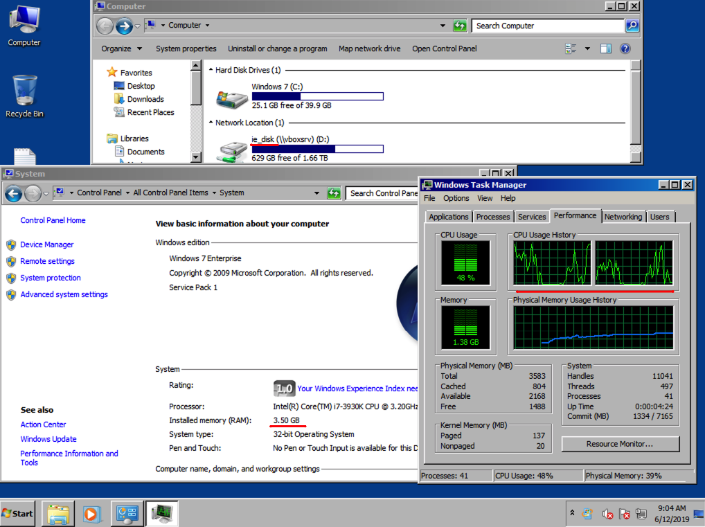

# Installing Windows 7 on VirtualBox in Headless Mode

## Overview

The note describes how to install Microsoft Windows 7 on Ubuntu 14.04 LTS server in headless mode.

### Configure Virtual Box

Check the Virtual Box version.

```sh
VBoxManage --version
```

```txt
4.3.36_Ubuntur105129
```

List the installed Virtual Box extensions.

```sh
VBoxManage list extpacks
```

```txt
Extension Packs: 1
Pack no. 0:   VNC
Version:      4.3.36
Revision:     105129
Edition:
Description:  VNC plugin module
VRDE Module:  VBoxVNC
Usable:       true
Why unusable:
```

If the `VBoxVRDP` [extension](https://www.virtualbox.org/manual/ch08.html#vboxmanage-modifyvm-vrde) is **not installed**, [download](https://download.virtualbox.org/virtualbox/) the compatible extension pack.

```sh
wget https://download.virtualbox.org/virtualbox/4.3.36/Oracle_VM_VirtualBox_Extension_Pack-4.3.36-105129a.vbox-extpack
```

Install the `VBoxVRDP` extension pack under the root privileges.

```sh
sudo VBoxManage extpack install Oracle_VM_VirtualBox_Extension_Pack-4.3.36-105129a.vbox-extpack
```

```txt
0%...10%...20%...30%...40%...50%...60%...70%...80%...90%...100%
Successfully installed "Oracle VM VirtualBox Extension Pack".
```

List the extensions again to verify that `VBoxVRDP` is installed.

```sh
VBoxManage list extpacks
```

```txt
Extension Packs: 2
Pack no. 0:   Oracle VM VirtualBox Extension Pack
Version:      4.3.36
Revision:     105129
Edition:
Description:  USB 2.0 Host Controller, Host Webcam, VirtualBox RDP, PXE ROM with E1000 support.
VRDE Module:  VBoxVRDP
Usable:       true
Why unusable:

Pack no. 1:   VNC
Version:      4.3.36
Revision:     105129
Edition:
Description:  VNC plugin module
VRDE Module:  VBoxVNC
Usable:       true
Why unusable:
```

Configure the Virtual Box to run only the RDP extension (no VNC).

```sh
VBoxManage setproperty vrdeextpack "Oracle VM VirtualBox Extension Pack"
```

## Download Windows VM

Download the VM image from the Microsoft Developer [site](https://developer.microsoft.com/en-us/microsoft-edge/tools/vms/)

```sh
wget -O IE11.Win7.VirtualBox.zip https://az792536.vo.msecnd.net/vms/VMBuild_20180102/VirtualBox/IE11/IE11.Win7.VirtualBox.zip
```

```sh
unzip IE11.Win7.VirtualBox.zip
```

Rename the `ova` file, mostly out of convenience to avoid dealing with spaces in file names.

```sh
mv IE11\ -\ Win7.ova IE11_Win7.ova
```

## Import Window VM

Check the VM properties.

```sh
VBoxManage import IE11_Win7.ova --dry-run
```

```txt
0%...10%...20%...30%...40%...50%...60%...70%...80%...90%...100%
Interpreting /home/axibase/win_vm/IE11_Win7.ova...
OK.
Disks:  vmdisk1 42949672960-1 http://www.vmware.com/interfaces/specifications/vmdk.html#streamOptimized IE11 - Win7-disk001.vmdk -1 -1
Virtual system 0:
 0: Suggested OS type: "Windows7"
    (change with "--vsys 0 --ostype <type>"; use "list ostypes" to list all possible values)
 1: Suggested VM name "IE11 - Win7"
    (change with "--vsys 0 --vmname <name>")
 2: Number of CPUs: 1
    (change with "--vsys 0 --cpus <n>")
 3: Guest memory: 4096 MB
    (change with "--vsys 0 --memory <MB>")
 4: Sound card (appliance expects "", can change on import)
    (disable with "--vsys 0 --unit 4 --ignore")
 5: Network adapter: orig NAT, config 3, extra slot=0;type=NAT
 6: IDE controller, type PIIX4
    (disable with "--vsys 0 --unit 6 --ignore")
 7: IDE controller, type PIIX4
    (disable with "--vsys 0 --unit 7 --ignore")
 8: Hard disk image: source image=IE11 - Win7-disk001.vmdk, target path=/home/axibase/VirtualBox VMs/IE11 - Win7/IE11 - Win7-disk001.vmdk, controller=6;channel=0
    (change target path with "--vsys 0 --unit 8 --disk path";
    disable with "--vsys 0 --unit 8 --ignore")
```

Import the VM with the default settings by running `VBoxManage import IE11_Win7.ova` or modify the settings.

The the settings by adding `--dry-run argument` prior to importing the VM.

```sh
VBoxManage import IE11_Win7.ova \
  --vsys 0 --cpus 2 --memory 4096 --vmname ie11-win7 \
  --unit 8 --disk /home/axibase/vms/ie11-win7.vmdk \
  --dry-run
```

The import process takes 3-5 minutes.

```txt
0%...10%...20%...30%...40%...50%...60%...70%...80%...90%...100%
Interpreting /home/axibase/win_vm/IE11_Win7.ova...
OK.
Disks:  vmdisk1 42949672960 -1 http://www.vmware.com/interfaces/specifications/vmdk.html#streamOptimized IE11 - Win7-disk001.vmdk -1 -1
Virtual system 0:
 0: Suggested OS type: "Windows7"
    (change with "--vsys 0 --ostype <type>"; use "list ostypes" to list all possible values)
 1: VM name specified with --vmname: "ie11-win7"
 2: No. of CPUs specified with --cpus: 2
 3: Guest memory specified with --memory: 4096 MB
 4: Sound card (appliance expects "", can change on import)
    (disable with "--vsys 0 --unit 4 --ignore")
 5: Network adapter: orig NAT, config 3, extra slot=0;type=NAT
 6: IDE controller, type PIIX4
    (disable with "--vsys 0 --unit 6 --ignore")
 7: IDE controller, type PIIX4
    (disable with "--vsys 0 --unit 7 --ignore")
 8: Hard disk image: source image=IE11 - Win7-disk001.vmdk, target path=/home/axibase/vms/ie11-win7.vmdk, controller=6;channel=0
0%...10%...20%...30%...40%...50%...60%...70%...80%...90%...100%
Successfully imported the appliance.
```

Check that the `vmdk` disk is located as configured in the `target path` setting.

```sh
ls -lah /home/axibase/vms
```

```txt
total 12G
drwx------  2 axibase axibase 4.0K Jun 12 15:37 .
drwxr-xr-x 65 axibase axibase 4.0K Jun 12 15:37 ..
-rw-------  1 axibase axibase  12G Jun 12 15:41 ie11-win7.vmdk
```

## Attach Shared Folder

Create a directory on the host that will be mapped to the VM.

```sh
mkdir /home/axibase/win_vm/ie_disk
```

```sh
VBoxManage sharedfolder add ie11-win7 --name ie_disk --hostpath /home/axibase/win_vm/ie_disk --automount
```

## Setup RDP Connection

Review VM attributes.

```sh
VBoxManage showvminfo ie11-win7
```

<details><summary>Click to view VM info</summary>

```txt
Name:            ie11-win7
Groups:          /
Guest OS:        Windows 7 (32-bit)
UUID:            6e35d733-54b7-417b-8ce6-9c0a4a61732c
Config file:     /home/axibase/VirtualBox VMs/ie11-win7/ie11-win7.vbox
Snapshot folder: /home/axibase/VirtualBox VMs/ie11-win7/Snapshots
Log folder:      /home/axibase/VirtualBox VMs/ie11-win7/Logs
Hardware UUID:   6e35d733-54b7-417b-8ce6-9c0a4a61732c
Memory size:     4096MB
Page Fusion:     off
VRAM size:       8MB
CPU exec cap:    100%
HPET:            off
Chipset:         piix3
Firmware:        BIOS
Number of CPUs:  2
PAE:             on
Long Mode:       off
Synthetic CPU:   off
CPUID overrides: None
Boot menu mode:  message and menu
Boot Device (1): HardDisk
Boot Device (2): DVD
Boot Device (3): Not Assigned
Boot Device (4): Not Assigned
ACPI:            on
IOAPIC:          on
Time offset:     0ms
RTC:             local time
Hardw. virt.ext: on
Nested Paging:   on
Large Pages:     on
VT-x VPID:       on
VT-x unr. exec.: on
State:           powered off (since 2018-01-03T06:00:58.000000000)
Monitor count:   1
3D Acceleration: off
2D Video Acceleration: off
Teleporter Enabled: off
Teleporter Port: 0
Teleporter Address:
Teleporter Password:
Tracing Enabled: off
Allow Tracing to Access VM: off
Tracing Configuration:
Autostart Enabled: off
Autostart Delay: 0
Default Frontend:
Storage Controller Name (0):            IDE Controller
Storage Controller Type (0):            PIIX4
Storage Controller Instance Number (0): 0
Storage Controller Max Port Count (0):  2
Storage Controller Port Count (0):      2
Storage Controller Bootable (0):        on
IDE Controller (0, 0): /home/axibase/vms/ie11-win7.vmdk (UUID: e3f59158-1152-4291-869f-e04eaef763ed)
NIC 1:           MAC: 0800274BE007, Attachment: NAT, Cable connected: on, Trace: off (file: none), Type: 82540EM, Reported speed: 0 Mbps, Boot priority: 0, Promisc Policy: deny, Bandwidth group: none
NIC 1 Settings:  MTU: 0, Socket (send: 64, receive: 64), TCP Window (send:64, receive: 64)
NIC 2:           disabled
NIC 3:           disabled
NIC 4:           disabled
NIC 5:           disabled
NIC 6:           disabled
NIC 7:           disabled
NIC 8:           disabled
Pointing Device: PS/2 Mouse
Keyboard Device: PS/2 Keyboard
UART 1:          disabled
UART 2:          disabled
LPT 1:           disabled
LPT 2:           disabled
Audio:           enabled (Driver: ALSA, Controller: AC97)
Clipboard Mode:  disabled
Drag'n'drop Mode: disabled
VRDE:            enabled (Address 127.0.0.1, Ports 5989, MultiConn: off, ReuseSingleConn: off, Authentication type: null)
Video redirection: disabled
VRDE property: TCP/Ports  = "5989"
VRDE property: TCP/Address = "127.0.0.1"
VRDE property: VideoChannel/Enabled = <not set>
VRDE property: VideoChannel/Quality = <not set>
VRDE property: VideoChannel/DownscaleProtection = <not set>
VRDE property: Client/DisableDisplay = <not set>
VRDE property: Client/DisableInput = <not set>
VRDE property: Client/DisableAudio = <not set>
VRDE property: Client/DisableUSB = <not set>
VRDE property: Client/DisableClipboard = <not set>
VRDE property: Client/DisableUpstreamAudio = <not set>
VRDE property: Client/DisableRDPDR = <not set>
VRDE property: H3DRedirect/Enabled = <not set>
VRDE property: Security/Method = <not set>
VRDE property: Security/ServerCertificate = <not set>
VRDE property: Security/ServerPrivateKey = <not set>
VRDE property: Security/CACertificate = <not set>
VRDE property: Audio/RateCorrectionMode = <not set>
VRDE property: Audio/LogPath = <not set>
USB:             disabled
EHCI:            disabled

USB Device Filters:

<none>

Available remote USB devices:

<none>

Currently Attached USB Devices:

<none>

Bandwidth groups:  <none>

Shared folders:  

Name: 'ie_disk', Host path: '/home/axibase/win_vm/ie_disk' (machine mapping), writable

VRDE Connection:    not active
Clients so far:     0

Video capturing:    not active
Capture screens:    0
Capture file:       /home/axibase/VirtualBox VMs/ie11-win7/ie11-win7.webm
Capture dimensions: 1024x768
Capture rate:       512 kbps
Capture FPS:        25

Guest:

Configured memory balloon size:      0 MB
```

</details>

Locate the `TCP/Ports` and `TCP/Address` settings.

```txt
VRDE property: TCP/Ports  = "5989"
VRDE property: TCP/Address = "127.0.0.1"
```

If the `TCP/Address` is set to `127.0.0.1`, the VM is accessible only to the local clients.

### Allow External Connections

To reconfigure the VM to listen on all interfaces change the `TCP/Address` to `0.0.0.0`.

```sh
VBoxManage modifyvm ie11-win7 --vrdeaddress "0.0.0.0"
```

> The port can be changed with `--vrdeport 5989`

List the VM properties again and check that the RDP address and port are set as expected.

```sh
VBoxManage showvminfo ie11-win7 | grep "VRDE property: TCP"
```

```txt
VRDE property: TCP/Ports  = "5989"
VRDE property: TCP/Address = "0.0.0.0"
```

Configure the firewall to grant access to the `VRDE` port if necessary.

* Allow access to `5589` clients from `192.0.2.1`

```sh
sudo ufw allow from 192.0.2.1 to any port 5589
```

* Allow access to `5589` clients from any IP address

```sh
sudo ufw allow 5589
```

### Open SSH Tunnel

Use SSH tunnel to connect to the VM restricted to local clients from `127.0.0.1`.

```sh
ssh -L 5989:127.0.0.1:5989 user@test.example.org -p 22 -i /path/to/ssh_priv_key
```

When connecting to the VM, specify `localhost` instead of the host IP address.



## Start VM

```sh
VBoxManage startvm ie11-win7 --type headless
```

```txt
Waiting for VM "ie11-win7" to power on...
VM "ie11-win7" has been successfully started.
```

## Add Port Forwarding

To forward TCP traffic from host port `12000` to guest port `11000`, add the following NAT rule.

```sh
VBoxManage modifyvm ie11-win7 --natpf1 "test,tcp,,12000,,11000"
```

The `controlvm` allows adding or deleting port forwarding rules without restarting the VM.

```sh
VBoxManage controlvm ie11-win7 natpf1 delete test
VBoxManage controlvm ie11-win7 natpf1 "test,tcp,,12000,,10000"
```

## Connect to RDP

Connect to the VM under the `Administrator` or `IEUser` using the `Passw0rd!` password.

If the RDP connection fails, check that the VM is listening on all interfaces on the configured RDP port and add rules to the `ufw` firewall if necessary.

```sh
netstat -l | grep 5989
```

```txt
tcp        0      0 *:5989                  *:*                     LISTEN
```

## Check VM Settings



## Modifying VM Settings

Stop the VM by initiating the shutdown from the guest OS or by powering off the VM.

```sh
VBoxManage controlvm ie11-win7 poweroff
```

Run `modifyvm` to increase CPU count or memory.

```sh
VBoxManage modifyvm ie11-win7 --cpus 4
```

## Delete VM

```sh
VBoxManage unregistervm ie11-win7 --delete
```